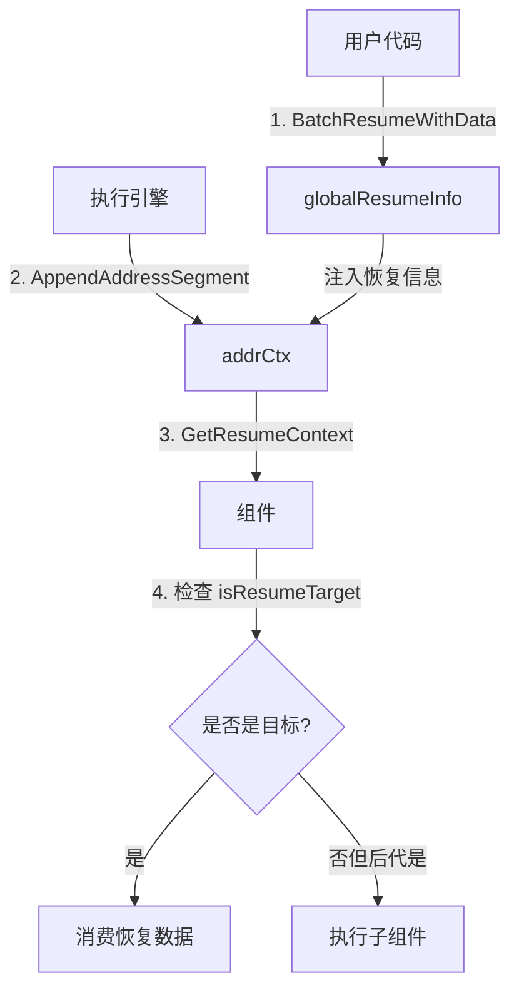

# address_scoping_and_resume_info 模块技术深潜

## 1. 问题与动机

想象一个复杂的嵌套执行环境：你有一个 agent，它在运行一个 graph，graph 中有一个 tool node，这个 tool node 又调用了另一个 agent，而在这个嵌套 agent 内部又发生了中断。当你想要恢复这个中断时，你需要知道*确切*是在执行路径的哪一点中断的，并且需要能够精确地把恢复信息送到那个位置。

这就是 `address_scoping_and_resume_info` 模块解决的问题：

- **问题 1**：在嵌套执行结构中，如何唯一标识一个执行位置？
- **问题 2**：如何沿着嵌套的调用链传递恢复信息，只对目标组件可见？
- **问题 3**：如何支持复合组件（如包含子图的工具）知道它们需要执行子组件来到达实际的恢复目标？

这个模块不是简单的"恢复数据容器"，它设计了一套完整的寻址系统，就像为复杂的执行路径提供了一个"GPS 导航系统"。

## 2. 核心架构与心智模型

### 2.1 核心概念类比

可以把这个模块想象成一个**嵌套的文件系统**：
- `Address` 就像文件路径（e.g., "/agent/agent1/graph/node1/tool/tool1"）
- `AddressSegment` 就像路径中的单个目录或文件
- `globalResumeInfo` 就像一个注册表，记录了哪些"路径"需要恢复以及相应的数据
- 当执行进入新组件时，`AppendAddressSegment` 就像进入一个新目录，路径变长一级

### 2.2 架构图



## 3. 核心组件深潜

### 3.1 Address 和 AddressSegment：执行位置的唯一标识

```go
type Address []AddressSegment

type AddressSegment struct {
    ID    string
    Type  AddressSegmentType
    SubID string
}
```

**设计意图**：
- `Type` 标识这个段是什么类型的组件（agent、node、tool 等）
- `ID` 是组件的唯一标识符
- `SubID` 处理那些仅靠 ID 不够唯一的场景（比如并行调用同名工具）

**关键方法**：
- `String()`：将地址转换为可读的字符串表示（e.g., "agent:myagent;node:mynode;tool:mytool:call123"）
- `Equals()`：精确比较两个地址是否相同

### 3.2 addrCtx：当前执行上下文的地址信息

```go
type addrCtx struct {
    addr           Address
    interruptState *InterruptState
    isResumeTarget bool
    resumeData     any
}
```

这是存储在 context 中的核心结构，每个执行层都有自己的 `addrCtx`。关键设计点：
- `isResumeTarget`：不仅标记当前组件是否是目标，还标记其后代是否是目标
- `interruptState`：保存原始中断时的状态
- `resumeData`：用户提供的恢复数据

### 3.3 globalResumeInfo：全局恢复信息注册表

```go
type globalResumeInfo struct {
    mu                sync.Mutex
    id2ResumeData     map[string]any
    id2ResumeDataUsed map[string]bool
    id2State          map[string]InterruptState
    id2StateUsed      map[string]bool
    id2Addr           map[string]Address
}
```

这是整个恢复机制的"中央数据库"。注意设计细节：
- 每个恢复数据只能被消费一次（通过 `id2ResumeDataUsed` 和 `id2StateUsed` 跟踪）
- 线程安全（通过 `sync.Mutex` 保护）
- 将中断 ID 映射到地址、状态和数据

## 4. 关键工作流程

### 4.1 地址构建流程

当执行进入一个新组件时：

1. 调用 `AppendAddressSegment(ctx, segType, segID, subID)`
2. 获取当前地址并追加新段
3. 检查全局恢复信息中是否有匹配这个新地址的
4. 如果有，设置相应的 `interruptState`、`isResumeTarget` 和 `resumeData`
5. 检查是否有后代地址是恢复目标（这一点很重要！）

**关键点**：即使当前组件不是直接目标，如果它的后代是目标，`isResumeTarget` 也会是 `true`，这样复合组件就知道需要执行子组件。

### 4.2 恢复数据消费流程

组件使用恢复信息的典型模式：

1. 调用 `GetInterruptState[T](ctx)` 检查是否有中断状态
2. 如果有，调用 `GetResumeContext[T](ctx)` 获取恢复信息
3. 根据 `isResumeTarget`、`hasData` 决定行为：
   - `isResumeTarget && hasData`：当前组件是直接目标，消费数据
   - `isResumeTarget && !hasData`：后代是目标，执行子组件
   - `!isResumeTarget`：不是目标，重新中断

## 5. 设计决策与权衡

### 5.1 路径式寻址 vs 扁平化 ID

**选择**：路径式寻址（Address 是 AddressSegment 的切片）

**权衡**：
- ✅ 优点：自然支持嵌套结构，可以判断祖先/后代关系
- ❌ 缺点：地址较长，比较成本稍高

**为什么这样选**：在嵌套执行环境中，知道"你在哪里"和"你要去哪里"同样重要。路径式寻址让我们可以回答：
- 这个地址是不是那个地址的祖先？
- 我需要执行哪些子组件才能到达目标？

### 5.2 单次消费语义

**选择**：恢复数据只能被消费一次

**权衡**：
- ✅ 优点：防止重复消费导致的逻辑错误
- ❌ 缺点：需要小心处理重试场景

**为什么这样选**：在大多数恢复场景中，你希望恢复数据被精确地使用一次，而不是在重试时被意外重复使用。

### 5.3 后代目标标记

**选择**：`isResumeTarget` 不仅标记当前组件，还标记有后代是目标的组件

**权衡**：
- ✅ 优点：复合组件自动知道需要执行子组件
- ❌ 缺点：逻辑稍微复杂一些

**为什么这样选**：这是一个关键的设计洞察。想象一个工具内部包含一个嵌套图，如果只是标记最内层的节点，外层的工具可能会直接中断而不执行内部的图。通过标记所有祖先，我们确保了恢复信息能够"渗透"到目标位置。

## 6. 使用指南与最佳实践

### 6.1 组件实现者的模式

```go
func MyComponent(ctx context.Context, input Input) (Output, error) {
    // 1. 检查中断状态
    wasInterrupted, hasState, state := GetInterruptState[MyState](ctx)
    
    // 2. 检查恢复上下文
    isResumeTarget, hasData, data := GetResumeContext[MyData](ctx)
    
    if wasInterrupted {
        if !isResumeTarget {
            // 不是恢复目标，重新中断
            return Interrupt(ctx, info, state, nil)
        }
        
        if hasData {
            // 是直接目标，使用恢复数据
            return processWithData(ctx, input, data)
        }
        
        // 后代是目标，继续执行，让 AppendAddressSegment 处理子组件
    }
    
    // 正常执行路径...
}
```

### 6.2 复合组件的特殊考虑

复合组件（如 Graph、包含子流程的工具）需要：

1. 总是调用 `AppendAddressSegment` 为子组件创建新的上下文
2. 不要在自己这一层消费掉针对后代的恢复信号
3. 如果 `isResumeTarget` 为 true 但没有直接数据，应该执行子组件

## 7. 常见陷阱与边界情况

### 7.1 忘记标记 SubID

在并行调用同名工具时，忘记设置 `SubID` 会导致地址冲突，恢复信息可能会送到错误的调用实例。

### 7.2 提前消费恢复信号

复合组件常见的错误是：看到 `isResumeTarget` 为 true 就认为自己是目标，而没有检查 `hasData`。这会导致真正的目标（后代组件）永远收不到恢复信息。

### 7.3 并发安全

虽然 `globalResumeInfo` 内部有锁，但从 `GetResumeContext` 获取数据后，数据本身的并发安全需要使用者自己保证。

## 8. 相关模块

- [interrupt_contexts_and_state_management](internal_runtime_and_mocks-interrupt_and_addressing_runtime_primitives-interrupt_contexts_and_state_management.md)：中断上下文和状态管理
- [runner_execution_and_resume](adk_runtime-flow_runner_interrupt_and_transfer-runner_execution_and_resume.md)：执行器的运行和恢复逻辑
