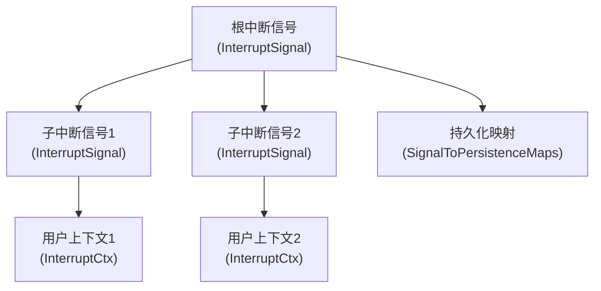
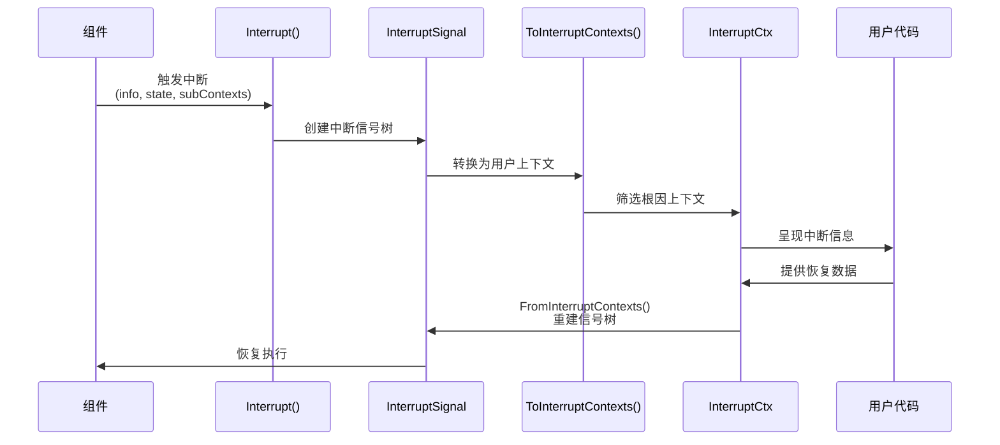

# 中断上下文与状态管理 (interrupt_contexts_and_state_management)

## 1. 什么是中断上下文与状态管理

这个模块解决了一个复杂执行系统中的核心问题：如何优雅地中断、持久化和恢复嵌套的、多组件协同的异步执行流程。

想象一下：你有一个由多个代理（Agent）组成的系统，它们在一个有向无环图（DAG）中协作。代理A调用工具X，工具X内部又触发另一个代理B，代理B在执行到一半时遇到需要外部输入的情况。这时你需要：
- 准确中断整个执行链
- 保存每个组件的当前状态
- 让用户知道哪里出了问题以及需要什么信息
- 之后能从断点处精确恢复

这个模块就是为这种场景设计的——它提供了一套完整的机制来管理中断上下文、保存执行状态、在不同组件间传递中断信号，并支持从任意中断点恢复执行。

## 2. 架构与核心概念

### 2.1 核心抽象与心智模型

这个模块引入了几个相互配合的核心抽象，可以用「中断树」的概念来理解：



**核心概念解释：**

1. **InterruptSignal（中断信号）** - 内部使用的树状结构，表示完整的中断链。类似错误传播机制，但携带丰富的状态信息。
2. **InterruptCtx（中断上下文）** - 用户可见的中断点信息，是中断信号经过筛选和处理后的呈现。
3. **InterruptState（中断状态）** - 保存中断点的执行状态，用于后续恢复。
4. **CheckPointStore（检查点存储）** - 接口，用于持久化中断状态。
5. **InterruptContextsProvider（中断上下文提供者）** - 接口，让不同类型的错误都能暴露中断上下文。

### 2.2 数据流向



## 3. 核心组件详解

### 3.1 InterruptSignal - 中断信号树

```go
type InterruptSignal struct {
    ID             string
    Address
    InterruptInfo
    InterruptState
    Subs           []*InterruptSignal
}
```

**设计意图：**
`InterruptSignal` 是整个模块的核心数据结构，它表示一个完整的中断链。这个设计选择了树状结构而非扁平列表，因为实际的执行流程往往是嵌套的——一个组件可能调用另一个组件，形成层级关系。

**关键特性：**
- **ID**: 唯一标识符，使用 UUID 生成
- **Address**: 结构化的地址，精确定位中断发生的位置
- **InterruptInfo**: 中断的描述信息
- **InterruptState**: 中断点的状态数据
- **Subs**: 子中断信号，构成树状结构

**为什么用树状结构？**
树状结构能准确反映组件调用的嵌套关系。当一个工具内部调用另一个代理时，如果内层代理中断，我们需要同时保存外层工具和内层代理的状态。树状结构让这种关系变得清晰，恢复时也能按照正确的顺序重建状态。

### 3.2 InterruptCtx - 用户可见的中断上下文

```go
type InterruptCtx struct {
    ID          string
    Address     Address
    Info        any
    IsRootCause bool
    Parent      *InterruptCtx
}
```

**设计意图：**
`InterruptCtx` 是 `InterruptSignal` 的用户友好版本。内部系统使用复杂的树状信号进行传递和持久化，但用户通常只关心：
1. 哪里中断了（Address）
2. 为什么中断（Info）
3. 需要什么来恢复（隐含在 State 中）
4. 这是根本原因还是连锁反应（IsRootCause）

**与 InterruptSignal 的关系：**
- `InterruptSignal` 是内部的、完整的表示
- `InterruptCtx` 是外部的、筛选后的表示
- `ToInterruptContexts()` 将信号树转换为上下文列表
- `FromInterruptContexts()` 将上下文列表重建为信号树

**EqualsWithoutID 方法的作用：**
这个方法比较两个上下文是否在除了 ID 之外的所有方面都相等。这在测试和状态比较时非常有用，因为 ID 是随机生成的，但逻辑上相同的中断应该被识别为等价的。

### 3.3 InterruptState - 中断状态

```go
type InterruptState struct {
    State                any
    LayerSpecificPayload any
}
```

**设计意图：**
`InterruptState` 将状态分为两部分，这是一个有意的设计选择：
- **State**: 核心执行状态，必须保存以恢复执行
- **LayerSpecificPayload**: 层特定的元数据，可能仅在当前层有意义

**为什么分离？**
这种分离允许不同层在不破坏核心恢复机制的情况下添加自己的元数据。例如，一个特定的代理实现可能想保存一些调试信息，但这些信息对恢复执行不是必需的。

### 3.4 InterruptContextsProvider - 接口隔离

```go
type InterruptContextsProvider interface {
    GetInterruptContexts() []*InterruptCtx
}
```

**设计意图：**
这个接口是「接口隔离原则」的典型应用。通过让错误类型实现这个接口，不同的包可以检查和提取中断上下文，而不需要知道具体的错误类型。

**实际应用场景：**
在 [flow_runner_interrupt_and_transfer](flow_runner_interrupt_and_transfer.md) 模块中，错误处理代码可以检查任意错误是否实现了这个接口，如果是，就可以提取中断上下文并进行特殊处理。

### 3.5 CheckPointStore - 持久化抽象

```go
type CheckPointStore interface {
    Get(ctx context.Context, checkPointID string) ([]byte, bool, error)
    Set(ctx context.Context, checkPointID string, checkPoint []byte) error
}
```

**设计意图：**
这是一个简单但强大的抽象，它将持久化逻辑与中断管理逻辑分离。模块本身不关心状态是保存在内存、磁盘还是数据库中，它只需要能够通过 ID 存取字节数组。

**灵活性的代价：**
这种设计的代价是调用者需要负责序列化和反序列化。但这是一个合理的权衡，因为不同的应用场景可能需要不同的序列化策略（JSON、protobuf、gob 等）。

## 4. 关键函数与转换流程

### 4.1 Interrupt() - 创建中断信号

```go
func Interrupt(ctx context.Context, info any, state any, 
               subContexts []*InterruptSignal, opts ...InterruptOption) (*InterruptSignal, error)
```

**工作流程：**
1. 从上下文中获取当前地址
2. 应用选项配置
3. 创建中断信息（如果没有子上下文，标记为根因）
4. 生成唯一 ID
5. 组装并返回中断信号

**设计亮点：**
- 使用选项模式（Option Pattern）提供灵活的配置
- 自动确定是否为根因中断
- 支持嵌套的子中断信号

### 4.2 ToInterruptContexts() - 信号转上下文

这个函数将内部的 `InterruptSignal` 树转换为用户可见的 `InterruptCtx` 列表。

**关键处理：**
1. 遍历信号树，为每个节点创建对应的上下文
2. 只收集标记为 `IsRootCause` 的上下文
3. 可选地根据允许的段类型过滤和调整地址

**地址过滤的设计意图：**
地址过滤功能让不同层可以只看到它们关心的地址部分。例如，用户层可能只关心代理级别的中断，而不关心具体的工具调用细节。

### 4.3 FromInterruptContexts() - 上下文重建信号

这个函数是 `ToInterruptContexts()` 的逆操作，它从用户上下文列表重建内部信号树。

**重建算法：**
1. 使用一个 map 来避免重复创建相同的信号
2. 自底向上构建树：先处理子节点，再处理父节点
3. 正确合并共同祖先

**为什么需要这个？**
当用户提供恢复数据时，他们通常只操作用户友好的 `InterruptCtx` 对象。这个函数让系统能将用户的操作转换回内部需要的信号树结构。

### 4.4 SignalToPersistenceMaps() - 持久化准备

```go
func SignalToPersistenceMaps(is *InterruptSignal) (
    map[string]Address, map[string]InterruptState)
```

**设计意图：**
将树状结构展平为映射是为了简化持久化。树状结构难以直接存储，而两个简单的 map（ID 到地址，ID 到状态）可以很容易地序列化和存储。

## 5. 设计权衡与决策

### 5.1 树状 vs 扁平结构

**选择：** 树状结构（InterruptSignal 有 Subs 字段）
**理由：**
- 准确反映嵌套的执行流程
- 支持多个根因中断的场景
- 恢复时可以按正确顺序重建状态

**权衡：**
- 更复杂的实现
- 需要额外的转换逻辑（展平/重建）
- 但这些复杂性被封装在模块内部

### 5.2 内部表示 vs 用户表示

**选择：** 分离的内部表示（InterruptSignal）和用户表示（InterruptCtx）
**理由：**
- 内部表示可以优化用于传递和持久化
- 用户表示可以优化用于可读性和易用性
- 两者之间可以灵活转换

**权衡：**
- 重复的字段和转换逻辑
- 但这种分离提供了更好的抽象边界

### 5.3 接口 vs 具体实现

**选择：** 定义 CheckPointStore 和 InterruptContextsProvider 接口
**理由：**
- 提高灵活性和可测试性
- 允许不同的持久化实现
- 降低与其他模块的耦合

**权衡：**
- 增加了一层间接性
- 但这是 Go 语言中管理依赖的标准做法

## 6. 使用指南与常见模式

### 6.1 触发中断

```go
// 基本中断
signal, err := interrupt.Interrupt(ctx, 
    "需要用户输入",    // Info
    currentState,      // State
    nil,               // 无子上下文
)

// 带层特定负载的中断
signal, err := interrupt.Interrupt(ctx,
    "需要确认",
    currentState,
    nil,
    interrupt.WithLayerPayload(map[string]any{
        "timeout": "30s",
        "priority": "high",
    }),
)
```

### 6.2 处理中断错误

```go
// 检查错误是否包含中断上下文
if provider, ok := err.(interrupt.InterruptContextsProvider); ok {
    contexts := provider.GetInterruptContexts()
    for _, ctx := range contexts {
        if ctx.IsRootCause {
            // 处理根因中断
            fmt.Printf("在 %s 处中断: %v\n", ctx.Address, ctx.Info)
        }
    }
}
```

### 6.3 持久化中断状态

```go
// 准备持久化
id2addr, id2state := interrupt.SignalToPersistenceMaps(signal)

// 序列化并存储
data, err := json.Marshal(map[string]any{
    "addresses": id2addr,
    "states": id2state,
})
if err != nil {
    // 处理错误
}
checkpointID := signal.ID
err = store.Set(ctx, checkpointID, data)
```

## 7. 注意事项与边缘情况

### 7.1 地址管理

中断系统的正确性高度依赖于正确的地址管理。确保：
- 每个组件在执行时都正确设置了地址
- 地址的段类型与系统其他部分一致
- 参考 [address_scoping_and_resume_info](internal_runtime_and_mocks-interrupt_and_addressing_runtime_primitives-address_scoping_and_resume_info.md) 模块了解更多

### 7.2 状态序列化

`InterruptState` 中的 `State` 和 `LayerSpecificPayload` 字段是 `any` 类型，这意味着：
- 调用者负责确保它们可以被序列化
- 如果使用自定义类型，确保它们有适当的序列化方法
- 避免存储无法重建的状态（如函数指针、通道等）

### 7.3 循环引用

在构建中断信号树或上下文链时，注意避免循环引用：
- `FromInterruptContexts()` 假设上下文链是有向无环图
- 循环引用会导致无限递归或内存泄漏

### 7.4 ID 唯一性

`Interrupt()` 函数使用 UUID 生成 ID，通常可以保证唯一性。但在某些测试场景下，你可能需要：
- 考虑使用可预测的 ID 生成方式
- 或者在比较时使用 `EqualsWithoutID()` 方法

## 8. 与其他模块的关系

- **[address_scoping_and_resume_info](internal_runtime_and_mocks-interrupt_and_addressing_runtime_primitives-address_scoping_and_resume_info.md)**: 提供地址管理功能，中断位置的精确定位依赖于此
- **[flow_runner_interrupt_and_transfer](flow_runner_interrupt_and_transfer.md)**: 主要使用方，处理中断的传播和恢复
- **[compose_graph_engine](compose_graph_engine.md)**: 在图执行过程中使用中断机制
- **[checkpointing_and_rerun_persistence](compose_graph_engine-checkpointing_and_rerun_persistence.md)**: 与 CheckPointStore 配合，实现完整的检查点功能

## 9. 总结

`interrupt_contexts_and_state_management` 模块是一个精心设计的组件，它解决了复杂异步系统中的中断、持久化和恢复问题。通过树状信号结构、分离的内部/用户表示、灵活的持久化抽象，它提供了一套强大而优雅的解决方案。

使用这个模块时，记住：
- 中断信号是内部的树状结构
- 中断上下文是用户可见的筛选表示
- 正确管理地址是系统正常工作的关键
- 状态序列化是调用者的责任

这个模块的设计展示了如何在保持灵活性的同时，通过清晰的抽象和合理的权衡来解决复杂问题。
