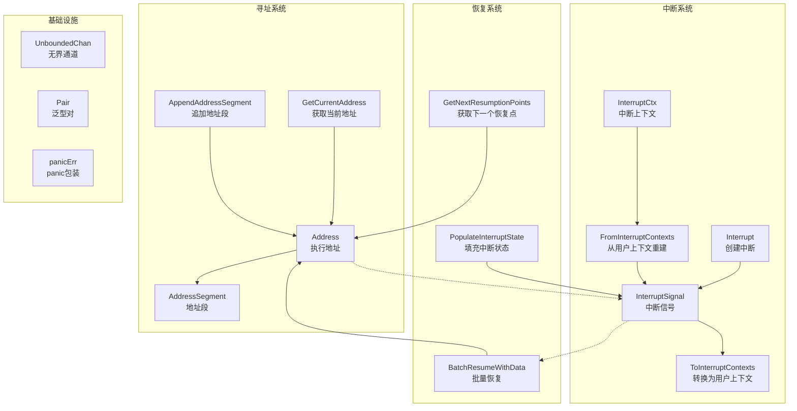

# 中断与寻址运行时原理解析

想象一下，你正在构建一个复杂的工作流系统，其中包含嵌套的图结构、代理和工具调用。在执行过程中，某些节点可能需要暂停执行（比如等待用户输入），然后在稍后从精确的暂停点恢复执行。这正是 `interrupt_and_addressing_runtime_primitives` 模块要解决的问题——它为整个系统提供了**精确的执行位置寻址**和**可靠的中断/恢复机制**。

## 核心问题与解决方案

在构建可中断的工作流系统时，我们面临几个关键挑战：

1. **精确定位**：如何在嵌套的执行结构中唯一标识一个执行点？
2. **状态保存**：中断时如何保存足够的上下文，以便恢复时能无缝继续？
3. **层级传播**：中断可能发生在深层嵌套的组件中，如何让上层组件也能感知和处理？
4. **精确恢复**：恢复时如何将数据准确地投递到正确的恢复点，而不影响其他组件？

这个模块的解决方案可以类比为**"快递系统"**：
- **地址（Address）** 就像快递单号，精确标识了执行结构中的每个位置
- **中断信号（InterruptSignal）** 就像暂停通知，携带了位置、原因和状态
- **恢复上下文** 就像重新投递的包裹，带着新数据回到指定地址

## 架构概览



这个模块的架构可以分为四个主要层次：

1. **寻址系统**：通过 `Address` 和 `AddressSegment` 构建层级化的执行位置标识
2. **中断系统**：通过 `InterruptSignal` 和 `InterruptCtx` 处理中断的创建、传播和转换
3. **恢复系统**：通过 `BatchResumeWithData` 等函数实现精确的恢复点定位和数据注入
4. **基础设施**：提供无界通道、泛型工具和 panic 安全包装等支撑功能

## 核心设计理念

### 1. 层级地址：精确的执行定位

地址系统的设计类似于文件系统路径，但更加结构化。每个执行点由一系列 `AddressSegment` 组成，每个段包含：
- `Type`：段类型（如 "node"、"tool"、"agent"）
- `ID`：唯一标识符
- `SubID`：可选的子标识符（用于区分并行工具调用等场景）

这种设计的优势在于：
- **唯一性**：完整的地址序列保证了全局唯一标识
- **层级性**：可以通过前缀匹配快速找到父子关系
- **可扩展性**：新增段类型不需要修改现有代码

### 2. 中断信号树：结构化的中断传播

中断不是简单的错误，而是一个**树状结构**。`InterruptSignal` 包含：
- 自身的地址、信息和状态
- 子中断信号列表

这种设计允许：
- **根因追踪**：通过 `IsRootCause` 标记找到真正的中断源
- **层级传播**：子组件的中断可以被父组件感知和聚合
- **状态保存**：每个中断点都可以保存自己的执行状态

### 3. 上下文传递：隐形的数据流

整个模块大量使用 `context.Context` 来传递状态，这种设计有几个关键考虑：

**选择 context 而非显式参数的原因**：
- ✅ **非侵入性**：不需要修改每个函数的签名来传递地址和中断状态
- ✅ **自动传播**：context 会自然地沿着调用链传递
- ❌ **类型不安全**：context 存储的值是 `any` 类型，需要类型断言
- ❌ **隐式依赖**：函数依赖 context 中的值，但这在签名中不明显

权衡结果：为了简洁性和易用性，选择了 context 方案，但通过内部封装（如 `addrCtx`、`globalResumeInfo`）来最小化类型不安全的影响。

### 4. 消费标记：防止重复使用

在恢复系统中，一个关键设计是**"使用即标记"**机制：
- `id2ResumeDataUsed` 和 `id2StateUsed` 映射表记录哪些恢复数据已被使用
- 一旦某个地址的恢复数据被消费，就不会再次被使用

这种设计解决了：
- **重复恢复**：防止同一个恢复数据被多个组件意外使用
- **精确投递**：确保恢复数据只到达目标组件

## 关键数据流程

### 中断创建与传播流程

当一个组件需要中断执行时，数据流向如下：

1. **组件调用 `Interrupt`**：传入当前 context、中断信息、状态和子中断
2. **获取当前地址**：通过 `GetCurrentAddress` 获取组件的执行位置
3. **构建中断信号**：创建 `InterruptSignal`，包含地址、信息、状态和子信号
4. **返回中断信号**：组件将中断信号作为错误返回
5. **上层组件处理**：上层组件可以选择聚合子中断或直接传播

```
工具节点调用 Interrupt()
    ↓
获取当前地址 (GetCurrentAddress)
    ↓
构建 InterruptSignal（包含地址、信息、状态）
    ↓
作为错误返回给上层
    ↓
上层组件可以：
  - 直接传播中断
  - 聚合多个子中断
  - 转换为用户友好的 InterruptCtx
```

### 恢复执行流程

当需要从中断处恢复执行时，数据流向如下：

1. **准备恢复数据**：创建 `map[string]any`，键是中断 ID（地址的字符串形式）
2. **调用 `BatchResumeWithData`**：将恢复数据注入 context
3. **构建新的执行上下文**：`globalResumeInfo` 被存储在 context 中
4. **执行流经 `AppendAddressSegment`**：每个组件追加自己的地址段
5. **匹配恢复点**：检查当前地址是否在恢复映射中
6. **消费恢复数据**：标记数据为已使用，设置 `isResumeTarget` 和 `resumeData`
7. **组件感知恢复**：组件可以检查自己是否是恢复目标，并使用恢复数据

```
用户调用 BatchResumeWithData(ctx, resumeData)
    ↓
创建/更新 globalResumeInfo，包含 id2ResumeData
    ↓
执行开始，流经各个组件
    ↓
每个组件调用 AppendAddressSegment()
    ↓
检查当前地址是否匹配恢复地址
    ↓
如果匹配：
  - 设置 interruptState（如果有）
  - 设置 resumeData
  - 标记 isResumeTarget = true
  - 标记数据为已使用
    ↓
组件检查自己是否是恢复目标
    ↓
使用 resumeData 继续执行
```

## 子模块概览

这个模块可以分为四个主要子模块，每个子模块负责特定的功能领域：

### 1. 中断上下文与状态管理
负责中断信号的创建、转换和状态管理。核心组件包括 `InterruptSignal`、`InterruptCtx`、`Interrupt` 函数等。这个子模块是中断系统的核心，处理中断的整个生命周期。

[中断上下文与状态管理](internal_runtime_and_mocks-interrupt_and_addressing_runtime_primitives-interrupt_contexts_and_state_management.md)

### 2. 地址作用域与恢复信息
提供层级地址系统和恢复信息的管理。核心组件包括 `Address`、`AddressSegment`、`GetCurrentAddress`、`AppendAddressSegment`、`BatchResumeWithData` 等。这个子模块是整个寻址和恢复系统的基础。

[地址作用域与恢复信息](internal_runtime_and_mocks-interrupt_and_addressing_runtime_primitives-address_scoping_and_resume_info.md)

### 3. 运行时通道与泛型原语
提供通用的基础设施组件，包括无界通道 `UnboundedChan` 和泛型工具 `Pair`、`PtrOf` 等。这些组件被系统的其他部分广泛使用。

[运行时通道与泛型原语](internal_runtime_and_mocks-interrupt_and_addressing_runtime_primitives-runtime_channel_and_generic_primitives.md)

### 4. Panic 安全原语
提供 panic 的安全包装，将 panic 转换为包含堆栈信息的错误。这对于构建健壮的运行时系统至关重要。

[Panic 安全原语](internal_runtime_and_mocks-interrupt_and_addressing_runtime_primitives-panic_safety_primitive.md)

## 与其他模块的关系

这个模块是一个**底层基础设施模块**，被系统的许多其他部分依赖：

- **[flow_runner_interrupt_and_transfer](../flow_runner_interrupt_and_transfer.md)**：直接使用中断和恢复机制来实现流程的中断和转移
- **[compose_graph_engine](../compose_graph_engine.md)**：使用寻址系统来标识图节点，使用中断系统来支持图执行的中断和恢复
- **[tool_node_execution_and_interrupt_control](../compose_graph_engine-tool_node_execution_and_interrupt_control.md)**：深度集成中断机制，实现工具调用的精确中断和恢复

## 新贡献者注意事项

### 1. 地址的唯一性保证
在使用 `AppendAddressSegment` 时，确保每个段的 ID 在同级中是唯一的。对于并行工具调用等场景，使用 `SubID` 来区分相同 ID 的不同实例。

### 2. 恢复数据的一次性消费
恢复数据被设计为**一次性消费**的。一旦某个组件消费了恢复数据，它就会被标记为已使用，不会再次被消费。如果你需要多次使用恢复数据，需要重新调用 `BatchResumeWithData`。

### 3. 中断信号的树状结构
`InterruptSignal` 是树状结构，在处理时要注意递归遍历子信号。使用 `ToInterruptContexts` 可以方便地获取所有根因中断点。

### 4. Context 的正确传递
由于地址和恢复信息都存储在 context 中，确保在调用子组件时正确传递 context。不要创建新的 context 而不继承父 context 的值。

### 5. 性能考虑
- `AppendAddressSegment` 会进行地址匹配检查，在深层嵌套结构中可能有性能开销
- 恢复信息的匹配是 O(n) 的，其中 n 是恢复点的数量
- 对于大型工作流，考虑减少恢复点的数量

## 总结

`interrupt_and_addressing_runtime_primitives` 模块是整个系统的"神经系统"，它提供了精确的执行位置寻址和可靠的中断/恢复机制。通过层级地址、树状中断信号和 context 传递，它解决了复杂工作流系统中最棘手的问题之一——如何在任意点暂停和恢复执行。

这个模块的设计体现了几个关键原则：
- **精确性**：每个执行点都有唯一的地址
- **灵活性**：中断可以携带任意状态和信息
- **安全性**：恢复数据只能被消费一次
- **简洁性**：通过 context 隐式传递状态，保持 API 简洁

对于新加入团队的开发者，理解这个模块是理解整个系统如何处理复杂工作流的关键。
