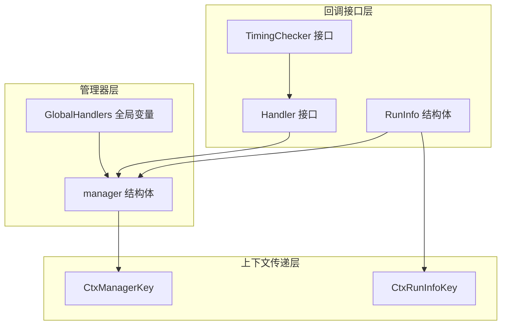
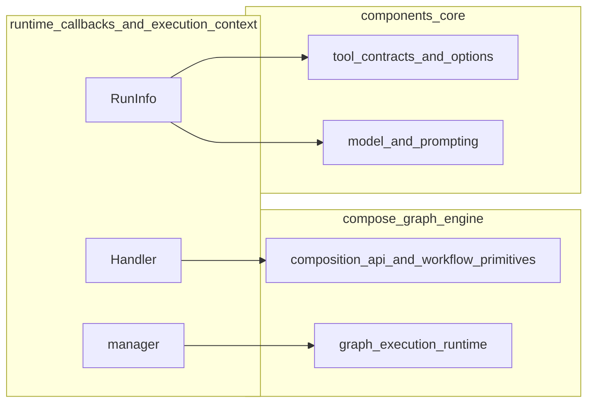

# runtime_callbacks_and_execution_context 模块深度解析

## 概述

`runtime_callbacks_and_execution_context` 是 Eino 框架中负责运行时回调管理和执行上下文传递的核心基础设施模块。想象一下：当一个复杂的 AI Agent 工作流执行时，我们需要一种方法来**监听和记录每个组件的执行过程**，而不必在每个组件代码中硬编码日志、监控或追踪逻辑。这个模块就是为此而设计的——它提供了一套优雅的回调机制，让框架可以在不侵入业务逻辑的情况下，实现对整个执行流程的透明观察。

这个模块解决了一个经典的软件工程问题：**如何在保持核心业务逻辑纯净的同时，提供横切关注点（cross-cutting concerns）的支持**。日志、性能监控、链路追踪、错误收集——这些都属于横切关注点，它们应该与核心逻辑解耦。

## 核心架构



### 架构说明

这个模块的设计采用了三层架构：

1. **回调接口层**：定义了回调的契约（`Handler` 接口）和执行上下文信息（`RunInfo`）。这是整个回调系统的"门面"，外部组件通过实现这个接口来接入回调机制。

2. **管理器层**：由 `manager` 结构体负责管理全局和局部的回调处理器，并提供回调的触发机制。`GlobalHandlers` 允许注册框架级别的全局回调。

3. **上下文传递层**：通过 `context.Context` 机制（配合 `CtxManagerKey` 和 `CtxRunInfoKey`）将回调管理器和执行信息在调用链中传递。这种设计确保了回调信息可以跨多个函数调用、甚至跨 Goroutine 传递。

## 核心组件详解

### 1. Handler 接口：回调契约的定义

`Handler` 是整个回调系统的核心接口，它定义了组件执行生命周期中的五个关键节点：

```go
type Handler interface {
    OnStart(ctx context.Context, info *RunInfo, input CallbackInput) context.Context
    OnEnd(ctx context.Context, info *RunInfo, output CallbackOutput) context.Context
    OnError(ctx context.Context, info *RunInfo, err error) context.Context
    OnStartWithStreamInput(ctx context.Context, info *RunInfo, input *schema.StreamReader[CallbackInput]) context.Context
    OnEndWithStreamOutput(ctx context.Context, info *RunInfo, output *schema.StreamReader[CallbackOutput]) context.Context
}
```

**设计意图**：
- 覆盖了组件执行的完整生命周期：开始 → （流式输入）→ 执行 → （流式输出）→ 结束/错误
- 每个方法都返回 `context.Context`，允许回调在执行过程中修改上下文（如添加追踪信息）
- 区分了普通输入输出和流式输入输出，适应 AI 场景中常见的流式交互模式

### 2. RunInfo：执行上下文信息

```go
type RunInfo struct {
    Name      string
    Type      string
    Component components.Component
}
```

**设计意图**：
- `Name`：用于显示的节点名称（来自 `compose.WithNodeName()`），便于人类阅读
- `Type`：组件类型，用于程序化地识别和分类组件
- `Component`：实际的组件实例，提供对组件的直接访问（虽然在回调中应该谨慎使用）

**注意**：`Name` 不保证唯一性——这是一个有意的设计选择，因为它主要用于显示目的，而不是作为唯一标识符。

### 3. manager：回调管理器

```go
type manager struct {
    globalHandlers []Handler
    handlers       []Handler
    runInfo        *RunInfo
}
```

#### 关键方法分析

**a. newManager - 工厂函数**

```go
func newManager(runInfo *RunInfo, handlers ...Handler) (*manager, bool) {
    if len(handlers)+len(GlobalHandlers) == 0 {
        return nil, false
    }

    hs := make([]Handler, len(GlobalHandlers))
    copy(hs, GlobalHandlers)

    return &manager{
        globalHandlers: hs,
        handlers:       handlers,
        runInfo:        runInfo,
    }, true
}
```

**设计亮点**：
- **性能优化**：如果没有任何回调，直接返回 `nil, false`，让调用者可以完全跳过回调处理逻辑
- **防御性复制**：复制 `GlobalHandlers` 而不是直接引用，防止后续对全局变量的修改影响已创建的管理器
- **简洁的 API**：返回的布尔值让调用代码更加清晰：`if mgr, ok := newManager(...); ok { ... }`

**b. withRunInfo - 不可变更新**

```go
func (m *manager) withRunInfo(runInfo *RunInfo) *manager {
    if m == nil {
        return nil
    }

    n := *m
    n.runInfo = runInfo
    return &n
}
```

**设计亮点**：
- **空值安全**：优雅处理 `m == nil` 的情况
- **值复制**：`n := *m` 创建了结构体的浅拷贝，这是 Go 中实现不可变对象的惯用手法
- **保持不变量**：只改变 `runInfo`，保持 `handlers` 和 `globalHandlers` 不变

**c. managerFromCtx - 安全的上下文提取**

```go
func managerFromCtx(ctx context.Context) (*manager, bool) {
    v := ctx.Value(CtxManagerKey{})
    m, ok := v.(*manager)
    if ok && m != nil {
        n := *m
        return &n, true
    }

    return nil, false
}
```

**设计亮点**：
- **类型安全**：使用类型断言确保我们得到的确实是 `*manager`
- **防御性复制**：返回的是管理器的副本，防止调用方修改管理器内部状态
- **布尔返回值**：让调用者可以安全地判断是否成功提取到管理器

#### manager 的设计意图

- 分离 `globalHandlers` 和 `handlers`：允许框架级别的全局回调和单次执行的局部回调共存
- `runInfo`：当前执行的上下文信息，会随着调用链的深入而更新
- 零值安全设计：通过 `newManager` 函数返回的第二个布尔值指示是否有实际的回调需要处理，避免无回调时的空指针问题

### 4. 上下文键：CtxManagerKey 和 CtxRunInfoKey

```go
type CtxManagerKey struct{}
type CtxRunInfoKey struct{}
```

这两个看似简单的空结构体实际上体现了 Go 语言中 context 使用的一个重要模式。

**设计意图**：
- **类型安全的键**：使用自定义类型作为 context 的键，避免键名冲突
- **包级私有**：这些键定义在 `callbacks` 包中，外部包无法直接使用它们来存取 context 中的值
- **零内存开销**：空结构体不占用任何内存

**Go 惯用法**：
在 Go 中，使用 `struct{}` 作为 context 键是一种标准做法。相比使用字符串键，它有两大优势：
1. **编译时类型检查**：不会因为拼写错误导致 bug
2. **避免命名冲突**：不同包可以使用相同的键名而不会冲突

### 5. TimingChecker：时机检查器（可选扩展）

```go
type TimingChecker interface {
    Needed(ctx context.Context, info *RunInfo, timing CallbackTiming) bool
}
```

**设计意图**：
- 提供了一种动态决定是否需要触发回调的机制
- 可以用于实现采样、条件触发等高级功能
- 这是一个可选接口，不是每个 `Handler` 都需要实现

## 数据流向分析

让我们基于实际的代码，追踪一个典型的组件执行流程中回调的传递路径：

### 场景：一个普通组件的执行（伪代码示例）

```go
func ExecuteComponent(ctx context.Context, component Component, input any) (any, error) {
    // 1. 初始化阶段
    info := &RunInfo{
        Name:      component.Name,
        Type:      component.Type,
        Component: component,
    }
    
    // 只有有回调时才创建管理器
    if mgr, ok := newManager(info, component.Handlers...); ok {
        ctx = ctxWithManager(ctx, mgr)
        
        // 2. 执行前回调
        ctx = invokeOnStart(ctx, mgr, input)
    }
    
    // 3. 执行业务逻辑
    output, err := component.DoSomething(ctx, input)
    
    // 4. 执行后回调
    if mgr, ok := managerFromCtx(ctx); ok {
        if err != nil {
            ctx = invokeOnError(ctx, mgr, err)
        } else {
            ctx = invokeOnEnd(ctx, mgr, output)
        }
    }
    
    return output, err
}
```

**关键点说明**：

1. **防御性初始化**：`newManager` 返回的布尔值让我们可以在没有回调时完全跳过相关逻辑
2. **防御性提取**：`managerFromCtx` 也返回布尔值，安全地处理 context 中没有管理器的情况
3. **副本保护**：`managerFromCtx` 返回的是管理器的副本，防止误修改

### 场景：嵌套组件的执行

当一个组件内部调用另一个组件时，数据流如下：

```go
func OuterComponent(ctx context.Context, input any) (any, error) {
    // 外层设置自己的 RunInfo
    outerInfo := &RunInfo{Name: "outer", Type: "outer-type"}
    if mgr, ok := newManager(outerInfo, outerHandlers...); ok {
        ctx = ctxWithManager(ctx, mgr)
    }
    
    // 调用内层组件前...
    innerInfo := &RunInfo{Name: "inner", Type: "inner-type"}
    
    // 关键：通过 withRunInfo 创建新的管理器，保持 Handler 列表，更新 RunInfo
    if mgr, ok := managerFromCtx(ctx); ok {
        newMgr := mgr.withRunInfo(innerInfo)
        ctx = ctxWithManager(ctx, newMgr)
    }
    
    // 此时调用内层组件，它看到的是 innerInfo...
    
    // 内层执行完毕后，如果需要恢复外层的 RunInfo，需要手动处理
    // 或者更常见的是：每个组件都设置自己的 RunInfo，不依赖恢复
    
    // ...
}
```

**关键设计**：
1. **不可变更新**：`manager.withRunInfo` 创建的是管理器的副本，不影响原管理器
2. **链式传递**：每层组件都可以设置自己的 `RunInfo`，同时保留所有外层的 Handler
3. **内存效率**：虽然创建副本，但 Handler 切片只复制引用，不复制底层数组

这个设计实现了一个非常优雅的效果：**回调处理器是全局/外层继承的，而执行信息是局部/当前层的**。


## 设计决策与权衡

### 1. 基于 Context 的传递机制 vs 显式参数传递

**选择**：使用 `context.Context` 传递回调管理器

**原因**：
- ✅ 不污染函数签名：核心业务逻辑不需要知道回调的存在
- ✅ 自动传递：Context 在 Go 的调用链中是习惯性传递的
- ❌ 隐式依赖：阅读代码时不容易看出回调的存在

**替代方案考虑**：
- 显式将 `Handler` 作为参数传递：会导致函数签名冗长，且不符合 Go 的惯用模式
- 使用全局变量：无法支持每次调用的局部回调

### 2. 全局回调 + 局部回调的双层设计

**选择**：同时支持 `GlobalHandlers` 和每次调用的 `handlers`

**原因**：
- ✅ 灵活性：框架可以设置全局监控，单个调用可以添加特定回调
- ✅ 性能：没有回调时 `newManager` 会返回 `false`，跳过回调处理
- ❌ 复杂度：需要维护两层回调列表

**权衡**：增加的复杂性换来了更好的可扩展性。

### 3. 不可变的 manager 设计

**选择**：`withRunInfo` 返回副本而不是修改原对象

**原因**：
- ✅ 线程安全：多个 Goroutine 可以安全地使用不同的 `RunInfo`
- ✅ 避免状态污染：嵌套调用不会影响外层的执行信息
- ❌ 内存分配：每次都创建新的对象（但在这个场景下是可接受的）

**关键洞察**：在并发场景下，不可变对象通常是更安全的选择。

### 4. Handler 接口的"胖"设计

**选择**：一个接口包含五个方法，而不是多个小接口

**原因**：
- ✅ 便利性：大多数实现者只需要关心其中一两个方法，其他可以留空
- ✅ 完整性：一个接口定义了完整的生命周期
- ❌ 违反接口隔离原则：实现者可能被迫依赖不需要的方法

**Go 的惯用法**：在 Go 中，这种设计比较常见——实现者可以嵌入一个提供空实现的结构体，只重写需要的方法。

## 使用指南与注意事项

### 如何实现一个自定义 Handler

```go
type MyHandler struct{}

func (h *MyHandler) OnStart(ctx context.Context, info *RunInfo, input CallbackInput) context.Context {
    log.Printf("Component %s starting with input: %v", info.Name, input)
    return ctx
}

// 其他方法可以留空，或者嵌入一个提供默认实现的基类
func (h *MyHandler) OnEnd(ctx context.Context, info *RunInfo, output CallbackOutput) context.Context { return ctx }
func (h *MyHandler) OnError(ctx context.Context, info *RunInfo, err error) context.Context { return ctx }
func (h *MyHandler) OnStartWithStreamInput(ctx context.Context, info *RunInfo, input *schema.StreamReader[CallbackInput]) context.Context { return ctx }
func (h *MyHandler) OnEndWithStreamOutput(ctx context.Context, info *RunInfo, output *schema.StreamReader[CallbackOutput]) context.Context { return ctx }
```

### 常见陷阱与注意事项

1. **不要阻塞回调**：
   - 回调应该快速执行，不要做耗时操作
   - 如果需要做耗时处理，应该启动新的 Goroutine

2. **注意 Context 的传递**：
   - 回调方法接收的 Context 是当前调用链的 Context
   - 如果修改了 Context，一定要返回修改后的版本
   - 不要在回调外部持有 Context 的引用

3. **RunInfo.Name 不唯一**：
   - 不要用 Name 作为唯一标识符
   - 如果需要唯一标识，可能需要自己生成

4. **全局回调的线程安全**：
   - 修改 `GlobalHandlers` 时要确保线程安全（目前的设计没有内置锁）
   - 建议在初始化阶段设置全局回调，运行时不要修改

5. **流式回调的特殊性**：
   - `OnStartWithStreamInput` 和 `OnEndWithStreamOutput` 接收的是 `StreamReader`
   - 要小心处理流式数据，不要消费掉原本应该由组件消费的数据

## 模块关系图



`runtime_callbacks_and_execution_context` 是一个底层基础设施模块，它被上层的图执行引擎、组件接口等使用。它不依赖业务逻辑模块，而是被业务逻辑模块依赖。

## 总结

`runtime_callbacks_and_execution_context` 模块展示了一个优雅的 Go 语言设计：它通过 Context 传递、接口契约和不可变对象，实现了横切关注点与核心逻辑的解耦。虽然它的代码量不大，但其设计思想贯穿整个 Eino 框架——让开发者可以专注于业务逻辑，而框架则负责处理监控、追踪等通用需求。

对于新加入的开发者，理解这个模块的设计意图，比理解具体的实现细节更重要。它代表了一种"让框架承担基础设施责任"的设计哲学。
