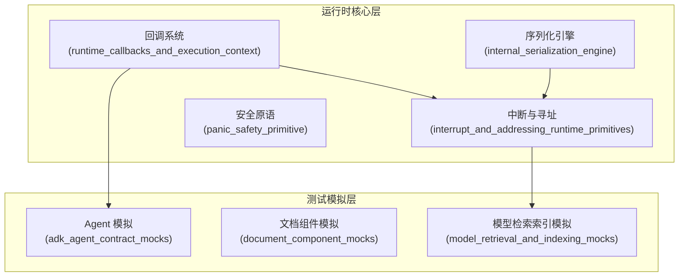

# internal_runtime_and_mocks 模块深度解析

## 模块概述

`internal_runtime_and_mocks` 模块是整个框架的基础设施层，它提供了两个核心能力：

1. **运行时支撑系统**：为上层组件提供回调机制、中断管理、地址追踪和序列化等底层功能
2. **测试模拟框架**：为所有核心组件提供统一的 Mock 实现，使测试可以在不依赖外部资源的情况下进行

想象一下，如果把整个框架比作一个城市，那么这个模块就是城市的**地下基础设施**——它包括供电系统（序列化）、交通监控（回调）、紧急响应机制（中断）以及城市规划图（地址系统）。虽然这些设施在地面上不可见，但没有它们，整个城市就无法正常运转。

## 架构概览

这个模块的架构清晰地分为两层：

1. **运行时核心层**：提供实际运行时所需的基础设施
   - 回调系统：用于组件执行的追踪和监控
   - 中断与寻址：处理执行中断、恢复和执行位置追踪
   - 序列化引擎：处理复杂数据结构的序列化和反序列化
   - 安全原语：提供 panic 捕获和处理机制

2. **测试模拟层**：为所有核心组件提供 Mock 实现
   - Agent 模拟：模拟 Agent 接口
   - 文档组件模拟：模拟文档加载和转换
   - 模型检索索引模拟：模拟模型、嵌入、索引和检索器

## 核心设计理念

### 1. 上下文驱动的执行模型

整个模块的设计围绕着 Go 的 `context.Context` 展开。几乎所有的运行时状态都通过 context 传递，而不是通过全局变量或显式参数。这种设计有几个关键优势：

- **可组合性**：组件可以自由嵌套，状态会自动传递
- **可测试性**：可以轻松创建带有特定状态的 context 进行测试
- **线程安全**：context 是不可变的，避免了并发问题

例如，`Address` 系统就是通过 context 传递的，每个组件在执行时都会将自己的地址段追加到 context 中，形成一个完整的执行路径。

### 2. 类型安全的序列化

序列化引擎采用了一种独特的设计：它不是简单地使用 JSON 序列化，而是先将数据转换为一个内部结构（`internalStruct`），然后再序列化为 JSON。这种设计使得：

- 可以处理任意复杂的类型嵌套
- 保留了类型信息，反序列化时可以正确恢复类型
- 支持自定义的 Marshaler/Unmarshaler

### 3. 中断作为第一类公民

中断系统不是简单的错误处理机制，而是一个完整的执行状态管理系统。它可以：

- 捕获完整的执行上下文（地址、状态、信息）
- 支持中断的嵌套和传播
- 提供精确的恢复机制，可以从任意中断点继续执行

## 关键设计决策

### 决策 1：使用 context 传递所有运行时状态

**选择**：所有运行时状态（回调管理器、地址、中断状态等）都通过 context 传递，而不是使用全局变量或显式参数。

**原因**：
- 这种设计与 Go 语言的惯用法一致
- 提供了自然的作用域管理——当 context 被取消时，相关状态也会被清理
- 使得组件可以自由嵌套，无需手动传递状态

**权衡**：
- ✅ 优点：高可组合性、易于测试、线程安全
- ❌ 缺点：类型安全减弱（需要类型断言）、调试难度增加（状态不直观）

### 决策 2：自定义序列化引擎而不是使用标准库

**选择**：实现了一个完整的自定义序列化引擎，而不是直接使用 `encoding/json`。

**原因**：
- 需要处理 interface{} 类型的序列化和反序列化
- 需要保留完整的类型信息，包括指针层级
- 需要支持自定义的 Marshaler/Unmarshaler

**权衡**：
- ✅ 优点：功能强大、灵活、类型安全
- ❌ 缺点：代码复杂度高、性能可能不如标准库、需要预先注册类型

### 决策 3：中断信号使用树形结构

**选择**：中断信号（`InterruptSignal`）采用树形结构，可以包含子中断信号。

**原因**：
- 支持复杂的嵌套执行场景（如一个 Agent 调用另一个 Agent）
- 可以精确地表示中断的根源和传播路径
- 便于实现精确的恢复机制

**权衡**：
- ✅ 优点：表达能力强、支持复杂场景
- ❌ 缺点：实现复杂、使用难度较高

## 子模块概览

### runtime_callbacks_and_execution_context

这个子模块提供了回调系统的核心实现，包括回调接口、回调管理器和运行信息。它就像是一个**执行监控系统**，可以在组件执行的各个阶段（开始、结束、错误）插入自定义逻辑。

详细信息请参考 [runtime_callbacks_and_execution_context 文档](internal_runtime_and_mocks-runtime_callbacks_and_execution_context.md)。

### interrupt_and_addressing_runtime_primitives

这个子模块是整个运行时的核心，它提供了中断管理、地址追踪和恢复机制。它就像是一个**执行导航系统**，可以精确地定位执行位置，处理中断，并支持从任意点恢复执行。

详细信息请参考 [interrupt_and_addressing_runtime_primitives 文档](internal_runtime_and_mocks-interrupt_and_addressing_runtime_primitives.md)。

### internal_serialization_engine

这个子模块提供了类型安全的序列化和反序列化功能。它就像是一个**数据翻译官**，可以在 Go 的复杂数据结构和 JSON 之间进行精确转换，同时保留完整的类型信息。

详细信息请参考 [internal_serialization_engine 文档](internal_runtime_and_mocks-internal_serialization_engine.md)。

### adk_agent_contract_mocks

这个子模块提供了 Agent 接口的 Mock 实现，用于测试。它就像是一个**演员替身**，可以在测试中代替真实的 Agent，按照预设的行为执行。

详细信息请参考 [adk_agent_contract_mocks 文档](internal_runtime_and_mocks-adk_agent_contract_mocks.md)。

### document_component_mocks

这个子模块提供了文档组件（Loader、Transformer）的 Mock 实现。它可以模拟文档的加载和转换，使测试不依赖真实的文档源。

详细信息请参考 [document_component_mocks 文档](internal_runtime_and_mocks-document_component_mocks.md)。

### model_retrieval_and_indexing_mocks

这个子模块提供了模型、嵌入、索引和检索器的 Mock 实现。它可以模拟这些组件的行为，使测试可以在不依赖外部服务的情况下进行。

详细信息请参考 [model_retrieval_and_indexing_mocks 文档](internal_runtime_and_mocks-model_retrieval_and_indexing_mocks.md)。

## 跨模块依赖

这个模块是整个框架的基础设施，因此它被几乎所有其他模块依赖：

- **被依赖**：`adk_runtime`、`compose_graph_engine`、`flow_agents_and_retrieval` 等模块都依赖这个模块提供的运行时功能
- **依赖**：这个模块几乎不依赖其他模块，只依赖一些基础的类型定义（如 `schema`）

这种依赖关系体现了它的基础设施定位——它为上层模块提供服务，而不依赖上层模块。

## 新贡献者指南

### 常见陷阱

1. **忘记注册类型**：使用序列化引擎时，必须先通过 `GenericRegister` 注册自定义类型，否则序列化会失败。

2. **context 传递**：所有运行时状态都通过 context 传递，因此必须确保 context 在组件调用链中正确传递，不要创建新的 context 而不继承父 context。

3. **中断处理**：中断信号是 error 类型，但它不是普通的错误——它包含完整的执行上下文。处理中断时，不要简单地将其视为错误，而应该使用专门的 API 处理。

4. **Mock 使用**：使用 Mock 时，必须通过 `EXPECT()` 方法设置期望行为，否则 Mock 会返回零值。

### 扩展点

1. **自定义回调**：可以通过实现 `Handler` 接口创建自定义回调，并通过 `GlobalHandlers` 注册全局回调。

2. **自定义序列化**：对于特殊类型，可以实现 `json.Marshaler` 和 `json.Unmarshaler` 接口，序列化引擎会自动使用这些自定义实现。

3. **新的 Mock**：当添加新的组件接口时，可以使用 `mockgen` 工具生成相应的 Mock 实现。

### 调试技巧

1. **打印地址**：使用 `GetCurrentAddress(ctx).String()` 可以打印当前的执行地址，这对于调试中断和恢复非常有用。

2. **检查回调**：可以通过 `managerFromCtx(ctx)` 检查当前 context 中的回调管理器。

3. **序列化测试**：在使用自定义类型前，先写一个简单的测试验证序列化和反序列化是否正常工作。
