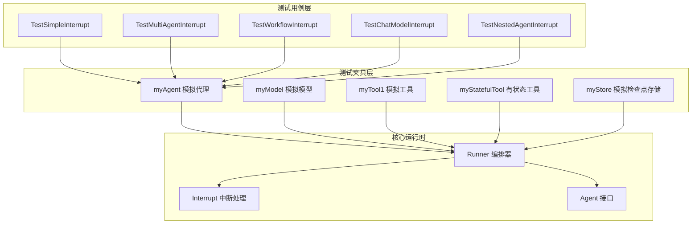
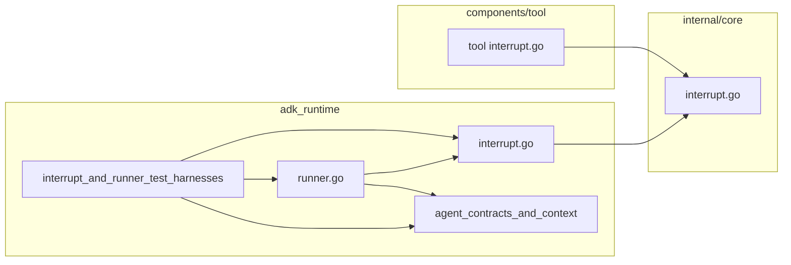

# interrupt_and_runner_test_harnesses 模块文档

## 模块概述

`interrupt_and_runner_test_harnesses` 是 Eino ADK（Agent Development Kit）运行时中的一个关键测试模块，它为**中断（Interrupt）机制**和**Runner 编排器**提供了全面的测试用例覆盖。

**为什么这个模块存在？**

在构建智能代理应用时，代理经常需要在执行过程中暂停，等待人类用户的确认或输入。想象一个场景：代理准备执行一笔转账操作，但在真正执行前需要用户确认金额和收款人。如果没有中断机制，代理可能会直接执行操作，或者你需要预先设计所有可能的分支路径，导致系统变得极其复杂。

中断机制允许代理在任意时刻"暂停"执行，将控制权交还给调用者。调用者可以展示当前状态给用户，收集用户决策，然后让代理从中断点继续执行。这就是这个模块所要验证的核心功能——确保代理的"暂停-恢复"生命周期能够正确工作。

这个模块不仅测试简单的单代理中断，还验证了复杂场景：多代理级联中断、工具中断、工作流（顺序/循环/并行）中的中断、嵌套代理中的中断，以及循环代理调用中的中断。

## 架构概览



### 架构解读

这个模块采用了经典的"测试金字塔"结构，底层是真实的核心运行时组件，上层是各种测试夹具（Mock），最顶层是全面的测试用例。

**测试夹具层**包含四个核心模拟组件：

- `myAgent`：实现了 `Agent` 和 `ResumableAgent` 接口的模拟代理，通过注入 `runFn` 和 `resumeFn` 函数来模拟不同的执行行为。这是测试中最灵活的组件，可以构造任意复杂度的代理交互场景。

- `myModel`：模拟 LLM（大语言模型），返回预定义的消息序列。通过 `validator` 函数可以验证模型接收到的输入是否正确，这对于测试代理与模型的交互逻辑至关重要。

- `myTool1` 和 `myStatefulTool`：模拟工具实现，支持中断和恢复机制。后者能够保存内部状态（`myStatefulToolState`），验证状态在中断前和恢复后的一致性。

- `myStore`：实现了 `CheckPointStore` 接口的内存存储，用于验证检查点保存和加载逻辑。

**数据流解读**：

当测试运行时，数据流遵循以下路径：

1. 测试用例创建 `Runner`，配置 `Agent` 和 `CheckPointStore`
2. 调用 `runner.Query()` 启动代理执行
3. 代理执行过程中可能调用模型、工具或子代理
4. 当代理调用 `Interrupt()` 或 `StatefulInterrupt()` 时，执行暂停
5. Runner 检测到中断事件，保存检查点
6. 测试用例调用 `runner.ResumeWithParams()` 恢复执行
7. 代理的 `Resume()` 方法被调用，继续执行

## 核心设计决策

### 1. 为什么使用函数式注入而非继承？

`myAgent` 采用了函数式设计模式——通过 `runFn` 和 `resumeFn` 函数指针来定义代理行为，而不是通过继承重写方法。这种设计有几个关键优势：

**优势**：
- **测试隔离**：每个测试可以完全控制代理的行为，不需要担心状态泄漏
- **行为组合**：同一个代理类型可以在不同测试中展现完全不同的行为
- **简洁性**：不需要创建大量的测试子类

**Trade-off**：
- 对于复杂的多态场景，可能需要更多的代码来模拟
- 静态类型检查能力略有削弱（因为函数签名是运行时确定的）

### 2. 为什么需要三种中断类型？

测试覆盖了三种中断类型：`Interrupt`、`StatefulInterrupt` 和 `CompositeInterrupt`。这反映了真实世界中的三种需求：

| 中断类型 | 用途 | 状态保存 | 典型场景 |
|---------|------|---------|---------|
| `Interrupt` | 简单暂停 | 否 | 等待用户确认 |
| `StatefulInterrupt` | 带状态暂停 | 是 | 多步骤流程，需要记住进度 |
| `CompositeInterrupt` | 聚合多个中断 | 是 | 并行工具同时中断 |

这种设计允许调用者根据具体场景选择合适的中断粒度。简单场景使用基础中断避免状态序列化开销，复杂流程使用有状态中断确保正确性。

### 3. 为什么中断上下文需要完整的地址链？

每个 `InterruptCtx` 都包含完整的 `Address` 链（例如：`[{Agent: A}, {Agent: B}, {Tool: myTool, SubID: 1}]`）。这并非过度设计，而是因为：

- **可观测性**：开发者可以准确知道中断发生在哪个深度
- **恢复目标指定**：调用者可以通过地址精确指定恢复哪个中断点
- **嵌套场景**：在嵌套代理（如 ChatModelAgent -> AgentTool -> ChatModelAgent）中，只有完整的地址链才能唯一定位一个中断点

### 4. 为什么工作流中断如此复杂？

`TestWorkflowInterrupt` 测试了三种工作流模式（Sequential、Loop、Parallel）的中断行为。这些场景特别复杂的原因在于：

- **顺序执行**：中断后恢复可能继续到下一个节点，也可能继续在当前节点循环
- **循环执行**：每次循环迭代都可能产生中断，需要跟踪循环计数
- **并行执行**：多个分支可能同时中断，需要聚合所有中断点

测试验证了每种模式下的中断上下文是否正确包含了工作流特定的元数据（如 `LoopIterations`、`SequentialInterruptIndex`、`ParallelInterruptInfo`）。

## 子模块说明

本模块相对紧凑，核心功能分为两个主要文件：

### 1. interrupt_test.go - 中断机制测试

这个文件包含了所有中断相关的测试用例，覆盖了：

- **基础中断功能**：`TestSimpleInterrupt` 验证单个代理的中断和恢复
- **多代理场景**：`TestMultiAgentInterrupt` 验证代理间转移（handoff）时的中断传递
- **工作流场景**：`TestWorkflowInterrupt` 验证三种工作流（Sequential/Loop/Parallel）中的中断行为
- **模型调用中断**：`TestChatModelInterrupt` 验证 ChatModelAgent 在工具调用时的中断
- **嵌套场景**：`TestChatModelAgentToolInterrupt` 和 `TestNestedChatModelAgentWithAgentTool` 验证多层嵌套代理的中断传播
- **循环调用**：`TestCyclicalAgentInterrupt` 验证代理循环调用（如 A->B->A->C）时的中断
- **并行工具中断**：`TestChatModelParallelToolInterruptAndResume` 验证多个工具同时中断的处理

### 2. runner_test.go - Runner 编排器测试

这个文件专注于 `Runner` 本身的功能验证：

- 创建 Runner 实例
- `Run()` 方法执行带消息的代理
- `Query()` 方法执行带字符串查询的代理
- 流式和非流式模式的支持

### 关键测试组件

| 组件 | 作用 | 关键特性 |
|------|------|---------|
| `myAgent` | 模拟可恢复代理 | 支持 `runFn` 和 `resumeFn` 函数注入 |
| `myModel` | 模拟 LLM | 支持预定义消息序列和输入验证器 |
| `myTool1` | 简单工具模拟 | 支持中断/恢复流程 |
| `myStatefulTool` | 有状态工具模拟 | 维护 `myStatefulToolState`，跟踪调用次数 |
| `myStore` | 内存检查点存储 | 简单 `map[string][]byte` 实现 |
| `mockRunnerAgent` | Runner 专用代理模拟 | 跟踪调用次数和输入参数 |

## 与其他模块的交互



**依赖关系分析**：

1. **依赖 `adk.interrupt.go`**：测试用例调用 `Interrupt()`、`StatefulInterrupt()` 等函数创建中断事件
2. **依赖 `adk.runner.go`**：测试使用 `Runner` 类执行和恢复代理
3. **依赖 `adk.interface.go`**：`myAgent` 实现了 `Agent` 和 `ResumableAgent` 接口
4. **依赖 `adk/flow.go`**：`TestWorkflowInterrupt` 使用 `NewSequentialAgent`、`NewLoopAgent`、`NewParallelAgent`
5. **依赖 `adk/chatmodel.go`**：`TestChatModelInterrupt` 使用 `NewChatModelAgent`
6. **依赖 `components/tool`**：工具通过 `tool.Interrupt()` 和 `tool.GetInterruptState` 实现中断

## 新贡献者注意事项

### 1. 中断上下文必须在创建时填充

测试 `TestInterruptFunctionsPopulateInterruptContextsImmediately` 验证了一个重要契约：中断函数（`Interrupt`、`StatefulInterrupt`、`CompositeInterrupt`）必须在返回 `*AgentEvent` 之前填充完整的 `InterruptContexts`。这意味着：

- 中断发生后，调用者可以立即从事件中获取中断信息
- 不需要等待额外的初始化步骤
- 地址链（Address）是基于当前执行上下文动态构建的

如果你修改了中断逻辑，确保这个行为不被破坏。

### 2. "隐式恢复全部" vs "显式指定目标"

`Runner` 提供了两种恢复方法：`Resume()` 和 `ResumeWithParams()`。理解它们的区别很重要：

- `Resume()`：隐式恢复所有中断点，所有被中断的组件收到 `isResumeFlow=false`
- `ResumeWithParams()`：显式指定恢复目标，未指定的组件必须重新中断

测试用例展示了后者（显式指定目标）的使用场景，这更常见于需要向不同中断点传递不同数据的场景。

### 3. 工具中断的特殊处理

`myTool1` 的实现展示了工具中断的正确模式：

```go
func (m *myTool1) InvokableRun(ctx context.Context, _ string, _ ...tool.Option) (string, error) {
    // 检查是否被中断（首次运行）
    if wasInterrupted, _, _ := tool.GetInterruptState[any](ctx); !wasInterrupted {
        return "", tool.Interrupt(ctx, nil)
    }

    // 检查是否是恢复流程
    if isResumeFlow, hasResumeData, data := tool.GetResumeContext[string](ctx); !isResumeFlow {
        return "", tool.Interrupt(ctx, nil)
    } else if hasResumeData {
        return data, nil
    }

    return "result", nil
}
```

关键点：
- 首次运行调用 `tool.Interrupt()` 触发中断
- 恢复时调用 `tool.GetInterruptState` 和 `tool.GetResumeContext` 判断当前状态
- 恢复数据通过 `tool.GetResumeContext` 获取

### 4. 并行工具中断的语义

`TestChatModelParallelToolInterruptAndResume` 揭示了一个重要语义：当多个工具并行中断时，恢复策略会影响后续行为：

- 如果只恢复 `toolA`，未恢复的 `toolB` 会被框架要求重新中断
- 这确保了"部分恢复"场景下的一致性

这种设计允许实现"确认一个，继续另一个"的交互模式。

### 5. 嵌套代理中的事件去重

`TestNestedChatModelAgentWithAgentTool` 是一个关键的回归测试。它验证了在嵌套代理场景下（OuterAgent -> AgentTool -> InnerAgent），事件不会被重复发送。这是通过 `shouldFire` 机制来防止的。新增功能时，确保这个行为不被破坏。

### 6. 检查点存储是可选的

注意测试中使用 `myStore`（一个内存 Map）作为 `CheckPointStore`，但 `Runner` 在没有 store 时仍然可以运行。这意味着：

- 非持久化场景不需要配置 store
- 中断后的恢复需要 store
- 测试中使用内存 store 是为了简化测试设置

## 扩展点与延伸阅读

如果你想深入理解这个模块的设计，建议按以下顺序阅读源码：

1. **起点**：`adk/runner.go` - 理解 Runner 如何编排代理执行和恢复
2. **中断核心**：`adk/interrupt.go` - 理解三种中断函数的实现
3. **工具中断**：`components/tool/interrupt.go` - 理解工具层面的中断 API
4. **内部实现**：`internal/core/interrupt.go` - 理解底层中断状态管理

相关文档：
- [flow_agent_orchestration](flow_agent_orchestration.md) - 工作流代理的实现细节
- [interrupt_resume_bridge](flow_runner_interrupt_and_transfer-interrupt_resume_bridge.md) - 中断与恢复的桥梁机制
- [runner_execution_and_resume](runner_execution_and_resume.md) - Runner 执行与恢复的详细流程