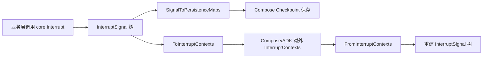

# interrupt_signal_and_context_bridge 深度技术解析

`interrupt_signal_and_context_bridge` 模块做的事情可以用一句话概括：它把“执行中断”从一个临时错误，变成一份可追踪、可序列化、可跨层传递、可恢复的结构化协议。想象你在一栋多层建筑里处理火警：你不仅要知道“有警报”，还要知道“哪一层、哪一间、谁先触发、上下级关系是什么、恢复时该把状态送回哪里”。这个模块就是这套“中断信号与上下文桥接协议”，它让 Compose/ADK 这样的上层系统能稳定地暂停和恢复，而不是靠模糊的 error 字符串碰碰运气。

## 它解决的是什么问题（为什么不能用朴素方案）

朴素方案通常是：某个组件返回一个 error，上层看到了就停止执行。这在“只需要失败”时够用，但在“需要恢复”时很快失效。恢复语义至少需要四件事：唯一 ID、层级地址、用户可读信息、机器可恢复状态。普通 error 没有这些结构，也无法表达“多个子中断合并成一棵树”这种现实场景。

这个模块的核心洞察是：**中断不是异常分支，而是控制流协议**。因此它定义了 `InterruptSignal`（内部信号树）与 `InterruptCtx`（用户侧上下文链）两种视图，并提供双向转换函数。这样上层可以在不同执行环境之间“桥接”中断信息，而不会丢失拓扑关系。

## 心智模型：两种表示、一个真相

可以把它想成“数据库中的规范化表 + API 返回 DTO”。

内部运行时使用 `InterruptSignal` 树，强调机器处理：节点有 `ID`、`Address`、`InterruptInfo`、`InterruptState`、`Subs`。这适合聚合、落盘、恢复。

对外展示使用 `InterruptCtx` 链，强调人和接口：每个 root cause 上下文都能沿 `Parent` 回溯上游链路，适合 UI、跨模块协议、外部调用方消费。

两者是同一事实的不同投影：

- `ToInterruptContexts`：树 -> root cause 上下文列表（附 Parent 链）
- `FromInterruptContexts`：上下文列表 -> 树（自动合并共同祖先）

这就是“context bridge”的字面含义。

## 架构与数据流



这条链路里，本模块的架构角色是“**协议转换层 + 状态结构层**”。它不负责执行调度，不负责存储后端，不负责 UI 展示；它负责把中断语义结构化，并在内部/外部表示之间保持可逆性（在输入一致时）。

从已确认的调用关系看：

- 上游调用：`compose.interrupt.Interrupt` / `StatefulInterrupt` / `CompositeInterrupt` 都会调用 `core.Interrupt`；`CompositeInterrupt` 还会在需要时调用 `core.FromInterruptContexts`。
- 下游消费：`compose.checkpoint` 侧通过 `SignalToPersistenceMaps` 将信号树拍平为持久化 map；`compose.interrupt` 侧通过 `ToInterruptContexts` 暴露用户可读上下文。

## 组件深潜

### `CheckPointStore`（interface）

`CheckPointStore` 只定义两件事：`Get` 和 `Set`。它刻意保持最小能力边界，不关心序列化格式、不关心并发策略、不关心业务语义。这个抽象把“中断协议”与“存储实现”解耦，让上层可以自由替换后端。

### `InterruptState`（struct）

`InterruptState` 有两个字段：`State` 和 `LayerSpecificPayload`。

`State` 是通用恢复状态；`LayerSpecificPayload` 是通过 `InterruptOption` 注入的层特定载荷。这个双槽设计很实用：既保留通用恢复语义，又允许不同层（例如 ADK、Compose）放置自己的元信息，而不污染主状态字段。

### `InterruptConfig` / `InterruptOption` / `WithLayerPayload`

这是典型函数选项模式。`Interrupt` 本身只接受稳定核心参数（`info/state/subContexts`），扩展字段通过 option 注入。这样避免不断膨胀函数签名，也给未来扩展留了兼容空间。

### `InterruptSignal`（struct）

`InterruptSignal` 是内部协议核心：

- `ID string`
- `Address`
- `InterruptInfo`
- `InterruptState`
- `Subs []*InterruptSignal`

它实现了 `Error()`，意味着可以直接作为 Go `error` 返回。这是一个关键设计：中断通过错误通道向上传播，但内部仍是结构化对象，不退化为字符串。

`Subs` 的存在使它天然支持“复合中断”。例如并发工具调用多个子任务都中断时，上层可构造一个父信号，子信号挂在 `Subs`。

### `Interrupt(ctx, info, state, subContexts, opts...)`

这是信号构造入口。它会调用 `GetCurrentAddress(ctx)` 绑定当前地址，然后生成新 UUID 作为 `ID`。如果 `subContexts` 为空，则自动标记 `IsRootCause=true`；否则作为聚合节点，root cause 由子节点决定。

这个自动 root-cause 策略是个不显眼但重要的默认：单点中断调用者不需要手动理解“根因”标记，复杂聚合场景再由组合逻辑控制。

### `InterruptCtx`（struct）与 `EqualsWithoutID`

`InterruptCtx` 是用户可见上下文：`ID`、`Address`、`Info`、`IsRootCause`、`Parent`。

`EqualsWithoutID` 递归比较地址、根因标记、`Info`（`reflect.DeepEqual`）和 `Parent`，故意忽略 `ID`。这反映了一个现实：有时需要比较“语义是否相同”，而不是比较运行期随机生成的 ID。

### `InterruptContextsProvider`（interface）

它只暴露 `GetInterruptContexts() []*InterruptCtx`。这个接口的价值在于“弱耦合识别”：别的包不需要依赖某个具体 error 类型，也能抽取中断上下文。

### `FromInterruptContexts(contexts)`

该函数把 `InterruptCtx` 列表重建为一棵 `InterruptSignal` 树。实现上用 `signalMap[ctx.ID]` 做缓存，递归地“先建自己，再挂到父节点”，并自动合并共同祖先。

这解决了桥接场景的关键问题：外部系统通常给你一组 root cause 上下文，但运行时需要的是完整树结构。这个函数就是两者之间的桥。

需要注意：它返回单个 `rootSignal`。这隐含输入应属于同一棵树；若输入来自多个独立根，最终行为依赖处理顺序，调用侧应避免混入不相关上下文。

### `ToInterruptContexts(is, allowedSegmentTypes)`

该函数把信号树展开为 root cause 上下文列表，并为每个 root cause 填好 `Parent` 链。

如果 `allowedSegmentTypes` 非空，还会做两步过滤：

1. `filterParentChain`：父链只保留“叶段类型被允许”的节点；
2. `encapsulateContextAddresses`：地址本身剔除不允许的 segment type。

这个过滤机制是“分层可见性控制”设计：同一条内部链路可以在对外暴露时做裁剪，避免泄露不必要的内部层级。

### `SignalToPersistenceMaps(is)`

它把树拍平成两个 map：`id2addr` 和 `id2state`。这是为 checkpoint 持久化准备的中间形态，便于存储层按 ID 索引状态，而不必理解树结构。

这个选择是典型的“写时拍平，读时重建”策略：存储更简单，运行时通过地址/上下文再恢复语义关系。

## 依赖分析与契约边界

本模块直接依赖很轻：`context`、`fmt`、`reflect`、`uuid`，以及同域地址能力 `GetCurrentAddress` / `Address` / `InterruptInfo`。

它与其他模块的关键契约是：

- 与 [address_and_resume_routing](address_and_resume_routing.md)：`Interrupt` 依赖 `GetCurrentAddress(ctx)` 提供当前执行地址，地址稳定性直接决定恢复定位正确性。
- 与 [Compose Interrupt](Compose%20Interrupt.md)：`compose.interrupt.Interrupt`、`StatefulInterrupt`、`CompositeInterrupt` 以 `core.InterruptSignal` 作为底层协议；`CompositeInterrupt` 在桥接路径会调用 `FromInterruptContexts`。
- 与 [Compose Checkpoint](Compose%20Checkpoint.md)：checkpoint 会保存 `InterruptID2Addr` / `InterruptID2State`，其来源正是 `SignalToPersistenceMaps` 的输出形态。

如果上游改动了地址构造规则（`Address`/`ID` 契约），这里的桥接与重建就会失配；如果下游不再使用 ID->state 映射，`SignalToPersistenceMaps` 的价值会下降。这说明该模块对“地址与 ID 稳定性”有强假设。

## 设计取舍与理由

这个模块明显偏向“恢复正确性优先”。

第一，它让 `InterruptSignal` 同时是结构体和 `error`。好处是与 Go 错误传播兼容，代价是调用方必须使用 `errors.As` 做类型化处理，不能只看字符串。

第二，它保留 `any`（`Info`、`State`、`LayerSpecificPayload`）。好处是跨层灵活，代价是类型安全后移到运行时。

第三，它采用树结构表达复合中断，而不是把所有中断平铺成列表。好处是保留真实调用拓扑，便于父子恢复决策；代价是序列化和转换逻辑更复杂。

第四，它在 `ToInterruptContexts` 提供 segment type 过滤。好处是信息最小暴露；代价是被过滤后地址可能不再唯一，调用方需要理解这是“展示/桥接视图”，不是完整内部坐标。

## 使用方式与示例

```go
// 1) 在当前执行点触发中断（自动绑定当前 Address）
is, err := core.Interrupt(ctx, "need human approval", map[string]any{"step": 3}, nil,
    core.WithLayerPayload(map[string]any{"source": "agent-layer"}),
)
if err != nil {
    return err
}
return is // InterruptSignal 实现了 error
```

```go
// 2) 对外暴露时转换为 InterruptCtx（可选过滤地址段）
contexts := core.ToInterruptContexts(is, nil)

// 3) 跨边界回来后再重建成内部信号树
reconstructed := core.FromInterruptContexts(contexts)

// 4) 写 checkpoint 前拍平
id2addr, id2state := core.SignalToPersistenceMaps(reconstructed)
_ = id2addr
_ = id2state
```

## 新贡献者最该注意的点

最容易忽视的是 ID 语义。`Interrupt()` 总是生成新 UUID；而 `FromInterruptContexts` 使用传入 `ctx.ID`。这意味着“重建”流程依赖外部上下文 ID 的一致性，不能随意改写。

第二个坑是 `allowedSegmentTypes` 过滤副作用。过滤会同时改父链和地址内容，得到的是裁剪视图。若你后续拿这个地址做内部精确匹配，可能失败。

第三个坑是 `FromInterruptContexts` 的输入预期。它主要针对同一中断链的上下文集合。若传入多棵互不相关的树，返回单 root 的语义并不适合这种场景。

第四个坑是 `Info/State` 的可比较与可序列化问题。`EqualsWithoutID` 使用 `reflect.DeepEqual`，某些复杂对象（函数、通道等）并不适合放在 `Info`；而 `State` 最终还可能进入 checkpoint，需要考虑序列化兼容。

## 参考

- [address_and_resume_routing](address_and_resume_routing.md)
- [Compose Interrupt](Compose%20Interrupt.md)
- [Compose Checkpoint](Compose%20Checkpoint.md)
