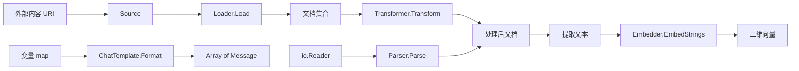

# knowledge_and_prompt_interfaces

这一组接口（`ChatTemplate`、`Source/Loader/Transformer/Parser`、`Embedder`）共同解决的是“**把原始信息变成模型可消费上下文**”的问题。它们像一条装配线：先把外部内容接入，再清洗/切分，再格式化成消息，最后（在需要时）转向量进入检索体系。接口都很薄，但边界划分非常刻意，目的是让每一段都能独立替换。

## 架构心智模型

把它想成“内容供应链”：

- `Source`：货源地址（URI）
- `Loader`：运输车，把内容拉回来
- `Parser`：拆箱员，从 `io.Reader` 解析文档
- `Transformer`：质检与分拣（切分/过滤）
- `Embedder`：把文本压成向量编码
- `ChatTemplate`：把变量装配成模型消息



## 组件逐个解析

### `components.prompt.interface.ChatTemplate`

```go
Format(ctx context.Context, vs map[string]any, opts ...Option) ([]*schema.Message, error)
```

`ChatTemplate` 的核心价值是把 prompt 构造从“字符串拼接”提升为“结构化消息生成”。`vs map[string]any` 提供变量输入，输出是 `[]*schema.Message`，天然适配模型接口。

源码里有 `var _ ChatTemplate = &DefaultChatTemplate{}`，说明 `DefaultChatTemplate` 是标准实现锚点。已读结构体可见它内部持有：

- `templates []schema.MessagesTemplate`
- `formatType schema.FormatType`

这意味着框架设计上把“模板内容”和“格式策略”分离，避免把格式判断散落在调用侧。

### `components.document.interface.Source`

```go
type Source struct { URI string }
```

`Source` 刻意只保留 `URI`。看起来简单，但它把“文档来源定位”变成稳定最小契约：不绑定协议、不绑定存储系统。注释明确要求 URI 可被服务访问，这是实际运行中的隐式前提。

### `Loader` / `Transformer`（与 `Source` 同文件）

- `Loader.Load(ctx, src Source, opts ...LoaderOption) ([]*schema.Document, error)`
- `Transformer.Transform(ctx, src []*schema.Document, opts ...TransformerOption) ([]*schema.Document, error)`

这两个接口将“取数”和“改数”分离：

- Loader 负责 I/O（从 URI 获取文档）；
- Transformer 负责纯内容变换（分块、过滤、清洗）。

这种分层的好处是测试与复用都更清晰：你可以在不访问外部存储的情况下单测 Transformer。

### `components.document.parser.interface.Parser`

```go
Parse(ctx context.Context, reader io.Reader, opts ...Option) ([]*schema.Document, error)
```

Parser 选择以 `io.Reader` 为输入，是非常 Go 风格的抽象：它不关心数据来自文件、网络还是内存，天然支持流式读取与大文件场景。代价是调用方要负责 reader 生命周期与编码一致性。

### `components.embedding.interface.Embedder`

```go
EmbedStrings(ctx context.Context, texts []string, opts ...Option) ([][]float64, error)
```

Embedder 把文本列表映射到二维向量。接口没有暴露模型细节（维度、归一化策略、批处理策略），把实现自由留给适配器层。好处是可替换性高；风险是调用方若假设固定维度，会在切换实现时出问题。

## 数据流与依赖关系（可验证范围）

- 输入类型统一收敛到 `schema.Document` 与 `schema.Message`。
- `ChatTemplate` 明确依赖 `schema.Message`。
- `Loader/Transformer/Parser` 都以 `schema.Document` 作为交换格式。
- `Embedder` 输出 `[][]float64`，通常被索引/检索模块消费（见 [Flow Indexers](flow_indexers.md)、[Flow Retrievers](flow_retrievers.md)）。

> 当前材料未提供细粒度调用边，无法断言某个具体函数调用顺序；以上是由接口契约推导的标准编排路径。

## 设计取舍

1. **统一文档交换类型（`schema.Document`）**
   - 优点：模块解耦、链路可拼装。
   - 代价：对超定制字段需靠 metadata 扩展。

2. **Parser 使用 `io.Reader` 而非路径字符串**
   - 优点：来源无关、可流式。
   - 代价：上层要多承担资源管理责任。

3. **Embedder 只定义文本批量嵌入**
   - 优点：最小稳定面。
   - 代价：多模态 embedding 不在该接口表达范围内。

4. **ChatTemplate 输出消息而非纯文本**
   - 优点：直接对接 `BaseChatModel`。
   - 代价：模板实现需理解消息结构，而不只是字符串模板语法。

## 新贡献者注意事项

- `Source.URI` 可达性是运行时硬前提，不能只在编译期验证。
- `Loader` 与 `Parser` 不要职责重叠（一个负责来源接入，一个负责内容解析）。
- `EmbedStrings` 返回向量维度必须在同一实现内保持稳定。
- `ChatTemplate.Format` 的变量 key 缺失/类型不匹配应明确返回错误，不要静默吞掉。

## 参考

- [Component Interfaces](Component Interfaces.md)
- [Schema Core Types](schema_core_types.md)
- [Schema Stream](schema_stream.md)
- [Component Options and Extras](component_options_and_extras.md)
