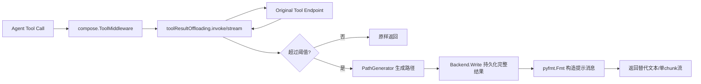

# large_tool_result_offloading_pipeline

`large_tool_result_offloading_pipeline` 的核心价值很直白：**防止工具输出“撑爆”模型上下文，同时又不丢数据**。在 Agent 调用文件系统工具（尤其是 `grep`、`execute`、`read_file` 大范围读取）时，返回结果可能非常长。朴素做法是把完整文本直接回传给模型，但这会迅速消耗 token budget，导致后续推理质量下降甚至失败。这个模块选择了一条更工程化的路：**把大结果写入文件系统，回给模型一段“索引说明 + 内容样例”**，让模型后续用分页的 `read_file` 再按需读取。

## 先讲问题：为什么必须有这个模块

这个模块解决的不是“能不能拿到工具输出”，而是“**拿到输出后怎么在上下文窗口里活下去**”。在多轮工具调用中，最昂贵的资源往往不是 CPU，而是模型上下文。一次 `execute` 或 `grep` 产生几万字符很常见，如果每次都原样塞进 message history，历史会在几轮内膨胀到不可用。

更糟的是，完全截断也不行：你会丢掉关键证据。比如编译日志里真实错误在后半段，简单 `[:N]` 会把最重要部分扔掉。该模块的设计洞察是：**把“内容存储”和“上下文表达”解耦**。完整内容落盘保存（storage plane），上下文里只保留可引导后续检索的摘要消息（control plane）。

你可以把它想成“仓库入库单”：大货物（完整结果）送进仓库（`Backend.Write`），对话里只传一张入库单（路径、call id、前 10 行样本），后续谁需要货，再拿单据去分批提货（`read_file` with offset/limit）。

## 架构角色与数据流

从架构角色看，它是一个**工具调用结果后处理的 middleware**，位于工具执行端点之后、结果回传模型之前。它本身不执行工具业务逻辑，只做“结果大小治理”。



关键链路在 [`filesystem.NewMiddleware`](filesystem_middleware_and_tool_surface.md) 里接上：当 `Config.WithoutLargeToolResultOffloading == false` 时，会设置 `AgentMiddleware.WrapToolCall = newToolResultOffloading(...)`。这说明它是文件系统 middleware 的默认行为，而不是调用方每次手工包裹。

在执行时有两条路径：

对于非流式工具，`toolResultOffloading.invoke` 包一层 `compose.InvokableToolEndpoint`。它先调用原 endpoint，拿到 `ToolOutput.Result`，再交给 `handleResult`。如果超限，写文件并返回替代消息；不超限原样透传。

对于流式工具，`toolResultOffloading.stream` 先把 `*schema.StreamReader[string]` 用 `concatString` 全量拼接成一个字符串，再复用同一套 `handleResult`。最后不管结果来源如何，都会返回 `schema.StreamReaderFromArray([]string{result})`，即单 chunk stream。

这也直接揭示一个重要设计点：**流式路径在本模块内被“降级”为聚合后处理**，它追求的是一致的 offloading 语义，而不是保留原始 streaming 形态。

## 心智模型：三步门卫

理解这个模块最有效的方式是记住一个三步门卫模型：

1. **测量**：判断结果是否超过阈值（`len(result) > tokenLimit*4`）。
2. **外置**：超过就把原文写入 `Backend.Write`。
3. **回执**：返回一个可操作的替代消息（带路径 + 样本），引导模型分段读取。

这三步都由 `handleResult` 完成；`invoke` 和 `stream` 只是适配不同 endpoint 形态。换句话说，真正的策略中心在 `handleResult`，其余函数是 I/O 适配层。

## 组件深潜

### `toolResultOffloadingConfig`

`toolResultOffloadingConfig` 是策略注入点，字段只有三个：`Backend`、`TokenLimit`、`PathGenerator`。它有意保持极简：这个模块只关心“写哪里、何时写、怎么命名文件”。

`TokenLimit` 为 0 时默认 20000，`PathGenerator` 为空时默认 `/large_tool_result/{CallID}`。默认值逻辑在 `newToolResultOffloading` 内部完成，调用方因此可以只传 `Backend` 就得到可用行为。

### `newToolResultOffloading`

这个构造函数把配置固化为 `toolResultOffloading` 实例，并返回 `compose.ToolMiddleware`，仅填充 `Invokable` 和 `Streamable` 两个字段。`ToolMiddleware` 还有 `EnhancedInvokable`/`EnhancedStreamable`，但本模块没有实现，这意味着它当前只覆盖普通 invokable/streamable tool 接口。

设计上这是“最小侵入”：它不改 Tool 定义，只在 middleware 接缝做包装，天然可插拔。

### `toolResultOffloading.invoke`

`invoke` 是经典 decorator：输入一个 `compose.InvokableToolEndpoint`，返回另一个 endpoint。它保持错误传播语义非常直接——原 endpoint 报错立刻返回，不做吞错或包装；`handleResult` 报错也直接返回。这让故障定位比较透明。

返回值是新的 `*compose.ToolOutput`，其中只替换 `Result`。除结果文本外，不引入附加 side channel。

### `toolResultOffloading.stream`

`stream` 逻辑与 `invoke` 类似，但中间多一步 `concatString(output.Result)`。这里的关键语义是：

- 如果上游 stream 是 `nil`，返回 `"stream is nil"` 错误。
- 读到 `io.EOF` 视为流结束。
- 任意中间错误直接失败。

处理结束后统一转成单 chunk stream 返回。这简化了下游消费契约，但牺牲了真正流式传输体验（tradeoff 见后文）。

### `toolResultOffloading.handleResult`

这是主算法：

- 判定阈值：`len(result) > tokenLimit*4`。
- 生成路径：`pathGenerator(ctx, input)`。
- 生成样本：`formatToolMessage(result)`，仅保留前 10 行，每行最多 1000 rune。
- 组装提示：`pyfmt.Fmt(tooLargeToolMessage, map[string]any{...})`。
- 写入后端：`backend.Write(ctx, &WriteRequest{FilePath:path, Content:result})`。
- 返回替代消息。

注意先构造消息，再写文件；但任何一步失败都会中止并返回错误，不会返回“部分成功”的假消息。

### `concatString`

一个小而关键的 helper，把 `StreamReader[string]` 汇总为完整字符串。它是 stream 路径语义统一的基石。

副作用是内存占用与输出大小线性相关：如果工具流非常大，内存峰值会增加。这是该模块“先聚合再决策”的直接代价。

### `formatToolMessage`

这个函数负责给模型一个“够用但不炸”的内容样例。它做了两层限制：最多 10 行、每行最多 1000 rune，并加行号（`1: ...`）。

行级截断按 rune 而非 byte，避免把多字节 UTF-8 字符切坏，这是一个很实用的 correctness 细节。

## 依赖分析：它依赖谁、谁依赖它

向下依赖方面，它依赖 [`backend_protocol_and_requests`](backend_protocol_and_requests.md) 暴露的 `Backend` 接口，实际使用仅 `Write`。它也依赖 [Compose Tool Node](Compose Tool Node.md) 的 endpoint/middleware 契约（`ToolInput`、`ToolOutput`、`StreamToolOutput`、`ToolMiddleware`），以及 [Schema Stream](Schema Stream.md) 的 `StreamReader` 与 `StreamReaderFromArray`。

此外它调用 `pyfmt.Fmt` 拼模板字符串，用于生成人类可读、可继续行动的替代消息。

向上调用方面，直接接入点是 [`filesystem.NewMiddleware`](filesystem_middleware_and_tool_surface.md)。调用方通过 `Config` 上的：

- `WithoutLargeToolResultOffloading`
- `LargeToolResultOffloadingTokenLimit`
- `LargeToolResultOffloadingPathGen`

来控制此模块行为。也就是说，上游对它的契约不是函数调用，而是配置约定。

数据契约最关键的是 `ToolInput.CallID`。默认路径生成依赖 `CallID`，替代消息也嵌入 `tool_call_id`。如果上游不保证 CallID 稳定、唯一，落盘路径与可追踪性都会受影响。

## 设计取舍与为什么这么选

### 1) 用 `len(result) > tokenLimit*4` 估算 token，而不是真实 tokenizer

这是明显的“性能与简化优先”选择。真实 tokenizer 精准但成本高、依赖重、语言模型相关性强。这里用 4x 字符长度估算，粗糙但快，且在工程上足够触发“避免超大文本”这一目标。

代价是阈值不是严格 token 等价；不同语言、符号密度下会偏差。模块通过可配置 `TokenLimit` 留了调参空间。

### 2) 流式结果先聚合再 offload，而不是边流边判断

这换来了“invokable/streamable 统一策略实现”，`handleResult` 复用最大化，逻辑简单可靠。缺点也很直接：

- 丢失 streaming 低延迟优势；
- 大流会占用较多内存；
- 返回给下游的是单 chunk stream，不再保留原 chunk 边界。

在文件系统工具场景，这个折中通常能接受，因为目标是上下文治理，不是实时 token-by-token 交互。

### 3) Offload 成功后返回“可执行指导语”，而非仅返回路径

替代消息不是“见路径”这么简陋，而是明确告诉模型用 `read_file` + `offset/limit` 分页读取，并附前 10 行样本。这个设计偏 correctness 和 agent 可用性：它减少模型“拿到路径却不会正确读取大文件”的失败率。

### 4) 错误不吞、直接透传

不论是 endpoint 错误、路径生成错误还是写入错误，都直接返回。这保证语义一致性：**offloading 是结果传递链路的一部分，不是 best-effort 日志**。代价是可用性更保守——写失败会让整次工具调用失败。

## 使用方式与配置示例

通常你不会单独调用 `newToolResultOffloading`，而是通过文件系统 middleware 配置启用：

```go
m, err := filesystem.NewMiddleware(ctx, &filesystem.Config{
    Backend: backend,
    LargeToolResultOffloadingTokenLimit: 12000,
    LargeToolResultOffloadingPathGen: func(ctx context.Context, input *compose.ToolInput) (string, error) {
        return fmt.Sprintf("/tmp/tool_results/%s.txt", input.CallID), nil
    },
})
```

如果你明确不希望自动 offload：

```go
m, err := filesystem.NewMiddleware(ctx, &filesystem.Config{
    Backend: backend,
    WithoutLargeToolResultOffloading: true,
})
```

贡献者在扩展时，最常见切入点是自定义 `LargeToolResultOffloadingPathGen`，把写入路径映射到你的存储组织策略（按会话、按 agent、按日期分桶等）。

## 新贡献者最该注意的坑

首先，`Backend.Write` 的具体语义由后端实现决定。`WriteRequest` 注释写的是“文件存在可能报错”，这意味着默认路径策略在重试场景下可能触发冲突。若你的运行环境存在重复 `CallID` 或重放执行，建议在 `PathGenerator` 中加入更强唯一性。

其次，`formatToolMessage` 使用 `bufio.Scanner`，但没有检查 `scanner.Err()`。在极长单行文本（超过 scanner 默认 token 限制）时，样本可能异常缩短甚至为空，且不会显式报错。这不影响完整结果落盘，但会影响替代消息可读性。

再次，stream 路径会把整个流拼到内存里再判断是否 offload。对于超大流输出，这可能成为热点内存路径。如果你要处理特别大的实时输出，可能需要重新设计为“边读边累计阈值 + 分段持久化”的策略。

最后，这个模块只填了 `ToolMiddleware` 的 `Invokable`/`Streamable` 字段，没有覆盖 `EnhancedInvokable`/`EnhancedStreamable`。如果系统里引入 enhanced tool 接口，当前 offloading 不会自动生效，除非新增对应包装逻辑。

## 与相邻模块的关系

这个模块与 [`filesystem_middleware_and_tool_surface`](filesystem_middleware_and_tool_surface.md) 强耦合：由后者配置并注入。

它与 [`backend_protocol_and_requests`](backend_protocol_and_requests.md) 通过 `Backend.Write` 建立存储契约。

它与 [Compose Tool Node](Compose Tool Node.md) 通过 `ToolMiddleware`/endpoint 类型契约对接执行链路。

如果你想看“更通用、可注入 token 计数器与 read tool 名称”的同类实现，可参考 reduction 侧的实现（`adk/middlewares/reduction/large_tool_result.go`），它在相同模式上增加了 `TokenCounter` 与 `ReadFileToolName` 的可配置能力。
