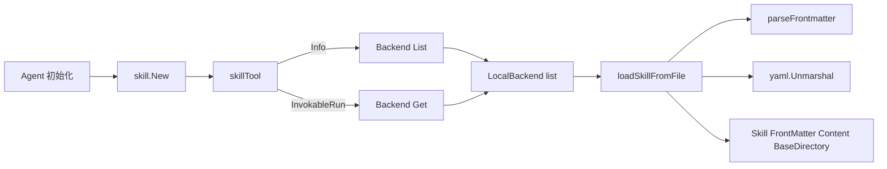

# local_backend_filesystem

`local_backend_filesystem`（即 `adk.middlewares.skill.local`）解决的是一个很现实的问题：**把“技能说明文档”变成 agent 可以动态发现和调用的运行时能力**。如果没有这个模块，最朴素的做法是把每个技能硬编码在代码里（名字、描述、提示词内容都写死），这会让技能维护像“改程序发布”而不是“改文档上线”。这个模块的设计洞察是：把技能定义下沉到本地目录中的 `SKILL.md`，运行时按约定扫描并解析，让 skill middleware 只依赖统一的 `Backend` 抽象，不关心技能来自哪里。

## 这个模块在架构里的角色

从架构定位看，`LocalBackend` 是一个**适配器（adapter）+ 轻量解析器（parser）**：向上实现 `skill` 中间件要求的 `Backend` 接口，向下对接本地文件系统和 YAML frontmatter。



数据流有两个高频路径：

第一条是工具元信息路径。`skillTool.Info` 会调用 `Backend.List`，这里 `LocalBackend.List` 实际上会遍历目录、读取每个 `SKILL.md`、解析 frontmatter，然后只返回 `[]FrontMatter`。这条路径决定了模型“能看到哪些技能，以及技能名/描述是什么”。

第二条是工具执行路径。`skillTool.InvokableRun` 在拿到参数中的技能名后调用 `Backend.Get`；`LocalBackend.Get` 也是全量扫描后按名字匹配，命中后返回完整 `Skill`（包含 `Content` 和 `BaseDirectory`）。这条路径决定了模型调用技能时，最终拼接给模型的内容素材。

## 心智模型：把它当成“技能仓库的目录索引员”

可以把 `LocalBackend` 想象成图书馆里负责“目录卡片”的管理员。

- 每个子目录是一种技能书架。
- 每本书固定叫 `SKILL.md`。
- 书首页的 YAML frontmatter 是目录卡片（`name`、`description`）。
- 正文是技能使用说明（`Content`）。
- `BaseDirectory` 是这本书所在书架的绝对路径，供后续执行时作为上下文。

而 `skill` 中间件只跟“管理员接口”打交道：

- `List(ctx)`：给我所有目录卡片；
- `Get(ctx, name)`：给我某本书的完整内容。

这就是它的核心抽象价值：**把“技能来源”与“技能使用”解耦**。

## 核心组件深拆

### `LocalBackendConfig`

`LocalBackendConfig` 只有一个字段：`BaseDir string`。设计上非常克制，这意味着本实现刻意保持“零策略、零缓存、零过滤”的简单形态：只指定根目录，其他行为全部由约定驱动。

这看似简单，实际上是一种边界声明：复杂策略（例如缓存、热更新、权限）不在这里做，而应在上层或替代 backend 中实现。

### `NewLocalBackend(config *LocalBackendConfig) (*LocalBackend, error)`

这个构造函数做了三层前置校验：

1. `config` 不能是 `nil`；
2. `BaseDir` 不能为空；
3. `BaseDir` 必须存在且是目录（`os.Stat` + `IsDir`）。

为什么要在构造阶段做这些检查？因为它把错误尽量前置到启动期，而不是延迟到第一次工具调用时才暴露。对 agent 系统来说，这能显著减少“运行中才发现配置错”的排障成本。

### `LocalBackend`（结构体）

`LocalBackend` 只持有 `baseDir string`，无缓存、无锁、无可变状态。这个设计使它天然线程安全（至少从结构体状态角度是只读的），并且行为可预测：每次调用都反映当前磁盘真实状态。

代价是性能上会有重复 IO（后文会展开 tradeoff）。

### `List(ctx context.Context) ([]FrontMatter, error)`

`List` 是 `Backend` 接口的一半实现。它先调用内部 `list(ctx)` 得到完整 `[]Skill`，再抽取 `FrontMatter` 返回。

这里的关键点是：它**复用同一套扫描解析逻辑**，避免 `List` 和 `Get` 各自维护一份文件发现规则。这减少了行为分叉风险（例如一个路径能在 `Get` 找到却在 `List` 看不到）。

另外要注意：函数签名有 `ctx`，但当前实现没有使用它做取消检查或超时控制，这是一个隐含约束（见“坑点”部分）。

### `Get(ctx context.Context, name string) (Skill, error)`

`Get` 的策略是：同样先做全量 `list(ctx)`，然后线性遍历按 `skill.Name == name` 匹配。

这不是最高效方案，但它换来一个重要一致性：`Get` 与 `List` 看到的是同一解析视图，不会因不同代码路径导致“列表里有但获取失败（或相反）”的奇怪状态。

当未命中时返回 `fmt.Errorf("skill not found: %s", name)`，由上层 `skillTool.InvokableRun` 包装为 `failed to get skill`。

### `list(ctx context.Context) ([]Skill, error)`

`list` 是模块的主干：

- `os.ReadDir(baseDir)` 枚举根目录；
- 仅保留子目录；
- 拼接 `<subdir>/SKILL.md`；
- 若文件不存在则跳过；
- 若存在则 `loadSkillFromFile`；
- 任意一个文件解析失败会立即返回错误并终止全量扫描。

这里有个非显式但很重要的策略：**容忍缺失，不容忍损坏**。也就是“没有 `SKILL.md` 的目录被安静跳过；有 `SKILL.md` 但内容非法会让整个调用失败”。这体现了偏正确性的选择：宁可让问题尽早暴露，也不悄悄吞掉坏技能。

### `loadSkillFromFile(path string) (Skill, error)`

这是文件到领域对象的转换器，步骤清晰：

1. `os.ReadFile` 读原始文本；
2. `parseFrontmatter` 拆出 YAML 区和正文区；
3. `yaml.Unmarshal` 到 `FrontMatter`；
4. `filepath.Abs(filepath.Dir(path))` 计算 `BaseDirectory`；
5. 返回 `Skill`，正文做 `strings.TrimSpace`。

`BaseDirectory` 设计很关键。它让 skill 执行阶段能基于技能目录定位相对资源（比如同目录脚本、模板、示例文件）。如果只返回内容字符串，技能就会失去与文件系统上下文的连接。

### `parseFrontmatter(data string) (frontmatter, content string, err error)`

这是一个非常轻量的 frontmatter 解析器，不依赖复杂 markdown parser。算法是基于分隔符 `---` 的字符串切片：

- 先 `TrimSpace`；
- 要求开头必须是 `---`；
- 在剩余文本里找 `"\n---"` 作为结束标记；
- 切分出 frontmatter 与 content；
- 若正文开头是换行，去掉一个。

这实现的“why”很直接：前置区格式可控、需求简单，用字符串扫描就够，避免引入更重依赖。

同时也有边界：它假定结束分隔符前是 `\n`，因此对某些换行风格或更复杂 markdown 结构兼容性有限。

## 依赖与契约分析

向上看，`LocalBackend` 通过实现 `Backend` 接口接入 [skill_middleware_core](skill_middleware_core.md)。根据已有调用关系：

- `skill.New` 要求 `Config.Backend` 非空，并把它注入 `skillTool`；
- `skillTool.Info` 调用 `Backend.List` 来生成工具描述（技能列表）；
- `skillTool.InvokableRun` 调用 `Backend.Get` 获取具体技能内容。

这说明 `LocalBackend` 是 skill middleware 的“数据平面”，而 `skillTool` 是“协议平面”（把技能包装成 tool API）。

向下看，`LocalBackend` 依赖：

- `os` / `filepath`：目录遍历、文件读取、路径规范化；
- `strings`：文本清洗与分割；
- `gopkg.in/yaml.v3`：frontmatter 反序列化。

数据契约方面，最核心的是：

- 文件命名契约：每个技能目录下文件必须叫 `SKILL.md`；
- frontmatter 契约：至少应能解析为 `FrontMatter{Name, Description}`；
- 语义契约：`name` 用于 `Get(name)` 精确匹配。

如果上游 `skillTool` 修改参数语义（例如不再传 `skill` 名字）或 `Backend` 接口改签名，`LocalBackend` 会直接失配。这是有意的紧耦合：接口很小，换来整体简单。

## 设计决策与取舍

### 1) 无缓存（simplicity）优先于读取性能（performance）

`List` 与 `Get` 都会触发磁盘扫描和解析，尤其 `Get` 是“先全量再筛选”。这对技能数量很大时不友好，但优点是：

- 实时反映文件变化（无需缓存失效策略）；
- 实现简单、可测试性高；
- 避免并发缓存一致性问题。

在“技能数量有限、变更频繁”的本地开发/轻量部署场景，这个选择是合理的。

### 2) 约定优于配置（convention over configuration）

固定 `SKILL.md`，固定目录结构，配置只要 `BaseDir`。这减少了使用门槛，也减少了错误空间；代价是灵活性低（不能按项目自定义文件名/层级）。

### 3) 失败快速暴露（correctness）优先于部分可用（availability）

遇到任一损坏 skill 文件就返回错误，整个 `List/Get` 失败。这会让单点坏文件影响全局可用性，但能强制内容质量，避免模型看到“部分技能、部分损坏”的不可解释状态。

### 4) 轻解析器（low dependency surface）优先于格式兼容性

`parseFrontmatter` 使用简单字符串逻辑，足够快、易读；代价是对边界格式容忍度有限。

## 使用方式与示例

典型接入方式是先构造 `LocalBackend`，再传给 skill middleware 的 `Config.Backend`：

```go
ctx := context.Background()

lb, err := NewLocalBackend(&LocalBackendConfig{
    BaseDir: "./skills",
})
if err != nil {
    panic(err)
}

mw, err := New(ctx, &Config{
    Backend: lb,
    // SkillToolName: ptr("skill"),
    // UseChinese: true,
})
if err != nil {
    panic(err)
}

_ = mw
```

技能目录示例：

```text
skills/
  pdf/
    SKILL.md
  xlsx/
    SKILL.md
```

`SKILL.md` 示例：

```markdown
---
name: pdf
description: Read and summarize PDF files
---
Use this skill when user asks about PDF parsing or summarization.
```

## 新贡献者要特别注意的点

首先，`context.Context` 在 `List/Get/list` 里当前未被使用。这意味着即使上层请求已取消，目录扫描和文件读取仍会继续到完成或失败。如果你计划在大目录/远程挂载盘场景使用，可能需要补充显式取消检查。

其次，`Get` 基于 `Name` 线性匹配，若多个 `SKILL.md` 使用同名 `name`，会返回遍历遇到的第一个，行为依赖目录枚举顺序（代码未做去重与冲突报错）。这属于隐含契约：**技能名应全局唯一**。

再次，frontmatter 解析比较严格：文件必须以 `---` 起始，且必须找到结束分隔。不符合即报错。编辑器自动插入 BOM、不同换行风格、或前置空内容都可能触发解析问题。

最后，`BaseDirectory` 是绝对路径。它对运行时很方便，但在日志/回显中可能暴露宿主机路径信息；如果你在多租户或安全敏感场景扩展此模块，要评估路径泄漏风险。

## 可扩展方向（在不破坏现有契约前提下）

如果后续要增强，一般建议通过新增 backend 实现而不是直接把 `LocalBackend` 变复杂。比如：

- 带缓存与失效策略的 backend；
- 支持递归目录或自定义 skill 文件名的 backend；
- 容错模式（跳过坏文件并记录告警）的 backend。

这样可以保持 `Backend` 接口稳定，让 [skill_middleware_core](skill_middleware_core.md) 无需感知实现细节。

## 参考

- [skill_middleware_core](skill_middleware_core.md)：`Backend` 接口定义、`skillTool` 调用路径、middleware 装配逻辑。
- [ADK Skill Middleware](ADK Skill Middleware.md)：技能中间件在 ADK 中的整体定位。
