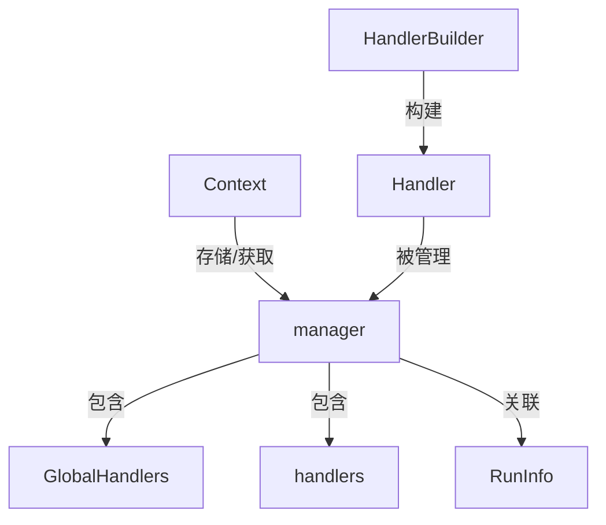

# Manager 模块技术深度解析

## 1. 模块概述

Manager 模块是 Eino 框架中 callbacks 系统的核心管理组件，它负责管理和组织回调处理器（Handler），并为整个系统提供统一的回调管理机制。想象一下，它就像一个交响乐团的指挥家，负责协调各个乐手（回调处理器）的演奏时机和顺序。

### 核心问题解决

在构建复杂的 AI 应用流程时，我们往往需要在组件执行的各个阶段（开始、结束、错误等）插入一些横切关注点，比如：
- 日志记录
- 性能监控
- 错误追踪
- 状态审计
- 安全检查

一个 naive 的解决方案是在每个组件中硬编码这些逻辑，但这会导致代码重复、耦合度高、难以维护。Manager 模块通过提供一个统一的回调管理机制，解决了这个问题。

## 2. 架构设计

### 核心组件关系图



### 核心组件

#### 2.1 manager 结构体

`manager` 是本模块的核心结构体，它负责管理回调处理器的生命周期和执行。

```go
type manager struct {
    globalHandlers []Handler
    handlers       []Handler
    runInfo        *RunInfo
}
```

**设计意图**：
- `globalHandlers`：存储全局注册的回调处理器，在整个应用生命周期中都有效
- `handlers`：存储特定于某次运行的回调处理器
- `runInfo`：存储当前运行的上下文信息

#### 2.2 上下文键

```go
type CtxManagerKey struct{}
type CtxRunInfoKey struct{}
```

**设计意图**：
- 使用空结构体作为上下文键，确保类型安全和唯一性
- 避免了使用字符串键可能导致的冲突问题

## 3. 数据流向

### 3.1 创建和注册流程

1. **全局处理器注册**：通过 `GlobalHandlers` 变量注册全局回调处理器
2. **Manager 创建**：调用 `newManager` 创建 manager 实例
3. **上下文注入**：通过 `ctxWithManager` 将 manager 注入到 context 中
4. **运行时信息更新**：通过 `withRunInfo` 更新运行时信息
5. **从上下文获取**：通过 `managerFromCtx` 从 context 中获取 manager

### 3.2 关键操作详解

#### newManager 函数

```go
func newManager(runInfo *RunInfo, handlers ...Handler) (*manager, bool)
```

**设计亮点**：
- 快速路径优化：如果没有任何处理器，直接返回 `nil, false`，避免不必要的对象创建
- 防御性复制：对 `GlobalHandlers` 进行复制，避免后续修改影响已创建的 manager

**返回值设计**：
- 第二个返回值 `bool` 用于快速判断是否有有效的 manager，调用方可以根据这个值决定是否启用回调机制

#### ctxWithManager 函数

```go
func ctxWithManager(ctx context.Context, manager *manager) context.Context
```

**设计意图**：
- 使用 context 传递 manager，确保在整个调用链中都能访问到回调管理器
- 符合 Go 语言的惯用模式

#### withRunInfo 方法

```go
func (m *manager) withRunInfo(runInfo *RunInfo) *manager
```

**设计亮点**：
- 值复制：创建 manager 的副本，避免并发安全问题
- 链式调用：返回新的 manager 实例，支持链式操作

**为什么要复制？**
- 不同的组件执行可能需要不同的 `RunInfo`
- 避免在并发环境下修改共享状态

## 4. 设计决策与权衡

### 4.1 全局处理器与局部处理器分离

**决策**：将处理器分为 `globalHandlers` 和 `handlers` 两个层次

**权衡**：
- ✅ 优点：
  - 全局处理器可以用于跨应用的关注点（如日志、监控）
  - 局部处理器可以针对特定场景定制
- ⚠️ 缺点：
  - 增加了理解成本
  - 需要注意执行顺序（全局处理器先于局部处理器执行）

### 4.2 使用 context 传递 manager

**决策**：通过 context 而不是显式参数传递 manager

**权衡**：
- ✅ 优点：
  - 不污染函数签名
  - 自动在整个调用链中传递
  - 符合 Go 语言的惯用模式
- ⚠️ 缺点：
  - 隐式依赖，降低了代码的自文档性
  - 难以追踪 manager 的流向

### 4.3 nil manager 模式

**决策**：允许 manager 为 nil，并在方法中处理这种情况

**权衡**：
- ✅ 优点：
  - 简化调用方代码，不需要总是检查 manager 是否存在
  - 性能优化：在没有回调需求时，避免额外的开销
- ⚠️ 缺点：
  - 需要在每个方法中处理 nil case
  - 可能掩盖某些错误

### 4.4 防御性复制

**决策**：在 `newManager` 中复制 `GlobalHandlers`，在 `managerFromCtx` 中复制 manager

**权衡**：
- ✅ 优点：
  - 避免后续修改影响已创建的实例
  - 提高线程安全性
- ⚠️ 缺点：
  - 轻微的内存和性能开销
  - 如果处理器本身是可变的，仍然可能有问题

## 5. 使用指南

### 5.1 基本使用模式

```go
// 1. 注册全局处理器
callbacks.GlobalHandlers = append(callbacks.GlobalHandlers, myGlobalHandler)

// 2. 创建运行时信息
runInfo := &callbacks.RunInfo{
    Name: "my-component",
    Type: "model",
    Component: myComponent,
}

// 3. 创建 manager
mgr, ok := callbacks.newManager(runInfo, myLocalHandler)
if !ok {
    // 没有处理器，跳过回调机制
    return
}

// 4. 注入到 context
ctx := callbacks.ctxWithManager(context.Background(), mgr)

// 5. 在后续代码中使用
if mgr, ok := callbacks.managerFromCtx(ctx); ok {
    // 使用 manager
}
```

### 5.2 更新运行时信息

```go
// 创建新的运行时信息
newRunInfo := &callbacks.RunInfo{
    Name: "another-component",
    Type: "tool",
    Component: anotherComponent,
}

// 更新 manager 的 runInfo
newMgr := mgr.withRunInfo(newRunInfo)

// 使用新的 manager
ctx = callbacks.ctxWithManager(ctx, newMgr)
```

## 6. 注意事项与陷阱

### 6.1 GlobalHandlers 的并发安全

**陷阱**：`GlobalHandlers` 是一个包级变量，直接修改它不是并发安全的

**建议**：
- 在应用初始化阶段完成全局处理器的注册
- 避免在运行时动态修改 `GlobalHandlers`
- 如果需要动态修改，使用适当的同步机制

### 6.2 Handler 的执行顺序

**注意**：全局处理器先于局部处理器执行

**影响**：
- 如果处理器之间有依赖关系，需要注意注册顺序
- 后执行的处理器可以覆盖先执行的处理器对 context 的修改

### 6.3 不要存储 context

**陷阱**：不要在 manager 或 handler 中存储对 context 的引用

**原因**：
- context 是短暂的，通常只在一次请求或操作中有效
- 存储 context 可能导致内存泄漏
- 可能会持有对已取消 context 的引用

### 6.4 nil manager 的处理

**注意**：所有导出的方法都应该正确处理 nil receiver

**原因**：
- 调用方可能从 `managerFromCtx` 获取到 nil
- 保持 API 的健壮性

## 7. 与其他模块的关系

### 7.1 依赖的模块

- **[schema](schema.md)**：提供了 `StreamReader` 类型，用于流式回调
- **[components](components.md)**：定义了 `Component` 接口，作为 `RunInfo` 的一部分

### 7.2 被依赖的模块

- **[handler_builder](handler_builder.md)**：使用 manager 来管理构建的 handler
- **[template](template.md)**：提供预定义的 handler 模板，通过 manager 进行管理

## 8. 总结

Manager 模块是 Eino 回调系统的核心，它通过简洁的设计提供了强大的回调管理能力。其主要设计哲学包括：

1. **简洁性**：核心逻辑简洁明了，易于理解和维护
2. **性能优先**：在关键路径上有优化（如快速返回 nil）
3. **防御性设计**：通过复制等手段避免共享状态问题
4. **Go 语言惯用法**：使用 context 传递状态，符合 Go 语言的最佳实践

理解这个模块的关键是理解它作为回调系统"指挥家"的角色，以及它如何在保持简洁的同时提供足够的灵活性。
