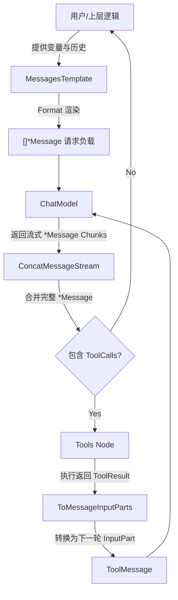

# Message 模块深度解析 (Message Module Deep Dive)

在构建 LLM 应用时，我们面临的一个核心挑战是：不同的模型厂商（如 OpenAI、Gemini、Claude）拥有完全不同的 API 规范、多模态数据结构和流式传输（Streaming）行为。如果让应用层的各个组件直接与这些异构数据打交道，整个系统很快就会退化为充满 `if/else` 的泥潭。

`message` 模块正是为此而生。它扮演着整个应用框架的**通用语言（Lingua Franca）**与**防腐层**。它不仅定义了统一的对话状态和多模态协议，还内置了一个复杂的流式数据组装引擎。通过这个模块，上层的 Prompt 模板、底层的模型驱动以及外部的工具（Tools），都可以基于一套标准化的“集装箱”进行数据流转，而无需关心底层厂商的差异。

## 架构与核心工作流

`message` 模块在系统架构中起到了数据总线的作用。想象一下，一个完整的 LLM 调用请求是如何在系统中流转的：



1. **模板渲染**：用户的输入首先通过实现了 `MessagesTemplate` 的组件（如 `Message` 或 `messagesPlaceholder`），结合上下文变量被渲染成标准的 `[]*Message` 数组。
2. **模型流转**：模型接收到标准的 `Message` 数组，处理后开始以流式（Stream）的方式返回 `*Message` 的切片（Chunks）。
3. **流式合并**：底层的分块数据经过 `ConcatMessages` 或 `ConcatMessageStream`，像拉链一样被严丝合缝地拼接成一个完整的 `Message`。
4. **工具交互**：如果模型决定调用工具，合并后的 `Message` 会带有 `ToolCalls`。系统执行工具后，生成 `ToolResult`，并强制通过 `ToMessageInputParts()` 转换回模型可识别的 `MessageInputPart` 格式，从而闭环整个对话链路。

## 核心组件剖析

### `Message`：对话的“集装箱”
`Message` 结构体是整个模块的灵魂。不要把它仅仅当成一个字符串包装器，它是一个包含了元数据、执行状态和多模态负载的 HTTP Request/Response 模拟物。
- **职责**：承载单次交互的完整语义，支持文本、多模态内容以及工具调用。
- **关键字段**：
  - `Role`：标识信息的提供方（`User`, `Assistant`, `System`, `Tool`）。
  - `UserInputMultiContent` 与 `AssistantGenMultiContent`：分别用于承载用户输入的多模态内容和模型生成的多模态内容（替代了已废弃的 `MultiContent`）。
  - `ToolCalls` 与 `ToolCallID`：前者是 `Assistant` 指示系统调用的工具列表，后者是 `Tool` 角色返回结果时关联的唯一标识。
- **设计巧思**：`Message.Format()` 方法。它不仅支持普通的文本格式化（`pyfmt` 或原生 `GoTemplate`），还支持 `Jinja2`。并且它在渲染时会深度遍历 `UserInputMultiContent` 等复杂结构，确保无论是普通文本还是多模态中的 URL/Base64 数据，都能被正确注入变量。

### `MessageInputPart` 与 `MessageOutputPart`：分离的多模态设计
在早期的设计中，多模态数据通常由一个统一的结构承载。但随着大模型能力的演进，团队发现**输入能力与输出能力是不对等的**。
- **`MessageInputPart`**：包含了文本、图片（`Image`）、音频（`Audio`）、视频（`Video`）以及**文件（`File`）**。因为用户在提问时经常需要上传各类文档实体。
- **`MessageOutputPart`**：包含了文本、图片、音频和视频，但**没有文件**。因为语言模型在输出时通常生成多媒体流或代码内容，而不是直接在交互体中吐出一个操作系统的文件对象。

通过将输入输出的数据结构解耦，模块在编译期就规避了“尝试让模型输出 File”这种不合逻辑的构造。采用带有 `Type` 鉴别器的“胖结构体（Fat Struct）”而非 Go 的 `interface{}`，极大地简化了 JSON 序列化和反序列化的复杂度，使得数据在不同节点间传递时不会丢失类型信息。

### 流式合并引擎：`ConcatMessages` 与相关工具族
如果说 `Message` 是静态的数据结构，那么 `ConcatMessages` 就是赋予其流式生命力的引擎。当对接支持 Streaming 的 LLM 时，由于网络或生成的特性，一个单词、一张图片的 Base64 甚至一个工具参数的 JSON，都会被切分成数十个碎片。
- **合并规则**：
  - **文本合并**：连续的 `ChatMessagePartTypeText` 会被 `strings.Builder` 高效拼接。
  - **工具调用对齐**：`concatToolCalls` 是这里的核心难点。模型在流式输出并行工具调用时，多个工具的 Chunk 会交织在一起返回。代码通过 `Index` 字段作为 Group Key，将属于同一个工具的 JSON 参数（`chunk.Function.Arguments`）精准拼接，并严格校验 `ID`、`Type` 和 `Name` 的一致性。
  - **Token 统计高水位线**：在合并 `ResponseMeta.Usage` 时，框架采用取最大值（`>`）的策略，完美兼容了那些只在最后一个 Chunk 返回总 Token，或者在每个 Chunk 累加 Token 的不同模型厂商行为。

### 工具输出的标准化桥梁：`ToolResult`
当开发者编写的自定义工具返回多模态结果（如一张图表和一段分析文本）时，这些结果被封装在 `ToolResult` 中。为了保证模型能理解这些结果，模块提供了 `ToMessageInputParts()` 方法，将 `ToolOutputPart` 映射回标准的 `MessageInputPart`，确保了数据格式的同构性，使得下游不需要编写额外的适配代码。

## 依赖关系分析

- **向下依赖谁（What it calls）**：
  - **模板引擎**：严重依赖 `github.com/nikolalohinski/gonja`（提供 Jinja2 支持）和 `github.com/slongfield/pyfmt`（支持 Python 风格 FString）。这也是为什么 `Message` 可以直接通过 `Format` 解析极其复杂的模板。
  - **内部工具**：依赖 `internal.generic` 进行 Map 深拷贝（`concatExtra`），以及向 `internal` 注册全局的 Stream Chunk Concat 钩子。
- **向上被谁依赖（What calls it）**：
  - **几乎所有核心组件**：由于它是核心 Schema 层，`components.model.interface.BaseChatModel` 的输入输出、`compose.graph` 的图节点流转、`flow` 的多智能体状态管理以及 `adk` 框架层，全部基于 `schema.message` 定义的契约运作。这里的结构设计牵一发而动全身。

## 设计决策与权衡

1. **“胖结构体” vs 多态接口**
   在 `MessageInputPart` 和 `ToolOutputPart` 中，代码使用了包含所有可能性字段的单一结构体，而不是定义一个 `Part` 接口并派生出诸如 `TextPart` 或 `ImagePart` 的实现类。
   - *权衡*：这会带来少量的内存浪费（包含未使用的空指针），但换来的是**零反射的 JSON 序列化支持**和极其清晰的值拷贝语义，这对于构建依赖网络传输和复杂状态持久化的 LLM 框架来说，是最优解。

2. **限制模板引擎能力换取安全性**
   在 `getJinjaEnv` 的初始化逻辑中，代码显式地替换并禁用了 Jinja2 的 `include`, `extends`, `import`, `from` 等关键字。
   - *权衡*：Prompt 注入是 LLM 应用的高危漏洞。通过阉割模板的跨文件读取和代码宏导入能力，框架严格限制了 Prompt 渲染边界，牺牲了一定程度的工程模板复用性，但守住了渲染层面的系统级安全底线。

3. **严格的流合并一致性校验**
   在 `ConcatToolResults` 和 `ConcatMessages` 中，如果发现非文本模态（如 Image 媒体）在不同的 Chunk 中重复出现，或者合并过程中多条消息的角色（`Role`）不匹配，代码会直接返回 `error` 而不是静默吞并。
   - *权衡*：这遵循了“快速失败（Fail-fast）”的设计原则。强制要求上层的 ChatModel 适配器提供合法、有序的流式块，避免由于静默拼接导致向模型发送截断的 Base64 编码，或因为角色交错而产生“人格分裂”的对话历史。

## 使用指南

- **构建普通的文本对话**：
  直接使用便捷函数 `SystemMessage(content)`, `UserMessage(content)`, `AssistantMessage(content, toolCalls)` 创建消息。

- **模板占位符的巧妙应用**：
  使用 `MessagesPlaceholder` 可以在 Prompt 模板中预留历史对话的位置，它会在运行时被完整的 `[]*Message` 替换，而不需要将历史拼接到字符串中：
  ```go
  placeholder := MessagesPlaceholder("history", false)
  // 当调用 Format 时，传入 {"history": historyMessages} 即可
  ```

- **处理工具结果循环**：
  在一个 Agent 的思考循环中，不要忘记工具的调用闭环：
  ```go
  // 获取 ToolResult 后
  inputParts, err := toolResult.ToMessageInputParts()
  // 封装为 ToolMessage
  msg := ToolMessage("", toolCall.ID)
  msg.UserInputMultiContent = inputParts
  // 将 msg 追加到历史中发送给模型
  ```

## 边缘情况与避坑指南

1. **废弃字段的幽灵**
   代码中保留了 `MultiContent`、`ChatMessageImageURL` 等被标记为 `Deprecated` 的字段。作为新加入的开发者，**切勿再使用这些老字段**。务必区分上下文：发送多模态使用 `UserInputMultiContent`，接收响应使用 `AssistantGenMultiContent`。
2. **永远不要信任流式过程中的单块（Chunk）数据**
   当拦截或观察模型流式输出时，一个 `*Message` Chunk 可能只包含半个单词或半个 JSON 括号。不要在流未结束时就尝试对 `ToolCall.Function.Arguments` 执行 `json.Unmarshal`。必须通过 `ConcatMessageStream` 得到最终状态后，再进行结构化读取。
3. **`ToolCall` 的 Index 索引约束**
   如果需要手动构造流式的工具调用碎片（例如用于编写测试），务必为 `ToolCall` 提供正确的 `Index` 指针赋值。`concatToolCalls` 强依赖 `Index` 来决定将参数拼接到哪个并发的工具调用中。如果设为空或错位，合并行为将发生灾难性的参数错乱。
4. **工具结果的部分转化失败**
   当调用 `convToolOutputPartToMessageInputPart` 时，如果 `ToolResult` 中存在未知的 `ToolPartType` 或者对应的指针内容为空（例如 `Type` 为 Image 但 `Image` 字段为 nil），方法会直接返回报错。在实现新的自定义工具时，务必保证 `Type` 枚举与实际填充的负载数据类型严格一致。

---
*参考链接：*
- [组件模型接口规范](components.model.interface.md)
- [Prompt 提示词组件](components.prompt.interface.md)
- [工具组件与中间件](components.tool.interface.md)