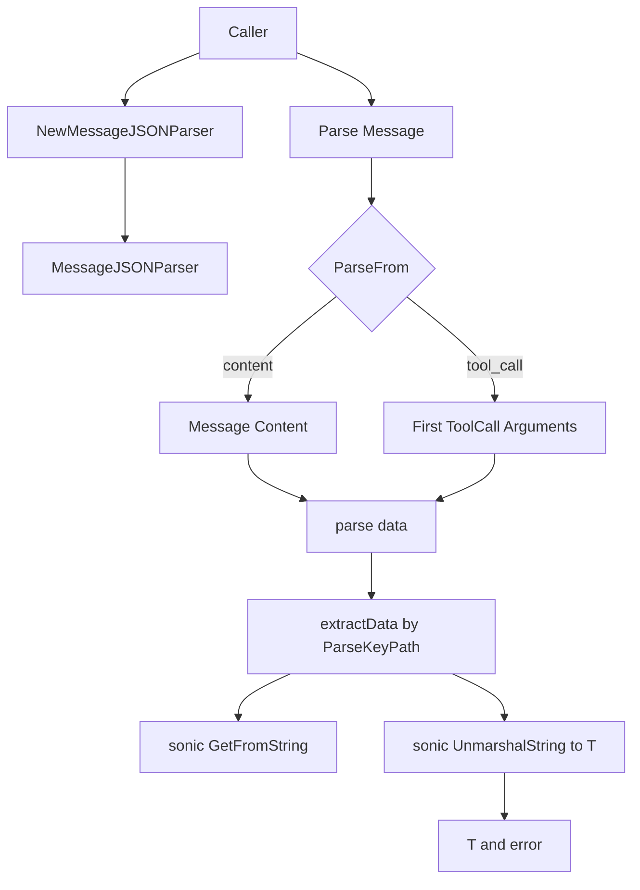

# message_json_parser 深度解析

`message_json_parser` 模块做的事情很“小”但非常关键：它把一条通用的 `Message`（通常是模型输出或工具调用载体）里的 JSON 字符串，稳定地转换成你真正要的强类型结构体。你可以把它想成“最后一公里的协议适配器”——上游世界传来的都是字符串和通用消息，下游业务要的是明确字段、可校验、可编译期约束的 Go 类型。没有这层，业务代码会到处散落 `json.Unmarshal`、字段路径提取、错误拼装，既重复又脆弱。

## 这个模块在解决什么问题？

在这个代码库里，`schema.message.Message` 是统一消息容器，既能装普通文本（`Content`），也能装工具调用（`ToolCalls[i].Function.Arguments`）。这很灵活，但对业务开发者不够“直接”：你在业务里往往需要的是 `OrderQueryArgs`、`GetUserParam` 这样的具体类型，而不是原始 JSON 文本。

朴素做法通常是：

1. 先决定从 `Content` 还是 `ToolCalls` 取字符串；
2. 如果只想取 JSON 子字段，再手动解析 map 后层层取值；
3. 再 `Unmarshal` 到目标结构体；
4. 每个调用点自己处理错误。

这个朴素方案的问题是：重复、易错、语义分散。尤其在 `tool call` 场景下，字段位置固定但调用点多，一旦约定变化会产生系统性维护成本。

`MessageJSONParser` 的设计洞察是：把“消息来源选择 + 路径提取 + 强类型反序列化”收敛成一个可配置、泛型化的小组件，并通过 `MessageParser[T]` 接口暴露统一能力。

## 心智模型：一个“两段式漏斗”

理解这个模块最好的方式是把它看成一个两段式漏斗：

第一段漏斗决定**从哪儿取原料**（`ParseFrom`：`content` 或 `tool_call`）；第二段漏斗决定**从原料里切哪一块**（`ParseKeyPath`），最后把切出来的 JSON 块倒进目标类型 `T`。

你可以想象它像“快递分拣线”：

- 第一道闸机：包裹来自 A 传送带（`Content`）还是 B 传送带（`ToolCalls[0].Function.Arguments`）
- 第二道闸机：是否按地址标签（`a.b.c`）拆出子包裹
- 出口：把包裹按模板装箱成 `T`

这就是 `Parse()` + `extractData()` + `parse()` 三步协作的核心抽象。

## 架构与数据流



从调用关系上，这个模块是一个**纯转换层（transformer）**，不负责消息生产、消息传输，也不做业务校验。它对外只暴露 `MessageParser[T]` 的 `Parse`，对内依赖 `sonic` 做 JSON 路径读取与反序列化。

关键端到端路径如下：

当调用者执行 `Parse(ctx, m)` 时，解析器先根据 `ParseFrom` 选择源数据。若是 `MessageParseFromContent`，直接读 `m.Content`；若是 `MessageParseFromToolCall`，读 `m.ToolCalls[0].Function.Arguments`（若无 tool call 则立即报错）。拿到字符串后进入 `parse(data)`：先 `extractData(data)`，若设置了 `ParseKeyPath`，通过 `strings.Split(".")` 组装路径并调用 `sonic.GetFromString` 取子节点，再将节点 `MarshalJSON` 回字符串；最后 `sonic.UnmarshalString` 到泛型目标 `T`。

## 组件深潜

### `type MessageParser[T any] interface`

这是模块的最小契约：`Parse(ctx context.Context, m *Message) (T, error)`。它的价值不在复杂功能，而在“稳定可替换”。即便当前只有 `MessageJSONParser` 一个实现，接口已经把“如何解析 Message”与“谁在消费解析结果”解耦开了。对调用者来说，只依赖“能得到 `T`”这个结果，而不关心内部是 JSON、YAML 还是别的协议。

需要注意：当前 `MessageJSONParser.Parse` 实现并未使用 `ctx`。这通常意味着接口层提前为未来扩展（例如取消、超时、外部 I/O 解析器）预留了形态。

### `type MessageJSONParseConfig struct`

这个配置定义了解析策略：

- `ParseFrom MessageParseFrom`：数据来源。
- `ParseKeyPath string`：JSON 路径（点分隔，如 `field.sub_field`）。

设计上它偏“轻配置”。没有复杂策略对象，也没有回调钩子。好处是易懂、低心智负担；代价是扩展复杂路径语法（数组索引、转义点号）时会受限。

### `func NewMessageJSONParser[T any](config *MessageJSONParseConfig) MessageParser[T]`

构造函数做了两件非常实用的事：

1. `nil` 配置兜底为默认配置；
2. `ParseFrom` 为空时默认 `MessageParseFromContent`。

这让“最常见路径”零配置可用，降低了调用负担。返回类型是接口 `MessageParser[T]` 而不是具体 struct，也体现了 API 设计上优先抽象契约。

### `type MessageJSONParser[T any] struct`

内部状态只有两个字段：`ParseFrom` 与 `ParseKeyPath`。没有可变缓存、没有共享状态，因此实例是轻量且天然并发安全（只要外部不在并发中修改其字段）。这与它“纯函数式转换器”的角色一致。

### `func (p *MessageJSONParser[T]) Parse(ctx context.Context, m *Message) (T, error)`

这是主入口，做“来源分发 + 基础守卫”：

- `content`：解析 `m.Content`
- `tool_call`：只取第一个 `m.ToolCalls[0]` 的 `Function.Arguments`
- 其他值：报 `invalid parse from type`
- `tool_call` 但无调用：报 `no tool call found`

一个非显然但重要的选择是：**多 tool call 时只看第一个**。这使接口简单，但把“多调用如何路由”责任交给上游。若你的业务依赖第 N 个 tool call，这里不会帮你做选择。

### `func (p *MessageJSONParser[T]) extractData(data string) (string, error)`

这是“路径切片器”。若 `ParseKeyPath` 为空，直接返回原始 JSON；否则：

1. `ParseKeyPath` 按 `.` 分割；
2. 调用 `sonic.GetFromString(data, keys...)` 获取 JSON 节点；
3. 节点再 `MarshalJSON` 成字符串返回。

这里的设计很巧：统一把输出保持为 JSON 字符串，后续 `parse()` 就能走同一条 `Unmarshal` 逻辑，不需要为“整包解析”和“子节点解析”维护两套代码路径。

### `func (p *MessageJSONParser[T]) parse(data string) (T, error)`

这是最后一步：先 `extractData`，再 `sonic.UnmarshalString` 到 `T`。错误统一包装为 `failed to unmarshal content`（或上游错误信息）。

副作用方面，这个函数无外部状态写入；其失败完全由输入数据和类型 `T` 的匹配关系决定。

## 依赖与契约分析

从当前提供代码可确认的依赖关系：

- 本模块直接依赖：
  - [`schema.message.Message`](message_schema_and_stream_concat.md)（输入协议容器）
  - `github.com/bytedance/sonic`（JSON 路径读取与反序列化）
  - `strings` / `fmt` / `context`（标准库）

- 本模块对调用方的隐式契约：
  - 若 `ParseFrom=tool_call`，`Message.ToolCalls` 至少有一个元素，且 `Function.Arguments` 是合法 JSON。
  - `ParseKeyPath` 必须是模块支持的“点分隔键路径”；若路径不存在或语法不匹配，会返回错误。
  - 目标类型 `T` 必须可由对应 JSON 反序列化。

- 关于“谁调用它”：
  - 在当前给定材料中，没有展示 `MessageJSONParser` 的 `depended_by` 明细，因此无法精确列举具体调用组件。可以确定的是，任何拿到 `*schema.Message` 且希望得到强类型参数的上游（例如模型输出处理、工具调用分发）都可直接使用该接口。

## 设计权衡与取舍

这个模块的取舍非常鲜明：

它优先选择**简单、稳定、低心智负担**，而不是构建一个“全能 JSON 查询框架”。例如 `ParseKeyPath` 只做点分割，不支持复杂表达式；`tool_call` 只取第一项，不处理多候选路由。这使 80% 常见场景非常直给，但把复杂场景留给上游编排。

在正确性与性能上，它借助 `sonic` 取得较高解析性能，同时通过“先抽子节点再统一反序列化”保持逻辑一致性。代价是子路径场景存在一次节点 marshal 的中间步骤（`node.MarshalJSON`），但换来代码路径统一和错误行为可预测。

在耦合方面，它与 `Message` 结构有明确耦合（特别是 `ToolCalls[0].Function.Arguments` 约定）。这种耦合是有意的：该模块本质上就是 schema 层转换器，脱离 `Message` 协议便失去意义。好处是调用侧简单；风险是若上游消息协议字段重构，这里需要同步修改。

## 使用方式与示例

最常见：从 `Content` 解析整个对象。

```go
config := &schema.MessageJSONParseConfig{}
parser := schema.NewMessageJSONParser[MyPayload](config)
out, err := parser.Parse(ctx, msg)
```

从工具调用参数解析：

```go
config := &schema.MessageJSONParseConfig{
    ParseFrom: schema.MessageParseFromToolCall,
}
parser := schema.NewMessageJSONParser[GetUserParam](config)
param, err := parser.Parse(ctx, message)
```

从嵌套字段解析（例如只取 `data.result`）：

```go
config := &schema.MessageJSONParseConfig{
    ParseFrom:    schema.MessageParseFromContent,
    ParseKeyPath: "data.result",
}
parser := schema.NewMessageJSONParser[Result](config)
result, err := parser.Parse(ctx, msg)
```

## 新贡献者需要特别注意的点（坑位）

首先，`Parse(ctx, m)` 没有对 `m == nil` 做保护，调用方若传空指针会触发 panic。这是一个隐式前置条件。

其次，`ParseKeyPath` 的分割规则是朴素 `strings.Split(".")`。如果 JSON 键名本身含 `.`，当前实现无法表达；数组下标路径也没有显式语法支持，是否可行取决于 `sonic.GetFromString` 对字符串键的解释，但本模块未做增强处理。

再次，`MessageParseFromToolCall` 只使用第一条 tool call。若模型一次返回多个工具调用，解析哪一个必须在进入本模块前就决定好。

最后，错误信息虽然有包装，但语义仍偏底层（如 `failed to get parse key path` / `failed to unmarshal content`）。如果你在上层做用户可见错误提示，建议追加业务上下文（消息 ID、目标类型、调用链阶段）。

## 可演进方向（基于现有设计）

在不破坏当前简洁性的前提下，未来可考虑：

- 在 `Parse` 增加 `nil message` 显式错误；
- 为 `tool_call` 增加索引或选择器配置（而不只固定第一个）；
- 扩展 `ParseKeyPath` 语法（数组索引、转义点号）；
- 让 `ctx` 真正参与（例如可取消的外部解析步骤）。

## 参考

- [`message_schema_and_stream_concat`](message_schema_and_stream_concat.md)：`Message` / `ToolCall` / `FunctionCall` 等消息协议定义。
- [`tool_schema_definition`](tool_schema_definition.md)：工具参数与工具元数据结构。
