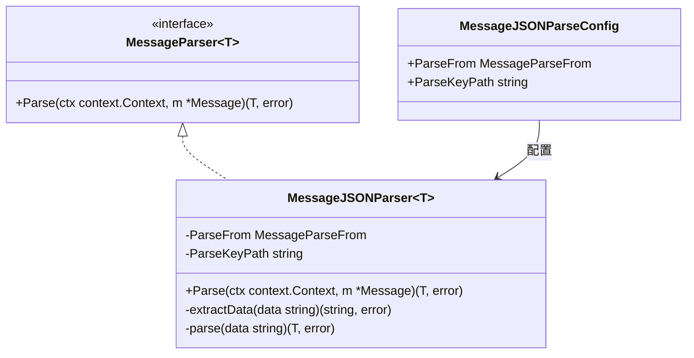

# message_parsing_engine 模块技术文档

## 概述

`message_parsing_engine` 是一个专注于将 `Message` 对象解析为强类型 Go 结构的模块。它解决了 AI 应用开发中常见的问题：如何从不同来源（消息内容或工具调用参数）提取 JSON 数据，并将其安全地转换为应用程序可以直接使用的类型化对象。

想象一下，这个模块就像是一个"智能数据提取器"——当你与 AI 模型交互时，模型可能返回原始文本内容，也可能通过工具调用返回结构化数据。`message_parsing_engine` 统一了这些不同的数据源，让你可以用一致的方式提取和解析你需要的数据。

## 架构设计

### 核心组件



### 工作流程

数据在模块中的流动路径如下：

1. **数据来源选择**：根据配置，从 `Message.Content` 或 `Message.ToolCalls[0].Function.Arguments` 中提取原始 JSON 字符串
2. **键路径提取**（可选）：如果配置了 `ParseKeyPath`，使用该路径从 JSON 中提取特定字段
3. **反序列化**：将提取的 JSON 字符串反序列化为目标类型 `T`

## 设计决策

### 1. 接口与实现分离

**决策**：定义 `MessageParser[T]` 接口，并提供 `MessageJSONParser[T]` 实现。

**原因**：这种设计为未来扩展其他解析器（如 YAML 解析器、XML 解析器）留出了空间，同时保持了 API 的一致性。当前模块专注于 JSON 解析，因为这是 AI 交互中最常见的数据格式。

**权衡**：
- ✅ 灵活性：可以轻松添加新的解析器实现
- ✅ 可测试性：可以轻松 mock 解析器进行单元测试
- ❌ 略微增加了抽象层次

### 2. 泛型设计

**决策**：使用 Go 1.18+ 的泛型特性，让解析器返回强类型对象。

**原因**：在 AI 应用开发中，经常需要将模型返回的 JSON 数据映射到特定的业务对象。使用泛型可以避免类型断言，提高代码的安全性和可读性。

**权衡**：
- ✅ 类型安全：编译时检查类型匹配
- ✅ 代码简洁：无需手动类型断言
- ❌ 对 Go 版本有要求（需要 1.18+）

### 3. 配置选项设计

**决策**：提供 `MessageJSONParseConfig` 配置结构体，支持从不同来源解析数据，并支持键路径提取。

**原因**：AI 模型返回数据的方式多种多样：
- 有时直接在消息内容中返回 JSON
- 有时通过工具调用的参数返回 JSON
- 有时 JSON 嵌套在复杂结构中，只需要提取特定字段

**权衡**：
- ✅ 灵活性：适应多种使用场景
- ✅ 简单性：默认配置可以满足大部分常见需求
- ❌ 键路径语法是自定义的（简单的点分隔），不如 JSONPath 强大，但足够满足常见需求

### 4. 工具调用处理策略

**决策**：当从工具调用解析数据时，只使用第一个工具调用。

**原因**：在大多数 AI 应用场景中，一次交互通常只包含一个工具调用。处理多个工具调用会增加复杂性，而且可以在应用层处理这种情况。

**权衡**：
- ✅ 简单性：API 更简洁，易于理解和使用
- ❌ 限制：如果需要处理多个工具调用，需要在应用层实现

## 核心组件详解

有关 `MessageJSONParseConfig` 和 `MessageJSONParser` 的更详细技术文档，请参阅 [core_parser 子模块文档](schema_models_and_streams-message_parsing_and_serialization_support-message_parsing_engine-core_parser.md)。

### MessageParser 接口

`MessageParser[T]` 是整个模块的核心抽象，定义了将 `Message` 解析为类型 `T` 的契约。这个接口非常简单，只有一个方法：

```go
type MessageParser[T any] interface {
    Parse(ctx context.Context, m *Message) (T, error)
}
```

这种极简设计遵循了"接口最小化"原则，使得实现该接口变得非常容易。

### MessageJSONParser 结构体

`MessageJSONParser[T]` 是 `MessageParser[T]` 接口的 JSON 实现。它的工作流程可以分为三个步骤：

1. **数据源选择**：根据 `ParseFrom` 配置，决定从哪里获取原始 JSON 数据
2. **键路径提取**：如果配置了 `ParseKeyPath`，使用该路径提取特定字段
3. **反序列化**：使用 sonic 库将 JSON 反序列化为目标类型

#### 数据源选择

`MessageJSONParser` 支持两种数据源：
- `MessageParseFromContent`：从 `Message.Content` 中解析数据
- `MessageParseFromToolCall`：从 `Message.ToolCalls[0].Function.Arguments` 中解析数据

这种设计反映了 AI 交互的两种常见模式：模型直接返回数据，或者模型通过工具调用返回数据。

#### 键路径提取

键路径提取是一个强大的功能，允许你从复杂的 JSON 结构中提取特定字段。例如，如果你有这样的 JSON：

```json
{
    "user": {
        "profile": {
            "id": 123,
            "name": "John"
        }
    }
}
```

你可以使用 `ParseKeyPath: "user.profile"` 来提取 `profile` 对象，或者使用 `ParseKeyPath: "user.profile.id"` 来直接提取 `id` 字段。

#### 反序列化

`MessageJSONParser` 使用 sonic 库进行 JSON 反序列化。sonic 是一个高性能的 JSON 库，比标准库的 `encoding/json` 更快。这对于处理大量 AI 模型输出的场景非常重要。

## 使用示例

### 基本用法：从消息内容解析

```go
type User struct {
    ID   int    `json:"id"`
    Name string `json:"name"`
}

parser := NewMessageJSONParser[User](&MessageJSONParseConfig{
    ParseFrom: MessageParseFromContent,
})

user, err := parser.Parse(ctx, &Message{
    Content: `{"id": 1, "name": "John"}`,
})
```

### 从工具调用解析

```go
parser := NewMessageJSONParser[User](&MessageJSONParseConfig{
    ParseFrom: MessageParseFromToolCall,
})

user, err := parser.Parse(ctx, &Message{
    ToolCalls: []ToolCall{
        {Function: FunctionCall{Arguments: `{"id": 1, "name": "John"}`}},
    },
})
```

### 使用键路径提取

```go
type Profile struct {
    Age int `json:"age"`
}

parser := NewMessageJSONParser[Profile](&MessageJSONParseConfig{
    ParseFrom:    MessageParseFromContent,
    ParseKeyPath: "user.profile",
})

profile, err := parser.Parse(ctx, &Message{
    Content: `{"user": {"profile": {"age": 30}}}`,
})
```

## 注意事项和潜在陷阱

### 1. 工具调用数量限制

当使用 `MessageParseFromToolCall` 时，`MessageJSONParser` 只使用第一个工具调用。如果 `Message.ToolCalls` 为空，会返回错误。如果有多个工具调用，其他的会被忽略。

**解决方法**：如果需要处理多个工具调用，可以在应用层遍历 `Message.ToolCalls`，并为每个工具调用创建一个新的解析器实例。

### 2. 键路径语法限制

键路径使用简单的点分隔语法，不支持数组索引、通配符等高级 JSONPath 功能。

**解决方法**：如果需要更复杂的 JSON 提取逻辑，可以在应用层先处理 JSON 数据，然后再使用解析器。

### 3. 类型匹配问题

由于使用了泛型，必须确保目标类型 `T` 与 JSON 数据的结构匹配。如果不匹配，会返回反序列化错误。

**解决方法**：
- 确保目标类型的字段标签（`json:"..."`）与 JSON 字段名匹配
- 使用指针类型处理可选字段
- 考虑使用 `map[string]any` 作为目标类型，如果 JSON 结构不确定

### 4. 空配置处理

如果传递 `nil` 作为配置，`NewMessageJSONParser` 会使用默认配置：
- `ParseFrom`: `MessageParseFromContent`
- `ParseKeyPath`: 空字符串

这通常是安全的，但如果你期望从工具调用解析数据，一定要显式配置。

## 与其他模块的关系

`message_parsing_engine` 是一个相对独立的模块，主要依赖于：
- `message_schema_and_templates`：提供 `Message` 类型的定义
- `sonic`：高性能 JSON 库

这个模块通常被上层的 AI 运行时和代理模块使用，用于解析模型返回的结构化数据。

## 总结

`message_parsing_engine` 是一个专注、灵活且易用的模块，解决了 AI 应用开发中常见的数据解析问题。它的设计遵循了"简单但足够"的原则，提供了核心功能，同时为未来的扩展留出了空间。

作为新加入团队的工程师，理解这个模块的设计理念和使用方法将帮助你更好地处理 AI 模型返回的数据，构建更健壮的 AI 应用。
