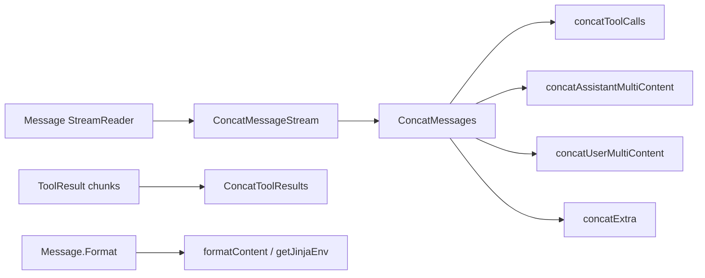

# message_schema_and_stream_concat 深度解析

`message_schema_and_stream_concat`（对应 `schema/message.go` 中的消息结构 + 拼接逻辑）本质上在解决一个很现实的问题：**上游世界是“分块、流式、异构”的，模型和工具输出可能断断续续、字段不完整；下游业务却希望拿到“完整、结构一致、可继续处理”的消息对象**。如果只做“字符串直接相加”，你很快会在 `tool_calls`、多模态分片、usage 统计、模板渲染和兼容旧字段时踩坑。这个模块的设计重点不是“定义了多少 struct”，而是把“消息作为可累积状态机”来处理：在正确性约束下，把流式碎片拼成语义完整的一条消息。

## 架构角色与数据流

从架构定位看，这个模块同时扮演三种角色：

1. **Schema 层契约**：`Message`、`ToolCall`、`ToolResult`、多模态 part 等类型定义了统一数据面。
2. **流式归并器**：`ConcatMessages` / `ConcatToolResults` / `ConcatMessageArray` 把 chunk 合并成稳定对象。
3. **模板渲染入口**：`MessagesTemplate`、`Message.Format`、`MessagesPlaceholder` 把“模板消息”变成“具体消息”。



这张图可以理解成一条“装配线”：左边是零件（流式分片），中间是装配工位（不同字段的 merge 策略），右边是可交付件（稳定 `Message` / `ToolResult`）。关键点在于：每个工位只处理自己关心的字段，并保持字段级别约束（例如 role 必须一致、tool id 不能冲突）。

## 核心心智模型：不是“拼字符串”，而是“按字段协议归并”

理解这个模块最有效的类比是“事件溯源中的 reducer”。每个 chunk 像一条事件，`ConcatMessages` 像 reducer：它不会盲目覆盖，而是按字段类型采用不同策略：

- 文本字段：顺序拼接（`Content`、`ReasoningContent`）。
- 身份字段：必须一致（`Role`、`Name`、`ToolCallID`、`ToolName`），不一致直接报错。
- 数组字段：先收集，再做二次归并（`ToolCalls`、多模态 parts）。
- 元数据字段：按“最后有效值/最大值/追加”混合策略处理（`FinishReason`、`Usage`、`LogProbs`）。

这就是该模块最核心的设计洞察：**不同字段的“可结合性”不同，必须显式编码 merge 语义。**

---

## 组件深潜

### 1) `Message` 及相关 schema：为什么要拆这么细

`Message` 同时覆盖用户输入、模型输出、工具回填三类场景，所以结构上出现了：

- 纯文本：`Content`
- 用户多模态输入：`UserInputMultiContent []MessageInputPart`
- 模型多模态输出：`AssistantGenMultiContent []MessageOutputPart`
- 兼容字段：`MultiContent []ChatMessagePart`（已 deprecated）
- 工具调用：`ToolCalls []ToolCall`、`ToolCallID`、`ToolName`
- 统计与可解释信息：`ResponseMeta`、`ReasoningContent`

这种设计牺牲了“字段少、看起来简洁”，换来的是跨供应商/跨模式的清晰边界。特别是把 input/output 的多模态 part 分开（`MessageInputPart` vs `MessageOutputPart`），避免了一个通用 union struct 带来的语义混乱。

### 2) `ConcatMessages(msgs []*Message)`：模块的主引擎

这是最关键函数。它做了四层处理：

首先做**一致性门禁**：遍历每个 chunk，检查 `nil`、`Role`/`Name`/`ToolCallID`/`ToolName` 冲突。任何冲突立即失败，避免 silently corrupt。

然后做**字段采集**：文本、reasoning、tool calls、extra、多模态、response meta 分别放入独立缓冲区。

接着做**字段级 merge**：

- `Content` / `ReasoningContent` 用 `strings.Builder` + 预估长度拼接（偏性能和低分配）。
- `ToolCalls` 交给 `concatToolCalls`。
- `Extra` 交给 `concatExtra`（内部使用 `internal.ConcatItems`，单项时走 `generic.CopyMap`）。
- 多模态分别走 `concatAssistantMultiContent` / `concatUserMultiContent`。
- `ResponseMeta` 中：`FinishReason` 取最后非空；`Usage` 取各计数最大值；`LogProbs.Content` 直接 append。

最后组装为一个新 `Message` 返回。

这个函数的“why”很清楚：它不是做“还原原始字节流”，而是做“业务语义上的最终态”。

### 3) `concatToolCalls(chunks []ToolCall)`：按 `Index` 聚合函数调用

流式 tool call 常见形态是：工具参数 JSON 被拆到多个 chunk。这个函数按 `ToolCall.Index` 把碎片分组，再拼接 `Function.Arguments`。

它的隐含契约是：同一 index 的 `ID`、`Type`、`Function.Name` 必须一致；一旦出现冲突就报错。排序阶段使用 `sort.SliceStable`，并让 `Index == nil` 的项优先。

这个设计在正确性上非常保守，避免“把两个不同工具调用误拼成一个”。

### 4) `concatAssistantMultiContent` 与 `concatUserMultiContent`

这两个函数都处理“连续同类文本片段合并”，但 assistant 侧额外支持了一个特殊优化：

- 连续的 **base64 音频分片**（`Type == audio_url` 且 `Audio.Base64Data != nil` 且 `Audio.URL == nil`）会被拼成一个音频 part。

这说明作者观察到了常见流式输出模式：音频可能按 base64 chunk 到达。相比之下，图片/视频/file 没做同样拼接，体现的是“按真实热点场景优化，而非泛化到所有类型”。

### 5) `ConcatToolResults(chunks []*ToolResult)`

此函数和 `ConcatMessages` 类似，但面向 `ToolResult`。关键策略是：

- 每个 chunk 内先调用 `mergeTextPartsInChunk` 合并连续文本。
- 非文本 part（image/audio/video/file）被视为“原子块”，且**同一种非文本类型不能跨多个 chunk 重复出现**，否则报错。

这个约束很强，换来的是“不会误把两个模态资源混成一个结果”。但代价是灵活性下降（例如两个不同图片分两块返回会失败）。

### 6) `ConcatMessageArray(mas [][]*Message)`：对齐维度归并

用于“多路结果按位置合并”。它要求二维数组每一行长度一致，然后逐列聚合并调用 `ConcatMessages`。这相当于把 merge 从“一维时间轴”扩展到“二维（路由 × 时间）”。

需要注意：函数直接访问 `mas[0]`，调用方必须保证 `mas` 非空。

### 7) `ConcatMessageStream(s *StreamReader[*Message])`

这是 `StreamReader` 场景下的便捷入口：不断 `Recv()` 直到 `io.EOF`，再调用 `ConcatMessages`。函数会 `defer s.Close()`，体现“消费方负责关闭”的资源管理约定。

### 8) 模板相关：`MessagesTemplate` / `Message.Format` / `MessagesPlaceholder`

`MessagesTemplate` 是抽象接口，`Message` 和 `messagesPlaceholder` 都实现它。这个设计让 prompt 组装时可以混合“固定消息模板”和“历史消息占位符”。

`Message.Format` 的关键点：

- 一定会格式化 `Content`。
- 若有 `MultiContent`（deprecated）和 `UserInputMultiContent`，也会递归格式化其中文本/URL/base64 字段。
- **不会格式化 `AssistantGenMultiContent`**（从实现看确实如此）。

`formatContent` 支持三种引擎：`FString`、`GoTemplate`、`Jinja2`。其中 `GoTemplate` 使用 `missingkey=error`，体现“缺变量即失败”的严格策略。

### 9) `getJinjaEnv()`：一次初始化 + 安全收敛

`getJinjaEnv` 用 `sync.Once` 懒初始化 `gonja.Environment`，并主动禁用 `include` / `extends` / `from` / `import`。这明显是为了减少模板执行带来的外部依赖/文件访问风险，也让模板行为更可预测。

---

## 依赖关系与契约分析

从代码可见的调用关系，这个模块主要依赖：

- 标准库：`io`、`strings`、`sort`、`text/template`、`sync`
- 模板引擎：`pyfmt`、`gonja`
- 内部工具：`internal.ConcatItems`、`internal.RegisterStreamChunkConcatFunc`、`generic.CopyMap`
- 流类型：`schema.stream.StreamReader`

尤其是 `init()` 中的三次注册：

- `internal.RegisterStreamChunkConcatFunc(ConcatMessages)`
- `internal.RegisterStreamChunkConcatFunc(ConcatMessageArray)`
- `internal.RegisterStreamChunkConcatFunc(ConcatToolResults)`

这说明该模块不仅“提供函数”，还通过注册机制参与了全局流式拼接框架。换句话说，它是 concat 能力的默认实现提供者。

关于“谁调用它”：在给定源码片段里，显式调用者主要是模块内部（例如 `ConcatMessageStream -> ConcatMessages`、`ConcatMessages -> concatToolCalls/...`）。跨模块调用者通过接口和注册机制接入，典型相关模块可参考 [schema_stream](schema_stream.md) 与 [message_json_parser](message_json_parser.md)。

数据契约上，最容易出问题的是“隐式一致性”：

- 分片 message 必须语义同源（role/name/tool ids 一致）。
- tool call 分片必须带可对齐 index，且同 index 元信息一致。
- 多模态 part 的 `Type` 与具体字段（`Image`/`Audio` 等）必须匹配。

---

## 关键设计取舍

这个模块有几处非常典型的工程取舍。

第一是**正确性优先于宽松容错**。大量冲突直接报错，而不是“尽量拼出来”。这让线上问题更早暴露，代价是对上游 chunk 质量要求高。

第二是**热点优化优先于完全泛化**。例如只对 assistant base64 音频做专门合并，而不是对所有媒体类型做统一分片协议。代码简单、性能好，但功能覆盖有意保守。

第三是**向后兼容与新模型并行**。`MultiContent` 仍保留并参与格式化/拼接，同时引入 `UserInputMultiContent` 与 `AssistantGenMultiContent`。这会让结构显得冗余，但迁移成本更可控。

第四是**模板能力和安全边界的平衡**。支持三种模板语法提高灵活性；但 Jinja2 禁用 include/import 等能力，避免模板系统变成“隐式执行环境”。

---

## 使用方式与示例

### 流式消息收敛

```go
msg, err := schema.ConcatMessageStream(stream)
if err != nil {
    // handle
}
// msg.Content / msg.ToolCalls / msg.ResponseMeta 已是归并后的最终态
```

### 手动合并分片

```go
chunks := []*schema.Message{chunk1, chunk2, chunk3}
merged, err := schema.ConcatMessages(chunks)
```

### 工具结果回填模型输入

```go
toolResult := &schema.ToolResult{Parts: parts}
inputParts, err := toolResult.ToMessageInputParts()
if err != nil {
    // 类型与字段不匹配时会报错
}
msg := &schema.Message{
    Role:                 schema.Tool,
    UserInputMultiContent: inputParts,
}
```

### 模板渲染

```go
msg := schema.UserMessage("hello {name}")
out, err := msg.Format(ctx, map[string]any{"name": "eino"}, schema.FString)
```

---

## 新贡献者最该注意的坑

最容易忽略的是 `ConcatMessageArray` 的输入前置条件：`mas` 为空会因访问 `mas[0]` 产生 panic，调用侧必须先校验。

其次，`ConcatToolResults` 对非文本 part 的约束是“按类型全局唯一”，不是“按具体资源唯一”。如果你想支持多图分块返回，需要先重构这条规则。

再者，`Message.Format` 不处理 `AssistantGenMultiContent`，如果你期待模型输出模板化，这里不会生效。

还有一个细节：`ResponseMeta.Usage` 的 merge 用的是“取最大值”而不是“求和”。这契合流式累进计数语义，但如果上游语义改成“增量值”，这里会产生错误统计。

最后，`concatExtra` 依赖 `internal.ConcatItems` 的冲突策略；如果 `Extra` 中存在同名 key 且值类型不兼容，可能直接返回错误。扩展 `Extra` 字段时应先定义清晰 merge 规则。

---

## 参考阅读

- [message_json_parser](message_json_parser.md)：消息结构如何被解析为结构化对象。
- [schema_stream](schema_stream.md)：`StreamReader`/`StreamWriter` 的流式基础设施。
- [tool_schema_definition](tool_schema_definition.md)：`ToolInfo`/参数 schema 的定义。
- [document_schema](document_schema.md)：与消息同属 schema 层的数据契约风格对照。
