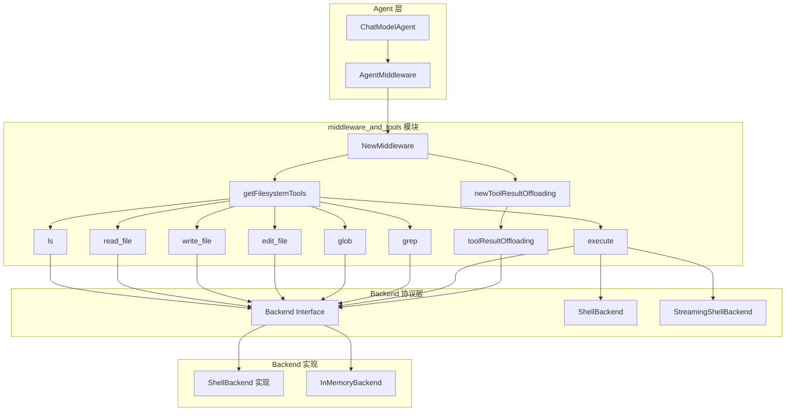

# middleware_and_tools 模块深度解析

## 概述：为什么需要这个模块？

想象一下，你正在构建一个能够与文件系统交互的 AI Agent。最直观的做法是什么？直接把文件操作代码硬编码到 Agent 逻辑里？这很快就会变成一场噩梦——每次添加新操作（比如从 `ls` 扩展到 `grep`），你都要修改 Agent 核心代码；每次想切换底层存储（从本地文件系统切换到云存储），都要重写一大片逻辑。

**`middleware_and_tools` 模块的核心价值在于：它将"Agent 能做什么"（工具定义）与"Agent 如何做"（中间件增强）从 Agent 运行时中解耦出来。**

这个模块位于 ADK（Agent Development Kit）的文件系统中间件层，它解决的是**能力注入**和**行为增强**两个问题：

1. **能力注入**：通过定义一套标准的工具集（`ls`、`read_file`、`write_file`、`edit_file`、`glob`、`grep`、`execute`），让 Agent 无需关心底层文件系统的具体实现，只需通过工具调用来完成操作。

2. **行为增强**：通过中间件机制（如大结果卸载 `toolResultOffloading`），在不修改工具本身的前提下，为所有工具调用添加横切关注点（cross-cutting concerns），比如自动将过大的工具结果写入文件而非直接返回。

这种设计的精妙之处在于：**Backend 协议定义了"能做什么"，Tools 定义了"Agent 如何调用"，Middleware 定义了"调用时发生什么额外的事"**。三者正交，互不干扰。

---

## 架构全景



### 数据流 walkthrough

让我们追踪一个典型的工具调用流程，看看数据如何在各层之间流动：

1. **Agent 初始化阶段**：
   - 用户调用 `NewMiddleware(ctx, config)` 
   - `NewMiddleware` 首先验证配置（确保 `Backend` 不为 nil）
   - 调用 `getFilesystemTools()` 创建 6-7 个工具（取决于 Backend 是否支持 shell 执行）
   - 如果启用了大结果卸载，调用 `newToolResultOffloading()` 创建中间件并赋值给 `m.WrapToolCall`
   - 返回 `AgentMiddleware{AdditionalInstruction, AdditionalTools, WrapToolCall}`

2. **Agent 运行阶段**（当 Agent 决定调用 `read_file` 工具时）：
   - ChatModel 返回工具调用请求（ToolCall）
   - ToolsNode 执行工具，首先经过 `WrapToolCall.Invokable` 中间件（如果配置了）
   - 中间件的 `invoke` 方法调用原始工具 endpoint
   - 工具执行 `fs.Read(ctx, &ReadRequest{...})`
   - Backend 实现读取文件并返回内容
   - 中间件检查结果大小，如果超过 token 限制，将内容写入文件并返回简短提示
   - 最终结果返回给 Agent

3. **关键设计点**：
   - **工具是纯函数**：每个工具（如 `newReadFileTool`）接收 Backend 和可选的自定义描述，返回 `tool.BaseTool`。工具本身不持有任何状态，所有状态通过 `ctx` 传递。
   - **中间件是装饰器**：`toolResultOffloading` 实现了 `compose.ToolMiddleware` 接口，它不修改原始工具，而是包装 endpoint 函数，在调用前后添加逻辑。
   - **Backend 是协议**：所有工具都依赖 `Backend` 接口，而非具体实现。这意味着你可以轻松替换为 S3、数据库或其他存储后端。

---

## 核心组件深度解析

### 1. Config：配置的哲学

```go
type Config struct {
    Backend Backend  // 必填：文件系统操作的实际执行者
    
    // 大结果卸载配置（可选）
    WithoutLargeToolResultOffloading bool
    LargeToolResultOffloadingTokenLimit int
    LargeToolResultOffloadingPathGen func(ctx context.Context, input *compose.ToolInput) (string, error)
    
    // 自定义提示词和工具描述（可选）
    CustomSystemPrompt *string
    CustomLsToolDesc *string
    // ... 其他工具的自定义描述
}
```

**设计意图**：Config 结构体体现了"约定优于配置"的原则。

- **必填项极少**：只有 `Backend` 是必须的。这意味着最小可用配置只需要提供一个 Backend 实现。
- **可选功能通过开关控制**：`WithoutLargeToolResultOffloading` 默认为 `false`（即默认启用卸载），这反映了设计者的判断：大结果卸载是大多数场景需要的，除非你明确不需要。
- **扩展点通过函数注入**：`LargeToolResultOffloadingPathGen` 是一个函数类型，允许用户自定义卸载文件的存储路径生成逻辑。默认实现是 `/large_tool_result/{ToolCallID}`，但你可以根据业务需求生成更有意义的路径。

**为什么用指针类型存储自定义描述？** 这是一个微妙但重要的设计。使用 `*string` 而非 `string` 可以区分"未设置"（nil）和"设置为空字符串"（""）两种状态。如果用户想完全移除某个工具的描述，可以设置为空字符串；如果用户想使用默认描述，保持为 nil 即可。

### 2. 工具创建函数：从接口到实现

以 `newReadFileTool` 为例：

```go
func newReadFileTool(fs filesystem.Backend, desc *string) (tool.BaseTool, error) {
    d := ReadFileToolDesc
    if desc != nil {
        d = *desc
    }
    return utils.InferTool("read_file", d, func(ctx context.Context, input readFileArgs) (string, error) {
        if input.Offset < 0 {
            input.Offset = 0
        }
        if input.Limit <= 0 {
            input.Limit = 200
        }
        return fs.Read(ctx, &filesystem.ReadRequest{
            FilePath: input.FilePath,
            Offset:   input.Offset,
            Limit:    input.Limit,
        })
    })
}
```

**内部机制**：

1. **参数验证与默认值**：在调用 Backend 之前，先对输入参数进行规范化（offset 不能为负，limit 有默认值 200）。这体现了"防御性编程"原则——工具应该对非法输入有合理的默认行为，而不是直接报错。

2. **utils.InferTool 的魔法**：这个辅助函数使用反射从 `readFileArgs` 结构体自动生成工具的参数 Schema（JSON Schema）。这意味着你只需要定义 Go 结构体：
   ```go
   type readFileArgs struct {
       FilePath string `json:"file_path"`
       Offset   int    `json:"offset"`
       Limit    int    `json:"limit"`
   }
   ```
   框架会自动生成对应的 JSON Schema，包括字段类型、必填项、描述等。这大大减少了样板代码。

3. **返回值设计**：工具函数返回 `(string, error)` 而非更复杂的结构。这是因为工具结果最终会被序列化为字符串发送给 LLM。简单即美。

**为什么工具函数接收 `filesystem.Backend` 而非具体的 `*ShellBackend`？** 这是依赖倒置原则的典型应用。工具不关心 Backend 的具体实现，只关心它是否符合接口。这使得：
- 单元测试时可以轻松注入 `InMemoryBackend`
- 生产环境可以无缝切换到云存储后端
- 不同项目可以共享同一套工具定义

### 3. toolResultOffloading：中间件模式实战

这是本模块最精彩的设计之一。让我们看看它是如何工作的：

```go
func (t *toolResultOffloading) invoke(endpoint compose.InvokableToolEndpoint) compose.InvokableToolEndpoint {
    return func(ctx context.Context, input *compose.ToolInput) (*compose.ToolOutput, error) {
        output, err := endpoint(ctx, input)  // 1. 先调用原始工具
        if err != nil {
            return nil, err
        }
        result, err := t.handleResult(ctx, output.Result, input)  // 2. 处理结果
        if err != nil {
            return nil, err
        }
        return &compose.ToolOutput{Result: result}, nil
    }
}
```

**设计模式**：这是典型的**装饰器模式（Decorator Pattern）**。`invoke` 函数接收一个 endpoint（原始工具），返回一个新的 endpoint（包装后的工具）。新 endpoint 在调用原始 endpoint 前后添加额外逻辑。

**handleResult 的核心逻辑**：

```go
func (t *toolResultOffloading) handleResult(ctx context.Context, result string, input *compose.ToolInput) (string, error) {
    // 1. 检查结果大小（按字节数估算 token 数）
    if len(result) > t.tokenLimit*4 {
        // 2. 生成存储路径
        path, err := t.pathGenerator(ctx, input)
        
        // 3. 格式化结果预览（前 10 行，每行最多 1000 字符）
        nResult := formatToolMessage(result)
        
        // 4. 生成提示消息，告诉 Agent 结果已保存到文件
        nResult, err = pyfmt.Fmt(tooLargeToolMessage, map[string]any{
            "tool_call_id":   input.CallID,
            "file_path":      path,
            "content_sample": nResult,
        })
        
        // 5. 将完整结果写入文件
        err = t.backend.Write(ctx, &WriteRequest{
            FilePath: path,
            Content:  result,
        })
        
        return nResult, nil
    }
    return result, nil
}
```

**为什么是 `tokenLimit*4`？** 这是一个经验法则：平均而言，1 个 token 约等于 4 个字节（对于英文文本）。这个估算虽然不精确，但足够高效——避免了真正调用 tokenizer 的开销。

**为什么只预览前 10 行？** 这是为了平衡两个需求：
1. Agent 需要知道结果的大致内容，以便决定下一步操作
2. 预览本身不能太大，否则失去了卸载的意义

**设计权衡**：
- **优点**：对 Agent 透明。Agent 不需要知道结果被卸载了，它看到的仍然是一个正常的工具调用结果（只是内容变成了"结果已保存到文件 X，以下是预览..."）。
- **缺点**：增加了额外的写操作。如果结果很大，写入文件可能成为性能瓶颈。但对于 LLM 场景，上下文长度限制是硬约束，这个权衡是必要的。

### 4. execute 工具：流式与非流式的分叉

`execute` 工具是唯一一个有两种实现的工具：

```go
// 非流式（ShellBackend）
func newExecuteTool(sb filesystem.ShellBackend, desc *string) (tool.BaseTool, error) {
    return utils.InferTool("execute", d, func(ctx context.Context, input executeArgs) (string, error) {
        result, err := sb.Execute(ctx, &filesystem.ExecuteRequest{Command: input.Command})
        return convExecuteResponse(result), nil
    })
}

// 流式（StreamingShellBackend）
func newStreamingExecuteTool(sb filesystem.StreamingShellBackend, desc *string) (tool.BaseTool, error) {
    return utils.InferStreamTool("execute", d, func(ctx context.Context, input executeArgs) (*schema.StreamReader[string], error) {
        result, err := sb.ExecuteStreaming(ctx, &filesystem.ExecuteRequest{Command: input.Command})
        sr, sw := schema.Pipe[string](10)
        go func() {
            // 异步读取流式结果并转发
            for {
                chunk, recvErr := result.Recv()
                // ... 处理 chunk
                sw.Send(strings.Join(parts, "\n"), nil)
            }
            sw.Close()
        }()
        return sr, nil
    })
}
```

**为什么需要两种实现？** 这反映了两种不同的使用场景：

- **非流式**：适用于快速执行的命令（如 `ls`、`cat`）。命令执行完成后一次性返回结果。
- **流式**：适用于长时间运行的命令（如 `npm install`、`pytest`）。可以实时看到输出，而不是等待命令结束。

**设计细节**：
- 流式实现使用 `schema.Pipe[string](10)` 创建一个带缓冲的管道（buffer size=10）
- 启动一个 goroutine 异步读取 Backend 返回的流，并转发到管道
- 使用 `defer + recover` 捕获 panic，防止 goroutine 崩溃导致资源泄漏
- 在流结束时，根据 exit code 发送不同的结束消息

**为什么流式工具返回 `*schema.StreamReader[string]`？** 这是为了与框架的流式处理机制集成。`StreamReader` 是一个通用的流式读取接口，支持 `Recv()` 方法逐个读取元素，并在结束时返回 `io.EOF`。

---

## 依赖关系分析

### 上游依赖（谁调用这个模块）

1. **ChatModelAgent**（[adk.chatmodel](chatmodel.md)）
   - 调用 `NewMiddleware()` 创建文件系统中间件
   - 将返回的 `AgentMiddleware` 添加到 `ChatModelAgentConfig.Middlewares`
   - 依赖 `AgentMiddleware.AdditionalTools` 和 `AgentMiddleware.WrapToolCall`

2. **应用层代码**
   - 直接调用 `NewMiddleware()` 并手动应用到 Agent
   - 需要理解 `Config` 的各个字段含义

### 下游依赖（这个模块调用谁）

1. **Backend 协议**（[backend_protocol](backend_protocol.md)）
   - 所有工具都依赖 `Backend` 接口
   - `execute` 工具额外依赖 `ShellBackend` 或 `StreamingShellBackend`
   - 大结果卸载依赖 `Backend.Write()`

2. **Tool 工具接口**（[tool_interfaces](tool_interfaces.md)）
   - `utils.InferTool()` 和 `utils.InferStreamTool()` 用于创建工具
   - 返回的 `tool.BaseTool` 实现了 `InvokableTool` 或 `StreamableTool` 接口

3. **Compose ToolMiddleware**（[compose_tool_node](compose_tool_node.md)）
   - `toolResultOffloading` 实现 `compose.ToolMiddleware` 接口
   - 依赖 `compose.ToolInput` 和 `compose.ToolOutput` 类型

4. **Schema 流式处理**（[schema_stream](schema_stream.md)）
   - 流式工具使用 `schema.StreamReader` 和 `schema.Pipe`
   - 依赖 `schema.StreamReaderFromArray` 等辅助函数

### 数据契约

**Config → NewMiddleware → AgentMiddleware**：
```
Config{Backend, ...} 
  → NewMiddleware() 
  → AgentMiddleware{
      AdditionalInstruction: string,
      AdditionalTools: []tool.BaseTool,
      WrapToolCall: ToolMiddleware
    }
```

**Tool Call 流程**：
```
Agent → ToolCall{Name: "read_file", Args: {...}}
  → ToolsNode
  → WrapToolCall.Invokable (if set)
  → read_file endpoint
  → Backend.Read()
  → string result
  → WrapToolResult (if large)
  → ToolOutput{Result: string}
  → Agent
```

---

## 设计决策与权衡

### 1. 为什么工具返回 string 而非结构化数据？

**选择**：所有工具都返回 `string`，即使底层操作可能返回结构化数据（如 `[]FileInfo`）。

**原因**：
- **LLM 友好**：LLM 的上下文窗口是文本，工具结果最终需要序列化为文本。直接返回字符串减少了序列化/反序列化的开销。
- **简化接口**：统一的返回类型使得中间件处理更简单（如 `toolResultOffloading` 只需要处理 `string`）。
- **灵活性**：工具可以自由选择返回格式（JSON、纯文本、表格等），无需框架层约束。

**权衡**：
- **缺点**：如果应用层需要结构化处理工具结果，需要额外解析字符串。
- **缓解**：工具描述中会说明返回格式（如 `ls` 返回换行分隔的路径列表），应用层可以按需解析。

### 2. 为什么大结果卸载默认启用？

**选择**：`WithoutLargeToolResultOffloading` 默认为 `false`，即默认启用卸载。

**原因**：
- **上下文长度是硬约束**：LLM 的上下文窗口有限（通常 8K-128K tokens），过大的工具结果会挤占其他信息的空间。
- **防御性设计**：即使用户没有意识到结果可能很大，默认启用可以防止意外崩溃。
- **透明性**：卸载对 Agent 是透明的，Agent 仍然可以正常工作（只是看到的是预览而非完整结果）。

**权衡**：
- **缺点**：增加了额外的写操作，可能影响性能。
- **缓解**：用户可以通过 `LargeToolResultOffloadingTokenLimit` 调整阈值，或完全禁用。

### 3. 为什么 Backend 接口使用 struct 参数？

**选择**：所有 Backend 方法都接收 struct 指针参数（如 `*ReadRequest`），而非多个独立参数。

**原因**：
- **向后兼容**：如果未来需要添加新参数（如 `ReadRequest.Timeout`），只需扩展 struct，无需修改接口签名。
- **可读性**：`&ReadRequest{FilePath: "/foo", Offset: 0, Limit: 100}` 比 `Read("/foo", 0, 100)` 更清晰。
- **可选参数**：可以通过 omit empty 实现可选参数（如 `GrepRequest` 的 `Path` 和 `Glob` 是指针类型，nil 表示使用默认值）。

**权衡**：
- **缺点**：每次调用都需要创建 struct，略微增加 GC 压力。
- **缓解**：对于性能敏感的场景，可以复用 struct 实例。

### 4. 为什么 execute 工具有两种实现？

**选择**：根据 Backend 是否实现 `StreamingShellBackend`，动态选择 `newExecuteTool` 或 `newStreamingExecuteTool`。

**原因**：
- **场景差异**：有些命令需要实时输出（如构建日志），有些命令只需最终结果（如 `echo`）。
- **后端能力差异**：不是所有 Backend 都支持流式执行（如 `InMemoryBackend` 可能只支持非流式）。
- **渐进增强**：如果 Backend 支持流式，自动获得流式能力；否则降级为非流式。

**权衡**：
- **缺点**：增加了代码复杂度，需要维护两套实现。
- **缓解**：两套实现共享相同的参数结构（`executeArgs`）和工具描述，差异仅在流式处理逻辑。

---

## 使用指南与示例

### 基础用法：创建文件系统中间件

```go
import (
    "context"
    "github.com/cloudwego/eino/adk"
    "github.com/cloudwego/eino/adk/middlewares/filesystem"
    "github.com/cloudwego/eino/adk/filesystem"
)

func main() {
    ctx := context.Background()
    
    // 1. 创建 Backend 实现（这里使用内存后端用于测试）
    backend := filesystem.NewInMemoryBackend()
    
    // 2. 配置中间件
    config := &filesystem.Config{
        Backend: backend,
        // 可选：调整大结果卸载阈值
        LargeToolResultOffloadingTokenLimit: 10000,
        // 可选：自定义系统提示
        CustomSystemPrompt: ptr("You are a file system assistant."),
    }
    
    // 3. 创建中间件
    middleware, err := filesystem.NewMiddleware(ctx, config)
    if err != nil {
        panic(err)
    }
    
    // 4. 将中间件应用到 Agent
    agent, err := adk.NewChatModelAgent(ctx, &adk.ChatModelAgentConfig{
        Name:        "file-agent",
        Description: "An agent that can interact with files",
        Model:       yourChatModel,
        Middlewares: []adk.AgentMiddleware{middleware},
    })
    
    // 5. 运行 Agent
    events := agent.Run(ctx, &adk.AgentInput{
        Messages: []*schema.Message{
            schema.UserMessage("List all files in /home"),
        },
    })
    
    for event := range events.Iterator() {
        // 处理事件
    }
}
```

### 高级用法：自定义路径生成器

```go
// 根据工具调用 ID 和用户 ID 生成唯一的文件路径
config.LargeToolResultOffloadingPathGen = func(ctx context.Context, input *compose.ToolInput) (string, error) {
    userID := getUserIDFromContext(ctx)  // 从 ctx 提取用户 ID
    return fmt.Sprintf("/users/%s/tool_results/%s.txt", userID, input.CallID), nil
}
```

### 高级用法：完全禁用大结果卸载

```go
config := &filesystem.Config{
    Backend: backend,
    WithoutLargeToolResultOffloading: true,  // 禁用卸载
}
```

### 高级用法：自定义工具描述

```go
config := &filesystem.Config{
    Backend: backend,
    CustomReadFileToolDesc: ptr(`Reads a file. 
WARNING: This tool is rate-limited to 10 calls per minute.
Use wisely.`),
}
```

---

## 边界情况与陷阱

### 1. 路径必须是绝对路径

**问题**：所有工具都要求路径以 `/` 开头（绝对路径）。如果 Agent 传入相对路径，Backend 可能报错或行为不一致。

**原因**：提示词中明确要求"All file paths must start with a '/'"，但 LLM 可能不遵守。

**缓解**：
- 在工具函数中进行验证（如 `if !strings.HasPrefix(path, "/") { return "", errors.New("path must be absolute") }`）
- 在系统提示中强调绝对路径要求
- 在 Backend 实现中自动转换为绝对路径（如拼接当前工作目录）

### 2. 大结果卸载的竞态条件

**问题**：如果两个工具调用同时卸载结果到同一路径（如使用相同的 `ToolCallID`），可能发生覆盖。

**原因**：默认路径生成器使用 `ToolCallID`，而 `ToolCallID` 在并发场景下可能重复（取决于 LLM 提供商的实现）。

**缓解**：
- 自定义 `PathGenerator`，加入时间戳或随机数：
  ```go
  config.LargeToolResultOffloadingPathGen = func(ctx context.Context, input *compose.ToolInput) (string, error) {
      return fmt.Sprintf("/large_tool_result/%s_%d", input.CallID, time.Now().UnixNano()), nil
  }
  ```
- 确保 Backend 的 `Write` 操作是原子的（如使用临时文件 + 重命名）

### 3. 流式 execute 的 goroutine 泄漏

**问题**：`newStreamingExecuteTool` 启动了一个 goroutine 来转发流式结果。如果 Agent 在流完成前取消上下文，goroutine 可能泄漏。

**原因**：goroutine 内部的 `result.Recv()` 可能阻塞，如果 Backend 没有正确实现上下文取消。

**缓解**：
- 确保 Backend 的 `ExecuteStreaming` 正确响应 `ctx.Done()`
- 在 goroutine 中使用 `select` 监听上下文取消：
  ```go
  go func() {
      defer sw.Close()
      for {
          select {
          case <-ctx.Done():
              return
          default:
              chunk, err := result.Recv()
              // ...
          }
      }
  }()
  ```

### 4. 工具描述的 token 消耗

**问题**：每个工具的描述都会添加到系统提示中，占用 context window。如果自定义描述过长，可能挤占其他信息。

**原因**：`AgentMiddleware.AdditionalInstruction` 会拼接到系统提示，而工具描述会添加到工具的 `description` 字段。

**缓解**：
- 保持工具描述简洁（通常 50-100 tokens 足够）
- 使用 `CustomSystemPrompt` 完全替换默认提示，而非追加
- 监控实际消耗的 token 数（通过 `TokenUsage` callback）

### 5. Backend 实现的幂等性

**问题**：某些操作（如 `Write`、`Edit`）可能不是幂等的。如果 Agent 重复调用，可能导致意外结果。

**原因**：LLM 可能因为网络问题或超时重试工具调用。

**缓解**：
- 在 Backend 实现中确保幂等性（如 `Write` 总是覆盖而非追加）
- 使用 `ToolCallID` 去重（在中间件层记录已处理的调用 ID）
- 在工具描述中说明操作的幂等性

---

## 扩展点

### 添加新工具

如果你想添加一个新的文件系统工具（如 `chmod`）：

1. **定义参数结构**：
   ```go
   type chmodArgs struct {
       Path string `json:"path"`
       Mode string `json:"mode"`
   }
   ```

2. **创建工具函数**：
   ```go
   func newChmodTool(fs filesystem.Backend, desc *string) (tool.BaseTool, error) {
       d := "Changes file permissions."
       if desc != nil {
           d = *desc
       }
       return utils.InferTool("chmod", d, func(ctx context.Context, input chmodArgs) (string, error) {
           err := fs.Chmod(ctx, &filesystem.ChmodRequest{
               Path: input.Path,
               Mode: input.Mode,
           })
           if err != nil {
               return "", err
           }
           return fmt.Sprintf("Changed permissions of %s to %s", input.Path, input.Mode), nil
       })
   }
   ```

3. **扩展 Backend 接口**（如果需要）：
   ```go
   type Backend interface {
       // ... 现有方法
       Chmod(ctx context.Context, req *ChmodRequest) error
   }
   ```

4. **在 `getFilesystemTools` 中注册**：
   ```go
   chmodTool, err := newChmodTool(validatedConfig.Backend, validatedConfig.CustomChmodToolDesc)
   tools = append(tools, chmodTool)
   ```

### 添加新中间件

如果你想添加一个新的中间件（如日志记录）：

```go
func newLoggingMiddleware() compose.ToolMiddleware {
    return compose.ToolMiddleware{
        Invokable: func(endpoint compose.InvokableToolEndpoint) compose.InvokableToolEndpoint {
            return func(ctx context.Context, input *compose.ToolInput) (*compose.ToolOutput, error) {
                log.Printf("Calling tool: %s, args: %s", input.Name, input.Arguments)
                start := time.Now()
                output, err := endpoint(ctx, input)
                log.Printf("Tool call completed in %v, err: %v", time.Since(start), err)
                return output, err
            }
        },
    }
}

// 使用
config.WrapToolCall = newLoggingMiddleware()
```

---

## 相关模块

- [backend_protocol](backend_protocol.md)：Backend 接口定义和实现
- [offloading_mechanism](offloading_mechanism.md)：大结果卸载的详细实现
- [chatmodel](chatmodel.md)：ChatModelAgent 如何使用中间件
- [tool_interfaces](tool_interfaces.md)：工具接口定义
- [compose_tool_node](compose_tool_node.md)：ToolsNode 如何执行工具和中间件

---

## 总结

`middleware_and_tools` 模块是 ADK 文件系统能力的核心载体。它通过**工具定义**将文件系统操作暴露给 Agent，通过**中间件机制**为工具调用添加横切关注点，通过**Backend 协议**解耦具体实现。

理解这个模块的关键在于把握三个层次：
1. **工具层**：定义 Agent 能做什么（ls、read、write 等）
2. **中间件层**：定义工具调用时发生什么额外的事（日志、卸载、限流等）
3. **Backend 层**：定义操作如何真正执行（本地文件、云存储、内存等）

这种分层设计使得每个层次可以独立演进：你可以添加新工具而不影响中间件，可以替换 Backend 而不修改工具，可以添加中间件而不改动 Agent 核心逻辑。这正是模块化设计的精髓所在。
