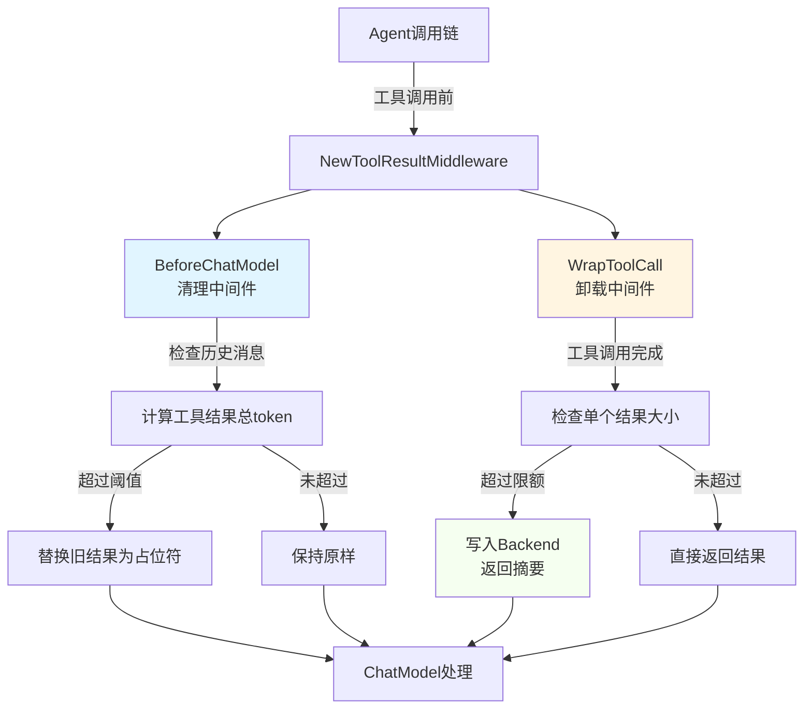

# middleware_entrypoint 模块深度解析

## 1. 为什么需要这个模块？

在 LLM Agent 系统中，工具调用结果的管理是一个常见的挑战。随着对话进行，工具返回的结果会不断累积，导致两个严重问题：

1. **上下文窗口溢出**：LLM 的上下文窗口大小有限，过多的工具结果会让对话历史超出模型处理能力
2. **单次超大结果阻塞**：某些工具可能返回特别大的结果（如长文档、大量搜索结果），单次调用就可能耗尽上下文窗口

一个朴素的解决方案是简单地截断消息历史，但这会丢失关键信息，特别是最近的交互可能对决策至关重要。另一种方法是让用户手动管理上下文，但这增加了使用复杂度。

`middleware_entrypoint` 模块通过**组合两种互补策略**优雅地解决了这个问题：
- **清理策略**：智能地用占位符替换旧的工具结果，同时保护最近的消息
- **卸载策略**：将超大的单个工具结果持久化到存储，只返回摘要引导 LLM 按需读取

## 2. 核心心智模型

把这个模块想象成**机场安检的行李处理系统**：

- **清理策略**像行李额度管理：每位乘客（工具调用）有行李限额，超出限额时，最旧的行李（工具结果）会被贴上"已寄存"标签（占位符），只保留最近的行李
- **卸载策略**像超大件行李处理：特别大的行李（超大工具结果）会被直接送到专门的超大件处理区（存储后端），乘客拿到一张取行李票（摘要信息），后续可以凭票领取

两种策略协同工作，确保上下文窗口永远不会超载，同时最大化保留有价值的信息。

## 3. 架构与数据流程



### 数据流详解

1. **配置阶段**：`NewToolResultMiddleware` 接收统一的 `ToolResultConfig`，然后分别构造：
   - 清理中间件（使用 `ClearToolResultConfig`）
   - 卸载中间件（使用 `toolResultOffloadingConfig`）

2. **运行时流程**：
   - **BeforeChatModel 钩子**：在每次调用 ChatModel 之前触发，检查历史消息中的工具结果总token量，按需清理
   - **WrapToolCall 钩子**：包装工具调用，在工具返回结果后检查单个结果大小，按需卸载

3. **策略协调**：
   - 两个策略独立工作，互不干扰
   - 清理策略处理累积问题，卸载策略处理单次大结果问题

## 4. 核心组件深度解析

### 4.1 Backend 接口

```go
type Backend interface {
    Write(context.Context, *filesystem.WriteRequest) error
}
```

**设计意图**：这是一个精心设计的最小接口，只要求实现 `Write` 方法。这种设计体现了**接口隔离原则**——使用方只依赖它实际需要的方法。

**为什么只需要 Write**：
- 卸载操作只需要写入能力
- 读取操作由独立的 `read_file` 工具负责
- 这种分离让 Backend 的实现更简单，职责更单一

**扩展点**：虽然接口只要求 `Write`，但实际的 Backend 实现（如文件系统后端）通常也会提供读取能力，供 `read_file` 工具使用。

### 4.2 ToolResultConfig 结构体

这是整个模块的**配置中心**，它将两个独立策略的配置整合在一起，提供统一的用户体验。

#### 清理策略配置

| 配置项 | 作用 | 默认值 | 设计考虑 |
|--------|------|--------|----------|
| `ClearingTokenThreshold` | 总工具结果token阈值 | 20000 | 平衡信息保留和上下文安全 |
| `KeepRecentTokens` | 保护的最近消息token预算 | 40000 | 确保最近的交互永远可用 |
| `ClearToolResultPlaceholder` | 替换文本 | "[Old tool result content cleared]" | 可定制化提示 |
| `TokenCounter` | 自定义token计算函数 | 字符数/4 | 支持精确tokenizer |
| `ExcludeTools` | 不清理的工具列表 | 空 | 保护关键工具结果 |

**设计权衡**：
- 默认使用 `字符数/4` 作为token估算，这是一个在准确性和性能之间的实用折中
- `KeepRecentTokens` 设置为 `ClearingTokenThreshold` 的2倍，确保即使触发清理，最近的上下文也完整保留

#### 卸载策略配置

| 配置项 | 作用 | 默认值 | 设计考虑 |
|--------|------|--------|----------|
| `Backend` | 存储后端 | **必需** | 抽象存储实现 |
| `OffloadingTokenLimit` | 单个结果token阈值 | 20000 | 平衡便利性和安全性 |
| `ReadFileToolName` | 读取工具名称 | "read_file" | 与文件系统中间件兼容 |
| `PathGenerator` | 路径生成函数 | "/large_tool_result/{ToolCallID}" | 灵活的存储路径管理 |

**设计要点**：
- `ReadFileToolName` 的默认值特意与文件系统中间件的工具名匹配，降低集成成本
- `PathGenerator` 允许用户自定义存储路径，支持不同的存储组织策略

### 4.3 NewToolResultMiddleware 函数

```go
func NewToolResultMiddleware(ctx context.Context, cfg *ToolResultConfig) (adk.AgentMiddleware, error)
```

这是模块的**工厂函数**，它将配置转换为具体的中间件实例。

**内部工作流程**：
1. 使用配置构造清理中间件 `bc`
2. 使用配置构造卸载中间件 `tm`  
3. 将两者包装在 `adk.AgentMiddleware` 中返回

**设计亮点**：
- **关注点分离**：清理和卸载逻辑分别实现，然后在这里组合
- **零配置运行**：所有可选参数都有合理默认值，用户只需提供 `Backend`
- **向后兼容**：可以独立使用任一策略，也可以同时使用

## 5. 依赖关系分析

### 输入依赖（被哪些模块调用）

这个模块通常被以下场景使用：
- **Agent 初始化**：在创建 Agent 时注册中间件
- **文件系统中间件**：内部默认集成了这个功能（通过 `WithoutLargeToolResultOffloading` 可禁用）

### 输出依赖（调用哪些模块）

| 依赖模块 | 用途 | 耦合程度 |
|----------|------|----------|
| `adk` | 提供 `AgentMiddleware` 类型 | 核心依赖 |
| `filesystem` | 提供 `WriteRequest` 类型 | 中度耦合 |
| `compose` | 提供 `ToolInput` 类型 | 中度耦合 |
| `schema` | 提供 `Message` 类型 | 核心依赖 |
| `clear_tool_result` | 清理策略实现 | 内部依赖 |
| `large_tool_result` | 卸载策略实现 | 内部依赖 |

**契约关系**：
- 模块假设 `Backend` 与 `read_file` 工具使用相同的存储系统
- 模块假设 LLM 能够理解返回的摘要信息并正确调用读取工具

## 6. 设计决策与权衡

### 6.1 为什么用组合而不是继承？

**选择**：将清理和卸载作为两个独立策略，通过组合使用

**理由**：
- **单一职责**：每个策略只关注一个问题
- **独立演进**：可以单独改进任一策略而不影响另一个
- **灵活配置**：用户可以选择只使用其中一个策略
- **测试友好**：可以独立测试每个策略

**替代方案**：创建一个处理所有逻辑的中间件，但这会导致代码复杂、难以维护。

### 6.2 Token 估算的折中

**选择**：默认使用 `字符数/4` 作为token估算

**理由**：
- **性能**：不需要加载完整的tokenizer，速度快
- **兼容性**：不需要知道具体使用哪个模型
- **足够好**：对于大多数场景，这个估算足够准确

**权衡**：
- 牺牲了准确性换取了简单性和性能
- 提供了 `TokenCounter` 接口允许用户注入精确计算

### 6.3 Backend 接口的最小化设计

**选择**：只要求 `Write` 方法

**理由**：
- **接口隔离**：使用方只依赖它需要的方法
- **实现简单**：Backend 实现者只需实现一个方法
- **职责分离**：读取由专门的工具负责

**权衡**：
- 这种设计要求用户确保 Backend 和 `read_file` 工具使用相同的存储系统
- 增加了一点集成复杂度，但大大降低了实现复杂度

### 6.4 默认值的选择逻辑

| 配置项 | 默认值 | 选择理由 |
|--------|--------|----------|
| `ClearingTokenThreshold` | 20000 | 大多数模型的上下文窗口足够容纳这个量级 |
| `KeepRecentTokens` | 40000 | 是清理阈值的2倍，确保最近上下文完整 |
| `OffloadingTokenLimit` | 20000 | 与清理阈值一致，保持策略协调 |

这些默认值是基于常见场景的经验值，在实际使用中可能需要根据具体模型和应用场景调整。

## 7. 使用指南与最佳实践

### 7.1 基本使用

```go
middleware, err := reduction.NewToolResultMiddleware(ctx, &reduction.ToolResultConfig{
    Backend: myBackend, // 必须提供存储后端
})
```

**最小配置只需要 Backend**，其他参数都有合理默认值。

### 7.2 与文件系统中间件集成

```go
// 文件系统中间件默认包含工具结果管理功能
fsMiddleware, err := filesystem.NewMiddleware(ctx, &filesystem.Config{
    Backend: myFSBackend,
    // 如果想单独使用 reduction 中间件，设置这个
    WithoutLargeToolResultOffloading: true, 
})

// 然后可以单独使用 reduction 中间件
reductionMiddleware, err := reduction.NewToolResultMiddleware(ctx, &reduction.ToolResultConfig{
    Backend: myFSBackend, // 复用同一个 Backend
})
```

### 7.3 自定义配置示例

```go
middleware, err := reduction.NewToolResultMiddleware(ctx, &reduction.ToolResultConfig{
    Backend: myBackend,
    
    // 更激进的清理策略
    ClearingTokenThreshold: 10000,  // 降低阈值
    KeepRecentTokens: 20000,          // 相应减少保护预算
    
    // 自定义占位符
    ClearToolResultPlaceholder: "[工具结果已归档]",
    
    // 保护关键工具不被清理
    ExcludeTools: []string{"database_query", "user_auth"},
    
    // 使用精确的token计算
    TokenCounter: func(msg *schema.Message) int {
        return preciseTokenizer.Count(msg.Content)
    },
    
    // 自定义卸载行为
    OffloadingTokenLimit: 15000,      // 降低卸载阈值
    PathGenerator: func(ctx context.Context, input *compose.ToolInput) (string, error) {
        return fmt.Sprintf("/results/%s/%s", 
            time.Now().Format("2006-01-02"), 
            input.ToolCallID), nil
    },
})
```

## 8. 常见陷阱与注意事项

### 8.1 缺少读取工具

**问题**：只配置了卸载中间件，但没有提供 `read_file` 工具

**后果**：LLM 看到摘要信息后，尝试调用读取工具但失败，无法获取完整结果

**解决方案**：
- 使用文件系统中间件（它自动提供 `read_file` 工具）
- 或者自己实现 `read_file` 工具，确保与 Backend 使用相同的存储

### 8.2 Backend 与读取工具不匹配

**问题**：Backend 写入到一个存储系统，但 `read_file` 工具从另一个存储系统读取

**后果**：LLM 读取不到之前写入的结果

**解决方案**：确保 Backend 和读取工具使用相同的存储后端和路径约定

### 8.3 Token 估算不准确

**问题**：默认的 `字符数/4` 估算对于某些语言（如中文）可能偏差较大

**后果**：可能过早或过晚触发清理/卸载

**解决方案**：提供自定义的 `TokenCounter` 函数，使用与你的模型匹配的 tokenizer

### 8.4 关键工具结果被清理

**问题**：某些工具的结果对后续决策至关重要，但被意外清理

**后果**：Agent 丢失关键信息，可能做出错误决策

**解决方案**：将这些工具添加到 `ExcludeTools` 列表中

### 8.5 与文件系统中间件重复配置

**问题**：同时使用文件系统中间件和 reduction 中间件，导致重复处理

**后果**：工具结果被卸载两次，或者产生冲突

**解决方案**：如果单独使用 reduction 中间件，设置 `filesystem.Config.WithoutLargeToolResultOffloading = true`

## 9. 扩展点与自定义

### 9.1 自定义 Backend

实现 `Backend` 接口即可支持任意存储系统：

```go
type MyDatabaseBackend struct {
    db *sql.DB
}

func (b *MyDatabaseBackend) Write(ctx context.Context, req *filesystem.WriteRequest) error {
    _, err := b.db.ExecContext(ctx,
        "INSERT INTO tool_results (path, content) VALUES (?, ?)",
        req.Path, req.Content)
    return err
}
```

### 9.2 自定义 PathGenerator

根据业务需求组织存储路径：

```go
func myPathGenerator(ctx context.Context, input *compose.ToolInput) (string, error) {
    // 从上下文中获取会话ID
    sessionID := ctx.Value("session_id").(string)
    
    // 按会话和日期组织
    return fmt.Sprintf("/%s/%s/%s.json",
        sessionID,
        time.Now().Format("2006-01-02"),
        input.ToolCallID), nil
}
```

### 9.3 自定义 TokenCounter

使用模型特定的 tokenizer：

```go
import "github.com/pkoukk/tiktoken-go"

func createTiktokenCounter(model string) func(*schema.Message) int {
    enc, err := tiktoken.EncodingForModel(model)
    if err != nil {
        // 回退到默认估算
        return func(msg *schema.Message) int {
            return len(msg.Content) / 4
        }
    }
    
    return func(msg *schema.Message) int {
        tokens := enc.Encode(msg.Content, nil, nil)
        return len(tokens)
    }
}
```

## 10. 总结

`middleware_entrypoint` 模块是一个精心设计的上下文管理解决方案，它通过组合清理和卸载两种策略，优雅地解决了 LLM Agent 中工具结果累积的问题。

**核心价值**：
- 统一的配置接口，简化使用
- 灵活的组合策略，适应不同场景
- 合理的默认值，开箱即用
- 丰富的扩展点，支持定制

**设计哲学**：
- 组合优于继承
- 接口最小化
- 默认值驱动设计
- 关注点分离

这个模块展示了如何在保持简单性的同时，提供足够的灵活性和强大的功能。

## 参考链接

- [ADK 文件系统中间件](adk_filesystem_middleware.md) - 提供 Backend 实现和 read_file 工具
- [ADK ChatModel Agent](adk_chatmodel_agent.md) - 了解如何注册和使用中间件
- [Compose Graph Engine](compose_graph_engine.md) - 理解工具调用的编排机制
