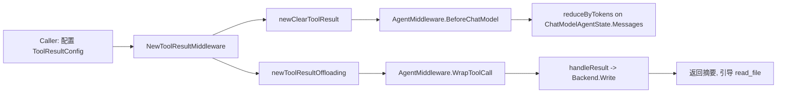

# middleware_entrypoint_and_contracts

`middleware_entrypoint_and_contracts`（代码位于 `adk/middlewares/reduction/tool_result.go`）是 reduction 中间件的“总装入口”。它解决的不是“工具怎么调用”，而是“工具结果太大时，Agent 还能不能继续稳定推理”的问题：一边要控制上下文体积（避免历史 tool output 吞掉 token 预算），一边要尽量保留可追溯能力（大结果可以写到外部存储并让模型按需读取）。这个模块的价值在于把这两种策略——**清理（clearing）** 和 **卸载（offloading）**——封装成一个统一契约，减少业务方自己拼装时的错误面。

## 先讲问题：为什么需要这个入口，而不是“各写各的中间件”

在工具型 Agent 里，最容易失控的通常不是用户消息，而是工具返回。比如搜索、文件读取、代码执行日志，一次就可能上万字符。朴素做法通常有两种：要么什么都不做，结果是每轮模型都背着历史大包袱；要么暴力截断，结果是关键证据丢失，模型后续决策变得“失忆”。

`NewToolResultMiddleware` 的设计洞察是：这两个问题其实要同时解。仅做清理，成本可控但信息丢失；仅做卸载，保真但上下文仍会被短时间内的历史结果冲击。于是这里采取组合策略：`BeforeChatModel` 阶段先清理旧且不重要的 tool result，`WrapToolCall` 阶段再把单次超大结果卸载到后端，并返回可让 LLM 自助读取的摘要提示。你可以把它想成“仓库管理”：货架上只留最近常用库存（clearing），超大件入库并贴取货单（offloading）。

## 心智模型：一个中间件，两个切入点，三类契约

理解这个模块可以抓住三层抽象。第一层是 Agent 生命周期切面：`adk.AgentMiddleware` 同时支持 `BeforeChatModel` 和 `WrapToolCall`，这使它可以在“模型调用前”与“工具执行后”各做一次治理。第二层是策略分工：清理策略面向“总量”，卸载策略面向“单次峰值”。第三层是外部契约：消息结构契约（`schema.Message`）、工具调用契约（`compose.ToolInput/ToolOutput`）、存储契约（`Backend.Write(*filesystem.WriteRequest)`）。



这个图里，`B` 是装配器；`C` 和 `D` 是两个策略工厂；`E/F` 是真正挂到运行时的钩子。核心理解点在于：**模块本身不直接“跑流程”**，它只负责把配置映射为可执行中间件，并保证默认值与契约完整。

## 组件深潜

### `Backend`（interface）

`Backend` 只有一个方法：`Write(context.Context, *filesystem.WriteRequest) error`。它是 offloading 路径唯一必须由用户实现的依赖。

这个接口故意很小，背后是一个明确取舍：模块不关心你用本地文件、对象存储还是远端服务，它只要求“把一段内容写到一个路径”。这种最小接口让 reduction 层避免绑定具体存储实现，同时也把一致性责任交给接入方——例如路径权限、幂等语义、覆盖策略都在你的 backend 中定义。

结合 `filesystem.WriteRequest` 的约束，`FilePath` 必须是绝对路径（以 `/` 开头），且“文件不存在时创建，已存在报错”。这意味着路径生成策略如果重复，可能直接触发写失败；这不是模块 bug，而是契约要求。

### `ToolResultConfig`（struct）

`ToolResultConfig` 是统一配置面，它把两类策略参数放在一个结构体中，目的是降低使用门槛并避免跨中间件配置漂移。

从字段可看出它的“分层控制”思想。`ClearingTokenThreshold`、`KeepRecentTokens`、`ClearToolResultPlaceholder`、`TokenCounter`、`ExcludeTools` 属于 clearing 维度；`Backend`、`OffloadingTokenLimit`、`ReadFileToolName`、`PathGenerator` 属于 offloading 维度。设计上最关键的点是 `Backend` 被标注为 required，这说明 offloading 在该入口里不是附带功能，而是一等公民。

`TokenCounter` 的签名是 `func(msg *schema.Message) int`，同时被 clearing 与 offloading 使用（offloading 的内部配置也有 `TokenCounter` 字段）。这是一种“统一口径”设计：无论是判断历史总量还是判断单个结果是否超限，都尽量基于同一计数规则，减少阈值行为不一致。

### `NewToolResultMiddleware(ctx context.Context, cfg *ToolResultConfig) (adk.AgentMiddleware, error)`

这是本模块的核心入口。实现很短，但它是策略编排点：

1. 调用 `newClearToolResult`，把 `ToolResultConfig` 中 clearing 相关字段映射为 `ClearToolResultConfig`；
2. 调用 `newToolResultOffloading`，把 offloading 字段映射为 `toolResultOffloadingConfig`；
3. 返回一个 `adk.AgentMiddleware`，其中 `BeforeChatModel = bc`、`WrapToolCall = tm`。

这里有一个容易被忽略但很重要的工程选择：`NewToolResultMiddleware` 本身几乎不做校验，也基本不返回错误（当前代码路径中 `error` 主要是为 API 演进预留）。这在短期内保持了接口稳定和调用简单，但也意味着配置错误往往在运行期才暴露，例如 backend 写失败、路径冲突或 read tool 不匹配。

## 数据流：关键操作如何端到端发生

当 Agent 进入一次模型调用前，运行时会执行 `AgentMiddleware.BeforeChatModel`。此时 `newClearToolResult` 生成的闭包会处理 `*adk.ChatModelAgentState`，其内部调用 `reduceByTokens(...)`。该逻辑先统计历史 `schema.Tool` 消息的 token 总量，超过阈值后，仅对保护窗口之外且不在 `ExcludeTools` 内的 tool 消息做占位替换。

当某个工具被调用时，`AgentMiddleware.WrapToolCall` 生效。`newToolResultOffloading` 返回的是 `compose.ToolMiddleware`，其中 `Invokable` 包装 `invoke`，`Streamable` 包装 `stream`。两条路径都会拿到工具原始结果，再交给 `handleResult` 判定是否超 `TokenLimit`，若超限则通过 `Backend.Write` 落盘，并把返回结果改写为“如何使用 `ReadFileToolName` 读取完整内容”的摘要文本。

这两段数据流互补：前者治理“历史累积”，后者治理“单次爆发”。如果只有前者，超大结果仍可能在本轮挤占上下文；如果只有后者，历史中等体积结果持续累加仍会失控。

## 依赖与耦合分析

从下游依赖看，本模块直接依赖：

- `adk.AgentMiddleware`：作为交付物契约；
- `compose.ToolInput`：用于 `PathGenerator` 根据 `CallID` 生成路径；
- `filesystem.WriteRequest`：作为 `Backend.Write` 的输入契约；
- `schema.Message`：用于 token 估算函数签名。

从上游调用看，它预期由 Agent 配置层注入到 middleware 链（通常在 ChatModel Agent 配置中挂载）。由于该入口返回的是标准 `AgentMiddleware`，调用方不需要理解内部策略实现，只需提供配置和 backend。

耦合点主要有两个。第一，offloading 与 `read_file` 生态存在语义耦合：注释已明确“仅写入不读取”，如果运行时没有可用的读取工具，LLM 即使拿到摘要也无法回取全文。第二，路径语义耦合到 backend：默认路径是 `/large_tool_result/{ToolCallID}`，若 backend 不接受该路径格式或存在冲突策略差异，行为会偏离预期。

## 设计决策与权衡

这个模块选择“组合而非继承”：通过把两个子策略挂在不同钩子位，而不是做一个巨型流程函数。好处是职责清晰、可替换性高；代价是排障时需要跨两个执行时机定位问题。

它也选择“默认值驱动”而非“强校验驱动”。例如 token 阈值、占位符、read tool 名称、路径生成器都可省略并有默认值。这降低了首次接入复杂度，但牺牲了显式性：团队如果不统一配置，很容易出现“看似能跑但行为和预期不同”的灰区。

另一个关键权衡是“抽象后端最小化”。`Backend` 极简让模块通用，但把事务性、去重、并发写保护等高级能力全部外置。对平台团队这是合理解耦；对业务团队则意味着要自己承担存储侧鲁棒性。

## 使用方式与示例

最小接入示例（示意）如下：

```go
mw, err := reduction.NewToolResultMiddleware(ctx, &reduction.ToolResultConfig{
    Backend:                 myBackend, // 必填，实现 Write(ctx, *filesystem.WriteRequest)
    ClearingTokenThreshold:  20000,
    KeepRecentTokens:        40000,
    OffloadingTokenLimit:    20000,
    ReadFileToolName:        "read_file",
    ClearToolResultPlaceholder: "[Old tool result content cleared]",
})
if err != nil {
    return err
}

agentCfg.Middlewares = append(agentCfg.Middlewares, mw)
```

如果你想按租户或会话组织落盘路径，可以定制 `PathGenerator`：

```go
PathGenerator: func(ctx context.Context, input *compose.ToolInput) (string, error) {
    return "/large_tool_result/" + input.CallID, nil
},
```

这里要注意 `WriteRequest.FilePath` 的绝对路径约束，以及路径唯一性。若你复用同一路径，backend 可能报“文件已存在”。

## 新贡献者最该注意的坑

第一个坑是“read tool 不存在”但 offloading 已开启。模块只负责写和提示，不负责把读取工具自动注入。注释也明确建议：要么使用 filesystem middleware（其默认提供 `read_file` 工具），要么自行提供兼容工具。否则模型会被告知“去读文件”，却没有执行手段。

第二个坑是 token 估算口径。默认计数器来自 reduction 子模块，属于启发式估算，不是精确 tokenizer。阈值如果照搬线上模型真实上下文极限，可能提前或延后触发。实践上建议先观测再调参。

第三个坑是 `cfg` 空指针风险。`NewToolResultMiddleware` 当前实现直接解引用 `cfg` 字段，没有像某些子模块那样做 `nil` 防护。调用方应保证传入非 `nil`。

第四个坑是执行时机差异。clearing 发生在模型调用前，offloading 发生在工具调用包装阶段；两者不是同一时刻。调试“为什么某条结果被清/被卸载”时，要先定位它处在哪个生命周期点。

## 参考

- [tool_result_clearing_policy](tool_result_clearing_policy.md)
- [filesystem_middleware_and_tool_surface](filesystem_middleware_and_tool_surface.md)
- [agent_runtime_and_orchestration](agent_runtime_and_orchestration.md)
- [Compose Tool Node](Compose Tool Node.md)
- [message_schema_and_stream_concat](message_schema_and_stream_concat.md)
