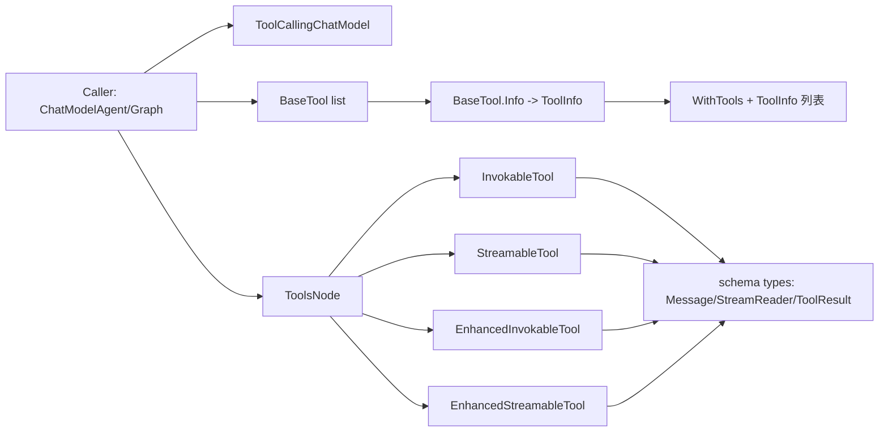

# model_and_tool_interfaces

`model_and_tool_interfaces` 这一层的价值，不在于“提供几个 Go interface”这么简单。它解决的是一个更本质的问题：**把“模型推理能力”和“工具执行能力”解耦成稳定契约**，让上层编排系统（Agent、Graph、Tool Node）可以自由组合不同实现，而不用关心底层是哪个厂商模型、工具是本地函数还是流式执行器、输出是纯文本还是多模态。

如果没有这一层，常见结果是：模型调用、工具注册、工具执行、回调埋点混在一起；一旦引入并发、重试、流式输出或多模态结果，代码会迅速失控。这个模块的设计洞察是：**先定义“最小可组合能力面”**，再由其他模块去组合行为。

## 架构角色与心智模型

可以把这个模块想象成“机场的标准接口层”：

- 航空公司（不同模型实现）很多，但都要遵守同一套登机口协议（`BaseChatModel` / `ToolCallingChatModel`）。
- 安检设备（不同工具实现）很多，但都要提供统一能力（`BaseTool` + `Invokable/Streamable` 及 Enhanced 变体）。
- 调度中心（如 Tool Node、ChatModelAgent）只依赖协议，不依赖具体品牌设备。



从架构定位看，它是一个**能力边界模块（capability boundary）**：

- 向上提供抽象：上层只看接口，不看实现。
- 向下约束实现：实现者必须按输入输出契约交付行为。
- 横向统一数据协议：通过 `schema` 中的 `Message`、`ToolInfo`、`ToolArgument`、`ToolResult`、`StreamReader` 把模型与工具连成一条数据通路。

## 组件深潜：Model 接口

### `components.model.interface.BaseChatModel`

`BaseChatModel` 定义了聊天模型最小闭环能力：

- `Generate(ctx context.Context, input []*schema.Message, opts ...Option) (*schema.Message, error)`
- `Stream(ctx context.Context, input []*schema.Message, opts ...Option) (*schema.StreamReader[*schema.Message], error)`

设计上它把“同步完整返回”和“流式返回”并列为一等公民，而不是把流式当附属功能。原因很直接：在 Agent/Workflow 场景中，流式 token 与事件传播是常态，不是边缘需求。

这里的关键取舍是：接口只规定 **I/O 形状**，不规定模型内部状态、重试策略、回调时机。这让不同实现可以保留自治空间，但也意味着行为一致性（比如重试语义）要由上层包装器保证（例如 [adk_chatmodel_agent](adk_chatmodel_agent.md) / [adk_runner](adk_runner.md) 侧）。

### `components.model.interface.ToolCallingChatModel`

`ToolCallingChatModel` 在 `BaseChatModel` 之上增加：

- `WithTools(tools []*schema.ToolInfo) (ToolCallingChatModel, error)`

这一个方法体现了模块中最重要的“why”：**避免可变共享状态导致的并发错误**。源码里明确标注了旧 `ChatModel.BindTools` 的 non-atomic 问题（先 Bind 再 Generate 的间隙可能被并发请求覆盖工具集）。`WithTools` 采用“返回新实例”的不可变风格，等于把“工具绑定配置”从全局状态变成请求局部状态。

简化理解：

- `BindTools` 像改“公共白板”，谁都能改，容易互相覆盖。
- `WithTools` 像复制一份“私有工单”，每个请求拿自己的副本走。

这个选择牺牲了一点实现复杂度（实现方要支持复制/派生实例），换来了并发安全和可预测性，尤其适合多租户、多请求并行的 Agent 运行时。

## 组件深潜：Tool 接口族

### `components.tool.interface.BaseTool`

- `Info(ctx context.Context) (*schema.ToolInfo, error)`

`BaseTool` 的存在意义是把“可执行能力”先抽象成“可声明能力”。模型在做 tool calling 意图识别前，首先需要工具的名字、描述、参数 schema（即 `schema.ToolInfo`）。因此 `Info` 是模型与工具的握手协议。

### `components.tool.interface.InvokableTool`

- `InvokableRun(ctx context.Context, argumentsInJSON string, opts ...Option) (string, error)`

这是经典文本工具接口。入参是 JSON 字符串，出参是字符串。它的优势是接入成本低、兼容历史实现广；代价是类型信息弱（参数/结果结构都在字符串边界上）。

### `components.tool.interface.StreamableTool`

- `StreamableRun(ctx context.Context, argumentsInJSON string, opts ...Option) (*schema.StreamReader[string], error)`

与 `InvokableTool` 对应的流式版本。它把“长耗时/长输出工具”从一次性返回升级为渐进式消费，适配前端实时显示与上层事件流编排。

### `components.tool.interface.EnhancedInvokableTool`

- `InvokableRun(ctx context.Context, toolArgument *schema.ToolArgument, opts ...Option) (*schema.ToolResult, error)`

Enhanced 版本的设计目标是突破“字符串工具输出”的天花板，支持多模态结构化结果：文本、图片、音频、视频、文件等都通过 `schema.ToolResult` 表达。入参也从裸 JSON 字符串升级为 `*schema.ToolArgument`。

### `components.tool.interface.EnhancedStreamableTool`

- `StreamableRun(ctx context.Context, toolArgument *schema.ToolArgument, opts ...Option) (*schema.StreamReader[*schema.ToolResult], error)`

这是多模态 + 流式组合。它是最“重”的能力接口，但对复杂 Agent（比如代码执行、文件系统、多媒体处理）非常关键。

四类工具接口并存，反映的是**向后兼容 + 渐进增强**的策略：

- 老工具可以只实现字符串接口快速接入。
- 新工具可直接走 Enhanced 接口拿到完整表达力。
- 运行时（如 Tool Node）按能力探测分发。

## 关键数据流（结合依赖关系）

从依赖图给出的模块关系看，`model_and_tool_interfaces` 主要被编排层消费，典型路径如下：

第一段是“声明路径”：

1. 上层（如 `adk.chatmodel.ChatModelAgentConfig`）持有 `Model model.ToolCallingChatModel` 和工具配置（`ToolsConfig` 嵌入 `compose.ToolsNodeConfig`，其中 `Tools []tool.BaseTool`）。
2. 编排层读取每个 `BaseTool.Info(ctx)` 得到 `*schema.ToolInfo`。
3. 将 `[]*schema.ToolInfo` 传给 `ToolCallingChatModel.WithTools(...)`，得到本次请求私有的模型实例。

第二段是“执行路径”：

1. 模型输出 tool call（具体格式由 `schema.Message` / `ToolCall` 承载，见 [schema_core_types](schema_core_types.md)）。
2. [compose_tool_node](compose_tool_node.md) 按工具能力分发：
   - `invokableToolWithCallback` 依赖 `tool.InvokableTool`
   - `streamableToolWithCallback` 依赖 `tool.StreamableTool`
   - `enhancedInvokableToolWithCallback` 依赖 `tool.EnhancedInvokableTool`
   - `enhancedStreamableToolWithCallback` 依赖 `tool.EnhancedStreamableTool`
3. 工具执行结果回填消息流，再进入下一轮模型推理或终止。

这说明该模块是典型“中间协议层”：它不直接执行复杂逻辑，但定义了最热调用路径上的每个接口拐点。

## 依赖分析：它调用谁、谁调用它

这个模块本身几乎不“调用业务逻辑”；它主要依赖两类基础契约：

- `context.Context`：统一取消、超时、链路传递。
- `schema` 类型：`Message`、`StreamReader`、`ToolInfo`、`ToolArgument`、`ToolResult`。

反过来，多个上层模块把它当作硬依赖边界：

- [compose_tool_node](compose_tool_node.md) 直接围绕这些 Tool 接口做执行与中间件封装。
- [adk_chatmodel_agent](adk_chatmodel_agent.md) 在配置层显式要求 `model.ToolCallingChatModel`。
- `components.tool.utils.invokable_func` / `components.tool.utils.streamable_func` 提供了这些接口的函数式实现包装，降低实现成本（见 [component_options_and_extras](component_options_and_extras.md)）。

隐含契约也很关键：

- `BaseTool.Info` 返回的 `ToolInfo` 必须和实际 `Run` 参数约定一致，否则模型会“正确调用错误参数”。
- `WithTools` 期望“实例派生”语义（不修改原对象）；如果实现者偷懒做原地修改，会破坏并发安全假设。

## 设计决策与权衡

### 1) 不可变绑定（`WithTools`）优先于可变绑定（`BindTools`）

选择：不可变。
原因：并发正确性与请求隔离优先。
代价：实现复杂度增加，可能有额外对象分配。

### 2) 保留字符串接口，同时引入 Enhanced 结构化接口

选择：双轨并行。
原因：兼容存量工具生态，同时支持多模态未来。
代价：接口族增多，调用方需要能力分支处理。

### 3) 同时提供同步与流式方法

选择：二者并列。
原因：流式是运行时核心需求；同步简化简单场景。
代价：实现者通常要维护两套执行路径或做适配桥接。

### 4) 接口极简，不内置策略

选择：只定义能力，不定义策略。
原因：保持跨场景复用、避免过早绑定某种运行时。
代价：重试、回调、限流等非功能能力要由外围模块承担，体系上更分层但也更分散。

## 使用方式与示例

下面是最小的协作范式（示意）：

```go
func runOnce(ctx context.Context, m model.ToolCallingChatModel, t tool.BaseTool, msgs []*schema.Message) (*schema.Message, error) {
    info, err := t.Info(ctx)
    if err != nil {
        return nil, err
    }

    mWithTools, err := m.WithTools([]*schema.ToolInfo{info})
    if err != nil {
        return nil, err
    }

    return mWithTools.Generate(ctx, msgs)
}
```

当你实现工具时，建议按需求选接口层级：

- 纯文本、一次性结果：`InvokableTool`
- 纯文本、渐进输出：`StreamableTool`
- 多模态结构化结果：`EnhancedInvokableTool`
- 多模态 + 流：`EnhancedStreamableTool`

## 新贡献者最该注意的坑

第一类坑是并发语义误解。`ToolCallingChatModel.WithTools` 的设计前提是“返回新实例”。如果你的模型实现内部仍共享可变工具状态，就会在高并发下出现交叉污染。

第二类坑是 schema 漂移。`BaseTool.Info` 里宣告的参数 schema 与实际执行入参如果不一致，模型端会持续产生“看起来合法但运行失败”的调用。这个问题通常不在编译期暴露，而是在线上提示词分布变化时突然放大。

第三类坑是流关闭与资源释放。所有 `Stream` / `StreamableRun` 返回 `StreamReader`，调用链上必须明确谁负责消费完成与关闭（具体关闭策略见 [schema_stream](schema_stream.md)）。

第四类坑是能力降级路径不清晰。你需要明确：当调用方只认识 `InvokableTool` 时，Enhanced 工具是否提供兼容层？反之亦然。接口本身不帮你做自动降级。

## 扩展建议

如果你要新增一种工具执行范式，优先评估能否在现有四类接口内表达；只有当输入输出形态无法映射到 `ToolArgument` / `ToolResult` / `StreamReader` 时，才考虑扩展接口。否则接口面会膨胀，最终损害互操作性。

如果你要实现新的模型适配器，先保证 `BaseChatModel` 的行为一致性，再实现 `WithTools` 的实例派生语义。不要先做“可运行”再补并发语义，这类债务通常会在 Agent 并发场景中立刻暴露。

## 参考

- [schema_core_types](schema_core_types.md)
- [schema_stream](schema_stream.md)
- [compose_tool_node](compose_tool_node.md)
- [adk_chatmodel_agent](adk_chatmodel_agent.md)
- [component_options_and_extras](component_options_and_extras.md)
