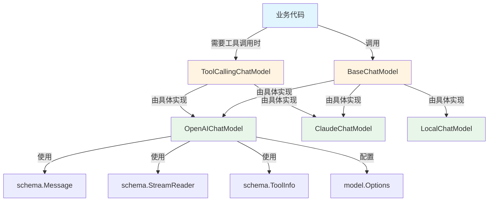

# model_interfaces 模块深度解析

## 1. 问题领域

在构建 AI 应用时，我们面临一个核心挑战：如何以统一的方式与不同的大语言模型（LLM）进行交互？不同的模型提供商（如 OpenAI、Anthropic、本地模型等）有各自独特的 API、工具调用机制和流式输出格式。如果直接在业务代码中与这些不同的 API 耦合，会导致：

- **高度碎片化**：每个模型需要单独的适配器代码
- **难以迁移**：切换模型提供商意味着重写大量业务逻辑
- **重复劳动**：相同的工具绑定、消息格式化等逻辑在多处实现
- **并发安全问题**：某些模型绑定工具的方式可能导致竞态条件

`model_interfaces` 模块的核心使命就是解决这些问题——它定义了一套干净、统一、线程安全的抽象层，让业务代码可以与任何模型提供商交互，而不必关心底层实现细节。

## 2. 核心抽象与心智模型

### 2.1 接口层次结构

本模块的设计采用了**渐进式接口**（progressive interfaces）的模式，这类似于"能力分层"的思想：

```
BaseChatModel（基础聊天能力）
    ↑
    ├─→ ChatModel（已废弃：带工具绑定能力）
    │
    └─→ ToolCallingChatModel（推荐：不可变工具绑定能力）
```

你可以把这想象成不同级别的"驾驶执照"：
- `BaseChatModel` 是基础驾照——只能开车（生成消息）
- `ToolCallingChatModel` 是高级驾照——不仅能开车，还能安全地挂载拖车（工具）

### 2.2 关键设计思想：不可变实例

`ToolCallingChatModel` 的设计体现了一个重要的函数式编程思想：**不可变性**。与已废弃的 `ChatModel.BindTools()` 不同，`WithTools()` 不会修改当前实例，而是返回一个新的实例。这就像字符串操作——`s.Replace()` 返回新字符串，而不是修改原字符串。

这种设计彻底避免了并发场景下的竞态条件，使得同一个模型实例可以在多个 goroutine 中安全使用。

## 3. 架构与数据流

### 3.1 组件关系图



### 3.2 典型数据流

让我们跟踪一次带工具调用的聊天会话的完整数据流：

1. **初始化阶段**：创建 `ToolCallingChatModel` 实例
2. **工具绑定阶段**：调用 `WithTools(tools)` 获得绑定了工具的新实例
3. **生成阶段**：调用 `Generate(ctx, messages, opts...)` 传入消息历史和选项（如温度、最大令牌数等）
4. **模型执行**：具体实现（如 OpenAIChatModel）处理请求，可能调用工具
5. **结果返回**：返回 `*schema.Message`，可能包含工具调用或最终回复

对于流式输出：
1. 调用 `Stream(ctx, messages, opts...)` 
2. 获得 `*schema.StreamReader[*schema.Message]`
3. 业务代码通过读取器逐步获取消息片段

## 4. 核心组件深度解析

### 4.1 BaseChatModel 接口

```go
type BaseChatModel interface {
    Generate(ctx context.Context, input []*schema.Message, opts ...Option) (*schema.Message, error)
    Stream(ctx context.Context, input []*schema.Message, opts ...Option) (
        *schema.StreamReader[*schema.Message], error)
}
```

**设计意图**：这是整个模块的基石，定义了任何聊天模型都必须具备的两种核心能力：

- **Generate**：完整生成——一次性返回完整的回复消息
- **Stream**：流式生成——返回一个读取器，让调用方可以逐步获取输出

**为什么同时需要这两种方法**？
- 完整生成适合简单场景，代码更简洁
- 流式生成适合用户体验要求高的场景，可以"打字机"式显示输出
- 两种模式覆盖了 99% 的使用场景

**参数契约**：
- `ctx`：用于取消、超时和传递上下文信息
- `input`：消息历史，必须是有序的，通常包含系统消息、用户消息、助手回复等
- `opts`：可变参数，用于传递模型特定的选项（如温度、最大令牌数等），通过 [model options](model_options_and_callback_extras.md) 定义

**返回值契约**：
- 成功时返回生成的消息或流式读取器
- 失败时返回错误，错误应该包含足够的调试信息

### 4.2 ToolCallingChatModel 接口

```go
type ToolCallingChatModel interface {
    BaseChatModel

    WithTools(tools []*schema.ToolInfo) (ToolCallingChatModel, error)
}
```

**设计意图**：这是对 `BaseChatModel` 的扩展，添加了工具调用能力。关键设计点在于 `WithTools` 方法的签名。

**为什么返回新实例而不是修改当前实例**？这是整个接口设计中最精妙的决策之一：

1. **并发安全**：多个 goroutine 可以同时使用同一个基础实例，各自绑定不同的工具而互不干扰
2. **可组合性**：可以链式调用，也可以创建"工具模板"实例，在不同场景下复用
3. **可预测性**：没有副作用，相同的输入总是产生相同的输出
4. **易于测试**：可以轻松创建隔离的测试实例，不会影响其他测试

**使用模式**：
```go
// 创建基础模型实例
baseModel := NewOpenAIChatModel(...)

// 为不同场景创建不同的工具绑定实例
searchModel, _ := baseModel.WithTools([]*schema.ToolInfo{searchTool})
calculatorModel, _ := baseModel.WithTools([]*schema.ToolInfo{calcTool})

// 两个实例可以安全地并发使用
go searchModel.Generate(ctx, searchMessages)
go calculatorModel.Generate(ctx, calcMessages)
```

### 4.3 已废弃的 ChatModel 接口

```go
// Deprecated: Please use ToolCallingChatModel interface instead
type ChatModel interface {
    BaseChatModel
    BindTools(tools []*schema.ToolInfo) error
}
```

**为什么被废弃**？`BindTools` 方法会修改实例状态，这在并发场景下是危险的。想象一下：

```go
// 危险！不要这样做！
model.BindTools(toolsA)
go model.Generate(ctx, messagesA)  // 可能使用 toolsA 或 toolsB！
model.BindTools(toolsB)
go model.Generate(ctx, messagesB)
```

这种设计会导致难以调试的竞态条件。`ToolCallingChatModel` 的不可变设计彻底解决了这个问题。

## 5. 依赖关系分析

### 5.1 依赖的模块

`model_interfaces` 模块非常精简，只依赖核心的 schema 模块和 options 模块：

- **[Schema Core Types](schema_core_types.md)**：提供消息结构、工具定义、流式读取器等核心类型
  - `schema.Message`：对话消息的标准表示
  - `schema.ToolInfo`：工具定义的标准格式
  - `schema.StreamReader`：流式输出的抽象
  
- **[Model Options and Callback Extras](model_options_and_callback_extras.md)**：提供模型配置选项
  - `model.Option`：模型选项的函数式封装
  - `model.Options`：模型配置的具体结构

这种极简依赖是精心设计的结果——接口定义应该尽可能少地依赖其他模块，以保持其稳定性和可复用性。

### 5.2 被依赖的模块

这个接口层被整个系统广泛使用：

- **[ADK Agent Interface](adk_agent_interface.md)**：Agent 系统通过这些接口调用模型
- **[ADK ChatModel Agent](adk_chatmodel_agent.md)**：具体的 Agent 实现使用这些接口
- **[Compose Graph Engine](compose_graph_engine.md)**：图执行引擎中的模型节点依赖这些接口
- **各种具体模型实现**：如 OpenAI、Claude、本地模型等都实现了这些接口
- **[Mock Utilities](mock_utilities.md)**：测试框架提供了这些接口的模拟实现（见 [Chat Model Mocks](chat_model_mocks.md)）

## 6. 设计权衡与决策

### 6.1 接口大小：小而美 vs 大而全

**决策**：选择了极简的接口设计，只包含 2-3 个方法。

**权衡**：
- ✅ **优点**：易于实现、易于测试、易于理解、稳定不变
- ❌ **缺点**：某些高级功能（如令牌统计、对数概率等）无法直接通过接口表达

**为什么这样选择**？通过 `Option` 可变参数模式解决了这个矛盾——核心接口保持稳定，高级功能通过选项传递，具体实现可以选择性支持。这在 [Model Options and Callback Extras](model_options_and_callback_extras.md) 中有详细说明。

### 6.2 工具绑定：可变 vs 不可变

**决策**：选择了不可变的 `WithTools` 模式。

**权衡**：
- ✅ **优点**：并发安全、可组合、可预测、易于测试
- ❌ **缺点**：可能创建更多对象（但在现代 Go 运行时中，这个开销几乎可以忽略）

**为什么这样选择**？在 AI 应用中，并发使用模型是常态——同一个模型实例可能服务多个用户请求。并发安全的设计是必须的，而不是可选的。

### 6.3 流式输出：回调 vs 读取器

**决策**：选择了 `schema.StreamReader` 抽象，而不是回调函数。

**权衡**：
- ✅ **优点**：更灵活（可以同步或异步处理）、更容易实现背压、代码更符合 Go 习惯
- ❌ **缺点**：比简单回调稍微复杂一点

**为什么这样选择**？读取器模式给了调用方完全的控制权——他们可以决定何时读取、读取多少、如何处理错误，这对于构建健壮的生产系统至关重要。更多关于流式处理的细节可以参考 [Schema Stream](schema_stream.md)。

## 7. 使用指南与最佳实践

### 7.1 基本使用模式

```go
// 1. 创建模型实例（具体实现的代码）
model := NewSomeChatModel(config)

// 2. 如果需要工具调用，使用 WithTools
if toolModel, ok := model.(ToolCallingChatModel); ok {
    model, err = toolModel.WithTools(tools)
    if err != nil {
        // 处理错误
    }
}

// 3. 生成回复（可以传入选项）
response, err := model.Generate(ctx, messages, 
    option.WithTemperature(0.7),
    option.WithMaxTokens(1000))
if err != nil {
    // 处理错误
}

// 4. 使用回复
fmt.Println(response.Content)
```

### 7.2 流式使用模式

```go
// 获取流式读取器
reader, err := model.Stream(ctx, messages, option.WithTemperature(0.7))
if err != nil {
    // 处理错误
}
defer reader.Close()

// 逐步读取消息
for {
    msg, err := reader.Recv()
    if err == io.EOF {
        break
    }
    if err != nil {
        // 处理错误
    }
    
    // 处理消息片段
    fmt.Print(msg.Content)
}
```

### 7.3 最佳实践

1. **总是进行类型断言**：不要假设所有模型都实现了 `ToolCallingChatModel`，使用类型断言检查
2. **错误处理要健壮**：模型调用可能因为网络、配额、内容过滤等多种原因失败
3. **上下文管理**：总是使用带超时的 context，避免请求无限期挂起
4. **实例复用**：基础模型实例可以安全复用，不必每次都创建新的
5. **选项传递**：使用 `Option` 传递模型特定参数，而不是硬编码，参考 [Model Options](model_options_and_callback_extras.md)
6. **流式资源清理**：总是确保关闭 `StreamReader`，使用 `defer` 是好习惯

## 8. 边缘情况与陷阱

### 8.1 并发陷阱

**❌ 错误做法**：
```go
// 已废弃的 ChatModel，不要这样用！
model.BindTools(tools)
go func() {
    model.Generate(ctx, messages)  // 竞态条件！
}()
```

**✅ 正确做法**：
```go
// 使用 ToolCallingChatModel
modelWithTools, _ := model.WithTools(tools)
go func() {
    modelWithTools.Generate(ctx, messages)  // 安全！
}()
```

### 8.2 工具绑定的生命周期

**陷阱**：`WithTools` 返回的是新实例，不会影响原实例。

```go
// 这样不会改变 baseModel 的工具！
baseModel.WithTools(tools)

// 必须这样做
modelWithTools := baseModel.WithTools(tools)
```

### 8.3 流式读取器的关闭

**陷阱**：忘记关闭 `StreamReader` 可能导致资源泄漏。

**必须使用 `defer reader.Close()`**，即使在错误情况下也要确保关闭。

### 8.4 消息历史的格式

**隐含契约**：`input []*schema.Message` 必须遵循特定的格式：
- 通常以系统消息开头（可选）
- 然后交替出现用户消息和助手消息
- 工具调用和工具结果必须正确配对

如果格式不正确，具体模型实现可能会返回错误或产生意外行为。更多细节请参考 [Schema Core Types](schema_core_types.md)。

### 8.5 选项的兼容性

**陷阱**：不是所有选项都被所有模型支持。

使用选项时要注意，某些选项可能被特定模型忽略或需要特殊处理。应该查阅具体模型实现的文档，了解支持哪些选项。

## 9. 总结

`model_interfaces` 模块是整个系统中最核心的抽象层之一。它通过精心设计的接口，解决了多模型提供商统一接入的难题，同时避免了并发安全问题。

关键要点：
- **极简主义**：接口只包含最核心的能力
- **不可变性**：`WithTools` 返回新实例，确保并发安全
- **渐进式能力**：从基础聊天到工具调用的平滑过渡
- **灵活性**：通过 `Option` 模式支持各种高级功能
- **稳定性**：接口定义简洁，依赖极少，变化缓慢

理解这个模块的设计思想，对于使用和扩展整个系统至关重要——它展示了如何通过良好的接口设计，将复杂的外部系统封装成简洁、安全、易用的抽象。
