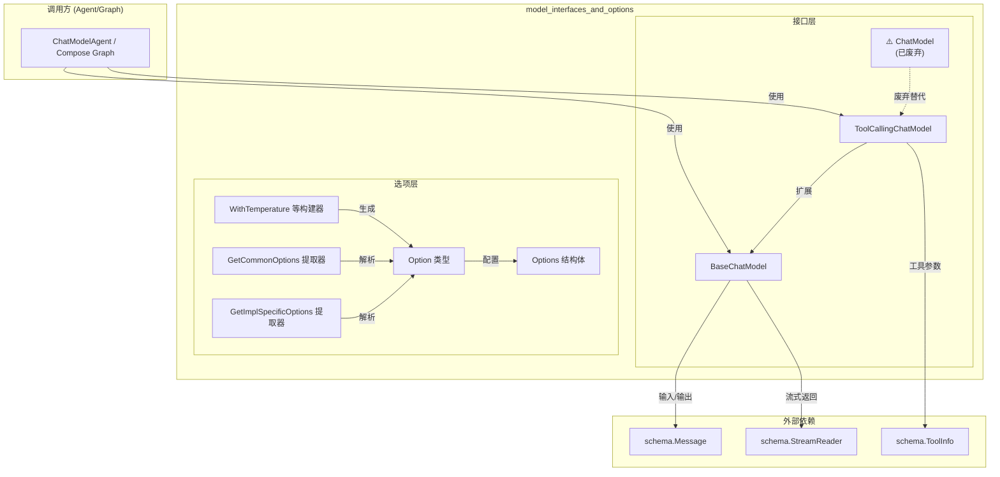

# model_interfaces_and_options 模块

> 本模块是 Eino 框架中大语言模型（LLM）组件的核心契约层 —— 它定义了所有聊天模型实现必须遵循的接口规范，以及配置这些模型的选项模式。

## 1. 问题空间：为什么需要这个模块？

在构建一个支持多种 LLM 提供商的 AI 应用框架时，我们面临一个核心挑战：**如何让上层代码与底层模型实现解耦？**

想象一下：你正在开发一个 AI 助手，最初使用 OpenAI 的 GPT-4。但后来，你需要支持 Anthropic Claude、字节跳动的豆包，或者本地部署的 Llama2。如果每次切换模型都要重写大量业务代码，那将是一场灾难。

`model_interfaces_and_options` 模块解决的就是这个问题。它扮演的角色类似于**电源插座标准**——无论你使用什么品牌的电器（LLM 提供商），只要符合标准接口（BaseChatModel / ToolCallingChatModel），就能正常接入系统。

### 核心问题清单

1. **接口统一**：如何用统一的方式调用不同的 LLM？
2. **参数传递**：如何优雅地传递生成参数（temperature、max_tokens 等）？
3. **工具调用**：如何让模型能够调用外部工具（函数）？
4. **流式输出**：如何处理模型的流式响应？
5. **并发安全**：如何在多线程环境下安全地使用模型？

---

## 2. 架构概览



### 数据流说明

1. **调用方**（Agent 或 Graph 节点）持有 `ToolCallingChatModel` 接口的实现实例
2. 调用方通过 `Option` 函数（如 `WithTemperature(0.7)`）构建配置
3. 调用 `Generate()` 或 `Stream()` 方法，传入消息切片和选项
4. 模型实现解析选项，执行推理，返回 `*schema.Message` 或 `*schema.StreamReader`

### 核心组件一览

| 组件 | 类型 | 职责 |
|------|------|------|
| `BaseChatModel` | 接口 | 定义模型核心能力：Generate 和 Stream |
| `ToolCallingChatModel` | 接口 | 扩展基础接口，增加工具调用能力 |
| `ChatModel` | 接口 | ⚠️ 已废弃，使用 ToolCallingChatModel |
| `Options` | 结构体 | 通用配置容器（Temperature、MaxTokens 等） |
| `Option` | 结构体 | 函数式选项，用于构建 Options |

---

## 3. 核心抽象： mental model

### 3.1 接口设计原则

把这个模块想象成**航空公司的登机口**：

- **BaseChatModel** 是最基本的"登机口" —— 任何飞机（LLM）都能在这里降落，提供**完整输出**和**流式输出**两种方式
- **ToolCallingChatModel** 是**带有廊桥的登机口** —— 飞机降落后，乘客（工具调用请求）可以通过廊桥（工具系统）直接进入航站楼（外部系统）

```go
// 核心接口 - 就像登机口的标准
type BaseChatModel interface {
    Generate(ctx context.Context, input []*schema.Message, opts ...Option) (*schema.Message, error)
    Stream(ctx context.Context, input []*schema.Message, opts ...Option) (*schema.StreamReader[*schema.Message], error)
}

// 扩展接口 - 带廊桥的登机口
type ToolCallingChatModel interface {
    BaseChatModel
    WithTools(tools []*schema.ToolInfo) (ToolCallingChatModel, error)  // 返回新实例，不修改原实例
}
```

### 3.2 选项模式：Function Options

Go 语言没有泛型构造器，也没有 Python 的 keyword arguments。选项模式（Functional Options）是解决"可选参数"问题的优雅方案。

想象你在点一杯咖啡：
- **传统方式**：咖啡店给你一张表格，每个参数都要填（即使是默认值）
- **选项方式**：你只需要说"我要一杯拿铁，牛奶换成豆奶"，店员就知道其他都用默认

```go
// 就像告诉店员"我要什么"
opts := []model.Option{
    model.WithTemperature(0.7),    // 降低随机性
    model.WithMaxTokens(2000),     // 限制输出长度
    model.WithTools(myTools),      // 绑定工具
}

// 底层实现会这样处理
commonOpts := model.GetCommonOptions(nil, opts...)
// commonOpts.Temperature = 0.7
// commonOpts.MaxTokens = 2000
// ...
```

### 3.3 为什么废弃 BindTools？

原代码中的 `BindTools` 方法存在**非原子性问题**：

```
线程1: model.BindTools([tool_A])  // 开始绑定
线程2: model.Generate(...)        // 触发生成，使用 tool_B
线程1: model.tools = [tool_A]     // 绑定完成（覆盖）
// 结果：线程2 使用了错误的工具！
```

`WithTools` 方法通过**返回新实例**而非修改原实例来避免这个问题——这是函数式编程中的 **immutable update** 模式。

---

## 4. 关键设计决策

### 4.1 为什么用指针接收者而非值接收者？

```go
// Options 字段都是指针类型
type Options struct {
    Temperature *float32  // 指针：区分"未设置"和"设置为零值"
    MaxTokens   *int
    // ...
}
```

**理由**：这是一个精心的设计，区分"用户没设置"和"用户设置为零值"两种情况。

```go
// 如果用值类型
type Options struct {
    Temperature float32  // 0.0 是默认值还是用户设置的值？
}

// 指针类型可以这样区分
Temperature: nil    // 用户没设置，使用模型默认值
Temperature: &0.0   // 用户明确设置为 0.0
```

### 4.2 为什么 Options 不直接是 Option 切片？

你可能会问：为什么不直接这样？

```go
// 直观但不灵活的方式
type Options struct {
    Temperature float32
}
// 用户调用
opts := model.Options{Temperature: 0.7}
```

**原因**：这种方式不支持**可选参数**和**扩展性**。

1. **可选参数**：如果用结构体，每个字段都需要指针类型或默认值
2. **扩展性**：如果要添加新参数，所有初始化代码都需要修改
3. **组合性**：选项模式可以动态组合，非常适合中间件和装饰器

### 4.3 为什么区分通用选项和实现特定选项？

```go
// 提取通用选项（所有模型都支持）
commonOpts := model.GetCommonOptions(nil, opts...)

// 提取实现特定选项（如某些模型特有的参数）
myOpts := model.GetImplSpecificOptions(&MyModelOptions{}, opts...)
```

这体现了 **"最小化接口依赖"** 原则：
- 上游代码（如 Agent）只需要知道通用选项
- 下游实现可以自由扩展自己的特殊参数
- 两者通过 `implSpecificOptFn` 桥接，互不污染

---

## 5. 与其他模块的交互

### 5.1 依赖关系

```
model_interfaces_and_options
    │
    ├──→ schema (外部依赖)
    │       ├── schema.Message      # 输入输出消息格式
    │       ├── schema.ToolInfo     # 工具定义
    │       ├── schema.ToolChoice   # 工具选择策略
    │       └── schema.StreamReader # 流式响应
    │
    └──→ 被以下模块使用
            ├── adk/chatmodel.go         # Agent 核心运行时
            ├── compose/graph_*.go       # 图执行引擎
            ├── 各种模型实现 (OpenAI/Claude/豆包等)
            └── callbacks                # 回调系统
```

### 5.2 典型使用模式

```go
// 1. Agent 配置阶段
config := &ChatModelAgentConfig{
    Model: openai.NewChatModel(...),  // 任意实现
}

// 2. Agent 运行阶段
agent.Run(ctx, input, model.WithTemperature(0.7))

// 3. 回调监控
callbacks.RegisterHandler(model.CallbackInput{}, model.CallbackOutput{}, handler)
```

---

## 6. 子模块概览

本模块包含以下逻辑子模块：

| 子模块 | 职责 | 详细说明 |
|--------|------|----------|
| **接口定义** | `BaseChatModel`, `ToolCallingChatModel` | 定义模型的核心契约 |
| **选项构建器** | `WithTemperature`, `WithMaxTokens` 等 | 提供 fluent API 构建选项 |
| **选项提取器** | `GetCommonOptions`, `GetImplSpecificOptions` | 解析选项为配置结构体 |
| **回调载荷** | `CallbackInput`, `CallbackOutput`, `TokenUsage` | 定义模型调用监控数据 |

详细文档：

- [model_interface](model_interface.md) — 接口定义与设计意图
- [model_option](model_option.md) — 选项模式与实现细节

---

## 7. 贡献者注意事项

### 7.1 新增选项的正确姿势

如果你需要为模型添加新参数，**不要**修改 `Options` 结构体然后到处修改代码。正确的做法是：

```go
// 1. 在 Options 中添加字段（如果是通用参数）
type Options struct {
    // ...existing fields...
    // NewField *string  // 谨慎添加
}

// 2. 或者使用实现特定选项（推荐）
type MyModelOption struct {
    CustomField string
}

func WithCustomField(v string) Option {
    return WrapImplSpecificOptFn[MyModelOption](func(m *MyModelOption) {
        m.CustomField = v
    })
}
```

### 7.2 注意事项

1. **nil 安全**：`WithTools(nil)` 会转换为空切片 `[]*schema.ToolInfo{}`，而不是 nil。这是测试用例中明确验证的行为。

2. **线程安全**：如果你实现 `ToolCallingChatModel`，`WithTools` 必须返回**新实例**，不能修改原实例。

3. **选项覆盖顺序**：后添加的选项会覆盖先前的：
   ```go
   model.GetCommonOptions(&Options{Temperature: ptr(1.0)}, WithTemperature(0.5))
   // 结果: Temperature = 0.5
   ```

4. **版本兼容性**：接口使用 Go 的 `go:generate` 注释生成 mock，修改接口后记得重新生成。

---

## 8. 总结

`model_interfaces_and_options` 模块是 Eino 框架的**抽象层基石**：

- 它通过接口抽象了 LLM 的实现差异
- 它通过选项模式提供了灵活的配置能力
- 它通过工具调用扩展让模型具备行动能力

理解这个模块的设计理念，有助于你：
- 正确实现新的模型适配器
- 在上层代码中优雅地使用模型能力
- 扩展框架以支持新的模型特性