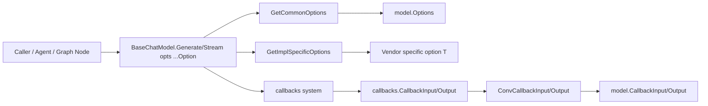

# model_options_and_callback_extras

`model_options_and_callback_extras` 可以理解为 ChatModel 组件的“控制面 + 遥测面”。它不负责真正向模型发请求，而是负责两件更底层但非常关键的事：第一，把一次调用的可选参数（temperature、max tokens、tools 等）组织成可组合、可扩展的 `Option` 机制；第二，把运行时回调中的输入输出统一成结构化 payload（包括 token 用量、配置快照、消息体），让上层编排、观测、计费、调试都能拿到稳定数据。没有这层抽象，调用方会在“每个模型实现都有自己参数形态”和“回调来源不一致”之间反复写胶水代码，系统会很快碎片化。

## 这模块解决的核心问题

从问题空间看，ChatModel 调用有两个天然复杂度。

第一是**参数复杂度**：一部分参数是跨模型共享的（如 `Temperature`、`TopP`、`Stop`），另一部分是模型实现私有参数（vendor-specific）。如果只用一个大 struct，接口会不断膨胀；如果完全交给 `map[string]any`，类型安全、IDE 体验和演进稳定性都会下降。

第二是**回调载荷复杂度**：回调系统 (`callbacks`) 面向通用组件，输入输出是通用 `callbacks.CallbackInput/Output`。但模型域内部需要结构化信息（消息、工具、token 使用、配置等），同时回调可能来自两条路径：

- 组件实现内部主动触发（通常已经是 `*model.CallbackInput` / `*model.CallbackOutput`）
- 图编排层注入触发（可能只有 `[]*schema.Message` 或 `*schema.Message`）

如果没有统一转换层，上层 handler 将充斥类型判断。

本模块的设计 insight 是：**把“共享语义”与“实现差异”拆开，把“通用回调协议”与“模型域语义”桥接起来**。于是就有了 `Option` 双通道（common + impl-specific）和 `ConvCallbackInput/Output` 这组适配函数。

## 心智模型：双轨配置 + 适配器网关

可以把这个模块想象成机场系统：

- `Options` / `Option` 是“标准登机字段 + 特殊旅客备注”
  - 标准字段：所有航班都认（共通参数）
  - 特殊备注：只有特定航空公司认（实现特有参数）
- `ConvCallbackInput` / `ConvCallbackOutput` 是“到港口岸转换柜台”
  - 不管旅客来自国际航站楼还是国内中转，先转换成边检系统可识别的统一格式

这个心智模型有助于理解为什么 `Option` 里同时有 `apply` 和 `implSpecificOptFn`，以及为什么 callback conversion 要容忍多种入参形态。

## 架构与数据流



在调用路径上，`components.model.interface.BaseChatModel` 把 `opts ...Option` 作为标准调用契约暴露出来。模型实现拿到这些 `Option` 后，通常会先用 `GetCommonOptions` 提取共享参数，再用 `GetImplSpecificOptions[T]` 提取实现私有参数。两者共享同一批 `Option`，但通过不同通道解码。

在回调路径上，回调基础设施的输入输出类型是通用接口；`model` 模块通过 `ConvCallbackInput` 和 `ConvCallbackOutput` 把它们“落地”为模型域结构体。特别要注意这两个函数显式兼容了“组件内部触发”和“图节点注入触发”两种来源，这在注释里已经写明，是设计中非常关键的兼容点。

## 组件深潜

## `Options` 与 `Option`：为什么是函数式 option 模式

`Options` 是数据容器，字段采用指针（如 `*float32`, `*int`, `*string`）而不是值类型，目的不是“炫技”，而是保留“是否显式设置”的语义。比如 `Temperature=0` 是合法业务值，不能和“未设置”混为一谈。

`Option` 则是行为容器：

- `apply func(opts *Options)` 负责写入共通字段
- `implSpecificOptFn any` 用于存放实现私有 option 函数（通过泛型解码）

这是一种折中：对调用者仍保持统一 `opts ...Option` 体验；对实现者允许按自己类型 `T` 取私有参数。

### `WithTemperature/WithMaxTokens/WithModel/WithTopP/WithStop`

这组函数都返回 `Option`，本质是在闭包里写入 `Options` 对应字段。没有副作用到全局状态，写入目标只在调用时传入的 `*Options`。

### `WithTools`

`WithTools` 的非显然点在于它会把 `nil` 归一化为空切片 `[]*schema.ToolInfo{}`。这避免下游把“未设置 tools(nil)”和“显式设置为空”混淆，尤其在序列化、比较、以及某些 provider SDK 对 nil/empty 差异敏感时很重要。

### `WithToolChoice`

它同时写 `ToolChoice` 和 `AllowedToolNames`。这说明设计上将“策略”（调用哪个工具）和“约束集合”（允许哪些工具）放在同一 option 原子操作里，减少调用方忘记同步设置两者的概率。

### `WrapImplSpecificOptFn`

这是扩展点核心：`WrapImplSpecificOptFn[T any](func(*T)) Option`。它不污染公共 `Options` 结构，却允许每个模型实现定义自己的 `T` 并注入配置逻辑。

### `GetCommonOptions`

`GetCommonOptions(base *Options, opts ...Option) *Options` 做三件事：

1. `base==nil` 时自动初始化
2. 线性遍历 `opts`
3. 仅执行 `apply != nil` 的 option

它是纯粹聚合器，不做冲突检测。也就是说，重复设置同一字段是“后写覆盖前写”。这是简洁优先的选择。

### `GetImplSpecificOptions[T]`

`GetImplSpecificOptions[T any](base *T, opts ...Option) *T` 会尝试把 `implSpecificOptFn` 断言为 `func(*T)`，断言成功才执行。断言失败直接忽略，不报错。

这背后是“弱耦合容错”策略：多个实现可共享一组 `Option`，不属于当前 `T` 的 option 自动跳过；代价是错误配置可能被静默吞掉，需要测试或更高层校验兜底。

## 回调 extra 结构体：为什么要拆这么细

`CallbackInput` / `CallbackOutput` 是回调的主载荷，`Config` 和 `TokenUsage` 是可复用子结构。

- `Config` 表示调用配置快照（model/max_tokens/temperature/top_p/stop）
- `TokenUsage` 表示计量结果，并细分为 `PromptTokenDetails` 与 `CompletionTokensDetails`
- `CompletionTokensDetails.ReasoningTokens` 专门承接新一代模型的 reasoning 计量能力

这种拆分让 handler 能按需消费：计费系统看 `TokenUsage`，调试系统看 `Config`，审计系统看 `Message` / `Tools`。

## `ConvCallbackInput` 与 `ConvCallbackOutput`：桥接器函数

这两个函数是模块在回调体系中的“网关”。

`ConvCallbackInput(src callbacks.CallbackInput) *CallbackInput`：

- 若 `src` 已是 `*CallbackInput`，直接返回（零拷贝路径）
- 若 `src` 是 `[]*schema.Message`，包装成 `&CallbackInput{Messages: t}`
- 其他类型返回 `nil`

`ConvCallbackOutput(src callbacks.CallbackOutput) *CallbackOutput`：

- 若 `src` 已是 `*CallbackOutput`，直接返回
- 若 `src` 是 `*schema.Message`，包装成 `&CallbackOutput{Message: t}`
- 其他类型返回 `nil`

从注释可见，这正对应了两条实际触发链路：组件内部触发 vs graph node 注入触发。

## 依赖分析（调用与被调用）

本模块对外部依赖很克制，主要依赖两个基础包：

- `schema`：承载 `Message`、`ToolInfo`、`ToolChoice` 等领域对象
- `callbacks`：承载通用回调输入输出接口

从契约关系看，`BaseChatModel.Generate/Stream` 的签名使用 `opts ...Option`，这意味着所有模型调用方（包括 agent 与 compose 层）都通过本模块的 option 机制传递参数；而回调模板层中存在 `ModelCallbackHandler`，其字段类型直接使用 `*model.CallbackInput` / `*model.CallbackOutput`，说明本模块定义的 callback payload 是模型观测面的标准数据契约。

另外，`ToolCallingChatModel` 在 `BaseChatModel` 基础上增加 `WithTools`，这与 `Options.Tools`/`WithTools` 形成两条并行能力：一种是“调用时 option 传 tools”，另一种是“返回绑定工具的新模型实例”。这不是重复，而是分别服务“临时调用上下文”与“实例级复用绑定”。

## 设计权衡与取舍

这里有几处很典型的工程取舍。

第一，`implSpecificOptFn any + type assertion` 选择了**灵活性优先**。优点是统一 option 管道、扩展低成本；缺点是类型错误时静默忽略，不如显式接口严格。

第二，`GetCommonOptions` / `GetImplSpecificOptions` 都采用原地修改 `base`，选择了**低分配与简单实现**，但也要求调用方理解对象可变语义，避免把同一个 `base` 在并发场景下复用。

第三，callback conversion 对未知类型返回 `nil`，选择了**兼容性优先**而非强失败。这让跨层注入更稳健，但 handler 必须处理 nil，避免空指针。

第四，`Options` 大量使用指针字段，选择了**语义精确性**（unset vs zero）而非结构体简洁性。

## 如何使用（实践示例）

```go
// common options
resp, err := chatModel.Generate(ctx, msgs,
    model.WithModel("gpt-4o"),
    model.WithTemperature(0.2),
    model.WithMaxTokens(1024),
    model.WithTopP(0.9),
    model.WithStop([]string{"<END>"}),
)
```

```go
// provider-specific options through WrapImplSpecificOptFn
// 假设实现方定义了 type ProviderOpts struct { TimeoutMs int }
resp, err := chatModel.Generate(ctx, msgs,
    model.WrapImplSpecificOptFn(func(o *ProviderOpts) {
        o.TimeoutMs = 30000
    }),
)

// 在实现内部提取：
// common := model.GetCommonOptions(nil, opts...)
// impl   := model.GetImplSpecificOptions(&ProviderOpts{TimeoutMs: 10000}, opts...)
```

```go
// callback conversion usage (通常在 handler/template 内部)
func handleStart(in callbacks.CallbackInput) {
    mi := model.ConvCallbackInput(in)
    if mi == nil {
        return // 未知来源，选择忽略或记录日志
    }
    // 使用 mi.Messages / mi.Tools / mi.Config
}
```

## 新贡献者最容易踩的坑

最常见的问题是把 `GetImplSpecificOptions[T]` 当作“强类型校验器”。它其实不是：类型不匹配会被忽略。若你新增了 impl-specific option，建议加单测验证该 option 在目标 `T` 上确实生效。

第二个坑是误把 `nil` tools 当成“等价空数组”。`WithTools` 已经做了归一化，但如果你绕过它直接写 `Options.Tools=nil`，下游语义可能变化。

第三个坑是 callback conversion 返回 `nil` 没有报错。新增回调触发路径时，务必确认传入类型是 `*model.CallbackInput` / `[]*schema.Message`（输出同理），否则 handler 可能悄悄失去观测数据。

第四个坑是可变 `base` 对象复用。`GetCommonOptions` 与 `GetImplSpecificOptions` 都会修改传入 `base`；不要在并发请求之间共享同一个 base 实例。

## 与其他模块的关系（参考阅读）

建议结合以下文档一起看，能更完整理解它在系统里的位置：

- [component_interfaces](component_interfaces.md)：`BaseChatModel` / `ToolCallingChatModel` 的调用契约
- [callbacks_system](callbacks_system.md)：回调生命周期与 handler 机制
- [tool_options_callback_and_function_adapters](tool_options_callback_and_function_adapters.md)：对比 tool 侧 option/callback 设计
- [embedding_retriever_indexer_options_and_callbacks](embedding_retriever_indexer_options_and_callbacks.md)：横向对比其他组件的 options & callback extra 方案

总体上，这个模块不是“功能大户”，而是“系统稳定器”：它用很小的代码面积，把模型调用的可配置性、可观测性和跨层兼容性固定成统一契约。对大规模演进来说，这类模块的价值通常远高于其代码行数。