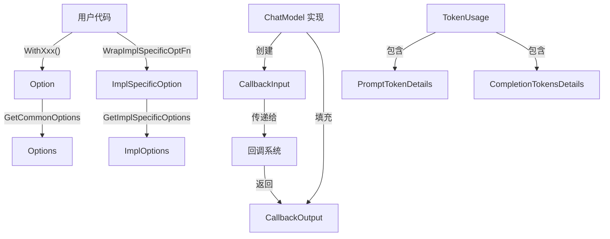

# Model Options & Callbacks (模型配置与回调)

## 一、问题空间与存在意义

在大型语言模型（LLM）集成系统中，模型调用配置和执行上下文传递是两个核心挑战。直接将所有配置参数作为函数参数传递会导致接口爆炸，而使用通用 `map[string]any` 又会失去类型安全。同时，在模型执行前后需要收集执行上下文（如输入消息、token 使用统计）用于监控、调试或后处理，但又不能污染核心模型调用接口。

`model_options_and_callbacks` 模块正是为了解决这两个问题而设计的：
1. **统一的模型配置机制**：提供类型安全的、可扩展的模型调用选项系统
2. **标准的回调上下文契约**：定义模型执行前后的上下文数据结构，与回调系统无缝集成

## 二、核心概念与心智模型

可以将这个模块想象成 **"模型的控制面板和飞行数据记录器"**：

- **Options** 是控制面板上的旋钮和开关（温度、最大 token 数等）
- **Option** 函数式选项是调整这些旋钮的操作
- **CallbackInput** 是起飞前记录的飞行参数（输入消息、配置等）
- **CallbackOutput** 是降落后的飞行日志（生成结果、token 使用情况等）
- **Config** 是飞行配置快照
- **TokenUsage** 是燃油消耗报告

这种设计实现了关注点分离：核心模型调用接口保持简洁，而配置和上下文通过辅助机制传递。

## 三、架构与数据流向



### 数据流向详解

1. **选项配置流程**：
   - 用户通过 `WithTemperature`、`WithModel` 等函数创建 `Option` 实例
   - 这些 `Option` 被传递给模型调用方法（如 `Generate` 或 `Stream`）
   - 模型内部通过 `GetCommonOptions` 提取通用配置到 `Options` 结构体
   - 同时通过 `GetImplSpecificOptions` 提取特定实现的配置

2. **回调上下文流程**：
   - 模型执行前，创建 `CallbackInput` 包含输入消息、工具配置等
   - 执行后，创建 `CallbackOutput` 包含生成结果、token 使用统计
   - 通过 `ConvCallbackInput` 和 `ConvCallbackOutput` 与通用回调系统适配

## 四、核心组件深度解析

### 4.1 `Options` 结构体

`Options` 是模型调用的通用配置中心，聚合了所有 LLM 调用的常见参数：

```go
type Options struct {
    Temperature *float32       // 控制随机性
    MaxTokens *int             // 最大生成 token 数
    Model *string              // 模型名称
    TopP *float32              // 核采样参数
    Stop []string              // 停止词
    Tools []*schema.ToolInfo   // 可用工具列表
    ToolChoice *schema.ToolChoice  // 工具选择策略
    AllowedToolNames []string  // 允许调用的工具名称子集
}
```

**设计亮点**：所有字段都使用指针类型，这样可以区分"未设置"和"设置为零值"两种状态。这对于合并默认配置和用户配置至关重要。例如，`Temperature` 为 `nil` 表示未设置，而为 `ptr(0.0)` 表示显式设置为 0。

### 4.2 `Option` 结构体与函数式选项模式

`Option` 采用了函数式选项模式，这是 Go 语言中处理可选参数的经典方案：

```go
type Option struct {
    apply func(opts *Options)  // 通用选项应用函数
    implSpecificOptFn any       // 实现特定选项函数
}
```

每个 `WithXxx` 函数创建一个包含相应 `apply` 函数的 `Option`：

```go
func WithTemperature(temperature float32) Option {
    return Option{
        apply: func(opts *Options) {
            opts.Temperature = &temperature
        },
    }
}
```

**设计权衡**：这种模式相比结构体选项更灵活，允许增量配置；相比变长参数列表更类型安全。但缺点是代码量稍多，且需要额外的解析步骤。

### 4.3 配置提取函数

#### `GetCommonOptions`
```go
func GetCommonOptions(base *Options, opts ...Option) *Options
```

这个函数是选项系统的核心，它：
1. 接受一个可选的基础配置（含默认值）
2. 遍历所有选项，依次应用它们的 `apply` 函数
3. 返回合并后的配置

**使用场景**：模型实现内部使用此函数提取通用配置。

#### `GetImplSpecificOptions`
```go
func GetImplSpecificOptions[T any](base *T, opts ...Option) *T
```

这是一个泛型函数，用于提取特定实现的选项：
1. 通过类型断言检查 `implSpecificOptFn` 是否匹配目标类型
2. 只应用类型匹配的选项函数
3. 保留其他选项不变

**设计意图**：这使得不同模型实现可以有自己的特定配置，同时共享同一套选项传递机制。例如，OpenAI 实现可以有 `WithAPIKey` 选项，而 Ollama 实现可以有 `WithEndpoint` 选项，两者互不干扰。

### 4.4 回调数据结构

#### `CallbackInput`
```go
type CallbackInput struct {
    Messages []*schema.Message  // 输入消息列表
    Tools []*schema.ToolInfo    // 可用工具
    ToolChoice *schema.ToolChoice  // 工具选择策略
    Config *Config              // 模型配置快照
    Extra map[string]any        // 扩展字段
}
```

这是模型执行前的上下文快照，包含了调用模型所需的所有关键信息。

#### `CallbackOutput`
```go
type CallbackOutput struct {
    Message *schema.Message     // 模型生成的消息
    Config *Config              // 实际使用的配置
    TokenUsage *TokenUsage      // Token 使用统计
    Extra map[string]any        // 扩展字段
}
```

这是模型执行后的结果上下文，包含了生成的内容和执行元数据。

### 4.5 Token 使用统计

```go
type TokenUsage struct {
    PromptTokens int                      // 提示 token 数
    PromptTokenDetails PromptTokenDetails // 提示 token 明细
    CompletionTokens int                  // 完成 token 数
    TotalTokens int                       // 总 token 数
    CompletionTokensDetails CompletionTokensDetails  // 完成 token 明细
}

type CompletionTokensDetails struct {
    ReasoningTokens int  // 模型用于推理的 token 数
}
```

特别值得注意的是 `CompletionTokensDetails` 中的 `ReasoningTokens` 字段，它专门用于支持具有推理能力的模型（如 OpenAI o1、Gemini 等）。这种设计体现了框架对前沿模型特性的前瞻性支持。

### 4.6 回调转换函数

```go
func ConvCallbackInput(src callbacks.CallbackInput) *CallbackInput
func ConvCallbackOutput(src callbacks.CallbackOutput) *CallbackOutput
```

这两个函数是与通用回调系统的桥梁，它们处理两种情况：
1. 已经是类型化的 `*CallbackInput`/`*CallbackOutput`（直接返回）
2. 原始接口类型（如 `[]*schema.Message` 或 `*schema.Message`，需要包装）

**设计原因**：回调可能从两个地方触发——组件内部（类型化）或图节点注入（原始接口），这个函数统一了处理逻辑。

## 五、依赖关系分析

### 5.1 输入依赖（此模块依赖什么）

- **`schema` 包**：依赖 `schema.Message`、`schema.ToolInfo`、`schema.ToolChoice` 等核心数据结构
- **`callbacks` 包**：依赖 `callbacks.CallbackInput` 和 `callbacks.CallbackOutput` 接口

### 5.2 输出依赖（什么依赖此模块）

- **`BaseChatModel` 接口**：所有模型实现都使用这些选项和回调类型
- **回调处理器**：如 `ModelCallbackHandler` 会消费 `CallbackInput` 和 `CallbackOutput`
- **图引擎**：在图节点级别注入回调时会使用这些类型

## 六、设计决策与权衡

### 6.1 函数式选项 vs 结构体选项

**选择**：函数式选项模式  
**原因**：
- 更好的向后兼容性（添加新选项不需要修改调用代码）
- 支持增量配置（可以先应用默认选项，再覆盖特定选项）
- 更自然地支持可选参数（不需要指针来表示"未设置"）

**权衡**：
- 代码量稍多（每个选项都需要一个 `WithXxx` 函数）
- 运行时开销（多个函数调用，虽然很小）
- 选项定义分散（不在一个地方）

### 6.2 指针字段 vs `Optional<T>` 类型

**选择**：指针字段  
**原因**：Go 语言没有内置的 `Optional<T>` 类型，指针是最自然的替代方案

**权衡**：
- 优点：简单、无需额外依赖
- 缺点：需要小心 nil 解引用，且零值和"未设置"的区别不够直观

### 6.3 分离通用选项和实现特定选项

**选择**：通过 `implSpecificOptFn` 字段和 `GetImplSpecificOptions` 泛型函数实现  
**原因**：
- 保持通用接口简洁
- 允许不同实现有自己的特殊配置
- 避免了接口污染

**权衡**：
- 类型安全在运行时检查（通过类型断言）
- 实现特定选项的定义分散在各实现中

### 6.4 回调数据结构包含完整上下文

**选择**：`CallbackInput` 和 `CallbackOutput` 包含完整的执行上下文  
**原因**：
- 回调处理器可能需要任何这些信息
- 避免了后续需要添加新字段时的破坏性变更
- 支持调试和监控场景

**权衡**：
- 内存占用稍大（即使回调不需要所有字段）
- 创建这些结构有轻微的性能开销

## 七、使用指南与常见模式

### 7.1 基本选项使用

```go
// 创建选项
opts := []model.Option{
    model.WithTemperature(0.7),
    model.WithMaxTokens(1000),
    model.WithModel("gpt-4"),
}

// 调用模型
result, err := chatModel.Generate(ctx, messages, opts...)
```

### 7.2 模型实现内部提取选项

```go
// 在模型实现内部
func (m *MyModel) Generate(ctx context.Context, messages []*schema.Message, opts ...model.Option) (*schema.Message, error) {
    // 提取通用选项
    commonOpts := model.GetCommonOptions(nil, opts...)
    
    // 使用选项
    if commonOpts.Temperature != nil {
        // 设置温度
    }
    
    // ... 其余实现
}
```

### 7.3 带默认值的选项

```go
// 定义默认配置
defaults := &model.Options{
    Temperature: ptr(float32(0.5)),
    MaxTokens:   ptr(500),
}

// 应用用户选项覆盖默认值
finalOpts := model.GetCommonOptions(defaults, userOpts...)
```

### 7.4 实现特定选项

```go
// 定义实现特定的配置结构
type MyModelOptions struct {
    SpecialFeature bool
    APIKey         string
}

// 创建实现特定选项的函数
func WithSpecialFeature(enabled bool) model.Option {
    return model.WrapImplSpecificOptFn(func(opts *MyModelOptions) {
        opts.SpecialFeature = enabled
    })
}

// 在模型实现内部提取
myOpts := &MyModelOptions{
    SpecialFeature: false, // 默认值
}
myOpts = model.GetImplSpecificOptions(myOpts, opts...)
```

### 7.5 回调处理

```go
// 在模型实现中触发回调
func (m *MyModel) Chat(ctx context.Context, messages []*schema.Message, opts ...model.Option) (*schema.Message, error) {
    // 准备回调输入
    cbInput := &model.CallbackInput{
        Messages: messages,
        Config: &model.Config{
            Temperature: 0.7,
            // ... 其他配置
        },
    }
    
    // 触发开始回调
    var cbOutput *model.CallbackOutput
    ctx = callbacks.OnStart(ctx, cbInput)
    
    // ... 执行模型调用 ...
    
    // 准备回调输出
    cbOutput = &model.CallbackOutput{
        Message: resultMsg,
        TokenUsage: &model.TokenUsage{
            PromptTokens:     100,
            CompletionTokens: 50,
            TotalTokens:      150,
        },
    }
    
    // 触发结束回调
    callbacks.OnEnd(ctx, cbOutput)
    
    return resultMsg, nil
}
```

## 八、边缘情况与注意事项

### 8.1 空选项处理

- `GetCommonOptions(nil)` 会返回一个空的 `Options` 结构体，所有字段都是 nil
- 传递空的 `opts` 切片不会修改基础配置
- `WithTools(nil)` 会被转换为空切片，而不是保留 nil

### 8.2 实现特定选项的类型安全

- `GetImplSpecificOptions` 使用类型断言，类型不匹配的选项会被静默忽略
- 这可能导致调试困难——如果选项没有生效，首先检查类型是否匹配
- 建议在实现特定的 `WithXxx` 函数中添加文档说明它们只能用于特定模型

### 8.3 回调转换的限制

- `ConvCallbackInput` 和 `ConvCallbackOutput` 只处理两种情况：完全匹配的类型或原始接口类型
- 其他类型会返回 nil，回调处理器需要处理这种情况
- 建议在回调处理器中始终检查返回值是否为 nil

### 8.4 Token 统计的兼容性

- 不是所有模型都支持所有 token 统计字段（如 `ReasoningTokens`）
- 不支持的字段应该保持为 0，而不是返回错误
- 消费 token 统计的代码应该优雅处理字段为 0 的情况

## 九、扩展与定制点

### 9.1 添加新的通用选项

1. 在 `Options` 结构体中添加新字段（指针类型）
2. 创建对应的 `WithXxx` 函数
3. 如果需要，在 `Config` 结构体中添加对应字段（非指针，因为这是快照）
4. 在 `CallbackInput` 或 `CallbackOutput` 中适当位置添加

### 9.2 创建自定义回调数据

- 使用 `CallbackInput.Extra` 和 `CallbackOutput.Extra` 字段传递自定义数据
- 注意这些字段是 `map[string]any`，类型安全需要自己保证
- 建议在组件文档中明确定义这些扩展字段的结构

### 9.3 实现新的模型组件

新模型实现应该：
1. 使用 `GetCommonOptions` 提取通用配置
2. 定义自己的实现特定选项结构，使用 `WrapImplSpecificOptFn` 和 `GetImplSpecificOptions`
3. 在执行前后创建适当的 `CallbackInput` 和 `CallbackOutput`
4. 尽可能填充 `TokenUsage` 信息

## 十、相关模块参考

- [Schema Core Types](schema_core_types.md)：定义了 `Message`、`ToolInfo` 等核心数据结构
- [Callbacks System](callbacks_system.md)：回调系统的实现，处理回调的注册和触发
- [Component Interfaces](component_interfaces.md)：`BaseChatModel` 接口定义，使用这些选项和回调类型
