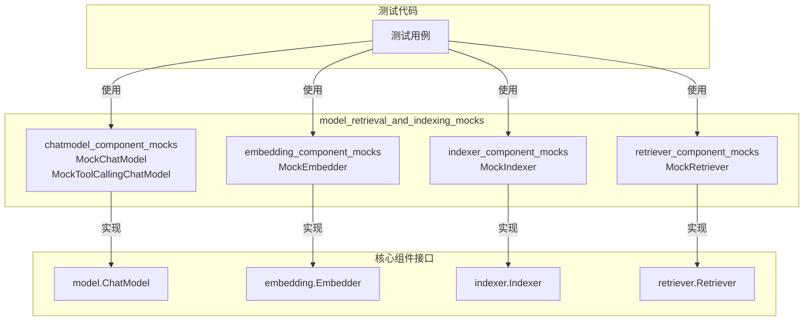

# model_retrieval_and_indexing_mocks 模块技术文档

## 概述

`model_retrieval_and_indexing_mocks` 模块是一套专门为测试设计的模拟组件集合，它为 AI 应用开发中的核心组件（模型、嵌入、索引器和检索器）提供了完整的模拟实现。在开发和测试过程中，你不需要调用真实的 API 或连接外部服务，就能验证你的业务逻辑是否正确。

想象一下，如果你正在构建一个智能问答系统，每次测试都要调用真实的 OpenAI API 和向量数据库，不仅成本高昂，而且测试速度慢，还受网络环境影响。这个模块就像一个"电影片场"，所有的"演员"（组件）都是专业的替身，它们按照剧本（你的测试预期）表演，让你能够专注于验证"导演"（你的业务逻辑）的工作，而不用担心"演员"的真实表现。

## 架构概览



这个模块基于 Go 语言的 `gomock` 框架生成，提供了四个核心子模块：

1. **chatmodel_component_mocks**：模拟聊天模型，支持普通对话和工具调用
2. **embedding_component_mocks**：模拟文本嵌入功能
3. **indexer_component_mocks**：模拟文档索引存储
4. **retriever_component_mocks**：模拟文档检索功能

每个模拟组件都遵循对应的接口契约，并且提供了强大的录制和回放功能，让你能够精确控制测试场景。

## 核心设计理念

### 为什么选择 gomock？

在设计这个模块时，团队考虑了多种模拟方案：

| 方案 | 优点 | 缺点 |
|------|------|------|
| 手写模拟实现 | 简单直接，易于理解 | 维护成本高，灵活性差 |
| 使用接口默认实现 | 无需额外依赖 | 无法灵活控制行为，难以验证调用 |
| **gomock 生成** | 完整的接口实现，强大的录制/回放功能 | 学习曲线稍陡 |

最终选择 gomock 的原因是：
- **完整性**：自动生成完整的接口实现，不会遗漏任何方法
- **灵活性**：支持任意返回值、任意次数的调用、按顺序调用等复杂场景
- **验证能力**：可以精确验证方法是否被调用、调用次数、调用参数等

### 组件设计模式

每个模拟组件都遵循相同的设计模式：

```
MockComponent (实现真实接口)
    ↓ 持有
MockRecorder (录制期望)
    ↓ 生成
gomock.Call (控制调用行为)
```

这种设计让你能够：
1. 创建模拟对象
2. 通过 `EXPECT()` 方法设置期望
3. 在测试中使用模拟对象
4. 自动验证期望是否满足

## 关键设计决策

### 1. 完全生成，不手动修改

**决策**：所有模拟代码都通过 `mockgen` 命令自动生成，不进行任何手动修改。

**原因**：
- 保证与真实接口的一致性
- 当接口变更时，只需重新生成即可
- 避免手动修改引入的错误

**影响**：
- 你不能在模拟代码中添加自定义逻辑
- 所有自定义行为都通过 gomock 的 API 在测试用例中设置
- 保持了模拟代码的纯净性和可维护性

### 2. 分离的录制器模式

**决策**：每个模拟组件都有一个对应的 `MockRecorder`，通过 `EXPECT()` 方法访问。

**原因**：
- 清晰的关注点分离：模拟对象负责实现接口，录制器负责设置期望
- 链式调用的便利性：`mock.EXPECT().Method().Return(...)`
- 符合 gomock 的惯用模式

### 3. 支持所有接口变体

**决策**：为每个相关接口都生成模拟实现，包括基础接口和扩展接口。

**例子**：
- `MockBaseChatModel`：基础聊天模型
- `MockChatModel`：支持工具绑定的聊天模型
- `MockToolCallingChatModel`：支持工具调用的聊天模型

**原因**：
- 覆盖所有使用场景
- 让测试能够精确模拟所需的接口类型
- 避免"为了测试而修改代码"的反模式

## 子模块概览

本模块包含四个主要子模块，每个子模块专注于模拟一类核心组件：

### [embedding_component_mocks](internal_runtime_and_mocks-model_retrieval_and_indexing_mocks-embedding_component_mocks.md)
提供 `MockEmbedder` 模拟实现，用于测试需要文本嵌入功能的代码。支持模拟 `EmbedStrings` 方法，可控制返回的嵌入向量和错误。

### [indexer_component_mocks](internal_runtime_and_mocks-model_retrieval_and_indexing_mocks-indexer_component_mocks.md)
提供 `MockIndexer` 模拟实现，用于测试文档索引功能。支持模拟 `Store` 方法，可控制返回的文档 ID 和错误。

### [chatmodel_component_mocks](internal_runtime_and_mocks-model_retrieval_and_indexing_mocks-chatmodel_component_mocks.md)
提供多个聊天模型模拟实现，包括 `MockBaseChatModel`、`MockChatModel` 和 `MockToolCallingChatModel`。支持模拟 `Generate`、`Stream`、`BindTools` 和 `WithTools` 等方法。

### [retriever_component_mocks](internal_runtime_and_mocks-model_retrieval_and_indexing_mocks-retriever_component_mocks.md)
提供 `MockRetriever` 模拟实现，用于测试文档检索功能。支持模拟 `Retrieve` 方法，可控制返回的文档列表和错误。

## 与其他模块的关系

`model_retrieval_and_indexing_mocks` 模块是一个测试支持模块，它与其他模块的关系主要是：

### 依赖的模块
- 核心组件接口模块：
  - [components_core-model_and_prompting-model_interfaces_and_options](components_core-model_and_prompting-model_interfaces_and_options.md)：提供模型接口定义
  - [components_core-embedding_indexing_and_retrieval_primitives](components_core-embedding_indexing_and_retrieval_primitives.md)：提供嵌入、索引器和检索器接口定义
- [schema_models_and_streams](schema_models_and_streams.md)：提供文档和消息的数据结构

### 被依赖的模块
- 测试模块：各种需要模拟组件的测试用例
- [adk_prebuilt_agents](adk_prebuilt_agents.md)：预构建代理的测试
- [flow_agents_and_retrieval](flow_agents_and_retrieval.md)：流程代理和检索功能的测试

## 实用指南

### 基本使用模式

使用这些模拟组件的基本步骤如下：

```go
import (
    "testing"
    "go.uber.org/mock/gomock"
    modelmock "github.com/cloudwego/eino/internal/mock/components/model"
)

func TestMyFunction(t *testing.T) {
    // 1. 创建 gomock 控制器
    ctrl := gomock.NewController(t)
    defer ctrl.Finish() // 确保所有期望都被验证
    
    // 2. 创建模拟对象
    mockModel := modelmock.NewMockChatModel(ctrl)
    
    // 3. 设置期望
    mockModel.EXPECT().
        Generate(gomock.Any(), gomock.Any()).
        Return(expectedMessage, nil).
        Times(1)
    
    // 4. 将模拟对象注入到被测试的代码中
    myComponent := NewMyComponent(mockModel)
    
    // 5. 执行测试
    result := myComponent.DoSomething()
    
    // 6. 验证结果（gomock 会在 ctrl.Finish() 时自动验证期望）
    assert.Equal(t, expectedResult, result)
}
```

### 常见场景示例

#### 场景 1：模拟错误返回

```go
mockEmbedder.EXPECT().
    EmbedStrings(gomock.Any(), gomock.Any()).
    Return(nil, errors.New("embedding failed"))
```

#### 场景 2：验证特定参数

```go
mockIndexer.EXPECT().
    Store(gomock.Any(), gomock.Len(2)). // 验证文档数量为 2
    Return([]string{"id1", "id2"}, nil)
```

#### 场景 3：按顺序返回不同结果

```go
gomock.InOrder(
    mockRetriever.EXPECT().Retrieve(gomock.Any(), "query1").Return([]*schema.Document{doc1}, nil),
    mockRetriever.EXPECT().Retrieve(gomock.Any(), "query2").Return([]*schema.Document{doc2}, nil),
)
```

### 新开发者注意事项

1. **不要修改生成的代码**：所有模拟代码都是自动生成的，修改会在下次重新生成时丢失。

2. **记住调用 `ctrl.Finish()`**：使用 `defer ctrl.Finish()` 确保所有期望都被验证。

3. **精确设置期望**：使用 `gomock.Any()` 匹配任意参数，使用 `gomock.Eq()` 匹配精确值，使用 `gomock.Len()` 匹配长度等。

4. **注意调用次数**：默认情况下，期望的方法至少被调用一次。使用 `Times(n)` 精确指定调用次数，使用 `MaxTimes(n)` 或 `MinTimes(n)` 指定范围。

5. **理解接口层次**：聊天模型有多个接口变体，确保使用正确的模拟类型。

## 总结

`model_retrieval_and_indexing_mocks` 模块是测试 AI 应用的强大工具。它通过提供完整的模拟实现，让你能够：
- 快速编写可靠的测试
- 精确控制测试场景
- 验证组件交互
- 避免依赖外部服务

虽然这些模拟组件本身很简单，但它们是构建高质量、可测试代码的基础。通过正确使用这些模拟组件，你可以构建出更加健壮、易于维护的 AI 应用。
