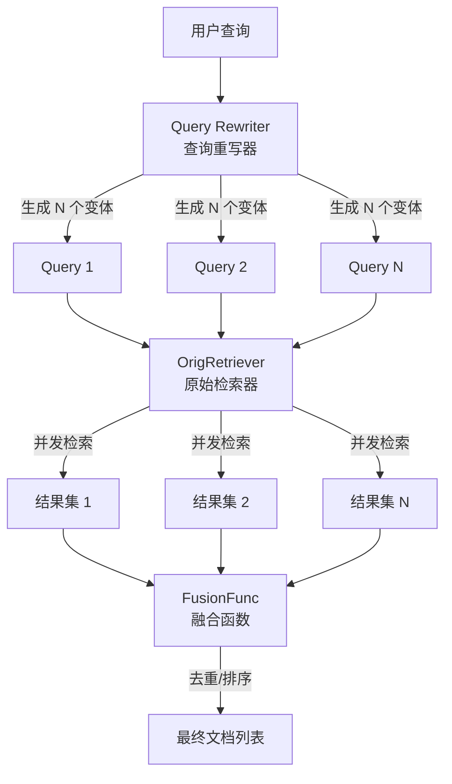

# MultiQuery Retriever 深度解析

想象一下，你正在图书馆找一本关于"如何构建 AI 智能体"的书。你只问了管理员一次，但管理员其实帮你用不同方式问了多个问题："AI 智能体构建指南"、"如何开发 autonomous agents"、"大模型应用开发教程"。然后她从不同书架收集了所有相关书籍，去掉重复的后一起给你。这就是 MultiQuery Retriever 的核心思想——**通过生成查询的多个变体，从多个角度召回文档，解决单一查询召回不足的问题**。

在 RAG（检索增强生成）系统中，用户的原始查询往往不够完善：可能用词太具体、太模糊，或者缺少同义词覆盖。MultiQuery Retriever 不直接拿原始查询去检索，而是先通过一个重写阶段（Rewriting Phase）将查询扩展成多个语义相近但表达方式不同的变体，然后并发检索，最后融合去重。这是一个典型的"以计算换召回"（compute-for-recall）的策略。

---

## 架构概览



### 核心角色

**1. Query Rewriter（查询重写器）**

这是模块的"大脑"。它可以是两种形态：
- **LLM 驱动**：通过 ChatModel + PromptTemplate 生成查询变体。默认使用 Jinja2 模板，提示模型从多角度重写查询。
- **自定义 Handler**：用户提供的纯函数 `(ctx, query) -> []queries`，适合已有同义词表或特定业务规则的场景。

**2. OrigRetriever（原始检索器）**

被装饰的基础检索器，负责实际的文档检索。MultiQuery Retriever 本身不直接访问向量数据库或搜索引擎，而是通过组合已有的检索器来增强能力。

**3. FusionFunc（融合函数）**

将多个查询的检索结果合并成一个有序列表。默认实现按 Document ID 去重，但用户可以自定义复杂的重排序（Reranking）或加权融合策略。

---

## 组件详解

### `Config` 配置结构

```go
type Config struct {
    // ===== 重写策略（二选一）=====
    // 方案 A：LLM 驱动重写
    RewriteLLM      model.ChatModel
    RewriteTemplate prompt.ChatTemplate  // 默认提供
    QueryVar        string               // 模板变量名，默认 "query"
    LLMOutputParser func(context.Context, *schema.Message) ([]string, error)
    
    // 方案 B：自定义逻辑
    RewriteHandler func(ctx context.Context, query string) ([]string, error)
    
    // 限制生成的查询数量，防止 LLM 生成过多查询导致成本爆炸，默认 5
    MaxQueriesNum int
    
    // ===== 检索与融合 =====
    OrigRetriever retriever.Retriever     // 必需，基础检索器
    FusionFunc    func(ctx context.Context, docs [][]*schema.Document) ([]*schema.Document, error)
}
```

**设计决策分析：**

1. **LLM vs Handler 的二选一设计**
   - 这种设计体现了**渐进式复杂性**（progressive disclosure）思想。简单场景用 LLM 零配置启动，复杂场景通过 Handler 完全接管。
   - 优先使用 Handler（如果提供），因为 Handler 是确定性的、可预测的，而 LLM 可能不稳定。

2. **MaxQueriesNum 的必要性**
   - LLM 可能生成无限多的查询变体（"还有吗？还有吗？"），必须设置上限防止成本失控。
   - 为什么是 5？经验法则：太少覆盖不足，太多边际收益递减且成本线性增长。

3. **FusionFunc 的可插拔性**
   - 检索结果的融合是一个高度业务相关的操作。有的场景需要去重即可，有的需要 BM25 重排，有的需要按置信度加权。
   - 默认的 `deduplicateFusion` 只按 ID 去重，保证**幂等性**（同一文档不会出现两次）。

### `multiQueryRetriever` 实现

```go
type multiQueryRetriever struct {
    queryRunner   compose.Runnable[string, []string]  // 重写链
    maxQueriesNum int
    origRetriever retriever.Retriever
    fusionFunc    func(ctx context.Context, docs [][]*schema.Document) ([]*schema.Document, error)
}
```

**关键洞察：** 使用 `compose.Runnable` 作为 `queryRunner` 的内部类型，而非直接调用 LLM，这使得重写逻辑可以被**编译优化**（通过 `compose.Chain.Compile()`）。Compose 框架可以进行图优化、并行化、甚至分布式执行。

### `NewRetriever` 构造流程

构造过程是**声明式**（declarative）的：根据配置声明一个处理链，然后编译成可执行的 Runner。

```go
// 伪代码展示构造逻辑
if 使用自定义 Handler {
    chain.AppendLambda(Handler)
} else {
    chain.AppendLambda(Converter)      // string -> map[string]any
         .AppendChatTemplate(tpl)       // 填充提示词
         .AppendChatModel(llm)          // LLM 调用
         .AppendLambda(Parser)          // Message -> []string
}
```

这里利用了 [Compose Graph Engine](compose_graph_engine.md) 的链式 API。每个 `Append` 添加一个节点，最终形成一个有向图。

### `Retrieve` 执行流程

```go
func (m *multiQueryRetriever) Retrieve(ctx context.Context, query string, opts ...retriever.Option) ([]*schema.Document, error) {
    // 1. 重写阶段：1 -> N
    queries, err := m.queryRunner.Invoke(ctx, query)
    queries = truncate(queries, m.maxQueriesNum)
    
    // 2. 并发检索：N 个查询并行执行
    tasks := make([]*utils.RetrieveTask, len(queries))
    // ... 填充任务
    utils.ConcurrentRetrieveWithCallback(ctx, tasks)  // 来自 [flow.retriever.utils](flow_retrievers_utils.md)
    
    // 3. 融合阶段：N -> 1
    ctx = ctxWithFusionRunInfo(ctx)  // 注入回调元数据
    fusionDocs, err := m.fusionFunc(ctx, results)
    return fusionDocs, nil
}
```

**性能特征：**
- **时间复杂度**：`O(RewriteLatency + Max(OrigRetrieveLatency) + FusionLatency)`。由于并发检索，整体耗时约等于最慢的那个查询的检索时间，而非累加。
- **空间复杂度**：`O(N * K)`，N 是查询数，K 是每个查询返回的文档数。所有结果需要驻留在内存中进行融合。

---

## 依赖关系与数据流

### 上游依赖（谁调用 MultiQuery）

MultiQuery Retriever 实现了 [`retriever.Retriever`](component_interfaces.md#retriever) 接口，因此可以被任何需要检索能力的组件使用：

- [Compose Graph Engine](compose_graph_engine.md) 中的检索节点
- [ChatModelAgent](adk_chatmodel_agent.md) 的工具调用
- 用户代码直接调用

### 下游依赖（MultiQuery 调用谁）

| 依赖 | 用途 | 契约要求 |
|------|------|----------|
| `config.OrigRetriever` | 实际检索文档 | 必须实现 `Retrieve(ctx, query, opts...) -> []*Document` |
| `config.RewriteLLM` | 生成查询变体 | 必须实现 `Generate(ctx, messages) -> *Message` |
| [`utils.ConcurrentRetrieveWithCallback`](flow_retrievers_utils.md) | 并发执行检索 | 接收 `[]*RetrieveTask`，并行调用每个 Retriever |
| [`callbacks`](callbacks_system.md) | 埋点与可观测性 | 通过 Context 传递 RunInfo，支持 OnStart/OnEnd/OnError |

### 数据契约

**输入**：`string`（原始查询）

**重写链中间态**：
```
string (原始查询) 
  -> map[string]any{"query": ...}  // Converter 节点
  -> []schema.Message               // ChatTemplate 节点
  -> *schema.Message                // ChatModel 节点
  -> []string                       // Parser 节点
```

**输出**：`[]*schema.Document`

---

## 设计决策与权衡

### 1. 为什么使用 Compose Chain 而非直接调用 LLM？

**选择的方案**：通过 `compose.Chain` 构建重写流水线。

**替代方案**：直接在 `Retrieve` 方法内手动拼接 Prompt 并调用 `RewriteLLM.Generate()`。

**权衡分析**：
- **Compose 方案的优势**：
  - **可观测性**：每个节点（Converter、Template、Model、Parser）都是图中的一个节点，可以被 Callback 系统单独追踪性能。
  - **可替换性**：用户可以通过 Graph 层面的配置替换任意节点（比如换个 Parser）。
  - **优化潜力**：Compose 编译器未来可以进行算子融合（fusion）或并行化。
  
- **Compose 方案的代价**：
  - **复杂性**：引入了框架依赖，调试时需要理解 Compose 的抽象。
  - **延迟**：图调度有微小开销（通常 < 1ms，可忽略）。

**适合场景**：这是合理的，因为 Eino 是一个基于 Compose 的框架，保持架构一致性比零依赖更重要。

### 2. 默认去重策略的局限

**当前实现**：
```go
var deduplicateFusion = func(ctx context.Context, docs [][]*schema.Document) ([]*schema.Document, error) {
    m := map[string]bool{}  // 按 ID 去重
    // ...
}
```

**问题**：按 ID 去重是**保守策略**（conservative）。如果底层检索器返回的文档没有稳定 ID（比如某些临时生成的文档），或者同一内容的不同切片有不同的 ID，去重会失效。

**为什么不默认用内容哈希去重？**
- 计算成本：需要读取整个文档内容并哈希，对于大文档是昂贵的。
- 语义模糊："相似"不等于"重复"，内容哈希可能过度去重（比如同一主题的多个视角）。

**建议**：生产环境中，建议自定义 `FusionFunc` 实现基于向量相似度的去重。

### 3. 并发控制的设计

**观察**：代码中没有显式的 `errgroup` 或 `semaphore`，而是委托给 `utils.ConcurrentRetrieveWithCallback`。

**设计意图**：
- **关注点分离**：MultiQuery 只负责"策略"（生成什么查询），不关心"执行策略"（怎么并发）。
- **可测试性**：可以 mock `ConcurrentRetrieveWithCallback` 来测试并发边界情况。

**潜在风险**：如果用户配置了 100 个 `MaxQueriesNum`，会并发 100 个检索请求，可能压垮下游数据库。**建议**：`MaxQueriesNum` 不宜设置过大（建议 ≤ 5）。

### 4. 回调与可观测性

```go
ctx = ctxWithFusionRunInfo(ctx)
ctx = callbacks.OnStart(ctx, result)
fusionDocs, err := m.fusionFunc(ctx, result)
if err != nil {
    callbacks.OnError(ctx, err)
    return nil, err
}
callbacks.OnEnd(ctx, fusionDocs)
```

**设计亮点**：
- **嵌套追踪**：Fusion 阶段本身是一个 Lambda 组件，在 Callback 系统中会显示为独立节点。
- **错误传播**：确保融合阶段的错误也被记录，不会静默失败。

**注意点**：重写的子查询执行阶段也有 Callback（通过 `ConcurrentRetrieveWithCallback`），所以一次 `Retrieve` 调用会产生**多层嵌套**的追踪事件：
```
Retrieve (MultiQuery)
  ├── QueryRewrite (Lambda)
  │     ├── Converter
  │     ├── ChatTemplate
  │     └── ChatModel
  ├── OrigRetriever (并发 N 次)
  └── FusionFunc (Lambda)
```

---

## 使用模式与示例

### 基础用法：LLM 驱动重写

```go
import (
    "github.com/cloudwego/eino/components/model"
    "github.com/cloudwego/eino/components/retriever"
    "github.com/cloudwego/eino/flow/retriever/multiquery"
)

func main() {
    // 假设已有基础检索器和 ChatModel
    var baseRetriever retriever.Retriever
    var llm model.ChatModel
    
    ret, err := multiquery.NewRetriever(ctx, &multiquery.Config{
        RewriteLLM:    llm,
        OrigRetriever: baseRetriever,
        MaxQueriesNum: 3,  // 生成 3 个变体
    })
    
    docs, err := ret.Retrieve(ctx, "如何优化 RAG 系统")
}
```

### 自定义重写逻辑

适用于已有查询同义词库或业务规则的场景：

```go
ret, err := multiquery.NewRetriever(ctx, &multiquery.Config{
    RewriteHandler: func(ctx context.Context, query string) ([]string, error) {
        // 基于规则的重写
        variations := []string{
            query,
            "优化 " + query,
            query + " 最佳实践",
        }
        return variations, nil
    },
    OrigRetriever: baseRetriever,
})
```

**注意**：当 `RewriteHandler` 设置时，`RewriteLLM`、`RewriteTemplate` 等字段会被忽略。

### 自定义融合策略：带权重的 Rerank

```go
ret, err := multiquery.NewRetriever(ctx, &multiquery.Config{
    RewriteLLM:    llm,
    OrigRetriever: baseRetriever,
    FusionFunc: func(ctx context.Context, docs [][]*schema.Document) ([]*schema.Document, error) {
        // 原始查询的结果权重更高，后续变体权重递减
        scores := make(map[string]float64)
        for i, batch := range docs {
            weight := 1.0 / float64(i+1)  // 1, 0.5, 0.33...
            for _, doc := range batch {
                scores[doc.ID] += weight * doc.Score  // 假设 Document 有 Score 字段
            }
        }
        // 按分数排序并返回...
    },
})
```

---

## 边缘情况与陷阱

### 1. 空查询处理

如果 `RewriteHandler` 或 LLM 返回空切片（`[]string{}`），`Retrieve` 会返回空结果，不会报错。这可能让调用者困惑：**是检索不到，还是生成阶段失败了？**

**建议**：在自定义 Handler 中添加验证逻辑，确保至少返回原始查询本身。

### 2. Context 传递与取消

并发检索阶段使用 `ConcurrentRetrieveWithCallback`，它会处理 Context 的取消信号。但如果**重写阶段**（`queryRunner.Invoke`）的 LLM 调用卡住，整个检索会阻塞。

**缓解措施**：为 `Retrieve` 调用设置超时：
```go
ctx, cancel := context.WithTimeout(parentCtx, 10*time.Second)
defer cancel()
docs, err := retriever.Retrieve(ctx, query)
```

### 3. 结果膨胀（Result Explosion）

如果 `OrigRetriever` 每个查询返回 100 个文档，`MaxQueriesNum=5`，融合前会有 500 个文档在内存中。对于大文档（比如包含长文本），这可能造成内存压力。

**优化建议**：
- 降低 `OrigRetriever` 的 top-k 参数
- 在 `FusionFunc` 中实现流式处理（streaming fusion），但当前接口签名不支持，需要完全自定义实现

### 4. ID 冲突的隐蔽性

默认的 `deduplicateFusion` 依赖 `Document.ID`。如果 `OrigRetriever` 返回的文档没有设置 ID（或者 ID 是随机生成的），去重会失效，导致重复内容。

**检查方法**：在传入 MultiQuery 之前，确保基础检索器返回的文档有稳定、唯一的 ID。

### 5. 回调追踪的嵌套深度

如果 Compose 图的嵌套太深，Callback 系统可能产生大量事件。在监控系统中注意采样或聚合策略，避免追踪数据爆炸。

---

## 相关模块

- **[flow.retriever.utils](flow_retrievers_utils.md)**：提供 `ConcurrentRetrieveWithCallback` 和 `RetrieveTask`，支持并发检索的基础设施。
- **[flow.retriever.parent](flow_retrievers_parent.md)**：另一种检索增强策略——父文档检索（Parent Document Retrieval），与 MultiQuery 是正交的策略，可以同时使用。
- **[components.retriever](component_interfaces.md#retriever)**：基础检索器接口定义。
- **[compose](compose_graph_engine.md)**：链式编排框架，MultiQuery 内部用于构建重写流水线。

---

## 总结

MultiQuery Retriever 是一个**策略增强型**组件，它不改变底层检索器的能力，而是通过**查询空间的扩展**来提升召回率。它的设计体现了 Eino 框架的核心哲学：

1. **组合优于继承**：通过包装已有检索器增强能力，而非重新实现
2. **可配置性**：关键策略点（重写、融合）都可插拔
3. **可观测性**：全程集成 Callback 系统，便于监控和调试

对于新贡献者，理解这个模块的关键是抓住**"1 -> N -> 1"**的转换模式：将单一查询问题转化为多查询问题，再聚合结果。任何在这个流程中的优化（更好的重写提示、更聪明的融合算法、更高效的并发控制）都能直接提升最终效果。