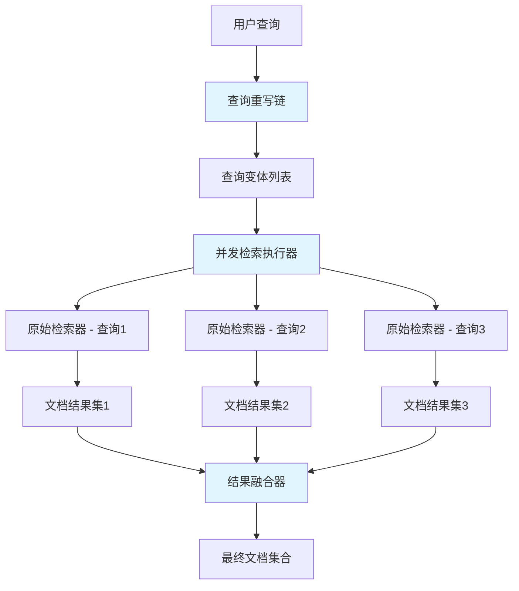

# MultiQuery Retriever 模块技术深度解析

## 1. 问题解决的核心

在信息检索系统中，单个查询往往难以捕获用户的完整意图。用户可能用特定的词汇表达需求，但相关文档可能使用了不同的表述方式。传统的单一查询检索会导致召回率（Recall）不足——即使相关文档存在，也可能因为表述差异而被错过。

**MultiQuery Retriever** 模块正是为了解决这一问题而设计的。它的核心思想是：不要只问一个问题，而是从多个角度提问，然后将所有结果合并。就像你在图书馆查找资料时，不会只查一个关键词，而是会尝试不同的同义词和相关词汇，然后综合所有搜索结果。

## 2. 架构设计与数据流程

### 2.1 架构概览

以下是 MultiQuery Retriever 的核心架构图：



### 2.2 数据流程详述

整个检索过程可以分为三个关键阶段：

1. **查询重写阶段**：将用户输入的单个查询转化为多个查询变体。这可以通过 LLM 生成（默认方式）或自定义的重写函数完成。
   
2. **并发检索阶段**：使用原始检索器，针对每个查询变体并行执行检索操作，获得多个文档结果集。

3. **结果融合阶段**：将多个文档结果集合并为一个最终的文档集合，默认策略是基于文档 ID 去重。

## 3. 核心组件详解

### 3.1 `multiQueryRetriever` 结构体

`multiQueryRetriever` 是整个模块的核心，它实现了 `retriever.Retriever` 接口，同时封装了查询重写、并发检索和结果融合的逻辑。

```go
type multiQueryRetriever struct {
    queryRunner   compose.Runnable[string, []string]  // 查询重写链
    maxQueriesNum int                                   // 最大查询数量限制
    origRetriever retriever.Retriever                  // 原始检索器
    fusionFunc    func(ctx context.Context, docs [][]*schema.Document) ([]*schema.Document, error)  // 结果融合函数
}
```

**设计意图**：这个结构体采用了组合模式，将不同的职责委托给不同的组件，使得每个部分都可以独立变化。

### 3.2 `Config` 配置结构体

`Config` 提供了灵活的配置选项，允许用户根据需求调整模块行为：

```go
type Config struct {
    // 查询重写相关配置
    RewriteLLM        model.ChatModel                          // 用于生成查询变体的 LLM
    RewriteTemplate   prompt.ChatTemplate                      // 查询重写的提示模板
    QueryVar          string                                    // 提示模板中的查询变量名
    LLMOutputParser   func(context.Context, *schema.Message) ([]string, error)  // LLM 输出解析器
    RewriteHandler    func(ctx context.Context, query string) ([]string, error)  // 自定义查询重写函数
    MaxQueriesNum     int                                       // 最大查询数量
    
    // 检索相关配置
    OrigRetriever     retriever.Retriever                      // 原始检索器
    
    // 结果融合相关配置
    FusionFunc        func(ctx context.Context, docs [][]*schema.Document) ([]*schema.Document, error)  // 结果融合函数
}
```

**设计意图**：配置结构体提供了两种查询重写方式——基于 LLM 的方式和完全自定义的方式，满足了不同场景的需求。同时，所有可选配置都有合理的默认值，降低了使用门槛。

### 3.3 `NewRetriever` 工厂函数

`NewRetriever` 函数负责创建和初始化 `multiQueryRetriever` 实例，它是模块的入口点：

```go
func NewRetriever(ctx context.Context, config *Config) (retriever.Retriever, error) {
    // 1. 配置验证
    // 2. 构建查询重写链
    // 3. 设置默认值
    // 4. 创建并返回 retriever 实例
}
```

**关键逻辑**：
- 优先使用 `RewriteHandler`（如果提供），否则使用基于 LLM 的重写方式
- 使用 `compose.Chain` 构建查询重写流程
- 为未设置的配置项提供合理的默认值

### 3.4 `Retrieve` 方法

`Retrieve` 是 `multiQueryRetriever` 的核心方法，实现了完整的检索流程：

```go
func (m *multiQueryRetriever) Retrieve(ctx context.Context, query string, opts ...retriever.Option) ([]*schema.Document, error) {
    // 1. 生成查询变体
    queries, err := m.queryRunner.Invoke(ctx, query)
    
    // 2. 限制查询数量
    if len(queries) > m.maxQueriesNum {
        queries = queries[:m.maxQueriesNum]
    }
    
    // 3. 并发执行检索
    tasks := make([]*utils.RetrieveTask, len(queries))
    // ... 初始化任务
    utils.ConcurrentRetrieveWithCallback(ctx, tasks)
    
    // 4. 融合结果
    fusionDocs, err := m.fusionFunc(ctx, result)
    
    return fusionDocs, nil
}
```

**设计意图**：这个方法清晰地体现了模块的三步检索流程，每一步都有明确的职责，易于理解和维护。

## 4. 依赖分析

MultiQuery Retriever 模块依赖以下关键组件：

1. **`retriever.Retriever`** 接口：定义了检索器的基本行为，`multiQueryRetriever` 实现了这个接口，同时也依赖另一个实现了该接口的原始检索器。

2. **`compose.Runnable`** 接口：用于构建和执行查询重写链，提供了灵活的组合能力。

3. **`utils.RetrieveTask`** 和 `utils.ConcurrentRetrieveWithCallback`：用于管理并发检索任务，提高检索效率。

4. **`callbacks` 包**：用于在结果融合阶段提供回调支持，方便监控和调试。

**数据契约**：
- 输入：单个查询字符串
- 中间输出：查询变体列表、多个文档结果集
- 最终输出：去重后的文档列表

## 5. 设计决策与权衡

### 5.1 组合优于继承

**决策**：`multiQueryRetriever` 不继承自某个基础检索器，而是通过组合的方式包含一个原始检索器。

**理由**：这样的设计使得 `multiQueryRetriever` 可以包装任何实现了 `retriever.Retriever` 接口的检索器，而不局限于某个特定的实现。这种灵活性是继承难以提供的。

### 5.2 两种查询重写方式

**决策**：同时支持基于 LLM 的查询重写和完全自定义的查询重写函数。

**理由**：基于 LLM 的方式提供了强大的语义理解能力，能够生成高质量的查询变体；而自定义函数则提供了最大的灵活性，适用于有特定需求或不想依赖 LLM 的场景。

### 5.3 并发检索

**决策**：使用并发方式执行多个查询的检索操作。

**理由**：检索操作通常是 I/O 密集型的，并发执行可以显著减少总体检索时间。虽然这增加了一些复杂度，但带来的性能提升是值得的。

### 5.4 默认去重融合策略

**决策**：默认使用基于文档 ID 的简单去重策略。

**理由**：简单的策略易于理解和实现，并且在大多数场景下已经足够。同时，模块允许用户替换融合函数，为需要更复杂融合策略（如基于分数的重新排序）的场景提供了扩展点。

## 6. 使用指南与最佳实践

### 6.1 基本使用

```go
// 创建原始检索器
origRetriever := // ... 你的原始检索器

// 创建 LLM
llm := // ... 你的 LLM

// 创建 MultiQuery Retriever
multiRetriever, err := multiquery.NewRetriever(ctx, &multiquery.Config{
    OrigRetriever: origRetriever,
    RewriteLLM:    llm,
})

// 使用
docs, err := multiRetriever.Retrieve(ctx, "如何使用 Eino 构建智能体")
```

### 6.2 自定义查询重写

```go
multiRetriever, err := multiquery.NewRetriever(ctx, &multiquery.Config{
    OrigRetriever: origRetriever,
    RewriteHandler: func(ctx context.Context, query string) ([]string, error) {
        // 自定义查询重写逻辑
        return []string{query, query + " 同义词", query + " 相关问题"}, nil
    },
})
```

### 6.3 自定义结果融合

```go
multiRetriever, err := multiquery.NewRetriever(ctx, &multiquery.Config{
    OrigRetriever: origRetriever,
    RewriteLLM:    llm,
    FusionFunc: func(ctx context.Context, docs [][]*schema.Document) ([]*schema.Document, error) {
        // 自定义融合逻辑，例如基于分数重新排序
        // ...
        return mergedDocs, nil
    },
})
```

## 7. 注意事项与潜在问题

### 7.1 查询数量控制

虽然增加查询变体数量可以提高召回率，但也会增加检索时间和成本。默认的最大查询数量是 5，这是一个在召回率和效率之间的合理权衡。

### 7.2 结果融合的重要性

默认的去重策略只是简单地保留第一次出现的文档。如果需要更精细的结果排序，应该提供自定义的融合函数。

### 7.3 LLM 输出的不确定性

当使用 LLM 生成查询变体时，LLM 的输出可能是不确定的，这可能导致检索结果的不一致性。如果需要确定性，可以设置 LLM 的 temperature 为 0，或者使用自定义的重写函数。

### 7.4 错误处理

如果任何一个查询的检索失败，整个检索过程都会失败。如果需要更宽松的错误处理策略（例如忽略失败的查询），可以在自定义的融合函数中处理。

## 8. 总结

MultiQuery Retriever 模块通过查询扩展的方式有效提高了检索系统的召回率。它的设计体现了几个重要的软件工程原则：

1. **组合优于继承**：通过组合而非继承来扩展功能
2. **开闭原则**：对扩展开放，对修改关闭
3. **单一职责**：每个组件都有明确的职责
4. **默认配置合理**：提供了合理的默认值，降低使用门槛

这个模块的灵活性使得它可以适应各种不同的检索场景，同时保持简洁易用的接口。
