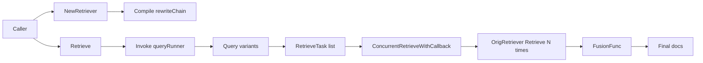

# multiquery_rewriter_retriever 技术深潜

`multiquery_rewriter_retriever` 的核心价值可以用一句话概括：**它不是“更聪明地搜一次”，而是“从多个角度问同一个问题，再把答案合并”**。在向量检索或关键词检索里，原始用户 query 往往只覆盖一个表达视角，导致召回漏掉语义相关但表述不同的文档。这个模块通过“query 改写 + 并发检索 + 融合去重”来提升召回率，尤其适合用户问题表达含糊、领域术语存在同义变体的场景。

---

## 1. 这个模块解决什么问题？

一个朴素检索器（单 query -> 单次 retrieve）的问题，不是“结果一定错”，而是**覆盖面不足**。例如用户问“怎么用 eino 搭 agent”，文档可能写的是 “build assistant workflow” 或 “chat model orchestration”。语义近，但词面差异会让检索打分偏低。

`multiQueryRetriever` 的设计 insight 是：

- 不强行让底层 retriever 变复杂；
- 在 retriever 外围加一个“问题扩增层”；
- 用多条改写 query 并发检索，再做融合。

这有点像信息检索里的“多探针搜索”：与其相信“唯一正确表述”，不如用多个表达去试探语料空间，最后合并结果。

---

## 2. 心智模型：它像一个“检索前置编排器”

可以把它想成机场安检前的“分流台”：

1. 用户只给一个问题（一个乘客）。
2. 分流台先把问题改写成多个版本（分到多个安检通道）。
3. 每个版本并发去同一个 `OrigRetriever` 检索（多个通道同时过检）。
4. 最后把多个通道结果汇总、去重（到达同一候机厅）。

所以它的架构角色是**orchestrator（编排器）**，而不是底层检索算法本身。

---

## 3. 架构与数据流



`NewRetriever` 阶段构建的是一个 `compose.Runnable[string, []string]`（代码里字段名是 `queryRunner`）。这个 Runnable 专门负责“单 query -> 多 query”。它有两种构建路径：

- **自定义路径**：`RewriteHandler` 非空时，直接用它作为改写逻辑。
- **LLM 路径**：用 `ChatTemplate + ChatModel + OutputParser` 组装一个 chain。

`Retrieve` 阶段执行顺序非常明确：

1. 调 `queryRunner.Invoke(ctx, query)` 产出改写 queries。
2. 按 `MaxQueriesNum` 截断。
3. 为每个 query 构造 `utils.RetrieveTask`，Retriever 都是同一个 `OrigRetriever`。
4. 调 `utils.ConcurrentRetrieveWithCallback` 并发执行所有 task。
5. 收集每个 task 的 `Result/Err`，遇到任一错误立即返回。
6. 调 `fusionFunc` 融合二维文档切片 `[][]*schema.Document`。
7. 返回融合后的 `[]*schema.Document`。

这条链路里最“热”的路径是：`OrigRetriever.Retrieve` 的并发调用，因为它占主要 I/O 或向量库查询开销。

---

## 4. 组件深潜

## `Config`

`Config` 把“改写策略”“原始检索器”“融合策略”分离开，这是模块可扩展性的核心。

### 改写相关字段

- `RewriteLLM model.ChatModel`
- `RewriteTemplate prompt.ChatTemplate`
- `QueryVar string`
- `LLMOutputParser func(context.Context, *schema.Message) ([]string, error)`
- `RewriteHandler func(ctx context.Context, query string) ([]string, error)`
- `MaxQueriesNum int`

这里有一个关键优先级：**`RewriteHandler` 一旦提供，就覆盖 LLM 方案**。这是刻意设计：给需要严格可控改写逻辑的场景（规则引擎、静态词典扩写、禁用外部模型）一条“硬覆盖”路径。

### 检索与融合字段

- `OrigRetriever retriever.Retriever`（必填）
- `FusionFunc func(ctx context.Context, docs [][]*schema.Document) ([]*schema.Document, error)`

`OrigRetriever` 是真正执行检索的执行体；`multiQueryRetriever` 不关心底层是向量检索、BM25 还是混合检索，只要求满足 `retriever.Retriever` 接口。

`FusionFunc` 允许调用方定义结果合并策略；默认策略是按 `Document.ID` 去重。

---

## `NewRetriever(ctx, config)`

这是模块最重要的“装配函数”。它做三件事：校验、拼装 query 改写链、注入默认值。

### 1) 参数校验

- `OrigRetriever == nil` 直接报错。
- `RewriteHandler == nil && RewriteLLM == nil` 直接报错。

这体现了一个明确契约：**必须有检索执行器，也必须有 query 生成器**。

### 2) 组装改写链

它内部通过 `compose.NewChain[string, []string]()` 构建流程。

- 如果有 `RewriteHandler`：
  - `AppendLambda(compose.InvokableLambda(config.RewriteHandler), compose.WithNodeName("CustomQueryRewriter"))`
- 否则用 LLM 流程：
  - `Converter`：把字符串 query 包成 `map[string]any{variable: input}`
  - `AppendChatTemplate(tpl)`
  - `AppendChatModel(config.RewriteLLM)`
  - `OutputParser`：默认按换行切分 `message.Content`

非显而易见但很重要的一点：`QueryVar` 在自定义模板场景才真正关键。使用默认模板时会强制回到 `defaultQueryVariable = "query"`。

### 3) 默认策略注入

- `MaxQueriesNum` 默认 `5`
- `FusionFunc` 默认 `deduplicateFusion`

`deduplicateFusion` 按 `Document.ID` 去重，保持首次出现顺序。

---

## `multiQueryRetriever.Retrieve(ctx, query, opts ...retriever.Option)`

`opts` 参数存在但当前实现**没有向下传递**到 `RetrieveTask.RetrieveOptions`（任务构造时只赋值了 `Retriever` 和 `Query`）。这意味着调用 `Retrieve(..., opts...)` 的 option 在当前版本会被静默忽略。这是一个需要特别注意的隐式行为。

主流程：

1. 调 `m.queryRunner.Invoke` 获取改写 query 列表。
2. 如果改写数量超过 `maxQueriesNum`，直接截断。
3. 构造 `[]*utils.RetrieveTask`。
4. 执行 `utils.ConcurrentRetrieveWithCallback`。
5. 若任一 task `Err != nil`，立即返回该错误。
6. 使用 `fusionFunc` 处理聚合结果。
7. 通过 callback 上报 `OnStart/OnError/OnEnd`（fusion 阶段）。

这里体现了“先保证正确性，再考虑部分可用”的策略：并发检索里只要一个子任务失败，整体失败，不做 best-effort 部分返回。

---

## `GetType()` 与回调上下文

`GetType()` 固定返回 `"MultiQuery"`，用于组件类型识别（例如回调系统/组件 introspection）。

融合阶段通过 `ctxWithFusionRunInfo` 注入 `callbacks.RunInfo`：

- `Component: compose.ComponentOfLambda`
- `Type: "FusionFunc"`
- `Name: Type + string(Component)`

这样 callback 观察链路时能把“融合步骤”识别为独立运行节点。

---

## 5. 依赖关系与契约分析

从代码可验证的直接依赖如下：

- 下游调用：
  - `compose`：构建与编译 query rewrite chain
  - `prompt` / `model.ChatModel`：LLM 改写路径
  - `flow/retriever/utils.ConcurrentRetrieveWithCallback`：并发检索执行
  - `callbacks`：运行事件埋点
  - `retriever.Retriever`：实际检索接口
  - `schema.Document` / `schema.Message`：数据契约

- 外部对它的期望（通过接口行为体现）：
  - 作为一个 `retriever.Retriever` 实现，调用者期望 `Retrieve` 返回文档列表与错误。
  - 调用者需要提供可用的 `OrigRetriever` 和改写能力（`RewriteHandler` 或 `RewriteLLM`）。

数据契约上有两个关键点：

1. `LLMOutputParser` 必须把 `*schema.Message` 解析为 `[]string`，并且结果用于直接检索；解析质量直接影响召回与噪声。
2. `FusionFunc` 输入是二维切片，外层对应 query，内层对应每次检索结果；函数需自行处理空切片、重复文档、排序保留策略。

---

## 6. 设计取舍与原因

### 取舍一：可控性 vs 易用性

模块同时支持 `RewriteHandler` 和 `RewriteLLM`。这是典型“双轨制”：

- LLM 路径开箱即用，适合快速接入；
- Handler 路径可控、可测、可离线。

优先级选择了 Handler 覆盖 LLM，牺牲了一些“组合灵活性”（比如两者叠加），换来行为确定性。

### 取舍二：并发吞吐 vs 资源压力

`ConcurrentRetrieveWithCallback` 对每个 query 起 goroutine，提升响应速度，但没有内置并发上限。query 数量过多时会给底层检索系统施压。`MaxQueriesNum` 因此成为保护阀，默认值 5 是性能与召回的折中。

### 取舍三：简单融合 vs 排序质量

默认 `deduplicateFusion` 仅按 ID 去重，逻辑非常稳健简单，但不做重排、打分融合或 reciprocal rank fusion。这降低了复杂度，也意味着最终排序质量完全依赖子检索器返回顺序与 query 顺序。

### 取舍四：失败即失败 vs 部分可用

当前策略是“任一 task 出错则整体报错”。这简化调用语义（要么完整成功，要么失败），但牺牲了部分成功场景的可用性（例如 5 个 query 成功 4 个也不能返回）。

---

## 7. 使用方式与示例

```go
cfg := &multiquery.Config{
    RewriteLLM:    myChatModel,
    OrigRetriever: myRetriever,
    // RewriteTemplate / QueryVar / LLMOutputParser 可按需覆盖
    MaxQueriesNum: 5,
}

r, err := multiquery.NewRetriever(ctx, cfg)
if err != nil {
    panic(err)
}

docs, err := r.Retrieve(ctx, "how to build agent with eino")
if err != nil {
    panic(err)
}
_ = docs
```

如果你想完全控制 query 改写（不依赖 LLM）：

```go
cfg := &multiquery.Config{
    RewriteHandler: func(ctx context.Context, query string) ([]string, error) {
        return []string{
            query,
            "eino agent architecture",
            "build chat agent workflow",
        }, nil
    },
    OrigRetriever: myRetriever,
}
```

如果你需要自定义融合策略：

```go
cfg.FusionFunc = func(ctx context.Context, groups [][]*schema.Document) ([]*schema.Document, error) {
    // 例如：先拼接再按某个 metadata 排序
    // 注意处理 ID 重复、空结果、稳定顺序
    return myFusion(groups), nil
}
```

---

## 8. 新贡献者要特别注意的坑

首先，`Retrieve` 的 `opts ...retriever.Option` 在当前实现中没有传入 `RetrieveTask.RetrieveOptions`，这是一个很容易误判的行为。你可能以为在外部传了 option 就生效，但实际上不会影响底层调用。

其次，默认 `LLMOutputParser` 只是 `strings.Split(message.Content, "\n")`，不会自动 trim 空白行或过滤空字符串。如果模型输出格式不稳定，可能产生空 query，继而造成无意义检索请求。

再者，`ConcurrentRetrieveWithCallback` 会并发启动多个 goroutine，且内部有 panic recover（将 panic 包装成错误）。这提升了健壮性，但不会自动限流；你在提高 `MaxQueriesNum` 时要关注底层检索系统容量。

最后，默认融合按 `Document.ID` 去重，隐含契约是：ID 在你的数据域里必须稳定且唯一。如果某些文档 ID 为空或重复策略不规范，去重会失真。

---

## 9. 相关模块参考

- 并发检索执行工具与回调注入：[`retrieval_concurrency_utils`](retrieval_concurrency_utils.md)
- 检索器接口与 option 契约：[`model_and_tool_interfaces`](model_and_tool_interfaces.md)（其中包含 `components.retriever` 相关接口定义入口）
- 组合式链路构建与运行时：[`Compose Graph Engine`](compose_graph_engine.md)
- 回调埋点模型：[`Callbacks System`](callbacks_system.md)

如果你下一步要改这个模块，建议先从 `multi_query.go` 的 `NewRetriever` 与 `Retrieve` 两条主路径入手，再对照 `flow/retriever/utils/utils.go` 看并发执行与错误传播语义。
