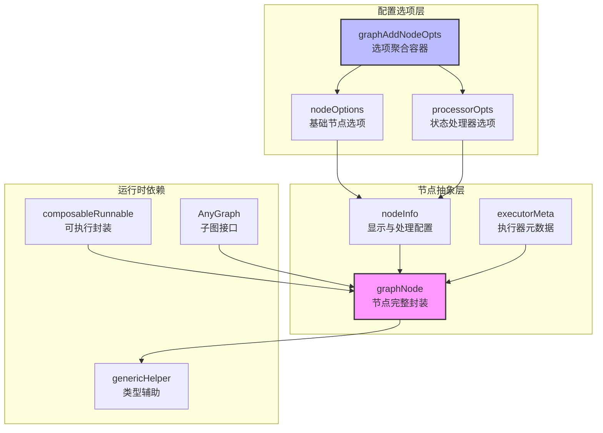
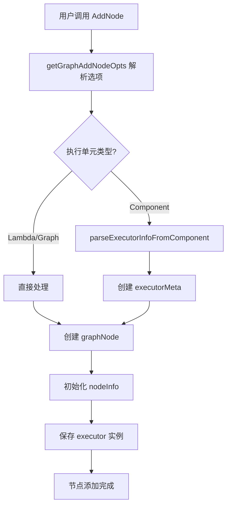
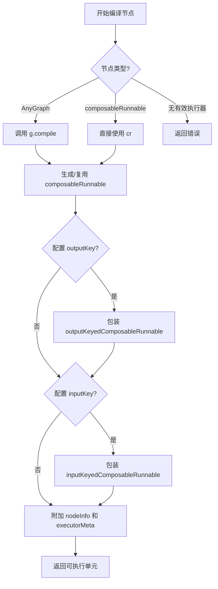
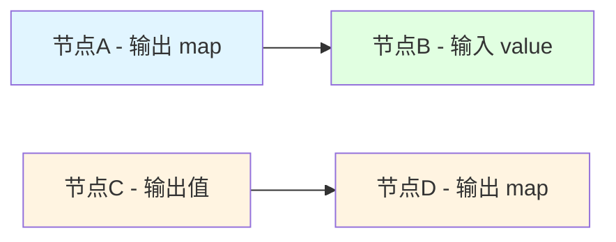
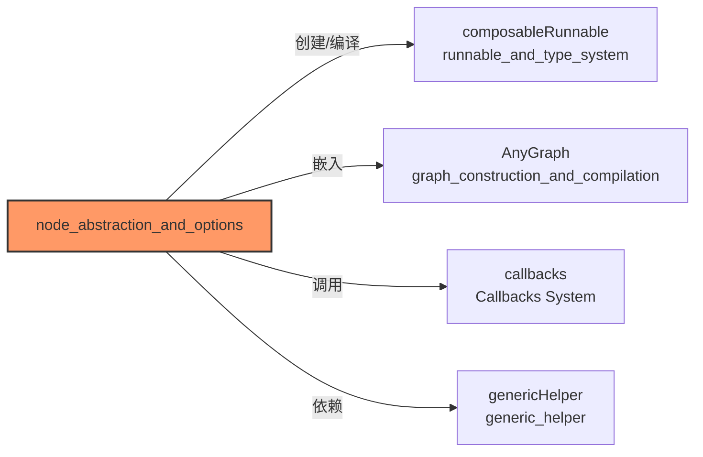

# Node Abstraction and Options（节点抽象与配置选项）

想象一下，你正在搭建一个乐高流水线工厂。流水线上有各种工位：有的负责切割（ChatModel），有的负责组装（Tool），有的本身就是一条完整的子流水线（Sub-graph）。**Node Abstraction and Options** 就是这个工厂中的"工位包装器"——它让不同类型的机器能够以统一的方式被安装到流水线上，同时保留各自的特性，并支持灵活的配置。

## 模块定位

在 Eino 的图计算引擎中，本模块定义了**图节点（Graph Node）的统一抽象**以及**节点配置选项系统**。它解决了以下核心问题：

1. **异构执行单元的统一封装**：如何让组件（Component）、Lambda 函数、嵌套图（Sub-graph）在图中被一致对待？
2. **灵活的数据流控制**：如何在不修改业务逻辑的情况下，调整节点的输入/输出映射？
3. **状态管理能力**：如何支持跨节点的状态共享和传递？
4. **延迟编译支持**：如何处理嵌套子图的编译时机？

---

## 1. 问题与解决方案

在构建复杂的 AI 应用工作流时，我们面临一个核心挑战：如何将不同类型的执行单元（如 ChatModel、Retriever、Tool、甚至是另一个 Graph）统一封装成图（Graph）中的节点，同时保持它们的独特行为和可扩展性？

### 问题空间

想象一下：你正在构建一个 AI 代理系统，它需要：
- 调用语言模型生成响应
- 调用外部工具获取信息
- 从知识库检索相关文档
- 甚至可能将整个流程作为子图嵌入到更大的系统中

每种组件都有自己的接口、行为和生命周期。如果直接将它们硬编码到图中，会导致：
- 代码耦合严重，难以维护
- 无法统一处理输入输出转换
- 难以插入钩子（如状态处理、回调）
- 子图嵌套变得复杂

### 核心设计洞察

解决方案是将图节点（graphNode）设计成一个**统一的适配器层**，它能够：
1. 包装任何可执行单元（组件、Lambda 函数、子图）
2. 提供统一的元数据和配置机制
3. 在编译时将这些单元转换为可组合的可运行对象（composableRunnable）
4. 支持输入输出键映射、状态处理等横切关注点

这就像一个万能插座适配器——无论你是两孔、三孔还是国外插头，都能通过适配器插到同一个插座上。

## 2. 架构概览

### 核心架构图



### 核心概念解释

**graphNode（图节点）** 是整个系统的核心抽象。可以将其视为一个"智能容器"，它包裹着一个可执行单元（可能是单个组件、Lambda 函数，甚至是另一个完整的图），并为其附加了元数据、类型信息和处理能力。

这种设计的精妙之处在于**关注点分离**：
- `cr`（composableRunnable）负责"如何执行"
- `g`（AnyGraph）负责处理子图场景
- `nodeInfo` 负责"如何显示和预处理"
- `executorMeta` 负责"这是什么"（用于监控和回调）

### 核心抽象层次

```
┌─────────────────────────────────────────────────────────────┐
│                      graphNode (节点)                        │
│  ┌───────────────────────────────────────────────────────┐  │
│  │  nodeInfo (节点信息)        executorMeta (执行器元数据) │  │
│  │  - name (显示名)            - component (组件类型)      │  │
│  │  - inputKey/outputKey       - isComponentCallbackEnabled│  │
│  │  - pre/postProcessor        - componentImplType         │  │
│  │  - compileOption                                      │  │
│  └───────────────────────────────────────────────────────┘  │
│  ┌───────────────────────────────────────────────────────┐  │
│  │  执行单元二选一                                          │  │
│  │  ┌──────────────────┐    ┌──────────────────────┐    │  │
│  │  │  AnyGraph (子图) │    │ composableRunnable   │    │  │
│  │  │  (延迟编译)       │    │ (立即可用)            │    │  │
│  │  └──────────────────┘    └──────────────────────┘    │  │
│  └───────────────────────────────────────────────────────┘  │
└─────────────────────────────────────────────────────────────┘
         │
         │ 编译 (compileIfNeeded)
         ▼
┌─────────────────────────────────────────────────────────────┐
│              composableRunnable (可组合运行体)               │
│  (包装了原始执行单元，添加了元数据、键映射、处理器)           │
└─────────────────────────────────────────────────────────────┘
```

### 核心组件角色

1. **graphNode**: 图节点的完整表示，是整个模块的核心结构体。它持有节点的所有信息，包括执行单元、元数据和配置。

2. **executorMeta**: 执行器元数据，记录原始执行对象的信息，如组件类型、是否启用回调、实现类型等。这些信息主要用于调试、监控和回调系统。

3. **nodeInfo**: 节点信息，包含节点的显示配置、输入输出键映射、前后处理器、编译选项等。这些是用户在添加节点时可以配置的部分。

4. **graphAddNodeOpts 及相关**: 节点添加选项，通过函数式选项模式提供灵活的节点配置方式。

---

## 3. 数据流与控制流

### 节点创建流程

当用户调用 `graph.AddNode("node_name", component, options...)` 时，数据流如下：



### 编译期流程

在图编译阶段，`compileIfNeeded` 方法被调用：



### 类型推断流程

graphNode 提供了 inputType() 和 outputType() 方法来推断节点的输入输出类型：

1. 如果配置了 inputKey/outputKey，则类型为 map[string]any
2. 否则，优先从子图 (AnyGraph) 获取类型
3. 如果没有子图，则从 composableRunnable 获取类型

这种设计确保了类型信息在整个图中能够正确传播，即使节点经过了多层包装。

---

## 4. 核心组件详解

### 4.1 executorMeta - 执行器元数据

```go
type executorMeta struct {
    component                  component
    isComponentCallbackEnabled bool
    componentImplType          string
}
```

**设计意图**：这是对"用户原始提供的可执行对象"的**身份档案**。

- `component`：自动识别组件类型（Model、Tool、Retriever 等）
- `isComponentCallbackEnabled`：组件是否自行处理回调。这是 Eino 回调系统的关键——如果组件自己处理回调，图引擎就不重复触发
- `componentImplType`：实现类型名称，用于调试和可观测性

**类比**：这就像是工厂设备的"铭牌信息"——记录设备型号、生产厂家、是否内置自检系统。

### 4.2 nodeInfo - 节点显示与处理配置

```go
type nodeInfo struct {
    name          string           // 显示名称（非唯一）
    inputKey      string           // 输入键（Map 输入时使用）
    outputKey     string          // 输出键（Map 输出时使用）
    preProcessor  *composableRunnable  // 状态预处理
    postProcessor *composableRunnable  // 状态后处理
    compileOption *graphCompileOptions // 子图编译选项
}
```

**设计意图**：这层负责**数据流的塑形**和**状态交互**。

#### inputKey/outputKey 机制

这是 Eino 中非常实用的一个特性，它允许**解耦节点的数据接口**：

- **Without Key**：节点 A 输出 `string`，节点 B 期望 `string`，直接传递
- **With Key**：节点 A 输出 `{"result": "value"}`，节点 B 配置了 `WithInputKey("result")`，则 B 收到 `"value"`



**说明**：
- 从 A 到 B：节点 A 输出 map，节点 B 配置了 `inputKey` 并只接收 value
- 从 C 到 D：节点 C 输出单个值，节点 D 配置了 `outputKey` 并将值包装在 map 中

这种设计避免了为了数据格式转换而编写繁琐的适配器 Lambda。

#### State Pre/Post Handler

```go
// PreHandler: 在节点执行前调用，可以修改输入或更新状态
func preHandler(ctx context.Context, input I, state S) (I, error)

// PostHandler: 在节点执行后调用，可以修改输出或更新状态
func postHandler(ctx context.Context, output O, state S) (O, error)
```

**关键约束**：这些处理器要求图必须是通过 `WithGenLocalState` 创建的，因为它们需要访问状态对象 S。

### 4.3 graphNode - 完整的节点封装

```go
type graphNode struct {
    cr *composableRunnable    // 可执行封装（编译后）
    g  AnyGraph               // 子图（如果有）
    
    nodeInfo     *nodeInfo
    executorMeta *executorMeta
    
    instance any               // 原始实例（保留用于元信息）
    opts     []GraphAddNodeOpt // 原始选项
}
```

**关键方法分析**：

#### getGenericHelper()

这是一个**类型计算的枢纽**。在 Eino 中，类型安全是通过 `genericHelper` 在编译期维护的。这个方法根据节点配置（特别是 inputKey/outputKey）返回对应的类型助手：

```go
// 如果配置了 inputKey，输入类型从 T 变为 map[string]any
if len(gn.nodeInfo.inputKey) > 0 {
    ret = ret.forMapInput()
}

// 如果配置了 outputKey，输出类型从 T 变为 map[string]any
if len(gn.nodeInfo.outputKey) > 0 {
    ret = ret.forMapOutput()
}
```

这体现了**类型系统的动态适配**——配置选项会影响类型推导。

#### compileIfNeeded()

这是**延迟编译**的核心实现：

1. **子图场景**：如果节点包含 `AnyGraph`，触发其子图的编译，生成 `composableRunnable`
2. **组件场景**：直接使用已有的 `composableRunnable`
3. **Key 包装**：根据需要添加输入/输出 Key 的包装器
4. **元数据附加**：将 `nodeInfo` 和 `executorMeta` 附加到最终的 Runnable 上

### 4.4 graphAddNodeOpts - 选项聚合容器

这是**函数式选项模式（Functional Options Pattern）**的实现载体：

```go
type graphAddNodeOpts struct {
    nodeOptions *nodeOptions
    processor   *processorOpts
    needState   bool  // 标记是否需要状态（用于验证）
}
```

#### 为什么使用函数式选项模式？

**权衡分析**：

| 方案 | 优点 | 缺点 |
|------|------|------|
| 函数式选项（当前） | 向后兼容、自文档化、可选参数天然支持 | 调用栈稍深、需要定义大量函数 |
| 配置结构体 | 直观、性能好 | 零值歧义、API breaking changes 风险 |
| Builder 模式 | 链式调用优雅 | 代码冗长、对必选参数处理 awkward |

当前选择体现了对 **API 演进友好性** 的优先考虑。在框架代码中，向后兼容通常比微小的性能差异更重要。

### 4.5 processorOpts - 状态处理器配置

```go
type processorOpts struct {
    statePreHandler  *composableRunnable
    preStateType     reflect.Type  // 用于类型验证
    statePostHandler *composableRunnable
    postStateType    reflect.Type  // 用于类型验证
}
```

这里有两个值得注意的设计细节：

1. **Handler 也是 composableRunnable**：状态处理器被统一转换为 `composableRunnable`，这意味着它们可以复用相同的执行基础设施，包括流式处理支持。

2. **显式保存 Type 信息**：虽然 Go 的泛型在编译期会擦除，但通过 `generic.TypeOf[S]()` 保存的 `reflect.Type` 可以在运行期进行类型校验。

---

## 5. 设计决策与权衡

### 决策 1：统一封装 vs 类型安全

**选择**：使用 graphNode 统一封装所有类型的执行单元，牺牲部分编译时类型安全换取灵活性

**原因**：
- AI 工作流中的组件类型多样，接口差异大
- 需要支持运行时动态组装图
- 类型安全可以通过泛型选项（如 WithStatePreHandler）部分保留

**权衡**：
- ✅ 灵活性高，可以封装任何执行单元
- ✅ 统一的接口简化了图的实现
- ❌ 部分错误只能在运行时发现
- ❌ 代码稍微复杂一些

### 决策 2：延迟编译 vs 立即编译

**选择**：支持两种模式，子图使用延迟编译，普通组件使用立即编译

**原因**：
- 子图可能需要在不同的上下文中以不同的选项编译
- 普通组件通常不需要这种灵活性，立即编译更高效
- 这种设计使得图的嵌套更加灵活

**权衡**：
- ✅ 子图的复用性更好
- ✅ 普通组件的效率更高
- ❌ 代码复杂度增加
- ❌ 需要维护两种路径

### 决策 3：函数式选项 vs 结构体配置

**选择**：使用函数式选项模式

**原因**：
- 节点配置项多，且大部分是可选的
- 需要支持未来添加新选项而不破坏 API
- 函数式选项更易读，配置代码更清晰

**权衡**：
- ✅ API 演进更安全
- ✅ 配置代码可读性好
- ❌ 选项数量多时，函数数量也多
- ❌ 实现稍微复杂一些

### 决策 4：输入输出键映射作为节点配置 vs 独立节点

**选择**：将输入输出键映射作为节点的配置项

**原因**：
- 键映射是一个常见需求，作为节点配置更方便
- 避免创建大量的专门用于键映射的节点，简化图结构
- 性能更好，不需要额外的节点执行开销

**权衡**：
- ✅ 使用方便，图结构简洁
- ✅ 性能更好
- ❌ 节点的职责稍微复杂了一些
- ❌ 如果需要复杂的映射，可能需要独立的处理节点

---

## 6. 跨模块依赖

本模块位于 [graph_construction_and_compilation](graph_construction_and_compilation.md) 之下，与以下模块有密切交互：



### 模块依赖详情

1. **[runnable_and_type_system](runnable_and_type_system.md)**：`composableRunnable` 和 `genericHelper` 是该模块的核心依赖
2. **[graph_construction_and_compilation](graph_construction_and_compilation.md)**：`AnyGraph` 接口定义和 `GraphCompileOption` 来自父模块
3. **[Callbacks System](callbacks_system.md)**：`isComponentCallbackEnabled` 字段直接支持回调系统的正确运行

---

## 7. 使用指南与最佳实践

### 基本用法

```go
// 添加一个普通组件节点
graph.AddNode("my_chat_model", chatModel,
    compose.WithNodeName("My Chat Model"),
    compose.WithInputKey("query"),
    compose.WithOutputKey("response"),
)

// 添加一个子图节点
subGraph := compose.NewGraph(...)
graph.AddNode("sub_graph", subGraph,
    compose.WithGraphCompileOptions(
        compose.WithGraphName("My Sub Graph"),
    ),
)
```

### 状态处理

```go
// 定义状态类型
type MyState struct {
    RequestCount int
}

// 创建图时启用状态
graph := compose.NewGraph(
    compose.WithGenLocalState[MyState](),
)

// 添加带有状态处理器的节点
graph.AddNode("my_node", node,
    compose.WithStatePreHandler(func(ctx context.Context, input Input, state *MyState) (Input, error) {
        state.RequestCount++
        return input, nil
    }),
    compose.WithStatePostHandler(func(ctx context.Context, output Output, state *MyState) (Output, error) {
        // 处理输出和状态
        return output, nil
    }),
)
```

### 流式状态处理

```go
graph.AddNode("streaming_node", node,
    compose.WithStreamStatePreHandler(func(ctx context.Context, input <-chan Input, state *MyState) (<-chan Input, error) {
        // 处理流式输入和状态
        return input, nil
    }),
    compose.WithStreamStatePostHandler(func(ctx context.Context, output <-chan Output, state *MyState) (<-chan Output, error) {
        // 处理流式输出和状态
        return output, nil
    }),
)
```

### 最佳实践

1. **合理使用输入输出键**：
   - 当节点只需要处理输入的一部分时，使用 inputKey
   - 当节点的输出需要被多个后续节点分别使用时，使用 outputKey

2. **状态处理器的性能考虑**：
   - 状态处理器会在每次节点执行时调用，保持它们轻量
   - 避免在状态处理器中进行耗时操作

3. **流式 vs 普通状态处理器**：
   - 如果上游输出是流，且你想保持流的特性，使用流式版本
   - 否则，使用普通版本，它更简单

4. **节点命名**：
   - 给节点起有意义的名字，这对调试和可视化很有帮助

## 8. 常见陷阱与注意事项

### 陷阱 1：State Handler 与 Stateless Graph

```go
// 错误：在没有使用 WithGenLocalState 创建的图上使用 State Handler
graph := compose.NewGraph()  // 无状态图
graph.AddNode("node", node, compose.WithStatePreHandler(...))  // 运行时可能出错
```

**原理**：`needState` 标记在 `getNodeInfo` 时会被设置为 `true`，但图本身需要支持状态存储。这个验证通常在图的编译期进行。

### 陷阱 2：Input/Output Key 与类型推导

```go
// 上游输出 string
graph.AddNode("upstream", stringProducer, compose.WithOutputKey("data"))
// 下游期望 string，但配置 inputKey 后实际收到 map[string]any
graph.AddNode("downstream", stringConsumer, compose.WithInputKey("data"))  // 类型不匹配！
```

**原理**：配置 `inputKey` 会将输入类型变为 `map[string]any`，即使你知道它里面存的是 `string`，类型系统也丢失了信息。

### 陷阱 3：Stream Handler 与普通 Handler 混用

```go
// 危险：上游是流式输出，但下游使用非流式 StatePostHandler
graph.AddNode("stream_node", streamableNode,
    compose.WithStatePostHandler(func(ctx context.Context, 
        output string, state *State) (string, error) {
        // 这里 output 是整个流聚合后的结果，失去了流式的优势
        return output, nil
    }),
)
```

**正确做法**：对于流式场景，使用 `WithStreamStatePreHandler` 和 `WithStreamStatePostHandler`。

### 陷阱 4：子图编译选项的继承

```go
// 注意：子图的编译选项不会自动继承父图的选项
parentGraph := compose.NewGraph(compose.WithGraphName("parent"))
parentGraph.AddNode("child", childGraph, 
    compose.WithGraphCompileOptions(compose.WithGraphName("child")),
)
```

每个子图需要显式配置自己的编译选项。

### 其他注意事项

#### 输入输出键的组合执行顺序

当同时使用 inputKey 和 outputKey 时，执行顺序是：
1. 使用 inputKey 从输入 map 中提取值
2. 将提取的值传递给节点执行
3. 将节点的输出用 outputKey 包装成 map

#### 状态处理器与键映射的交互

状态处理器是在键映射**之前**执行的：
- preHandler 看到的是原始输入，不是 inputKey 提取后的值
- postHandler 看到的是节点原始输出，不是 outputKey 包装后的值

#### 回调执行的两种模式

如果组件自己实现了回调功能（isComponentCallbackEnabled 为 true），那么图级别的回调不会再执行。这是为了避免重复回调，但也意味着你需要了解组件的回调行为。

#### 类型推断的限制

当使用 inputKey 或 outputKey 时，inputType() 和 outputType() 会返回 map[string]any，这会覆盖底层执行单元的真实类型。这是合理的，因为从外部看，这个节点确实是在处理 map。

---

## 9. 总结

**Node Abstraction and Options** 是 Eino 图引擎的**基石层**。它通过精巧的抽象设计，将异构的执行单元（组件、Lambda、子图）统一为一致的 `graphNode` 接口，同时通过灵活的配置选项系统支持：

1. **数据流塑形**（Input/Output Key）
2. **状态管理**（State Pre/Post Handlers）
3. **延迟编译**（子图编译时机的控制）
4. **可观测性**（执行器元数据的保留）

理解这个模块的关键在于抓住**分层封装**的思想：`executorMeta` 回答"这是什么"，`nodeInfo` 回答"如何处理"，`graphNode` 将它们统一为"可执行的单元"。这种分层使得系统既能保持类型安全，又能提供灵活的配置能力。

对于新加入的开发者，建议先从理解 `graphNode` 的结构和 `compileIfNeeded` 方法开始，这是整个模块的核心。然后通过实际使用 `WithInputKey`/`WithOutputKey` 和状态处理器等选项，来体会模块的设计理念和使用方式。
