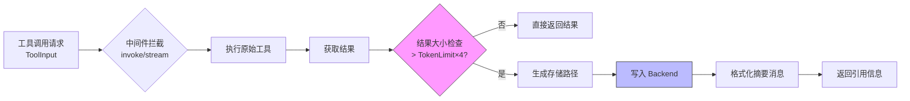

# 大工具结果卸载机制 (Large Tool Result Offloading)

## 概述

想象你正在使用一个智能助手，让它帮你读取一个 10MB 的日志文件。如果系统把这个 10MB 的原始内容直接塞进对话历史，那么下一次模型调用时，这 10MB 会作为上下文的一部分被反复传输和处理——很快你的 token 配额就会耗尽，系统也会变慢。**大工具结果卸载机制**就是解决这个问题的：它像一个智能的"内容快递员"，当检测到工具返回的内容过大时，不会直接塞进对话流，而是把它存到"仓库"（后端存储），然后只传递一张"取货单"（包含文件路径和内容摘要的引用信息）。

这个模块是 Eino ADK 文件系统中间件的核心组件，用于在工具执行链中拦截过大的结果，将其持久化到外部存储，并以轻量级引用替换原始内容，从而保护上下文窗口、降低网络传输开销，同时保留内容的可访问性。

---

## 架构设计

### 数据流图



### 核心抽象

**想象这是一个"智能分拣中心"**：

1. **入口检查点** (`invoke`/`stream`): 所有工具调用的必经之地，负责拦截和检查
2. **尺寸评估器** (`handleResult`): 快速估算内容体积，决定是否触发卸载
3. **存储协调员** (`Backend`): 抽象的外部存储接口，可以是本地文件系统、对象存储等
4. **路径规划师** (`PathGenerator`): 智能生成存储位置，支持按调用 ID、时间等维度组织
5. **摘要生成器** (`formatToolMessage`): 创建内容的"缩略图"，保留前 10 行关键信息

### 组件职责

| 组件 | 角色定位 | 核心职责 |
|------|----------|----------|
| `toolResultOffloadingConfig` | 配置载体 | 封装卸载策略参数：阈值、存储后端、路径生成规则 |
| `toolResultOffloading` | 中间件实现 | 实现 `compose.ToolMiddleware` 接口，提供 Invokable 和 Streamable 双模式处理 |
| `newToolResultOffloading` | 工厂函数 | 配置校验、默认值填充、中间件实例化 |
| `handleResult` | 卸载决策器 | 大小判定、路径生成、存储写入、引用格式化 |

---

## 组件深度解析

### `toolResultOffloadingConfig` - 配置策略对象

```go
type toolResultOffloadingConfig struct {
    Backend       Backend                                           // 存储后端接口
    TokenLimit    int                                               // 触发卸载的 token 阈值
    PathGenerator func(ctx context.Context, input *compose.ToolInput) (string, error)  // 路径生成策略
}
```

**设计意图**：将配置与实现解耦，支持运行时注入不同的存储后端和路径策略。`PathGenerator` 使用函数类型而非接口，简化了简单场景下的配置——你可以直接传入一个闭包，而不需要实现完整的接口。

**默认策略的合理性**：
- `TokenLimit` 默认为 20000：基于大语言模型典型的上下文窗口限制（通常 4K-128K tokens），预留 20K 作为"大内容"阈值是一个保守且实用的选择
- 路径生成默认使用 `/large_tool_result/{call_id}`：利用工具调用的唯一 ID 确保无冲突，同时集中管理便于清理

### `toolResultOffloading` - 中间件核心实现

```go
type toolResultOffloading struct {
    backend       Backend
    tokenLimit    int
    pathGenerator func(ctx context.Context, input *compose.ToolInput) (string, error)
}
```

**架构角色**：这是一个典型的**装饰器模式**实现，包装原始工具端点，在不改变工具本身逻辑的前提下增强其行为。

#### `invoke` 方法 - 同步处理流

```go
func (t *toolResultOffloading) invoke(endpoint compose.InvokableToolEndpoint) compose.InvokableToolEndpoint {
    return func(ctx context.Context, input *compose.ToolInput) (*compose.ToolOutput, error) {
        // 1. 透传执行原始工具
        output, err := endpoint(ctx, input)
        if err != nil {
            return nil, err
        }
        // 2. 结果后处理（可能卸载）
        result, err := t.handleResult(ctx, output.Result, input)
        if err != nil {
            return nil, err
        }
        return &compose.ToolOutput{Result: result}, nil
    }
}
```

**关键决策**：采用**后处理模式**（Post-processing）而非拦截模式。工具先完整执行，结果被获取后再决定是否卸载。这确保了即使卸载失败，也不会阻塞工具的正常执行流程。

#### `stream` 方法 - 流式处理流

```go
func (t *toolResultOffloading) stream(endpoint compose.StreamableToolEndpoint) compose.StreamableToolEndpoint {
    return func(ctx context.Context, input *compose.ToolInput) (*compose.StreamToolOutput, error) {
        output, err := endpoint(ctx, input)
        if err != nil {
            return nil, err
        }
        // 关键：流式结果需要物化（materialize）才能判断大小
        result, err := concatString(output.Result)
        if err != nil {
            return nil, err
        }
        // 处理后再转回流式
        result, err = t.handleResult(ctx, result, input)
        if err != nil {
            return nil, err
        }
        return &compose.StreamToolOutput{
            Result: schema.StreamReaderFromArray([]string{result})
        }, nil
    }
}
```

**设计权衡**：流式场景下必须先将流内容物化为字符串才能判断大小，这看似违背了流式的"惰性计算"原则。但考虑到**只有大内容才需要卸载**，而小内容直接透传，这种权衡是可接受的。如果强制保持流式，将无法在首包就判断是否需要卸载，导致架构复杂度剧增。

### `handleResult` - 卸载决策核心

```go
func (t *toolResultOffloading) handleResult(ctx context.Context, result string, input *compose.ToolInput) (string, error) {
    // 大小判定：TokenLimit × 4（假设 UTF-8 平均每个字符 4 字节）
    if len(result) > t.tokenLimit*4 {
        path, err := t.pathGenerator(ctx, input)
        if err != nil {
            return "", err
        }
        // 格式化摘要消息（包含原始内容的预览）
        nResult := formatToolMessage(result)
        nResult, err = pyfmt.Fmt(tooLargeToolMessage, map[string]any{
            "tool_call_id":   input.CallID,
            "file_path":      path,
            "content_sample": nResult,
        })
        if err != nil {
            return "", err
        }
        // 写入后端存储
        err = t.backend.Write(ctx, &WriteRequest{
            FilePath: path,
            Content:  result,
        })
        if err != nil {
            return "", err
        }
        return nResult, nil
    }
    return result, nil
}
```

**大小估算逻辑**：使用 `len(result) > t.tokenLimit*4` 进行快速判断。这里假设平均每个 token 约 4 字节（UTF-8 编码下），这是一个工程上的近似值。真实的 token 数量需要经过 tokenizer 计算，但那样会带来显著的性能开销。这种近似在"宁可误判大，不可误判小"的场景下是安全的——误判只会导致本可以内联的内容被卸载，不会影响正确性。

### `formatToolMessage` - 内容摘要生成

```go
func formatToolMessage(s string) string {
    reader := bufio.NewScanner(strings.NewReader(s))
    var b strings.Builder
    lineNum := 1
    for reader.Scan() {
        if lineNum > 10 {  // 仅保留前 10 行
            break
        }
        line := reader.Text()
        if utf8.RuneCountInString(line) > 1000 {  // 每行截断至 1000 字符
            runes := []rune(line)
            line = string(runes[:1000])
        }
        b.WriteString(fmt.Sprintf("%d: %s\n", lineNum, line))
        lineNum++
    }
    return b.String()
}
```

**设计意图**：生成人类可读的上下文预览，帮助模型理解被卸载内容的性质，同时严格控制摘要大小（最多 10 行 × 1000 字符 = 约 10KB），避免摘要本身成为"大内容"。

---

## 依赖关系分析

### 向上依赖（本模块依赖谁）

| 依赖模块 | 依赖组件 | 依赖原因 |
|----------|----------|----------|
| [ADK Filesystem Middleware - Backend Protocol](adk_filesystem_middleware.md) | `Backend`, `WriteRequest` | 存储抽象，解耦具体的存储实现（本地文件、S3、内存等） |
| [Compose Graph Engine](compose_graph_engine.md) | `compose.ToolMiddleware`, `compose.ToolInput`, `compose.ToolOutput`, `compose.InvokableToolEndpoint`, `compose.StreamableToolEndpoint` | 中间件接口契约，确保与 Eino 的组合图执行引擎兼容 |
| [Schema Stream](schema_stream.md) | `schema.StreamReader`, `schema.StreamReaderFromArray` | 流式数据的读取和重建 |

**数据契约**：
- `Backend.Write` 必须幂等或支持覆盖写入，因为路径生成策略可能因重试等原因产生重复调用
- `ToolInput.CallID` 必须全局唯一，作为卸载文件的标识和去重键

### 向下依赖（谁依赖本模块）

本模块主要通过 `newToolResultOffloading` 被 [ADK Filesystem Middleware](adk_filesystem_middleware.md) 调用，作为其工具链增强能力的一部分。下游调用者只需配置 `toolResultOffloadingConfig`，无需感知内部实现细节。

---

## 设计决策与权衡

### 1. 阈值计算：字节长度 vs 真实 Token 数

**选择**：使用字节长度估算（`len(result) > tokenLimit*4`）

**权衡分析**：
- **替代方案**：集成 tokenizer 精确计算 token 数量
- **当前方案优势**：零依赖、零延迟、实现简单
- **当前方案劣势**：对非英语内容（如中文，每 token 可能 1-2 字节）会过早触发卸载
- **决策理由**：在存储成本远低于 API 调用成本的场景下，"过度卸载"比"遗漏卸载"更安全。且 4 倍系数为英文场景提供了缓冲，对中文场景只是略微激进。

### 2. 流式处理：物化 vs 窗口采样

**选择**：完全物化流内容 (`concatString`)

**权衡分析**：
- **替代方案**：仅读取前 N 字节采样判断，若小则透传，若大则重新读取流
- **当前方案优势**：实现简单，无"二次读取"复杂性，无状态管理负担
- **当前方案劣势**：内存峰值 = 完整结果大小，大文件会瞬间占用大量内存
- **决策理由**：工具结果通常是一次性生成的，流式更多是为了适配接口而非真正的增量生成。且 Go 的字符串不可变，物化后可直接复用，避免重复内存分配。

### 3. 错误处理：硬失败 vs 降级

**选择**：任何卸载环节失败都返回错误（硬失败）

**权衡分析**：
- **替代方案**：卸载失败时降级为直接返回原始内容，带警告日志
- **当前方案优势**：失败显式化，避免静默行为不一致（如存储半成功导致文件找不到）
- **当前方案劣势**：存储后端抖动会影响工具可用性
- **决策理由**：遵循"快速失败"原则。卸载通常用于严格的大小限制场景（如模型上下文硬限制），降级可能导致下游模型调用失败，更难排查。

### 4. 路径生成：函数 vs 接口

**选择**：使用函数类型 `func(ctx context.Context, input *compose.ToolInput) (string, error)`

**权衡分析**：
- **替代方案**：定义 `PathGenerator` 接口
- **当前方案优势**：简单场景下无需定义新类型，直接写匿名函数更 Go 风格
- **当前方案劣势**：复杂策略（如需配置参数的生成器）难以抽象
- **决策理由**：路径生成策略通常是纯函数（基于 CallID、时间戳等），无需维护状态，函数类型足够表达。若需复杂策略，可通过闭包捕获配置。

---

## 使用指南

### 基础配置

```go
import (
    "context"
    "github.com/cloudwego/eino/compose"
    filesystem "github.com/cloudwego/eino-examples/adk/middlewares/filesystem"
)

// 创建卸载中间件
offloadingMiddleware := filesystem.newToolResultOffloading(ctx, &filesystem.toolResultOffloadingConfig{
    Backend:    myBackend,           // 实现 Backend 接口的存储后端
    TokenLimit: 15000,               // 超过 15K tokens 触发卸载（默认 20K）
    PathGenerator: func(ctx context.Context, input *compose.ToolInput) (string, error) {
        // 自定义路径：按日期分目录，便于清理
        return fmt.Sprintf("/tool_results/%s/%s.json", 
            time.Now().Format("2006-01-02"), 
            input.CallID), nil
    },
})

// 应用到工具链
toolNode, err := compose.NewToolNode(ctx, &compose.ToolsNodeConfig{
    Tools: []compose.Tool{
        // ... 你的工具
    },
    ToolMiddlewares: []compose.ToolMiddleware{offloadingMiddleware},
})
```

### 流式工具适配

对于返回 `schema.StreamReader[string]` 的流式工具，中间件会自动处理物化和重建流：

```go
// 原始流式工具返回大内容时
streamOutput, _ := myStreamingTool.Invoke(ctx, input)
// 中间件内部：concatString 物化 → handleResult 处理 → StreamReaderFromArray 重建
// 最终返回的流可能只有 1 个元素（摘要）或完整内容
```

---

## 边界情况与陷阱

### 1. 空结果处理

`concatString` 会正确处理 `nil` StreamReader，返回错误。但在 `handleResult` 中，空字符串 `len("")` 为 0，不会触发卸载，直接透传。

### 2. 存储后端不可用

如果 `Backend.Write` 失败，整个工具调用会失败并返回错误。确保：
- 后端有健康检查机制
- 关键路径考虑使用本地磁盘作为降级存储
- 监控 `Write` 操作的错误率

### 3. 路径冲突

`PathGenerator` 返回的路径若已存在，`Backend.Write` 的行为取决于具体实现：
- **InMemoryBackend**：覆盖写入
- **ShellBackend**（文件系统）：通常覆盖或报错

建议 `PathGenerator` 使用 `input.CallID`（UUID 格式）确保唯一性，避免冲突。

### 4. 并发安全

`toolResultOffloading` 本身是无状态的，多个 goroutine 可同时调用。但需注意：
- `Backend` 实现必须是并发安全的
- `PathGenerator` 若使用随机或时间相关逻辑，确保线程安全

### 5. Token 估算偏差

对于中文为主的场景，`len(str)/4` 会严重低估 token 数（中文通常 1-2 字节/token）。若主要处理中文内容，建议将 `TokenLimit` 调低（如 5000），或自定义估算逻辑：

```go
// 更保守的中文场景配置
TokenLimit: 5000,  // 实际效果更接近 20K token 的英文内容
```

### 6. 循环依赖风险

`handleResult` 写入后端后返回的摘要消息包含 `file_path`。若下游组件（如另一个工具）尝试读取该路径，确保：
- 读取权限正确配置
- 路径命名空间与写入时一致（相对路径 vs 绝对路径）
- 生命周期管理：何时删除已卸载的文件？当前模块不负责清理。

---

## 扩展点

### 自定义存储后端

实现 `Backend` 接口即可接入任意存储：

```go
type MyS3Backend struct {
    client *s3.Client
    bucket string
}

func (b *MyS3Backend) Write(ctx context.Context, req *WriteRequest) error {
    _, err := b.client.PutObject(ctx, &s3.PutObjectInput{
        Bucket: &b.bucket,
        Key:    aws.String(req.FilePath),
        Body:   strings.NewReader(req.Content),
    })
    return err
}
```

### 内容压缩卸载

在 `PathGenerator` 或自定义 `Backend` 中集成压缩逻辑：

```go
// 在 Backend 实现中先压缩再存储
func (b *CompressBackend) Write(ctx context.Context, req *WriteRequest) error {
    compressed := gzipCompress(req.Content)
    return b.inner.Write(ctx, &WriteRequest{
        FilePath: req.FilePath + ".gz",
        Content:  compressed,
    })
}
```

---

## 相关文档

- [ADK Filesystem Middleware](adk_filesystem_middleware.md) - 本模块的调用方，提供 Backend 实现和整体工具链封装
- [Compose Graph Engine](compose_graph_engine.md) - 工具中间件的执行框架，定义 `ToolMiddleware` 接口
- [Schema Stream](schema_stream.md) - 流式数据的抽象，`StreamReader` 的定义与操作

---

## 总结

大工具结果卸载机制是 Eino ADK 中一个**小而精的防御性设计**。它位于工具执行链的"最后一公里"，通过简单的尺寸阈值判断，将可能压垮系统的大内容转移至廉价存储，以极低的代码复杂度解决了生产环境中的实际问题。理解它的关键在于：**它不是优化，而是保护**——保护上下文窗口不被意外撑爆，保护网络带宽不被大内容占满，保护下游模型调用不被超长输入拖垮。在新特性开发或问题排查时，若遇到"工具返回内容过大导致模型调用失败"的场景，应首先检查此中间件是否已正确配置。
