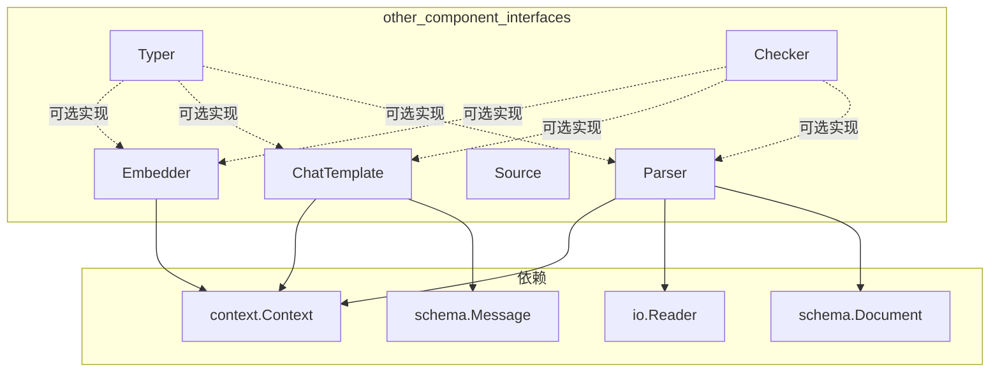

# other_component_interfaces 模块技术深度解析

## 1. 模块概述

`other_component_interfaces` 模块是 Eino 框架中组件接口层的重要组成部分，它定义了除模型和工具之外的其他核心组件的标准接口。这些接口包括嵌入器（Embedder）、聊天模板（ChatTemplate）、文档源（Source）、文档解析器（Parser）以及类型和回调检查器（Typer/Checker）。

这个模块的核心价值在于：它为框架中的各种辅助组件提供了统一的抽象契约，使得不同实现可以无缝替换，同时保持系统的整体架构一致性。想象一下，如果你可以像更换电池一样更换嵌入模型或文档解析器，而不需要修改使用它们的代码——这就是这个模块要实现的目标。

## 2. 核心组件架构



## 3. 核心组件详解

### 3.1 Embedder - 文本嵌入器接口

**设计意图**：
`Embedder` 接口定义了将文本转换为向量表示的标准契约。在语义搜索、聚类分析、文本分类等场景中，我们需要将非结构化的文本数据转换为计算机可以处理的数值向量——这个过程就是"嵌入"。

```go
type Embedder interface {
    EmbedStrings(ctx context.Context, texts []string, opts ...Option) ([][]float64, error)
}
```

**核心机制**：
- **批量处理**：接口接受 `[]string` 而非单个字符串，这是因为现代嵌入模型通常支持批量处理，能显著提高吞吐量。
- **上下文传递**：`context.Context` 参数允许传递超时控制、取消信号和请求元数据。
- **可配置性**：通过 `opts ...Option` 提供了灵活的配置机制，不同实现可以定义自己的选项。

**数据流向**：
输入文本列表 → Embedder 实现 → 向量列表。每个输入文本对应一个 `[]float64` 向量，保持顺序一致。

### 3.2 ChatTemplate - 聊天模板接口

**设计意图**：
`ChatTemplate` 解决了"如何将变量填充到提示词模板中生成结构化消息序列"的问题。在 LLM 应用中，提示词工程至关重要，而模板化是管理提示词的有效方式。

```go
type ChatTemplate interface {
    Format(ctx context.Context, vs map[string]any, opts ...Option) ([]*schema.Message, error)
}
```

**核心机制**：
- **变量映射**：`vs map[string]any` 提供了键值对形式的变量注入，这使得模板可以引用外部数据。
- **消息序列输出**：返回的是 `[]*schema.Message` 而非单个字符串，这反映了现代 LLM API 的多轮对话特性。
- **上下文感知**：同样支持 `context.Context` 用于传递控制信号和元数据。

**默认实现**：
注意到代码中有 `var _ ChatTemplate = &DefaultChatTemplate{}`，这表明框架提供了一个默认实现 `DefaultChatTemplate`，用户可以直接使用或自定义。

### 3.3 Source - 文档源结构体

**设计意图**：
`Source` 是一个简单但关键的数据结构，它抽象了"文档来自哪里"这个概念。在文档处理流程中，我们需要一种统一的方式来引用文档位置。

```go
type Source struct {
    URI string
}
```

**设计考量**：
- **URI 而非 URL**：使用 URI（统一资源标识符）而非更具体的 URL，这为本地文件、数据库记录、云存储对象等各种文档来源提供了统一的表示方式。
- **简洁性**：只包含一个 `URI` 字段，保持了极简设计，额外信息可以通过 URI 的格式或其他机制传递。

### 3.4 Parser - 文档解析器接口

**设计意图**：
`Parser` 接口定义了从原始字节流中提取结构化文档的标准方式。不同的文档格式（PDF、Word、HTML 等）需要不同的解析逻辑，但它们都应该产生统一的 `schema.Document` 结构。

```go
type Parser interface {
    Parse(ctx context.Context, reader io.Reader, opts ...Option) ([]*schema.Document, error)
}
```

**核心机制**：
- **流式输入**：使用 `io.Reader` 而非 `[]byte`，这允许处理大文件而不需要将整个内容加载到内存中。
- **多文档输出**：返回 `[]*schema.Document` 而非单个文档，这是因为某些输入源（如压缩包、包含多个章节的文件）可能产生多个文档。

### 3.5 Typer 和 Checker - 组件元信息接口

**设计意图**：
这两个接口提供了组件自我描述的能力，是框架与组件实现之间的"元契约"。

```go
type Typer interface {
    GetType() string
}

type Checker interface {
    IsCallbacksEnabled() bool
}
```

**Typer 的作用**：
- 为组件提供人类可读的类型标识，用于日志、监控和调试。
- 框架会默认将组件全名构造成 `{Typer}{Component}` 的形式。
- 推荐使用驼峰命名法（CamelCase）。

**Checker 的作用**：
- 允许组件自主控制回调行为。如果 `IsCallbacksEnabled()` 返回 `false`，框架将不会启动默认的回调切面，而是由组件自己决定回调的执行位置和注入的信息。
- 这为高级用户提供了完全控制回调机制的灵活性，同时保持了默认行为的简单性。

**辅助函数**：
```go
func GetType(component any) (string, bool)
func IsCallbacksEnabled(i any) bool
```
这两个函数提供了类型安全的方式来检查组件是否实现了相应接口并获取其值。

## 4. 依赖关系分析

### 4.1 流入依赖（被哪些模块使用）

虽然我们没有完整的依赖图，但从接口设计可以推断，这些接口主要被以下类型的模块使用：

1. **Flow 层组件**：如 [Flow Retrievers](flow_retrievers.md) 和 [Flow Indexers](flow_indexers.md) 可能会使用 `Embedder` 来生成向量。
2. **ADK 层**：各种 [ADK Agent](adk_agent_interface.md) 实现可能使用 `ChatTemplate` 来格式化提示词。
3. **文档处理管道**：会组合使用 `Source`、`Parser`、`Loader` 和 `Transformer` 来构建文档处理流程。
4. **回调系统**：[Callbacks System](callbacks_system.md) 会使用 `Typer` 和 `Checker` 来确定如何处理组件的回调。

### 4.2 流出依赖（使用了哪些模块）

从代码中可以明确看到的依赖：

- **schema 包**：`ChatTemplate` 依赖 [schema.Message](schema_core_types.md)，`Parser` 和 `Source` 相关接口依赖 [schema.Document](schema_core_types.md)。
- **context 包**：所有主要接口都使用 `context.Context` 来传递控制信号。
- **io 包**：`Parser` 使用 `io.Reader` 来处理输入流。

## 5. 设计决策与权衡

### 5.1 接口极简主义 vs 功能丰富性

**决策**：所有接口都保持了极简设计，通常只包含一个核心方法。

**权衡分析**：
- **优点**：
  - 降低了实现者的负担，更容易创建新的组件实现。
  - 提高了接口的稳定性，不需要因为添加新功能而破坏现有实现。
  - 遵循了"接口隔离原则"，组件只需要依赖它们实际使用的方法。
- **缺点**：
  - 某些高级功能可能需要通过选项模式（`opts ...Option`）来实现，这增加了使用的复杂性。
  - 发现可用功能需要查看具体实现的文档，而不是接口签名本身。

**为什么这样设计**：
在框架层面，保持接口的极简和稳定是首要考虑。功能的丰富性可以通过具体实现和选项模式来提供，而不需要改变接口契约。

### 5.2 批量处理 vs 单次处理

**决策**：`Embedder.EmbedStrings` 和 `Parser.Parse` 都设计为批量处理接口。

**权衡分析**：
- **优点**：
  - 性能优化：许多底层实现（如嵌入模型 API）本身支持批量操作，批量接口可以避免多次网络往返。
  - 减少开销：即使底层不支持批量，框架层面也可以实现批处理逻辑来摊销开销。
- **缺点**：
  - 对于只需要处理单个项目的场景，API 略显冗长（需要创建单元素切片）。
  - 错误处理更复杂：是在第一个错误时失败，还是尽可能多地处理并返回部分结果？

**为什么这样设计**：
在 ML/AI 相关的应用中，批量处理通常是性能的关键。对于单次处理的场景，可以通过辅助函数或包装器来简化使用。

### 5.3 可选接口模式

**决策**：`Typer` 和 `Checker` 被设计为可选实现的接口，而非强制要求。

**权衡分析**：
- **优点**：
  - 简单组件不需要实现这些接口，降低了入门门槛。
  - 功能可以渐进式添加：先实现核心功能，再根据需要添加元信息。
- **缺点**：
  - 调用方需要使用类型断言来检查这些接口是否实现，增加了运行时的不确定性。
  - 缺少编译时强制检查，可能导致某些组件缺少必要的元信息。

**为什么这样设计**：
这是 Go 语言中常见的设计模式，它在保持接口简单的同时提供了扩展机制。通过提供辅助函数（如 `GetType` 和 `IsCallbacksEnabled`），框架封装了类型断言的复杂性，使得使用这些可选接口更加安全和方便。

## 6. 使用指南与最佳实践

### 6.1 实现 Embedder

```go
type MyEmbedder struct {
    // 内部字段
}

func (e *MyEmbedder) EmbedStrings(ctx context.Context, texts []string, opts ...Option) ([][]float64, error) {
    // 实现逻辑
    // 1. 解析选项
    // 2. 调用实际的嵌入模型
    // 3. 处理结果并返回
}

// 可选：实现 Typer 来提供类型信息
func (e *MyEmbedder) GetType() string {
    return "My"
}

// 可选：实现 Checker 来自定义回调行为
func (e *MyEmbedder) IsCallbacksEnabled() bool {
    return true // 或者 false，根据需要
}
```

### 6.2 实现 ChatTemplate

```go
type MyChatTemplate struct {
    template string
}

func (t *MyChatTemplate) Format(ctx context.Context, vs map[string]any, opts ...Option) ([]*schema.Message, error) {
    // 1. 检查上下文是否已取消
    select {
    case <-ctx.Done():
        return nil, ctx.Err()
    default:
    }
    
    // 2. 使用 vs 中的变量填充模板
    // 3. 构造 schema.Message 列表
    // 4. 返回结果
}
```

### 6.3 使用 Source 和 Parser

```go
// 创建文档源
src := document.Source{URI: "s3://my-bucket/documents/report.pdf"}

// 在 Loader 中使用
func (l *MyLoader) Load(ctx context.Context, src document.Source, opts ...LoaderOption) ([]*schema.Document, error) {
    // 1. 根据 src.URI 打开输入流
    reader, err := openURI(ctx, src.URI)
    if err != nil {
        return nil, err
    }
    defer reader.Close()
    
    // 2. 根据文件类型选择合适的 Parser
    parser := selectParser(src.URI)
    
    // 3. 使用 Parser 解析文档
    return parser.Parse(ctx, reader, opts...)
}
```

### 6.4 最佳实践

1. **始终尊重 context**：在所有接口实现中，都应该检查 `ctx.Done()` 并及时响应取消信号。
2. **合理实现 Typer**：如果你的组件会被用于日志、监控或调试，强烈建议实现 `Typer` 接口。
3. **选项模式**：使用功能选项模式（Functional Options Pattern）来提供配置，而不是定义大量方法。
4. **错误处理**：返回有意义的错误信息，考虑使用 `fmt.Errorf("context: %w", err)` 来包装原始错误。
5. **并发安全**：确保你的实现可以被并发调用，或者明确文档化其并发安全性。

## 7. 注意事项与常见陷阱

### 7.1 Embedder 的常见陷阱

- **向量维度不一致**：确保对于相同的模型配置，每次调用返回的向量维度是一致的。
- **空输入处理**：明确如何处理空的文本列表或空字符串。
- **文本长度限制**：如果底层模型有文本长度限制，应该在文档中明确说明，并考虑提供截断或分割策略。

### 7.2 ChatTemplate 的常见陷阱

- **变量缺失**：当模板引用的变量在 `vs` 中不存在时，是应该返回错误还是使用默认值？最好在文档中明确这种行为。
- **消息角色处理**：确保生成的消息序列有合理的角色分配（如系统消息、用户消息、助手消息的顺序）。

### 7.3 Source 和 Parser 的常见陷阱

- **URI 格式假设**：不要对 URI 的格式做过多假设，最好使用专门的库来解析 URI。
- **资源泄漏**：始终确保 `io.Reader` 被正确关闭，使用 `defer reader.Close()` 是个好习惯。
- **大文件处理**：对于可能很大的输入流，确保你的实现不会一次性将所有内容加载到内存中。

### 7.4 Typer 和 Checker 的常见陷阱

- **命名冲突**：确保 `GetType()` 返回的名称足够独特，避免与其他组件类型冲突。
- **回调禁用的影响**：如果你通过 `IsCallbacksEnabled()` 返回 `false` 禁用了默认回调，确保你了解自己在做什么——这可能会影响框架的可观测性。

## 8. 相关模块参考

- [Schema Core Types](./Schema%20Core%20Types.md)：定义了 `Message`、`Document` 等核心数据结构
- [Component Interfaces](./Component%20Interfaces.md)：包含模型和工具相关的接口定义
- [Callbacks System](./Callbacks%20System.md)：了解回调机制如何与 `Checker` 交互
- [Flow Retrievers](flow_retrievers.md)：查看 `Embedder` 在实际组件中的使用示例
