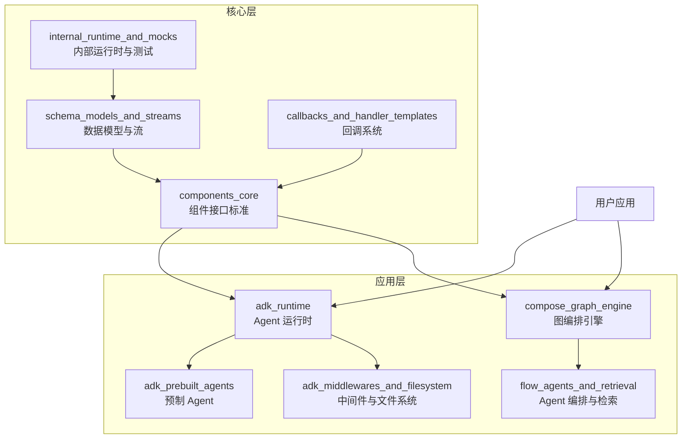

# Eino 项目 Wiki - 欢迎 👋

欢迎来到 **Eino** —— 一个用于构建生产级 LLM 应用的 Go 模块化框架。如果你是第一次接触这个项目，这里是你开始的最佳起点。

---

## 1. 什么是 Eino？（30秒看懂）

想象一下你要搭建一个 AI 助手团队：
- 你需要**专家员工**（单个 AI Agent）处理特定任务
- 你需要**项目经理**（工作流编排）让他们协同工作
- 你需要**文件柜**（文档检索）让他们能查到资料
- 你需要**打卡系统**（回调/监控）知道每个人在做什么

**Eino** 就是这个团队的「人事行政部」—— 它提供了一套标准化的「工位」、「流程」和「工具」，让你可以像搭积木一样快速搭建复杂的 AI 应用，而不用从零开始写每一行代码。

它不是一个绑定特定模型的黑盒子，而是一套**接口标准与实现套件**：用 Go 的强类型保证安全，用模块化保证灵活，用生产级的组件保证稳定。

---

## 2. 架构总览

这是 Eino 的核心架构图（核心模块，不超过 10 个节点）：

### 架构叙事 Walkthrough

Eino 采用**分层架构**，从底到上分别是：

1.  **基础层**（底座）：
    -   `schema_models_and_streams`：定义了整个系统的「通用语言」—— 消息、文档、工具的结构，以及流式处理的核心原语。
    -   `callbacks_and_handler_templates`：提供了「监控摄像头」—— 横切关注点（日志、追踪、指标）的统一回调机制。
    -   `internal_runtime_and_mocks`：提供了「后勤保障」—— 内部运行时支持和测试用的 Mock 组件。

2.  **核心层**（标准）：
    -   `components_core`：定义了「插座标准」—— 模型、工具、检索、文档处理的核心接口，所有具体实现都遵循这个标准。

3.  **编排层**（骨架）：
    -   `compose_graph_engine`：提供了「工作流蓝图」—— 用 DAG（有向无环图）来编排复杂任务，支持分支、并行、检查点。
    -   `adk_runtime`：提供了「团队经理」—— Agent 的核心运行时，管理生命周期、状态、中断/恢复。

4.  **应用层**（血肉）：
    -   `adk_prebuilt_agents`：提供了「即插即用的专家」—— DeepAgent、PlanExecute、Supervisor 等预制协作模式。
    -   `flow_agents_and_retrieval`：提供了「检索增强大脑」—— ReAct 运行时、多 Agent 编排、高级检索策略（MultiQuery、ParentDocument）。
    -   `adk_middlewares_and_filesystem`：提供了「工具柜」—— 文件系统抽象、大结果 Offload、技能加载等中间件。

---

## 3. 关键设计决策

我们在设计 Eino 时做了以下关键权衡，这些决策塑造了整个框架的性格：

| 决策 | 选择 | 原因 |
| :--- | :--- | :--- |
| **架构风格** | **模块化积木式** vs 大而全框架 | LLM 生态迭代太快，我们希望用户可以只替换需要的部分，不用推倒重来。 |
| **Agent 模式** | **接口优先，组合胜于继承** | 所有 Agent 实现统一的 `Agent` 接口，可以像乐高一样自由嵌套和组合（Workflow 本身也是一个 Agent）。 |
| **编排方式** | **基于 DAG 的图引擎** vs 硬编码流程 | 复杂任务需要分支、并行、条件执行，DAG 是业界标准且足够灵活。 |
| **状态管理** | **检查点（Checkpoint）机制** | 支持长时运行任务，可以随时暂停、从断点恢复，状态与执行分离。 |
| **流式输出** | **一等公民支持** | LLM 的流式输出是核心用户体验，`StreamReader`/`StreamWriter` 提供了类型安全的流式原语。 |
| **测试性** | **接口驱动，内置 Mock** | 所有核心组件都有对应的 Mock 实现，测试可以不依赖外部 API。 |

---

## 4. 核心模块指南

下面是每个主要模块的作用，以及深入阅读的链接：

### 基础层

1.  **[schema_models_and_streams](schema_models_and_streams.md)**
    这是系统的「数据结构圣经」。它定义了 `Message`（对话消息）、`Document`（文档）、`ToolInfo`（工具元数据）等核心模型，以及 `StreamReader`/`StreamWriter` 流式处理原语。**所有数据交换都通过这里定义的结构进行。**

2.  **[callbacks_and_handler_templates](callbacks_and_handler_templates.md)**
    这是系统的「监控与埋点系统」。它提供了 `HandlerBuilder` 和 `HandlerHelper`，让你可以在不修改组件代码的情况下，为模型、工具、检索等组件插入日志、追踪、指标等横切逻辑。

3.  **[internal_runtime_and_mocks](internal_runtime_and_mocks.md)**
    这是「幕后英雄」。它包含了内部运行时支持（中断、寻址、序列化）以及所有核心组件的 Mock 实现。**写测试时一定要看这个模块。**

### 核心层

4.  **[components_core](components_core.md)**
    这是系统的「接口宪法」。它不提供具体实现（比如 OpenAI 客户端），而是定义了所有组件必须遵守的契约：`BaseChatModel`、`Tool`、`Retriever`、`Loader` 等。**这是整个框架最稳定的部分。**

### 编排层

5.  **[compose_graph_engine](compose_graph_engine.md)**
    这是系统的「任务指挥室」。它允许你用声明式的 API 构建 DAG 工作流，支持分支、并行、循环、检查点、中断恢复。**复杂的 RAG  pipeline 或多步骤任务都在这里编排。**

6.  **[adk_runtime](adk_runtime.md)**
    这是系统的「Agent 大本营」。它提供了 Agent 的核心抽象：`ChatModelAgent`（基于大模型的 Agent）、`WorkflowAgent`（工作流 Agent）、`FlowAgent`（流控 Agent），以及 `Runner` 运行时。**构建 Agent 从这里开始。**

### 应用层

7.  **[adk_prebuilt_agents](adk_prebuilt_agents.md)**
    这是「预制专家团队」。它提供了三种开箱即用的多 Agent 协作模式：
    -   `DeepAgent`：深度任务分解，把子任务分包给专家。
    -   `PlanExecute`：经典的「计划-执行-重计划」循环。
    -   `Supervisor`：中心化的「老板-员工」模式。

8.  **[flow_agents_and_retrieval](flow_agents_and_retrieval.md)**
    这是「检索增强大脑」。它构建在上面两个模块之上，提供了：
    -   ReAct Agent 运行时。
    -   高级检索策略（MultiQuery、ParentDocument、Router）。
    -   多 Agent Host 编排。

9.  **[adk_middlewares_and_filesystem](adk_middlewares_and_filesystem.md)**
    这是「实用工具柜」。它提供了：
    -   统一的文件系统抽象（内存、本地磁盘）。
    -   大工具结果 Offload（避免 Context 溢出）。
    -   技能加载（从文件系统加载预定义技能）。

---

## 5. 端到端工作流示例

让我们通过两个最常见的用户旅程，看看数据是如何在系统中流动的。

### 旅程 1：构建一个带检索的 ReAct Agent

假设你要做一个「可以查文档的 AI 助手」：

1.  **数据准备**：
    -   使用 `components_core` 的 `Loader` 加载文档。
    -   使用 `DocumentSplitter` 切分文档。
    -   使用 `ParentIndexer`（来自 `flow_agents_and_retrieval`）构建父子文档索引。

2.  **检索器设置**：
    -   创建 `ParentRetriever`，检索时返回完整的父文档而不是片段。

3.  **Agent 构建**：
    -   使用 `adk_runtime` 的 `ChatModelAgent`，把检索器包装成一个工具。
    -   或者直接使用 `flow_agents_and_retrieval` 里的预制 ReAct Agent。

4.  **运行**：
    -   创建 `Runner`，传入 Agent。
    -   调用 `runner.Query()`，开始对话！

**数据流**：
`用户输入` -> `Runner` -> `ReAct Agent` -> (`思考` -> `调用检索工具` -> `ParentRetriever` -> `返回文档`) -> `模型生成最终回答` -> `流式输出给用户`

### 旅程 2：构建一个多 Agent 协作团队

假设你要做一个「产品经理 + 程序员 + 测试员」的协作团队：

1.  **定义专家**：
    -   创建三个 `ChatModelAgent`，分别赋予不同的人设（System Prompt）和工具。

2.  **选择模式**：
    -   使用 `adk_prebuilt_agents` 的 `Supervisor` 模式。
    -   Supervisor 作为「项目经理」，负责理解需求并分配任务。

3.  **编排**：
    -   把三个专家注册到 Supervisor 中。
    -   （可选）使用 `compose_graph_engine` 在外层再加一层工作流。

4.  **运行与监控**：
    -   使用 `callbacks_and_handler_templates` 添加回调，监控每个 Agent 的输入输出。
    -   启用检查点，支持长时任务中断恢复。

**数据流**：
`用户需求` -> `Supervisor Agent` -> (`分析` -> `分配给程序员 Agent`) -> `程序员写代码` -> (`返回给 Supervisor` -> `分配给测试员 Agent`) -> `测试员测试` -> `Supervisor 总结` -> `最终结果`

---

## 下一步？

如果你已经准备好了，请选择一个模块开始深入阅读，或者直接查看示例代码（如果有的话）。祝你在 Eino 的世界里玩得开心！🚀

---
*最后修改时间：2024年*