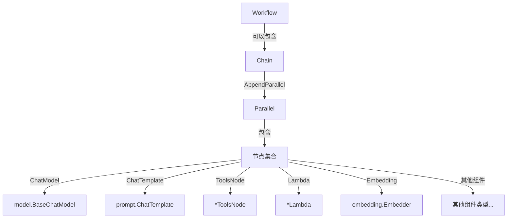

# Parallel Execution 模块技术深度解析

## 1. 概述

Parallel Execution 模块提供了一种在组合图（Compose Graph）中并行执行多个处理节点的能力。它允许开发者将多个不同类型的组件（如聊天模型、提示模板、工具节点、嵌入器、检索器等）组织成一个并行执行单元，从而提高处理效率。

### 核心问题解决

在构建复杂的 AI 应用程序时，常常需要同时执行多个独立的处理步骤。例如，你可能需要：
- 同时调用多个不同的大语言模型来获取多样化的结果
- 并行处理多个文档检索任务
- 同时执行多个数据转换操作

如果使用传统的串行方式，这些操作会依次执行，导致整体处理时间过长。Parallel Execution 模块通过提供一个优雅的 API 来组织和管理这些并行任务，解决了这个问题。

## 2. 核心概念与架构

### 2.1 核心数据结构

**Parallel 结构体**是本模块的核心，它负责管理一组并行执行的节点：

```go
type Parallel struct {
    nodes      []nodeOptionsPair
    outputKeys map[string]bool
    err        error
}
```

- **nodes**: 存储所有要并行执行的节点及其配置选项（使用内部的 `nodeOptionsPair` 结构体）
- **outputKeys**: 记录所有输出键，防止重复
- **err**: 存储在构建 Parallel 过程中可能出现的错误

### 2.2 架构角色

Parallel 模块在整个 Compose Graph 引擎中扮演着"并行节点集合"的角色。它本身不是一个独立的图，而是可以被嵌入到 [Chain](chain.md)（链）或其他更复杂的图结构（如 [Workflow](workflow.md)）中的一个组件。

### 2.3 组件关系图




## 3. 组件详解

### 3.1 Parallel 构造与节点添加

Parallel 模块提供了 `NewParallel()` 函数来创建一个新的并行执行单元：

```go
func NewParallel() *Parallel {
    return &Parallel{
        outputKeys: make(map[string]bool),
    }
}
```

创建后，可以通过一系列的 `AddXxx` 方法添加各种类型的节点：

| 方法 | 用途 | 对应组件类型 |
|------|------|--------------|
| `AddChatModel` | 添加聊天模型节点 | `model.BaseChatModel` |
| `AddChatTemplate` | 添加提示模板节点 | `prompt.ChatTemplate` |
| `AddToolsNode` | 添加工具节点 | `*ToolsNode` |
| `AddLambda` | 添加 Lambda 函数节点 | `*Lambda` |
| `AddEmbedding` | 添加嵌入器节点 | `embedding.Embedder` |
| `AddRetriever` | 添加检索器节点 | `retriever.Retriever` |
| `AddLoader` | 添加文档加载器节点 | `document.Loader` |
| `AddIndexer` | 添加索引器节点 | `indexer.Indexer` |
| `AddDocumentTransformer` | 添加文档转换器节点 | `document.Transformer` |
| `AddGraph` | 添加子图或链作为节点 | `AnyGraph` |
| `AddPassthrough` | 添加直通节点 | - |

所有这些方法都遵循相似的模式：接受一个 `outputKey`（用于标识该节点的输出）、具体的组件实例和可选的配置选项。

### 3.2 addNode 内部方法

所有的 `AddXxx` 方法最终都会调用内部的 `addNode` 方法：

```go
func (p *Parallel) addNode(outputKey string, node *graphNode, options *graphAddNodeOpts) *Parallel
```

这个方法执行以下关键验证和操作：
1. 检查是否已有错误存在（错误传播模式）
2. 验证节点不为 nil
3. 确保 outputKey 不重复
4. 设置节点的 outputKey 信息
5. 将节点添加到集合中

## 4. 数据流程与依赖分析

### 4.1 在更大的系统中的位置

Parallel 模块通常与以下组件配合使用：

```
[Chain] → [Parallel] → [多个并行节点]
    ↑
[Workflow] 或 [Graph]
```

1. **调用方**: 主要是 Chain（通过 `AppendParallel` 方法）、Workflow 或其他图结构
2. **被调用方**: 各种组件接口（ChatModel、ChatTemplate、ToolsNode 等）

### 4.2 执行流程

当包含 Parallel 组件的 Chain 或 Graph 被执行时：
1. 输入数据被传递到 Parallel 中的所有节点
2. 所有节点并行处理输入数据
3. 所有节点的输出被收集到一个 map 中，键为每个节点指定的 outputKey
4. 这个 map 作为 Parallel 组件的整体输出被传递到下一个处理步骤

## 5. 设计决策与权衡

### 5.1 错误处理策略

Parallel 采用了**早期错误捕获与传播**的策略：
- 在添加节点过程中如果出现错误（如重复的 outputKey），会立即记录到 `err` 字段
- 后续的所有操作都会检查这个错误字段并直接返回，避免无效操作

这种设计使得 API 可以支持链式调用，同时保证错误能够被正确捕获。

### 5.2 输出键唯一性

Parallel 严格要求每个节点的 outputKey 必须唯一：
- 使用 `map[string]bool` 来跟踪已使用的键
- 添加重复键会导致错误

这种设计确保了输出结果的清晰性和可预测性，避免了命名冲突。

### 5.3 组件多样性与统一接口

Parallel 支持多种不同类型的组件，但通过统一的内部机制处理它们：
- 每种组件类型都有对应的 `AddXxx` 方法
- 所有 `AddXxx` 方法内部都使用相应的 `toXxxNode` 函数转换为通用的 `graphNode`
- 最终通过统一的 `addNode` 方法处理

这种设计既提供了类型安全的 API，又保持了内部实现的简洁性。

## 6. 使用指南与最佳实践

### 6.1 基本使用示例

```go
// 创建一个并行执行单元
parallel := compose.NewParallel()

// 添加多个聊天模型
chatModel1, err := openai.NewChatModel(ctx, &openai.ChatModelConfig{Model: "gpt-4o"})
if err != nil {
    // 处理错误
}

chatModel2, err := openai.NewChatModel(ctx, &openai.ChatModelConfig{Model: "gpt-3.5-turbo"})
if err != nil {
    // 处理错误
}

parallel.AddChatModel("gpt4_output", chatModel1)
parallel.AddChatModel("gpt35_output", chatModel2)

// 重要：检查 parallel 是否有错误
if parallel.Err() != nil { // 注意：此方法在示例代码中未显示，但实际应该有类似方法
    // 处理构建错误
}

// 将并行单元添加到链中
chain := compose.NewChain[*schema.Message, map[string]any]()
chain.AppendParallel(parallel)

// 执行链
result, err := chain.Invoke(ctx, inputMessage)
if err != nil {
    // 处理执行错误
}

// 访问并行执行的结果
gpt4Result := result["gpt4_output"]
gpt35Result := result["gpt35_output"]
```

### 6.2 完整示例：并行文档处理

```go
// 创建并行处理单元
parallel := compose.NewParallel()

// 添加文档加载器
loader, err := file.NewLoader(ctx, &file.LoaderConfig{})
if err != nil {
    log.Fatal(err)
}
parallel.AddLoader("raw_docs", loader)

// 添加文档分割器
splitter, err := markdown.NewHeaderSplitter(ctx, &markdown.HeaderSplitterConfig{})
if err != nil {
    log.Fatal(err)
}
parallel.AddDocumentTransformer("split_docs", splitter)

// 添加嵌入器
embedder, err := openai.NewEmbedder(ctx, &openai.EmbeddingConfig{
    Model: "text-embedding-3-small",
})
if err != nil {
    log.Fatal(err)
}
parallel.AddEmbedding("doc_embeddings", embedder)

// 构建链
chain := compose.NewChain[string, map[string]any]()
chain.AppendParallel(parallel)

// 执行
results, err := chain.Invoke(ctx, "path/to/documents")
if err != nil {
    log.Fatal(err)
}

// 使用结果
rawDocs := results["raw_docs"]
splitDocs := results["split_docs"]
embeddings := results["doc_embeddings"]
```

### 6.3 常见模式

1. **模型结果对比**: 同时调用多个模型，便于结果比较
2. **并行数据处理**: 对同一输入执行多种不同的处理
3. **多路检索**: 使用多个检索器并行查找相关信息

### 6.4 注意事项

1. **输出键命名**: 为 outputKey 选择有意义的名称，便于后续处理
2. **错误处理**: 在构建完 Parallel 后，应该检查是否有错误发生
3. **资源考虑**: 并行执行会同时消耗更多资源，注意控制并行度

## 7. 边缘情况与陷阱

### 7.1 错误处理与错误传播

Parallel 模块使用了一种"错误累加"模式，任何添加节点时的错误都会被存储在 `err` 字段中，并且后续操作都会直接返回，不再执行实际工作。这种设计有几个重要的含义：

1. **无法部分恢复**: 一旦发生错误，整个 Parallel 组件就失效了，无法只使用部分成功添加的节点
2. **错误检查**: 开发者必须在使用 Parallel 前检查是否有错误（虽然目前提供的代码中没有显示 `Err()` 或类似方法，但这是一个常见的模式）
3. **错误类型**: 可能的错误包括：
   - 重复的 outputKey
   - nil 节点
   - 节点缺少必要的信息

### 7.2 输出键冲突

每个节点必须有唯一的 outputKey，试图添加具有相同 outputKey 的第二个节点会导致错误。这是一个严格的约束，确保了输出结果的清晰性。

### 7.3 节点间依赖

Parallel 中的所有节点都接收相同的输入，它们之间没有直接的数据依赖关系。如果需要节点间的依赖，应该使用 Chain 或其他图结构，而不是 Parallel。

### 7.4 执行时错误

当前代码只处理了构建 Parallel 时的错误，没有展示如何处理执行时的错误（例如，某个并行节点失败时的行为）。这取决于 Chain 或 Graph 如何处理 Parallel 组件的执行。

### 7.5 资源限制

并行执行多个节点可能会导致：
- 同时消耗更多的 API 配额
- 更高的内存使用
- 更多的并发网络连接

在添加大量节点到 Parallel 时，应该考虑这些因素。

## 9. 与其他组件的关系

Parallel Execution 模块与以下模块紧密相关：

- **[Chain](chain.md)**: 最常见的 Parallel 容器，通过 `AppendParallel` 方法使用
- **[Graph](graph.md)**: 底层的图引擎，Parallel 最终会被编译为图结构
- **[Workflow](workflow.md)**: 更高级的工作流抽象，也可以包含 Parallel 组件
- **[Component Interfaces](../component_interfaces.md)**: 定义了 Parallel 可以使用的各种组件类型


## 10. 扩展与未来方向

Parallel 模块设计为可以轻松扩展以支持新的组件类型。当有新的组件类型添加到系统中时，只需：

1. 为 Parallel 添加相应的 `AddXxx` 方法
2. 实现相应的 `toXxxNode` 转换函数
3. 确保新方法遵循与现有方法相同的模式

## 11. 总结

Parallel Execution 模块是 Compose Graph 引擎中的一个关键组件，它提供了一种简洁而强大的方式来组织和执行并行任务。通过将多个组件封装在一个 Parallel 结构中，开发者可以轻松地构建高效的 AI 应用程序，同时保持代码的清晰性和可维护性。

该模块的设计体现了以下原则：
- 简单易用的 API
- 类型安全
- 严格的错误处理
- 灵活的组件支持

从架构角度看，Parallel 模块介于底层的图执行引擎和高层的工作流抽象之间，为开发者提供了恰到好处的抽象级别：既足够简单以快速上手，又足够灵活以支持复杂的并行执行场景。

对于新加入团队的开发者来说，理解 Parallel 模块的设计理念和使用方法，将有助于更高效地构建和调试复杂的 AI 应用程序。

