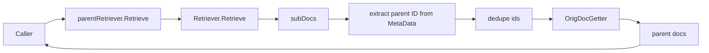

# parent_document_retriever 深度解析

`parent_document_retriever` 解决的是一个经典 RAG 矛盾：**检索时你希望文档越小越容易命中（chunk 级别），但生成时你又希望上下文更完整（parent document 级别）**。这个模块的作用就是在两者之间搭桥：先用底层检索器召回子文档，再根据子文档里的父文档 ID，回捞原始文档并返回。可以把它想成“快递中转站”：前半段按“包裹碎片”高效分拣，后半段按“订单号”合并还原成用户真正要看的完整货物。

## 一、它到底在解决什么问题？

如果你直接把长文档原文塞进向量库或全文检索，通常会遇到三个问题。第一，召回精度差：长文本包含太多主题，embedding 或关键词会被稀释。第二，召回成本高：每次比较的单位太大，排序质量和吞吐都受影响。第三，生成体验差：即便召回到了，也可能只命中文档中的局部片段。

业界常见做法是“索引时切分，检索时命中 chunk”。但这会引入另一个问题：LLM 最终拿到的是碎片，缺少上下文连续性。`parent_document_retriever` 的设计意图是保留两头好处：

- 底层检索依然在 chunk 层工作（高召回、高定位精度）
- 最终输出恢复为 parent 层（高语义完整性）

所以它不是一个“新检索算法”，而是一个**检索结果提升层（retrieval post-processing adapter）**。

## 二、心智模型：两阶段检索 + 一次 ID 反查

建议把这个模块放在脑中作为一个“翻译器”：

1. 上游调用者说“给我和 query 相关的文档”；
2. 底层检索器实际返回的是子文档 `[]*schema.Document`；
3. 本模块从每个子文档 `MetaData[parentIDKey]` 里提取父 ID，并去重；
4. 通过 `OrigDocGetter(ctx, ids)` 回源拿父文档；
5. 把父文档返回给上游。

这个结构非常“组合式（composition）”：它不关心底层是 Milvus、Elasticsearch 还是其他实现，只要满足 `retriever.Retriever` 接口即可。

## 三、架构与数据流



从调用链看，`parentRetriever` 是一个很薄的 orchestrator：

- 它**向下**只依赖两个能力：`Retriever.Retrieve(...)` 与 `OrigDocGetter(...)`。
- 它**向上**暴露的仍是统一接口 `Retriever.Retrieve(...)`，因此可以无缝接到任何期望 `retriever.Retriever` 的地方。

关键路径在 `Retrieve` 方法，逻辑顺序非常线性：先召回子文档，再抽 ID，再回源父文档。这里没有并发、没有缓存、没有重排序，意味着行为透明、可预测，也意味着更多性能/排序责任外置给底层与 `OrigDocGetter`。

## 四、核心组件深挖

### 4.1 `Config`

`Config` 是模块的全部扩展面，包含三个字段：

- `Retriever retriever.Retriever`
- `ParentIDKey string`
- `OrigDocGetter func(ctx context.Context, ids []string) ([]*schema.Document, error)`

其中真正决定行为的是后两者的契约配合。

`ParentIDKey` 指定了“子文档里哪一个 metadata 键保存父文档 ID”。如果这个键缺失，子文档会被静默忽略；如果值不是 `string`，同样忽略。也就是说，这里把 metadata 质量问题当作“不可召回”处理，而非 hard error。

`OrigDocGetter` 则定义了“如何从父 ID 取回原文档”。它可以接数据库、KV、对象存储，或任何自定义回源逻辑。这个设计把存储策略彻底解耦出模块本体：模块只做 ID 管道，不做存储假设。

### 4.2 `NewRetriever(ctx, config *Config)`

构造函数只做两件事：

1. 校验 `config.Retriever` 不为空；
2. 校验 `config.OrigDocGetter` 不为空。

注意它**不会**校验 `ParentIDKey` 是否为空字符串。这是一个值得留意的隐式契约：若 `ParentIDKey == ""`，读取的将是 `MetaData[""]`。这在 Go map 上是合法的，但通常不是你想要的配置。

返回值类型是 `retriever.Retriever` 而不是具体 struct，体现了模块面向接口暴露、隐藏实现细节的风格。

### 4.3 `parentRetriever`（内部实现体）

内部字段对应配置直接落地：

- `retriever`：底层子文档检索器
- `parentIDKey`：父 ID 的 metadata 键名
- `origDocGetter`：父文档回源函数

这是典型“装饰器/包装器（wrapper）”实现：持有一个同接口对象并增强其语义。

### 4.4 `(*parentRetriever).Retrieve(...)`

这是模块唯一热路径，核心机制如下：

1. 调 `p.retriever.Retrieve(ctx, query, opts...)` 拿 `subDocs`。
2. 遍历 `subDocs`，读取 `subDoc.MetaData[p.parentIDKey]`。
3. 仅当值是 `string` 时纳入候选 ID。
4. 通过 `inList` 做线性去重，保留首次出现顺序。
5. 调 `p.origDocGetter(ctx, ids)` 返回父文档结果。

几个非显然点：

- 它将 `opts ...retriever.Option` 原样透传给底层检索器，自己不消费这些 option。
- 返回结果的顺序由 `OrigDocGetter` 决定，不再保证与子文档得分顺序一致。
- 如果所有子文档都没有有效父 ID，则会调用 `OrigDocGetter(ctx, []string{})`；空切片行为取决于你的 getter 实现。

### 4.5 `inList(elem string, list []string) bool`

这是一个 O(n) 的去重辅助函数。整体去重复杂度 O(n²)。

在“每次召回几十个 chunk”的常见场景这通常可接受，代码也最直接；如果你准备让底层检索一次返回几千条，这里就会成为热点，应该改为 `map[string]struct{}` 去重。

## 五、依赖关系与契约分析

### 它调用了什么

本模块显式调用依赖只有两类：

- `components.retriever.interface.Retriever`：通过 `Retrieve(ctx, query, opts...)` 拿子文档
- `OrigDocGetter`（配置注入函数）：通过 `ids []string` 回源父文档

数据结构契约则依赖 `schema.document.Document`：

- 子文档必须在 `MetaData` 中提供 `ParentIDKey -> string`
- 回源返回值为 `[]*schema.Document`

### 什么会调用它

`NewRetriever` 返回 `retriever.Retriever`，所以任何接收该接口的上游都可以调用它。换句话说，它在系统中的角色是一个**可插拔检索中间层**。

从模块族关系看，它通常与 [parent_document_indexer](parent_document_indexer.md) 成对使用：后者在索引阶段把 `parentIDKey` 写入子文档 metadata，前者在检索阶段再利用这个键还原父文档。两者键名不一致会导致“召回子文档但回捞不到父文档”的静默退化。

此外，它也可以与 [multiquery_rewriter_retriever](multiquery_rewriter_retriever.md) 或 [router_retriever](router_retriever.md) 组合，但组合顺序会影响语义（见后文）。

## 六、设计取舍：它为什么长这样

这个实现的核心取舍是“极简编排”优先。

第一，**简单性 > 功能完备性**。它不做排序融合、不做缓存、不做并发回源，只做最小职责：ID 映射。这降低了认知负担和出错面，尤其适合做基础构件。

第二，**解耦性 > 内聚控制**。`OrigDocGetter` 用函数注入，而不是内置某种 store 接口，意味着模块对存储层几乎零耦合；代价是调用方必须自己处理批量查询、顺序稳定、缺失 ID 等细节。

第三，**吞错策略 > 强校验策略**。对子文档 metadata 缺失/类型错误选择忽略，不中断请求。这样在脏数据场景下可用性更高，但问题会更隐蔽（结果变少而不是报错）。

第四，**低开销实现 > 极致性能**。`inList` 的线性去重实现很直观，但在大结果集下不够高效。当前实现显然假设每次召回规模中小。

## 七、使用方式与组合建议

```go
r, err := parent.NewRetriever(ctx, &parent.Config{
    Retriever:   chunkRetriever,
    ParentIDKey: "parent_id",
    OrigDocGetter: func(ctx context.Context, ids []string) ([]*schema.Document, error) {
        // 例如：从文档主存按 ID 批量读取
        return docStore.GetByIDs(ctx, ids)
    },
})
if err != nil {
    return err
}

docs, err := r.Retrieve(ctx, "how does checkpoint recovery work")
```

实践上建议把它放在“最终输出层”：先让多路检索、重写查询等策略在 chunk 级别完成，再在最后一步做 parent 回捞。这样可以最大化利用 chunk 级排序与融合信息。

## 八、新贡献者最该注意的坑

最常见问题不是代码 bug，而是契约错配。

第一类是 `ParentIDKey` 对不齐。索引端写的是 `"parent_id"`，检索端读 `"source_doc_id"`，结果会直接退化为空或偏少。这个问题在运行时没有明确报错。

第二类是 metadata 类型不对。代码要求 `MetaData[parentIDKey]` 必须是 `string`；如果上游写入了 `int`、`[]byte` 或自定义类型，会被静默忽略。

第三类是 `OrigDocGetter` 的顺序与去重语义。模块只保证传入 ID 的顺序是“子文档首次出现顺序”；getter 若自行重排，最终输出顺序会变化。若上游依赖稳定排序，需要在 getter 内显式按输入 ID 重排。

第四类是空 ID 列表处理。模块在无有效 parent ID 时仍调用 getter；请确保 getter 对空切片返回空结果而非报错。

第五类是性能预期。当前去重是 O(n²)，当 `subDocs` 很大时会放大延迟。如果你要扩展大规模召回，请优先优化去重策略并评估回源批量能力。

## 九、可扩展方向（在不破坏当前设计的前提下）

如果未来要增强这个模块，建议遵守“保持核心单一职责”的原则，把增强点放在可选策略上，例如：

- 可选的去重实现（list / hash）
- 可选的缺失 parentID 观测（日志/计数）
- 可选的父文档排序策略（按首命中子文档位置、按聚合得分等）

这样既不破坏当前 API 的简洁性，也能满足高阶场景。

## 参考

- [parent_document_indexer](parent_document_indexer.md)
- [multiquery_rewriter_retriever](multiquery_rewriter_retriever.md)
- [router_retriever](router_retriever.md)
