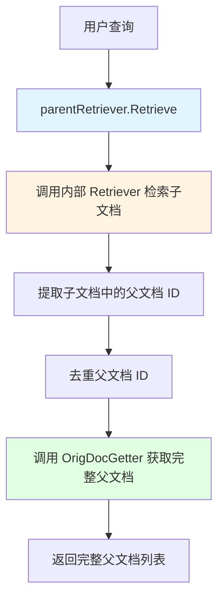

# Parent Retriever 模块技术深度解析

## 问题背景与模块存在意义

在 RAG (Retrieval-Augmented Generation) 系统中，我们经常面临一个经典的权衡困境：**检索粒度与上下文完整性的矛盾**。

想象一下：如果你将一份 1000 字的文档整体向量化存储，检索时虽然能返回完整文档，但向量相似度可能不够精确——因为文档中不同段落讨论的主题可能差异很大。反之，如果你将文档切分成 100 字的小块分别向量化，检索精度提高了，但返回的结果只是碎片化的段落，缺乏完整的上下文信息，可能导致 LLM 无法准确理解原文含义。

这就是 `parent_retriever` 模块要解决的核心问题：**通过先检索子文档片段保证精度，再回溯获取完整父文档保证上下文完整性**。它就像一位图书管理员——先根据关键词找到书中最相关的章节（子文档），然后把整本书（父文档）递给你，而不是只给你那几页纸。

## 架构与数据流程



### 核心数据流程

1. **子文档检索阶段**：`parentRetriever` 首先将查询转发给内部的 `Retriever`（可以是向量检索器、全文检索器等），获取最相关的子文档片段。
2. **父文档 ID 提取阶段**：遍历检索到的子文档，从每个子文档的 `MetaData` 中提取 `ParentIDKey` 对应的父文档 ID。
3. **去重阶段**：使用简单的线性扫描去重，避免重复获取同一个父文档。
4. **父文档获取阶段**：将去重后的父文档 ID 列表传递给 `OrigDocGetter`，获取完整的父文档并返回。

## 核心组件深度解析

### Config 结构体

`Config` 是 `parentRetriever` 的配置中心，体现了"组合优于继承"的设计思想。

```go
type Config struct {
    Retriever     retriever.Retriever
    ParentIDKey   string
    OrigDocGetter func(ctx context.Context, ids []string) ([]*schema.Document, error)
}
```

**设计意图**：
- **Retriever**：这是一个策略模式的应用——`parentRetriever` 不关心底层检索是用向量数据库还是全文检索，只要实现了 `retriever.Retriever` 接口即可。这种设计使得 `parentRetriever` 可以与任何检索器组合使用。
- **ParentIDKey**：将元数据键名配置化，而不是硬编码，提高了灵活性。不同的索引系统可能使用不同的键名（如 `parent_id`、`source_doc_id`、`original_id` 等）。
- **OrigDocGetter**：这是一个依赖倒置的设计——`parentRetriever` 不负责存储或获取父文档，而是将这个责任委托给调用者。这使得父文档可以存储在任何地方：数据库、文件系统、对象存储等。

### parentRetriever 结构体

```go
type parentRetriever struct {
    retriever     retriever.Retriever
    parentIDKey   string
    origDocGetter func(ctx context.Context, ids []string) ([]*schema.Document, error)
}
```

`parentRetriever` 本身非常简洁，它只是一个"编排者"，将三个独立的组件（检索器、ID 提取逻辑、文档获取器）组合在一起工作。这种设计符合单一职责原则——每个组件只负责一件事。

### Retrieve 方法

```go
func (p *parentRetriever) Retrieve(ctx context.Context, query string, opts ...retriever.Option) ([]*schema.Document, error) {
    subDocs, err := p.retriever.Retrieve(ctx, query, opts...)
    if err != nil {
        return nil, err
    }
    ids := make([]string, 0, len(subDocs))
    for _, subDoc := range subDocs {
        if k, ok := subDoc.MetaData[p.parentIDKey]; ok {
            if s, okk := k.(string); okk && !inList(s, ids) {
                ids = append(ids, s)
            }
        }
    }
    return p.origDocGetter(ctx, ids)
}
```

**关键逻辑解析**：

1. **容错处理**：如果子文档没有 `ParentIDKey` 或该键对应的值不是字符串，该子文档会被静默忽略。这是一种防御性编程——不因为个别文档的元数据问题导致整个检索失败。
2. **去重策略**：使用简单的线性扫描去重（`inList` 函数）。这里没有使用 map 去重，可能是考虑到检索结果通常不会太多，线性扫描的性能已经足够，且避免了 map 的初始化开销。
3. **选项透传**：`opts ...retriever.Option` 被直接透传给内部的 `Retriever`，这使得调用者可以控制底层检索的行为（如返回数量、相似度阈值等）。

## 依赖关系分析

### 输入依赖

- **retriever.Retriever**：来自 [components/retriever](retriever.md) 接口。`parentRetriever` 对这个接口有强依赖——它需要一个实际的检索器来获取子文档。
- **schema.Document**：来自 [schema/document](schema_document.md)。这是整个系统中文档的标准表示。

### 被依赖情况

`parentRetriever` 实现了 `retriever.Retriever` 接口，因此它可以被任何接受 `retriever.Retriever` 的组件使用，形成一种"装饰器"模式。这意味着你可以嵌套使用 `parentRetriever`，或者将它与其他检索器（如 [multiQueryRetriever](multi_query_retriever.md)、[routerRetriever](router_retriever.md)）组合使用。

## 设计决策与权衡

### 1. 组合而非继承

**选择**：通过 `Config` 注入依赖，而不是通过子类化扩展。

**原因**：这种设计提供了最大的灵活性。你可以将 `parentRetriever` 与任何检索器组合，而不需要为每种检索器创建一个子类。

**权衡**：调用者需要自己组装各个组件，增加了初始化的复杂度。但这是值得的，因为它带来了更好的可扩展性。

### 2. 静默忽略无效文档

**选择**：如果子文档没有有效的父文档 ID，就忽略它，而不是返回错误。

**原因**：在实际场景中，索引可能包含各种来源的文档，有些可能没有父文档。如果因为一个文档的问题导致整个检索失败，会降低系统的健壮性。

**权衡**：这可能导致调用者困惑——为什么检索到的子文档数量和最终返回的父文档数量不一致？但这是一个合理的权衡，因为健壮性通常比严格性更重要。

### 3. 简单的线性去重

**选择**：使用 `inList` 函数进行线性扫描去重，而不是使用 map。

**原因**：对于检索结果这种通常较小的数据集（通常不超过 100 个文档），线性扫描的性能与 map 相近，但代码更简单，且避免了 map 的初始化开销。

**权衡**：如果检索结果非常大（比如 1000+ 个文档），这种方法的性能会下降。但在 RAG 场景中，检索结果通常不会这么多。

### 4. 不保留子文档的排序信息

**选择**：最终返回的父文档顺序由 `OrigDocGetter` 决定，而不是子文档的相似度顺序。

**原因**：多个子文档可能对应同一个父文档，无法简单地保留子文档的排序。此外，父文档的排序逻辑可能与子文档不同（比如按相关性、时间等）。

**权衡**：这可能导致最相关的子文档对应的父文档不是排在第一位。如果需要保留相关性顺序，调用者需要在 `OrigDocGetter` 中自己处理排序逻辑。

## 使用指南与示例

### 基本用法

```go
// 1. 创建底层检索器（例如向量检索器）
vectorRetriever := createVectorRetriever()

// 2. 创建父文档获取器（例如从数据库获取）
docGetter := func(ctx context.Context, ids []string) ([]*schema.Document, error) {
    return documentDatabase.GetByIDs(ctx, ids)
}

// 3. 创建 parentRetriever
parentRetr, err := NewRetriever(ctx, &Config{
    Retriever:     vectorRetriever,
    ParentIDKey:   "parent_id",
    OrigDocGetter: docGetter,
})

// 4. 使用，就像使用普通的 retriever 一样
docs, err := parentRetr.Retrieve(ctx, "什么是 RAG？")
```

### 与 parentIndexer 配合使用

`parentRetriever` 通常与 [parentIndexer](parent_indexer.md) 配合使用——`parentIndexer` 负责将文档切分成子文档并建立索引，`parentRetriever` 负责检索子文档并回溯父文档。

```go
// 索引阶段
indexer := parentIndexer.NewIndexer(...)
err = indexer.Add(ctx, documents)

// 检索阶段
retriever := parentRetriever.NewRetriever(...)
docs, err := retriever.Retrieve(ctx, query)
```

## 边界情况与注意事项

### 1. 元数据类型安全

`ParentIDKey` 对应的值必须是 `string` 类型，否则会被静默忽略。如果你的元数据中 ID 是 `int` 类型，需要在索引时转换为 `string`。

### 2. 去重逻辑的性能

如前所述，`inList` 函数使用线性扫描。如果你的检索结果可能超过 100 个文档，建议自己实现一个更高效的去重逻辑。

### 3. 父文档获取的批量操作

`OrigDocGetter` 接收的是一个 ID 列表，而不是单个 ID。这是为了支持批量获取，提高性能。如果你的存储系统不支持批量获取，需要在 `OrigDocGetter` 中自己处理并发获取。

### 4. 上下文传递

`parentRetriever` 将 `ctx` 透传给内部的 `Retriever` 和 `OrigDocGetter`，这意味着超时、取消等信号会正确传播。但要注意，如果你在 `OrigDocGetter` 中启动新的 goroutine，需要正确地传递上下文。

### 5. 错误处理

如果内部 `Retriever` 返回错误，`parentRetriever` 会直接返回该错误。但如果 `OrigDocGetter` 返回错误，也会直接返回。这意味着调用者需要同时处理检索错误和文档获取错误。

## 相关模块

- [retriever](retriever.md)：`parentRetriever` 实现的接口
- [schema/document](schema_document.md)：文档类型定义
- [parent_indexer](parent_indexer.md)：与 `parentRetriever` 配合使用的索引器
- [multi_query_retriever](multi_query_retriever.md)：另一种检索增强策略，可以与 `parentRetriever` 组合使用
- [router_retriever](router_retriever.md)：路由检索器，也可以与 `parentRetriever` 组合使用
