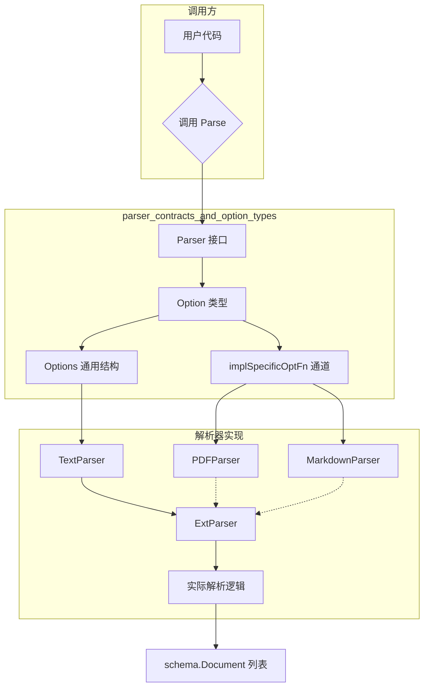

# parser_contracts_and_option_types 模块

## 模块概述

`parser_contracts_and_option_types` 模块是 EINO 文档处理流水线中的**契约定义层**。它定义了一个统一的 `Parser` 接口和灵活的选项（Option）机制，使得不同格式的文档解析器（PDF、DOCX、Markdown、纯文本等）能够以一致的方式被调用，同时保留各自特有的配置能力。

**解决的问题**：在文档处理场景中，我们需要从各种格式的文件中提取结构化内容。不同的解析器有不同的配置需求——比如 PDF 解析可能需要页码范围，Markdown 解析可能需要是否支持数学公式的选项。如果为每个解析器单独定义接口，会导致调用方需要针对每种格式编写不同的代码。这个模块提供了**统一的入口**和**可组合的选项系统**，让调用方可以用相同的方式调用任何解析器。

---

## 核心抽象与心智模型

### 1. Parser 接口 — 统一的解析入口

```go
type Parser interface {
    Parse(ctx context.Context, reader io.Reader, opts ...Option) ([]*schema.Document, error)
}
```

这个接口极其简洁，只有三部分：
- **输入**：上下文、原始字节流、选项列表
- **输出**：解析后的文档列表（可能返回多页/多段）
- **约束**：所有解析器都必须实现这个签名

**心智模型**：把 `Parser` 想象成**电源适配器**。无论你插入的是 110V 还是 220V 的电器（不同格式的文档），适配器（Parser 接口）都提供统一的插口（`Parse` 方法），将输入转换为标准的"电流"（`schema.Document`）。

### 2. Option 机制 — 双通道选项系统

这是本模块最核心的设计亮点。`Option` 结构体同时承载了两类信息：

```go
type Option struct {
    apply             func(opts *Options)      // 通用选项的回调
    implSpecificOptFn any                      // 实现特定选项的回调（泛型函数指针）
}
```

- **`apply` 字段**：处理**通用选项**（所有解析器都理解的选项，如 URI 和 ExtraMeta）
- **`implSpecificOptFn` 字段**：处理**实现特定选项**（只有特定解析器认识的选项）

**为什么这样设计？**

想象你在餐厅点餐：
- **通用选项**（`apply`）：无论你点什么菜，都可以要求"少盐"、"加辣"——这是所有菜品都支持的
- **实现特定选项**（`implSpecificOptFn`）：但如果点的是牛排，你可以要求"几分熟"；如果是饮料，可以要求"少冰"——这些选项只有特定菜品（解析器）能理解

这种设计的核心优势是：
1. **接口稳定性**：Parser 接口签名永远不变，增加新选项不需要修改接口
2. **实现灵活性**：每个解析器可以定义自己的选项而不影响其他解析器
3. **调用方统一性**：调用方可以用相同的方式传递选项，解析器自动提取自己需要的部分

---

## 架构图与数据流



### 关键数据流

**以 ExtParser（基于文件扩展名自动选择解析器）为例**：

1. **选项传递**：`docs, err := extParser.Parse(ctx, reader, parser.WithURI("./file.pdf"), parser.WithExtraMeta(map[string]any{"source": "upload"}))`

2. **选项提取**：
   - `GetCommonOptions(&Options{}, opts...)` 提取通用选项（URI, ExtraMeta）
   - `GetImplSpecificOptions[PDFOptions](&defaultOpts, opts...)` 提取 PDF 特定选项

3. **解析路由**：通过 `filepath.Ext(opt.URI)` 获取扩展名，查找对应的 Parser 实现

4. **元数据合并**：解析完成后，将 `ExtraMeta` 合并到每个文档的 `MetaData` 中

---

## 核心组件详解

### 1. Parser 接口

**组件 ID**: `components.document.parser.interface.Parser`

这是整个文档解析模块的**核心契约**。任何实现了 `Parse(ctx, reader, ...Option) ([]*schema.Document, error)` 的类型都可以作为解析器使用。

**使用场景**：
- 作为 `Loader` 的内部组件（参考 [document_loader_contracts_and_options](./document_loader_contracts_and_options.md)）
- 作为 `ExtParser` 的注册解析器
- 直接被用户代码调用

**注意事项**：
- 返回的文档列表可能为空（`nil` 或空切片），但不应返回错误
- 解析失败时应返回具体的错误信息，建议包含失败位置（如页码、行号）

### 2. Options 通用结构

**组件 ID**: `components.document.parser.option.Options`

```go
type Options struct {
    URI       string      // 文档来源 URI
    ExtraMeta map[string]any  // 要合并到每个文档的元数据
}
```

**设计意图**：
- `URI` 不仅用于标识文档来源，还被 `ExtParser` 用于**自动选择解析器**（通过文件扩展名）
- `ExtraMeta` 允许调用方附加业务相关的上下文信息（如"所属项目"、"创建人"），这些信息会被注入到每个解析出的文档中

### 3. Option 类型与工具函数

**组件 ID**: `components.document.parser.option.Option`

这是实现双通道选项系统的关键类型。提供了以下工具函数：

| 函数 | 作用 |
|------|------|
| `WithURI(uri string)` | 创建通用 URI 选项 |
| `WithExtraMeta(meta map[string]any)` | 创建通用元数据选项 |
| `GetCommonOptions(base, opts...)` | 从选项列表中提取通用配置 |
| `WrapImplSpecificOptFn[T](fn)` | 将实现特定选项包装为统一 Option 类型 |
| `GetImplSpecificOptions[T](base, opts...)` | 从选项列表中提取实现特定配置 |

**典型用法（解析器实现者视角）**：

```go
// 1. 定义自己的选项结构
type PDFParserOptions struct {
    StartPage int
    EndPage   int
    WithOCR   bool
}

// 2. 暴露选项函数
func WithPageRange(start, end int) Option {
    return WrapImplSpecificOptFn(func(o *PDFParserOptions) {
        o.StartPage = start
        o.EndPage = end
    })
}

// 3. 在 Parse 方法中提取选项
func (p *PDFParser) Parse(ctx context.Context, reader io.Reader, opts ...Option) ([]*schema.Document, error) {
    // 提取通用选项
    common := GetCommonOptions(&Options{}, opts...)
    
    // 提取实现特定选项
    pdfOpts := GetImplSpecificOptions(&PDFParserOptions{
        StartPage: 1,
        EndPage:   -1, // -1 表示解析到最后一页
    }, opts...)
    
    // 使用选项进行解析...
}
```

---

## 设计决策与 tradeoff 分析

### 1. 为什么使用函数回调而不是直接传值？

`Option` 使用函数回调（`apply func(opts *Options)`）而不是直接存储值，这看起来有些反直觉。**为什么这样做？**

**选择**：函数回调（Builder Pattern）
**替代方案**：直接存储值

**理由**：
- **可选参数**：Go 没有可选参数，但通过函数回调可以模拟"命名参数"的效果
- **延迟执行**：回调在 `GetCommonOptions` 或 `GetImplSpecificOptions` 时才真正执行，这意味着我们可以先收集所有选项，最后统一处理
- **组合能力**：多个 `Option` 可以叠加，后面的选项可以覆盖前面的

```go
// 这种灵活性来自于回调机制
opts := []Option{
    WithURI("a.txt"),
    WithExtraMeta(map[string]any{"k": "v1"}),  // 第一个
    WithExtraMeta(map[string]any{"k": "v2"}),  // 第二个会覆盖第一个
}
```

### 2. 为什么要区分通用选项和实现特定选项？

**选择**：双通道 Option 设计
**替代方案**：单一 Options 结构体，所有解析器共享

** tradeoff 分析**：

| 方面 | 单一结构体 | 双通道设计 |
|------|------------|------------|
| 接口简洁性 | 简单，所有人共享 | 稍复杂，需要两个提取函数 |
| 扩展性 | 差，增加选项需改接口 | 好，Parser 可自行扩展 |
| 类型安全 | 好，编译时检查 | 一般，使用 `any` 类型 |
| 性能 | 略好 | 略有开销（函数指针） |

**选择理由**：在库/框架场景中，**扩展性通常比微小的性能提升更重要**。EINO 期望支持多种文档格式，每种格式有不同的配置需求是合理的设计假设。

### 3. 为什么 URI 既用于标识又用于路由？

`ExtParser` 使用 `WithURI` 传入的路径来自动选择解析器，这是设计决策的微妙之处：

**优点**：
- 调用方无需显式指定解析器类型
- 符合"约定优于配置"原则

**缺点**：
- 隐式依赖文件扩展名，可能导致意外行为
- 无法处理无扩展名或扩展名不匹配的情况

**注意事项**：文档中明确说明了这一点，要求 `URI` 必须能被 `filepath.Ext` 正确解析。这是**有意的约束**，降低了使用复杂度。

---

## 依赖关系与集成点

### 上游依赖

本模块本身不依赖其他业务模块，只依赖标准库和 `schema` 包：

```go
import (
    "context"
    "io"
    "github.com/cloudwego/eino/schema"
)
```

### 下游使用方

1. **[document_loader_contracts_and_options](./document_loader_contracts_and_options.md)**：Loader 组件使用 Parser 作为内部组件，通过 `WithParserOptions` 传递解析器选项

2. **ExtParser**（同包内）：基于扩展名自动路由到合适的解析器

3. **具体解析器实现**（通常在独立包中）：
   - PDF 解析器
   - DOCX 解析器
   - Markdown 解析器
   - 等等

### 与其他模块的对比

| 模块 | 职责 | 关系 |
|------|------|------|
| [document_loader_contracts_and_options](./document_loader_contracts_and_options.md) | 文档加载（从 URL/文件到内存） | 使用 Parser 进行内容解析 |
| 本模块 | 文档解析（从原始字节到结构化 Document） | 被 Loader 调用 |
| [document_transformer_options_and_callbacks](./document_transformer_options_and_callbacks.md) | 文档转换（切分、过滤） | 接收 Parser 输出的 Document |

---

## 常见问题与注意事项

### 1. 扩展名不匹配怎么办？

`ExtParser` 的默认行为是使用 `TextParser` 作为 fallback。如果你需要更严格的处理：

```go
extParser, _ := parser.NewExtParser(ctx, &parser.ExtParserConfig{
    Parsers:        parsers,
    FallbackParser: nil, // 设为 nil 会导致解析失败并返回错误
})
```

### 2. 实现特定选项的类型安全

`implSpecificOptFn` 使用 `any`（即 `interface{}`）存储，这意味着类型转换失败会被静默忽略：

```go
// 如果传入的 Option 是为 PDFParser 准备的，但被 MarkdownParser 接收
// 下面的类型断言会失败，但不会 panic
if s, ok := opt.implSpecificOptFn.(func(*PDFOptions)); ok {
    s(&pdfOpts)
}
// 类型不匹配时，ok 为 false，静默跳过
```

**警告**：实现者应该清楚自己期望的选项类型，错误地传递选项类型不会得到编译时错误。

### 3. ExtraMeta 的合并策略

`ExtraMeta` 会**覆盖**文档原有的同名元数据键：

```go
// 假设解析出的文档 MetaData 已有 {"source": "original"}
// 使用 WithExtraMeta(map[string]any{"source": "override"})
// 结果是 {"source": "override", ...}
```

如果需要保留原有值，需要在调用方自行处理。

### 4. 性能考虑

每次调用 `GetCommonOptions` 和 `GetImplSpecificOptions` 都会遍历整个选项列表。对于高频调用场景，可以考虑：

- 在解析器实例中缓存已提取的选项（如果选项不变）
- 使用具体类型而非函数回调（但会失去可选参数的灵活性）

---

## 总结

`parser_contracts_and_option_types` 模块是 EINO 文档处理流水线的**契约层**，它的设计体现了以下原则：

1. **接口最小化**：Parser 接口只有一个方法，保持极简
2. **扩展性优先**：通过双通道 Option 设计，让框架可以支持任意多的解析器类型而不改变接口
3. **约定与灵活性平衡**：通用选项（URI、ExtraMeta）提供一致性，实现特定选项提供灵活性

理解这个模块的关键是理解 **"双通道 Option"** 设计模式：它允许框架定义所有人都能理解的通用语义（"这是文档的来源"），同时保留每个解析器实现自己特有配置的能力（"PDF 需要知道从哪一页开始"）。

---

## 相关文档

- [document_loader_contracts_and_options](./document_loader_contracts_and_options.md) - 文档加载器契约
- [document_transformer_options_and_callbacks](./document_transformer_options_and_callbacks.md) - 文档转换器契约