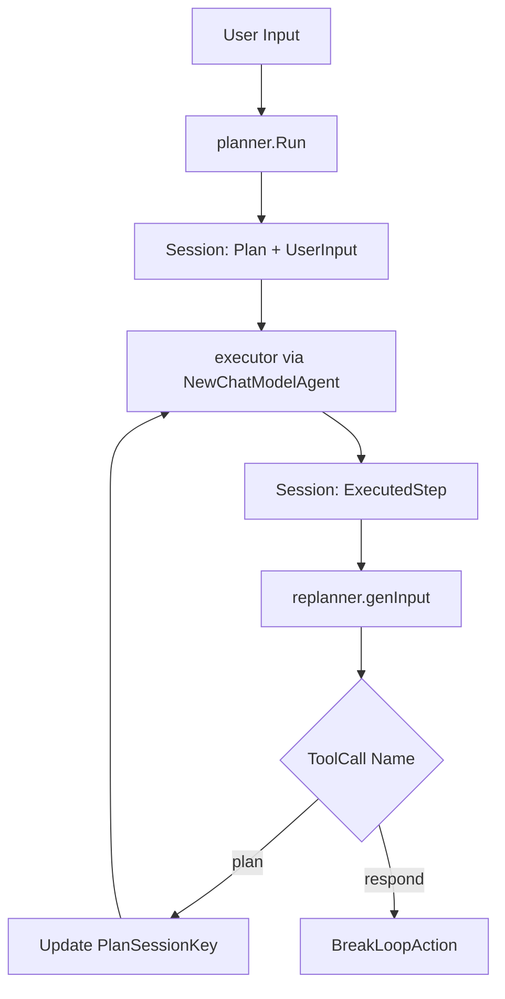

# plan_execute_orchestration_core

`plan_execute_orchestration_core` 是 `ADK Prebuilt Plan-Execute` 的执行心脏：把一个复杂任务拆成“先规划、再执行、再复盘改计划”的闭环。你可以把它想成一个**项目经理回路**：

1. `planner` 先给出任务分解（Plan）
2. `executor` 只做当前第一步
3. `replanner` 根据执行结果决定“继续改计划”还是“直接收官回复”

这个设计不是为了“多加一个 agent”，而是为了解决现实问题：模型一次性给长答案时，容易遗漏、跑偏、或者无法根据中间发现动态修正。

---

## 1. 核心抽象：模块如何“思考”

### Plan 接口：把“计划”升级为一等公民

`Plan` 不是普通 `[]string`，而是一个接口：

- `FirstStep() string`
- `json.Marshaler`
- `json.Unmarshaler`

这背后的意图是：

- **执行器只关心“下一步”**（`FirstStep`）
- **规划/复盘都要在 prompt 里传输计划结构**（Marshal）
- **模型输出必须回到强类型结构**（Unmarshal）

默认实现是 `defaultPlan{ Steps []string }`，但通过 `NewPlan` 可替换为你自己的领域计划格式。

### ExecutionContext：上下文快照

`ExecutionContext` 聚合三件事：

- `UserInput []adk.Message`
- `Plan Plan`
- `ExecutedSteps []ExecutedStep`

你可以把它理解成“当前项目面板”：目标、剩余路线、已完成证据。

### Session Key：隐式总线

该模块通过 session 在子 agent 间传状态（而不是函数参数直传）：

- `UserInputSessionKey`
- `PlanSessionKey`
- `ExecutedStepSessionKey`
- `ExecutedStepsSessionKey`

这是一种松耦合编排手法：每个 agent 专注自己读写的键，最终由组合器拼出闭环。

---

## 2. 端到端数据流

### 2.1 `planner.Run`

`planner.Run` 内部使用 `compose.NewChain[*adk.AgentInput, Plan]`：

1. `genInputFn` 生成 planner prompt（默认 `defaultGenPlannerInputFn` + `PlannerPrompt`）
2. 调用模型
3. 流式/非流式分支处理输出
4. 解析 plan JSON 并写入 `PlanSessionKey`

关键点：

- 若走 tool calling 模式，会强制 `model.WithToolChoice(schema.ToolChoiceForced)`
- 通过 `argToContent` 把 `ToolCall.Function.Arguments` 转成可流式展示的 assistant 内容
- 一开始就写入 `UserInputSessionKey`

### 2.2 `executor`（由 `NewExecutor` 构建）

`executor` 本体不是手写 Run，而是包装 `adk.NewChatModelAgent`：

- `GenModelInput` 从 session 读 `Plan / UserInput / ExecutedSteps`
- 用 `defaultGenExecutorInputFn` 把 `ExecutorPrompt` 填好
- `OutputKey` 设为 `ExecutedStepSessionKey`

这意味着 executor 每轮只负责“产出本轮执行结果字符串”，并把结果交给后续 replanner 消费。

### 2.3 `replanner.Run`

`replanner.Run` 也是 compose chain：

1. `replanner.genInput`：
   - 读取本轮 `ExecutedStepSessionKey`
   - 读取 `PlanSessionKey` 并取 `FirstStep`
   - 追加到 `ExecutedStepsSessionKey`
2. 调用 tool-calling model（强制 tool choice）
3. 根据第一条 tool call 分支：
   - `respondTool.Name` -> `adk.NewBreakLoopAction(...)`
   - `planTool.Name` -> 反序列化新计划并覆写 `PlanSessionKey`

所以 replanner 是策略枢纽：它决定循环是否继续。

### 2.4 总编排 `New`

`New` 做了两层组合：

- `adk.NewLoopAgent`：子 agent 为 `[Executor, Replanner]`
- `adk.NewSequentialAgent`：子 agent 为 `[Planner, loop]`

即：先规划一次，再进入“执行-复盘”循环。

---

## 3. 非显然设计选择与取舍

### 选择 A：Plan 抽象成接口（灵活性 > 简单性）

- 好处：可替换领域计划结构，不锁死 `defaultPlan`
- 代价：调用方必须保证自定义 `Plan` 的 JSON 兼容性

### 选择 B：Executor 复用 `ChatModelAgent`（复用性 > 细粒度控制）

- 好处：直接获得工具调用、中断恢复、迭代控制等成熟能力
- 代价：executor 逻辑受 `adk.ChatModelAgent` 契约约束（比如 `OutputKey` 行为）

### 选择 C：Replanner 用 tool-call 二选一（正确性 > 自由文本）

- 好处：通过 `plan`/`respond` 两个工具把决策空间收敛，便于程序判定
- 代价：模型必须支持工具调用；否则不能用该默认实现

### 选择 D：大量 session 断言 + panic（快速失败 > 宽容容错）

代码里有多处 `panic("impossible: ... not found")`。这代表作者把这些键视为**强不变量**：

- `planner` 必须先于 executor
- `executor` 必须先于 replanner

这样能尽早暴露编排错误，但如果你乱改子 agent 顺序，会直接崩。

---

## 4. 关键组件速览

- `PlannerConfig`：支持两种 planner 模型接入
  - `ChatModelWithFormattedOutput`
  - `ToolCallingChatModel + ToolInfo`
- `ExecutorConfig`：定义执行模型、工具集、最大迭代、输入生成函数
- `ReplannerConfig`：定义 plan/respond 双工具与输入生成函数
- `Config`：把 Planner/Executor/Replanner 组装成完整 plan-execute-replan agent
- `Response`：replanner 选择收官时的 JSON 结构（`response` 字段）
- `ExecutedStep`：记录某一步 + 执行结果

---

## 5. 新贡献者容易踩的坑

1. **空计划问题**：`defaultPlan.FirstStep()` 可能返回空字符串；executor prompt 仍会执行，导致模型收到“空 step”。
2. **工具调用假设**：tool-call 路径若模型没返回 `ToolCalls`，会报 `no tool call`。
3. **只看第一条 ToolCall**：planner/replanner 都只读取 `ToolCalls[0]`，多 tool call 会被忽略。
4. **`ExecutedStepSessionKey` 类型假设为 string**：replanner 中是 `executedStep.(string)`，如果你改了 executor 输出类型会 panic。
5. **循环退出语义**：replanner 发 `BreakLoopAction`，不是 `ExitAction`；依赖 LoopAgent 解释此动作。

---

## 6. 与其他模块的关系

- 运行时能力来自 [ADK ChatModel Agent](ADK ChatModel Agent.md)（`NewExecutor` 直接复用）
- 顶层生命周期由 [ADK Runner](ADK Runner.md) 驱动（通过 `Run/Resume` 消费事件）
- 组合执行模型来自 [Compose Graph Engine](Compose Graph Engine.md)（planner/replanner 内部 chain）
- 消息与工具结构依赖 [Schema Core Types](Schema Core Types.md)（`Message`、`ToolCall`、`ToolInfo`）
- 中断/恢复语义对接 [ADK Interrupt](ADK Interrupt.md) 与 [Compose Interrupt](Compose Interrupt.md)
