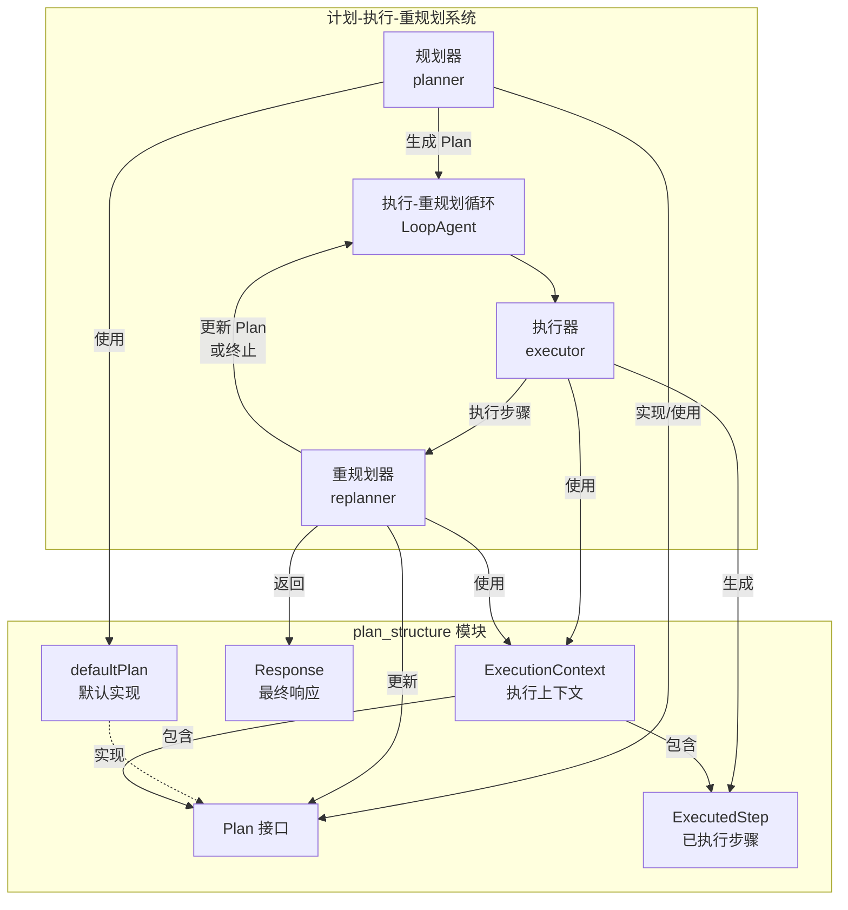

# Plan Structure 模块技术深度解析

## 1. 模块概述

`plan_structure` 模块是 `planexecute` 包中的核心组件，它定义了计划-执行-重规划（Plan-Execute-Replan）模式中计划的结构、序列化和交互方式。这个模块解决了如何将大语言模型的非结构化输出转换为可执行、可追踪的结构化计划的问题，同时提供了灵活的扩展机制以适应不同的应用场景。

## 2. 问题空间与设计洞察

在构建基于大语言模型的智能代理时，我们面临一个核心挑战：如何让模型生成的输出既具有人类可读的自然语言表达，又能被系统可靠地解析和执行？

### 为什么需要这个模块？

1. **结构化需求**：纯自然语言输出难以被程序可靠地解析和执行
2. **序列化需求**：计划需要在不同组件间传递、存储和恢复
3. **可扩展性需求**：不同应用场景可能需要不同形式的计划结构
4. **交互需求**：计划需要能够在提示词模板中使用，并能从模型输出中解析

### 设计洞察

模块的核心设计理念是将计划抽象为一个接口，而不是固定的结构体，这样既提供了默认实现满足常见需求，又保留了足够的灵活性让用户自定义计划结构。同时，通过强制实现 JSON 序列化接口，确保了计划可以在整个系统中无缝传递。

## 3. 核心组件详解

### 3.1 Plan 接口

```go
type Plan interface {
    FirstStep() string
    json.Marshaler
    json.Unmarshaler
}
```

**设计意图**：
- `FirstStep()` 方法提供了执行引擎与计划结构之间的解耦点，执行器只需要知道如何获取第一步，而不需要了解计划的完整结构
- 强制实现 JSON 序列化接口确保了计划可以在提示词模板中使用，也可以从模型输出中解析
- 接口设计允许用户自定义计划结构，只要满足这三个契约即可

### 3.2 defaultPlan 结构体

```go
type defaultPlan struct {
    Steps []string `json:"steps"`
}
```

**设计特点**：
- 简单直观的步骤列表结构
- 清晰的 JSON 标签定义了序列化格式
- 通过类型别名技巧避免了 JSON 序列化时的无限递归

**实现细节**：
```go
func (p *defaultPlan) MarshalJSON() ([]byte, error) {
    type planTyp defaultPlan
    return sonic.Marshal((*planTyp)(p))
}

func (p *defaultPlan) UnmarshalJSON(bytes []byte) error {
    type planTyp defaultPlan
    return sonic.Unmarshal(bytes, (*planTyp)(p))
}
```

这里使用了一个巧妙的技巧：通过定义一个类型别名 `planTyp`，我们可以在不触发无限递归的情况下使用标准的 JSON 序列化逻辑。这是 Go 语言中自定义 JSON 序列化的常见模式。

### 3.3 Response 结构体

```go
type Response struct {
    Response string `json:"response"`
}
```

**设计意图**：
- 提供了一个标准的最终响应结构
- 与 `RespondToolInfo` 配合使用，让模型可以生成结构化的最终答案

### 3.4 ExecutionContext 结构体

```go
type ExecutionContext struct {
    UserInput     []adk.Message
    Plan          Plan
    ExecutedSteps []ExecutedStep
}
```

**设计意图**：
- 封装了执行器和重规划器所需的所有上下文信息
- 作为 `GenModelInputFn` 的输入，提供了生成提示词所需的完整数据

### 3.5 ExecutedStep 结构体

```go
type ExecutedStep struct {
    Step   string
    Result string
}
```

**设计意图**：
- 记录已执行步骤及其结果
- 用于在重规划阶段展示执行历史，帮助模型做出更好的决策

## 4. 数据流程与架构角色

### 4.1 架构图



### 4.2 架构图说明

上述架构图展示了 `plan_structure` 模块与整个计划-执行-重规划系统之间的关系：

1. **上层系统**：包含规划器、执行器、重规划器和执行-重规划循环，这些组件共同协作完成任务
2. **plan_structure 模块**：提供核心数据结构和接口，定义了系统中各组件间的数据契约
3. **交互关系**：展示了各组件如何使用和转换 `plan_structure` 模块中定义的数据结构

### 4.3 数据流程

`plan_structure` 模块在整个计划-执行-重规划流程中的数据流动如下：

1. **规划阶段**：
   - 规划器生成 `Plan` 对象
   - `Plan` 被序列化为 JSON 并存储在会话中
   - `Plan` 被包含在 `ExecutionContext` 中传递给执行器

2. **执行阶段**：
   - 执行器从 `ExecutionContext` 中获取 `Plan`
   - 调用 `FirstStep()` 获取要执行的步骤
   - 执行结果与步骤一起存储为 `ExecutedStep`

3. **重规划阶段**：
   - 重规划器收到包含 `Plan` 和 `ExecutedSteps` 的 `ExecutionContext`
   - 可能生成新的 `Plan` 或 `Response`

### 4.4 架构角色

`plan_structure` 模块在整个系统中扮演着以下角色：

- **数据契约定义者**：定义了计划、执行上下文等核心数据结构
- **序列化层**：处理结构化数据与 JSON 之间的转换
- **扩展点提供者**：通过 `Plan` 接口和 `NewPlan` 函数类型提供扩展机制

## 5. 设计决策与权衡

### 5.1 接口 vs 结构体

**决策**：使用 `Plan` 接口而不是固定的结构体

**权衡**：
- ✅ 优点：提供了极大的灵活性，允许用户自定义计划结构
- ✅ 优点：将执行引擎与具体计划结构解耦
- ❌ 缺点：增加了一定的复杂性，用户需要理解接口契约
- ❌ 缺点：编译器无法在编译时捕获所有可能的错误

**为什么这样选择**：
在智能代理系统中，不同应用场景对计划的需求差异很大。有些场景可能只需要简单的步骤列表，而有些场景可能需要更复杂的结构，如包含子任务、依赖关系、预估时间等。通过使用接口，我们可以满足这些不同需求而不需要修改核心执行逻辑。

### 5.2 JSON 序列化作为接口的一部分

**决策**：将 `json.Marshaler` 和 `json.Unmarshaler` 包含在 `Plan` 接口中

**权衡**：
- ✅ 优点：确保所有计划实现都可以与提示词模板和模型输出无缝集成
- ✅ 优点：简化了使用方式，调用者不需要担心序列化问题
- ❌ 缺点：强制了序列化格式，限制了某些可能的实现方式
- ❌ 缺点：对于不需要 JSON 序列化的场景，这是一个不必要的约束

**为什么这样选择**：
在计划-执行-重规划模式中，计划几乎总是需要在以下场景中使用：
1. 在提示词模板中展示给模型
2. 从模型的输出中解析
3. 在会话中存储和传递

所有这些场景都需要 JSON 序列化，因此将其作为接口的一部分是合理的。

### 5.3 使用类型别名避免无限递归

**决策**：在 `MarshalJSON` 和 `UnmarshalJSON` 方法中使用类型别名技巧

**权衡**：
- ✅ 优点：避免了无限递归，同时保留了标准 JSON 序列化的所有功能
- ✅ 优点：代码简洁，性能好
- ❌ 缺点：对于不熟悉这个技巧的开发者来说，可能不太直观

**为什么这样选择**：
这是 Go 语言中自定义 JSON 序列化的标准和最佳实践，既满足了需求，又保持了代码的简洁性和性能。

## 6. 扩展点与使用方式

### 6.1 自定义 Plan 实现

如果 `defaultPlan` 不能满足您的需求，您可以自定义 `Plan` 实现：

```go
type MyComplexPlan struct {
    Goal        string   `json:"goal"`
    Steps       []Step   `json:"steps"`
    Constraints []string `json:"constraints,omitempty"`
}

type Step struct {
    Description string `json:"description"`
    EstimatedTime int `json:"estimated_time,omitempty"`
    Dependencies []int `json:"dependencies,omitempty"`
}

func (p *MyComplexPlan) FirstStep() string {
    if len(p.Steps) == 0 {
        return ""
    }
    return p.Steps[0].Description
}

func (p *MyComplexPlan) MarshalJSON() ([]byte, error) {
    type planTyp MyComplexPlan
    return sonic.Marshal((*planTyp)(p))
}

func (p *MyComplexPlan) UnmarshalJSON(bytes []byte) error {
    type planTyp MyComplexPlan
    return sonic.Unmarshal(bytes, (*planTyp)(p))
}
```

然后，您需要提供一个 `NewPlan` 函数：

```go
func NewMyComplexPlan(ctx context.Context) Plan {
    return &MyComplexPlan{}
}
```

最后，在创建规划器和重规划器时使用它：

```go
planner, err := planexecute.NewPlanner(ctx, &planexecute.PlannerConfig{
    // 其他配置...
    NewPlan: NewMyComplexPlan,
})

replanner, err := planexecute.NewReplanner(ctx, &planexecute.ReplannerConfig{
    // 其他配置...
    NewPlan: NewMyComplexPlan,
})
```

### 6.2 自定义提示词模板

您可以自定义提示词模板来更好地指导模型生成符合您需求的计划：

```go
myPlannerPrompt := prompt.FromMessages(schema.FString,
    schema.SystemMessage(`您的自定义规划器提示词...`),
    schema.MessagesPlaceholder("input", false),
)

// 然后创建自定义的 GenInputFn
func myGenPlannerInputFn(ctx context.Context, userInput []adk.Message) ([]adk.Message, error) {
    msgs, err := myPlannerPrompt.Format(ctx, map[string]any{
        "input": userInput,
    })
    if err != nil {
        return nil, err
    }
    return msgs, nil
}

// 最后在配置中使用
planner, err := planexecute.NewPlanner(ctx, &planexecute.PlannerConfig{
    // 其他配置...
    GenInputFn: myGenPlannerInputFn,
})
```

## 7. 注意事项与常见陷阱

### 7.1 FirstStep() 的重要性

`FirstStep()` 方法是执行引擎与计划结构之间的关键契约。确保它返回的是清晰、可执行的步骤描述，而不是其他信息。

### 7.2 JSON 序列化的一致性

确保 `MarshalJSON` 和 `UnmarshalJSON` 的实现是一致的，即：
- 如果 `UnmarshalJSON` 可以解析某个 JSON，那么 `MarshalJSON` 应该能够生成相同或等价的 JSON
- 避免在序列化过程中丢失信息

### 7.3 会话键的使用

模块定义了几个会话键：
- `UserInputSessionKey`
- `PlanSessionKey`
- `ExecutedStepSessionKey`
- `ExecutedStepsSessionKey`

确保在自定义代码中使用这些键而不是硬编码字符串，以避免命名冲突。

### 7.4 工具信息与计划结构的匹配

如果您自定义了 `Plan` 实现，确保相应的 `ToolInfo` 也能匹配您的计划结构，否则模型可能无法生成正确的 JSON。

## 8. 与其他模块的关系

- **[ADK Agent Interface](adk_agent_interface.md)**：`plan_structure` 模块定义的结构会通过 `adk.Agent` 接口在不同代理间传递
- **[Schema Core Types](schema_core_types.md)**：`plan_structure` 模块依赖 `schema` 包进行序列化和消息处理
- **[Compose Graph Engine](compose_graph_engine.md)**：规划器和执行器内部使用 `compose` 包构建处理链

## 9. 总结

`plan_structure` 模块是计划-执行-重规划模式的基石，它通过精心设计的接口和结构，解决了如何将大语言模型的输出转换为可执行计划的问题。其核心设计理念是灵活性与简单性的平衡：通过接口提供扩展点，通过默认实现满足常见需求，通过 JSON 序列化确保无缝集成。

对于新加入团队的开发者，理解这个模块的设计意图和扩展点是有效使用计划-执行-重规划模式的关键。
