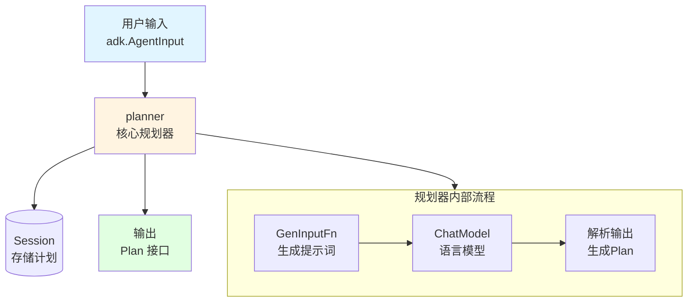

# Planner Component 技术深度解析

## 概述

`planner_component` 模块是 `plan-execute-replan` 模式中的核心组件之一，负责将用户的目标转换为结构化的执行计划。它通过与大语言模型交互，将模糊的任务需求分解为清晰、可执行的步骤序列，为后续的执行和重新规划奠定基础。

## 1. 问题与解决方案

### 问题场景

在构建 AI 代理系统时，我们经常面临这样的挑战：用户的输入通常是自然语言描述的模糊目标（如"帮我分析这个数据集并总结发现"），而代理需要将其转化为一系列可操作的步骤。直接让模型"做事情"往往导致效率低下、结果不可预测，因为模型缺乏明确的执行框架。

### 核心洞察

`planner_component` 的设计理念是：**将复杂任务分解为明确的计划，通过结构化输出约束模型行为**。这一设计带来三个关键优势：

1. **可观测性**：计划作为中间产物，让我们能够理解代理的思考过程
2. **可调试性**：当执行失败时，我们可以检查是计划本身有问题还是执行环节出错
3. **可恢复性**：结合重新规划机制，系统可以根据执行结果动态调整策略

## 2. 架构与数据流程

### 核心架构图



### 数据流程详解

1. **输入接收**：`planner.Run` 方法接收 `adk.AgentInput`，其中包含用户消息和流式输出配置
2. **提示词生成**：通过 `GenInputFn`（默认使用 `PlannerPrompt`）将用户输入转换为模型可理解的提示
3. **模型调用**：使用配置的语言模型（结构化输出模型或工具调用模型）生成计划
4. **输出解析**：将模型输出（JSON字符串或工具调用参数）解析为 `Plan` 接口实例
5. **会话存储**：将生成的计划存储在会话中，供后续执行器和重新规划器使用
6. **事件输出**：通过 `adk.AsyncIterator` 发出 `AgentEvent`，包含生成的消息和计划

## 3. 核心组件深度解析

### PlannerConfig 配置结构体

`PlannerConfig` 是规划器的配置中心，提供了两种主要的配置方式：

```go
type PlannerConfig struct {
    // 方式1：使用预配置的结构化输出模型
    ChatModelWithFormattedOutput model.BaseChatModel
    
    // 方式2：使用工具调用模型 + 工具定义
    ToolCallingChatModel model.ToolCallingChatModel
    ToolInfo             *schema.ToolInfo
    
    // 可选的自定义组件
    GenInputFn GenPlannerModelInputFn
    NewPlan    NewPlan
}
```

**设计意图**：提供灵活的配置选项以适应不同的模型能力。结构化输出模式适合原生支持 JSON 输出的模型，而工具调用模式则更通用，适用于大多数现代对话模型。

### planner 核心结构体

`planner` 是实现 `adk.Agent` 接口的核心结构体：

```go
type planner struct {
    toolCall   bool                    // 是否使用工具调用模式
    chatModel  model.BaseChatModel     // 底层语言模型
    genInputFn GenPlannerModelInputFn  // 提示词生成函数
    newPlan    NewPlan                 // Plan 实例创建函数
}
```

**关键方法解析**：

1. **Run 方法**：实现 `adk.Agent` 接口的核心执行逻辑
   - 使用 `compose.Chain` 构建执行管道
   - 支持流式输出和非流式输出两种模式
   - 通过协程异步执行，避免阻塞
   - 完善的 panic 恢复机制，确保稳定性

2. **内部执行链**：
   ```
   AgentInput → 生成提示词 → 调用模型 → 处理输出 → 解析为Plan
   ```

### Plan 接口与默认实现

`Plan` 接口定义了计划的基本契约：

```go
type Plan interface {
    FirstStep() string
    json.Marshaler
    json.Unmarshaler
}
```

**设计亮点**：
- 仅要求 `FirstStep()` 方法，为执行器提供明确的起点
- 集成 JSON 序列化接口，便于在提示词中使用和从模型输出解析
- 默认实现 `defaultPlan` 采用简单的步骤列表结构，覆盖大多数场景

## 4. 依赖关系分析

### 输入依赖

| 依赖项 | 用途 | 契约要求 |
|--------|------|----------|
| `adk.AgentInput` | 接收用户输入 | 必须包含 `Messages` 字段 |
| `model.BaseChatModel` 或 `model.ToolCallingChatModel` | 生成计划 | 实现相应的生成/流式接口 |
| `prompt.ChatTemplate` | 构建提示词 | 默认使用 `PlannerPrompt` |

### 输出依赖

| 输出项 | 消费者 | 格式要求 |
|--------|--------|----------|
| `Plan` 实例 | 执行器、重新规划器 | 实现 `Plan` 接口，可序列化为 JSON |
| `adk.AgentEvent` | 代理运行时 | 包含消息或错误信息 |
| 会话值 | 整个代理系统 | 使用预定义的会话键（`PlanSessionKey` 等） |

### 关键内部依赖

- **compose 包**：用于构建执行管道，提供链式调用和流式处理能力
- **schema 包**：提供消息结构、工具定义等核心数据类型
- **adk 包**：定义代理接口和运行时契约

## 5. 设计决策与权衡

### 设计决策1：双模式配置（结构化输出 vs 工具调用）

**选择**：同时支持 `ChatModelWithFormattedOutput` 和 `ToolCallingChatModel` 两种配置方式

**理由**：
- 不同模型提供商的能力差异很大，结构化输出是较新的特性
- 工具调用模式更成熟，兼容性更好
- 给用户选择权，让他们根据实际模型能力选择最适合的方式

**权衡**：
- 增加了代码复杂度，需要维护两条逻辑路径
- 但提供了更好的兼容性和灵活性

### 设计决策2：Plan 接口的最小化设计

**选择**：`Plan` 接口只要求 `FirstStep()` 方法和 JSON 序列化能力

**理由**：
- 执行器只需要知道第一步做什么，不需要了解整个计划结构
- JSON 序列化是与提示词和模型输出交互的必要条件
- 保持接口简单，便于自定义实现

**权衡**：
- 限制了默认执行器的能力（只能顺序执行第一步）
- 但为更复杂的计划结构和执行策略留下了扩展空间

### 设计决策3：通过会话共享状态

**选择**：使用 `adk.AddSessionValue` 和 `adk.GetSessionValue` 在组件间传递计划和执行结果

**理由**：
- 避免了复杂的参数传递
- 为代理系统提供了统一的状态共享机制
- 支持中断和恢复（与 checkpoint 机制配合）

**权衡**：
- 增加了组件间的隐式耦合
- 会话键需要全局协调，避免冲突

## 6. 使用指南与最佳实践

### 基本使用

```go
// 使用工具调用模式（推荐，兼容性更好）
planner, err := NewPlanner(ctx, &PlannerConfig{
    ToolCallingChatModel: myToolCallingModel,
    // ToolInfo: 可选，默认使用 PlanToolInfo
})

// 或者使用结构化输出模式
planner, err := NewPlanner(ctx, &PlannerConfig{
    ChatModelWithFormattedOutput: myStructuredOutputModel,
})
```

### 自定义计划结构

如果默认的 `defaultPlan` 不能满足需求，可以自定义 `Plan` 实现：

```go
type MyDetailedPlan struct {
    Steps []struct {
        Description string `json:"description"`
        Tools       []string `json:"tools"`
        EstimatedTime int `json:"estimated_time"`
    } `json:"steps"`
}

func (p *MyDetailedPlan) FirstStep() string {
    if len(p.Steps) == 0 {
        return ""
    }
    return p.Steps[0].Description
}

// 实现 MarshalJSON 和 UnmarshalJSON...

// 使用自定义计划
planner, err := NewPlanner(ctx, &PlannerConfig{
    ToolCallingChatModel: myModel,
    NewPlan: func(ctx context.Context) Plan {
        return &MyDetailedPlan{}
    },
    // 同时应提供相应的 ToolInfo
})
```

### 自定义提示词

```go
customGenInputFn := func(ctx context.Context, userInput []adk.Message) ([]adk.Message, error) {
    // 自定义提示词逻辑
    return myCustomPrompt.Format(ctx, map[string]any{
        "input": userInput,
        "custom_context": getMyCustomContext(ctx),
    })
}

planner, err := NewPlanner(ctx, &PlannerConfig{
    ToolCallingChatModel: myModel,
    GenInputFn: customGenInputFn,
})
```

## 7. 注意事项与潜在陷阱

### 会话键冲突

`planner_component` 使用预定义的会话键（`UserInputSessionKey`、`PlanSessionKey` 等）。确保：
- 不要在其他地方使用这些键存储不同类型的值
- 自定义组件使用自己的命名空间避免冲突

### 模型输出的可靠性

虽然我们通过结构化输出或工具调用约束了模型，但：
- 模型仍可能生成无效的 JSON
- 计划的质量高度依赖于模型能力和提示词质量
- 应该有错误处理和降级策略

### 流式输出的资源管理

当启用流式输出时，`planner` 会复制流（`sr.Copy(2)`），确保：
- 两个流都被正确消费或关闭
- 长时间运行的代理注意内存使用

### 与执行器和重新规划器的协调

`planner` 生成的计划需要与执行器和重新规划器协调：
- 自定义 `Plan` 实现时，确保执行器能正确理解 `FirstStep()` 的输出
- 重新规划器会替换计划，注意不要保留对旧计划的引用

## 8. 扩展点

`planner_component` 设计了几个明确的扩展点：

1. **自定义 Plan 结构**：通过 `NewPlan` 配置项
2. **自定义提示词**：通过 `GenInputFn` 配置项
3. **自定义工具定义**：通过 `ToolInfo` 配置项
4. **替换整个规划器**：实现 `adk.Agent` 接口并在 `Config` 中使用

## 总结

`planner_component` 是 `plan-execute-replan` 模式的起点，它通过将模糊目标转化为结构化计划，为整个代理系统提供了清晰的执行框架。其设计注重灵活性（双模式配置）、可扩展性（最小化接口）和实用性（会话共享状态），同时也考虑了不同模型能力的兼容性。

使用 `planner_component` 时，需要注意会话键冲突、模型输出的可靠性等问题，同时可以通过自定义 Plan 结构、提示词等方式满足特定需求。
