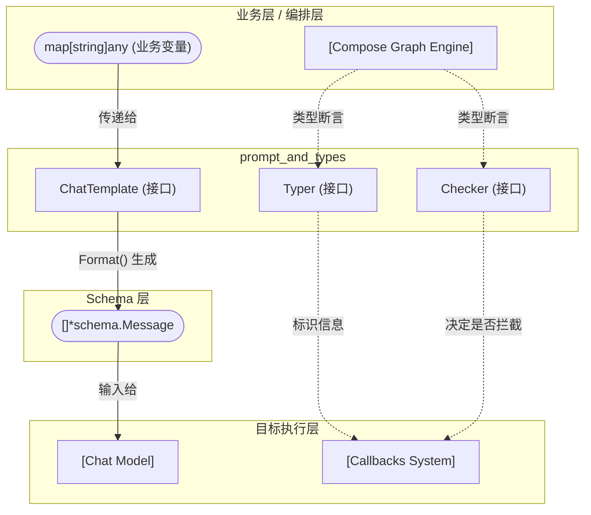

# 模块深度解析：prompt_and_types

作为 Eino 框架的核心接口定义层之一，`prompt_and_types` 模块看似轻量（仅包含少数接口和常量定义），但它却是整个框架能够实现**解耦**和**高可观测性**的基石。

本文将深入解析该模块的设计意图，探讨它如何连接业务数据与底层大模型，以及它如何在框架层面上定义组件的元数据和回调契约。

## 1. 为什么需要这个模块？ (Why this module exists)

在构建复杂的 LLM 应用时，开发者面临两个维度的痛点：

1. **业务逻辑与模型输入的不匹配**：业务层操作的是诸如“用户信息”、“搜索结果摘要”、“当前时间”等结构化或非结构化变量；而大模型（Chat Model）严格要求输入遵循特定规范的多轮对话格式（如 `System`, `User`, `Assistant` 区分的 `schema.Message` 列表）。如果每次调用模型前都手动拼接和转换这些结构，不仅代码冗余、极易出错，还会导致业务逻辑与 Prompt 表现层代码重度耦合。
2. **异构组件的可观测性治理**：Eino 是一个高度抽象和可编排的框架，编排引擎（Graph Engine）在调度各种节点（Model、Tool、Retriever 等）时，需要一种统一的机制来获取组件的标识（用于日志和链路追踪），并在合适的时机触发回调（Callbacks）。但强迫所有组件继承一个臃肿的基类并不符合 Go 的设计哲学。

**解决方案**：
`prompt_and_types` 模块通过极简的接口设计优雅地解决了上述问题。`ChatTemplate` 作为纯粹的视图层，隔离了变量注入与消息构造；而 `Typer` 和 `Checker` 接口则利用了 Go 的鸭子类型（Duck Typing），允许组件以“选择性加入（Opt-in）”的方式向框架声明自己的身份和回调能力。

## 2. 核心心智模型 (Mental Model)

要理解这个模块，你可以将其核心抽象与现实世界进行类比：

*   **`ChatTemplate`（Prompt 模板）是“视图渲染引擎”**：
    就像 Web 开发中的 HTML 模板引擎（传入上下文变量，渲染出完整的 HTML 字符串），`ChatTemplate` 接收一个 `map[string]any` 类型的变量字典，渲染并返回结构化的 `[]*schema.Message`。它负责将**“业务意图”**翻译为**“模型语言”**。
*   **`Typer`（类型标识）是组件的“工牌”**：
    在编排引擎（图调度器）这个繁忙的车间里，每个节点都是一个匿名的执行单元（`any` 类型）。`Typer` 接口就是一张工牌，当可观测性系统询问“你是谁？”时，实现了 `Typer` 的组件就能亮出名字（例如 `OpenAI`、`DuckDuckGoSearch`）。框架会将这个具体名称与 `Component` 类型（如 `ChatModel`、`Tool`）组合，形成完整的身份标识。
*   **`Checker`（回调接管声明）是“免检通道申请”**：
    框架默认会在每次组件执行前后加上“安检”（自动拦截并触发 Pre/Post Callbacks）。但如果一个组件内部包含了复杂的逻辑（例如流式输出、内置的重试循环或多步骤执行），外部的统一安检就无法捕捉其内部细节。实现了 `Checker` 并返回 `true`，就相当于组件向框架声明：“我有自己的安检团队（内部会在精确的时机触发 Callback），请框架不要再套一层默认安检了。”

## 3. 架构依赖与数据流向 (Architecture & Data Flow)

以下是 `prompt_and_types` 模块在整个 Eino 架构中的枢纽位置。



### 数据流向追踪
1. **模板格式化 (Prompt Formatting)**：在图节点（Graph Node）执行时，前置节点的输出数据会被组装为 `map[string]any`，传递给实现了 `ChatTemplate` 接口的具体实例（如 `DefaultChatTemplate`）。实例调用内部的解析逻辑，输出 `[]*schema.Message` 结构体切片（详见 [Schema Core Types](./Schema%20Core%20Types.md)）。
2. **可观测性拦截 (Observability Interception)**：当 [Compose Graph Engine](./Compose%20Graph%20Engine.md) 准备包装一个执行节点时，它会调用 `components.IsCallbacksEnabled(component)`。
   - 如果返回 `false`（或未实现），框架引擎会自动包装一层 AOP 拦截器，在组件执行前后调用 [Callbacks System](./Callbacks%20System.md) 的相关 Handler。
   - 如果返回 `true`，框架引擎放弃最外层的默认拦截，把拦截点“下放”给组件。组件在自身内部执行时，主动利用 Context 触发事件（如流式输出的关键节点回调）。
3. **身份标识 (Component Identity)**：无论在日志记录还是拓扑图绘制阶段，底层均会调用 `components.GetType(component)` 尝试提取组件名称，与预定义的组件常量（如 `ComponentOfPrompt`, `ComponentOfTool`）结合，生成最终的可追踪标识。

## 4. 核心组件深度解析 (Component Deep-dives)

### 4.1 `ChatTemplate`：提示词模板契约
```go
type ChatTemplate interface {
        Format(ctx context.Context, vs map[string]any, opts ...Option) ([]*schema.Message, error)
}
```
* **职责**：将无状态、无模式的变量集合转化为大模型所需的对话级消息序列。
* **参数说明**：
  * `vs map[string]any`：使用泛型的 Map 而不是严格类型化的 Struct，这在强类型的 Go 语言中是一个特殊的妥协（详见后文“设计权衡”）。
  * `opts ...Option`：遵循可变选项模式（Functional Options），允许在不破坏接口签名的情况下注入执行时的动态配置（例如：在部分变量缺失时是否静默跳过）。
* **设计意图**：作为一个独立接口，它使得系统可以在同一个运行时环境中轻松插拔不同的 Prompt 渲染策略（例如从本地文本模版切换到基于远端 CMS 的模版管理中心）。

### 4.2 `Typer` 与 `GetType` 工具函数
```go
type Typer interface {
        GetType() string
}
// 工具函数：func GetType(component any) (string, bool)
```
* **职责**：赋予泛化组件具体的语义类型名称。
* **设计巧思**：该接口常常配合包级别的 `Component` 常量枚举联合使用：
  ```go
  const (
      ComponentOfChatModel Component = "ChatModel"
      ComponentOfTool      Component = "Tool"
      // ...
  )
  ```
  如果一个大模型接入端实现了 `Typer` 返回 `"OpenAI"`，框架在组装观测数据时通常会将其名称拼接为 `{Typer}{Component}`，即 `"OpenAI ChatModel"`。这使得全链路追踪（Tracing）时的 Span 名称极具业务可读性。

### 4.3 `Checker` 与回调控制权倒置
```go
type Checker interface {
        IsCallbacksEnabled() bool
}
// 工具函数：func IsCallbacksEnabled(i any) bool
```
* **职责**：控制回调切面（Callbacks）的接管权，决定生命周期事件是由框架在外层统一拦截，还是由组件在内部精准触发。
* **工作机制**：这是一个极其精简的 IoC（控制反转）设计。默认情况下，框架将任何组件视为黑盒，因此只能做粗粒度的“开始计算”和“计算完成”拦截。但像支持 Streaming 的 [Chat Model](chat_model.md) 流式组件，需要在网络收流、产出第一个 Token 等关键节点触发细粒度的事件。通过返回 `true`，底层组件要求框架“让出控制权”，并承诺自己会负责调用 Callbacks 系统的状态机。

## 5. 设计决策与权衡 (Design Decisions & Tradeoffs)

### 权衡 1：`map[string]any` vs. 强类型 Struct（灵活度 vs. 类型安全）
在 `ChatTemplate.Format` 的设计中，选择了 `map[string]any` 而非具体的业务 Struct 或是泛型参数。
* **牺牲了什么**：失去了 Go 编译器在编译期的类型安全性检查。如果模板中需要键值为 `"username"` 的数据，但代码中传入的是 `"userName"`，错误只能在运行时才会暴露。
* **换取了什么**：极致的编排灵活性。在高度动态的编排引擎（Compose Graph）中，上游节点的输出、下游节点的期望在编写框架代码时通常是不可知的。统一使用弱类型的字典可以无缝桥接各种中间序列化（如 JSON 转换）和动态装配的数据流，极大降低了在构建泛化数据处理流时的阻力。

### 权衡 2：显式接口 vs. 隐式鸭子类型元数据（接口隔离原则）
为什么要用 `Typer` 和 `Checker` 两个孤立的方法接口，而不是定义一个类似于 `BaseComponent` 的重量级接口让所有核心模块去继承？
* **设计哲学**：Go 语言提倡小巧而纯粹的接口。
* **实际效益**：Eino 选择了“渐进式增强（Progressive Enhancement）”。一个最简单的闭包函数也能作为一个执行节点挂载到图中。开发者只有在**关心监控追踪**或**需要处理复杂数据流式输出**时，才需要实现这两个接口。这种无侵入的设计避免了在编写第三方扩展插件或简易脚本时强行实现一堆无意义的空方法。

## 6. 新手避坑指南 (Gotchas & What to Watch Out For)

作为一个刚接触本模块的开发者，你需要特别警惕以下几个陷阱：

1. **实现 `Checker` 的“黑洞”陷阱**：
   如果你在开发一个自定义组件，且由于内部逻辑极其复杂而实现了 `Checker` 并返回了 `true`。**请千万记住**：你必须在自己的实现内部通过 Context 提取 Callbacks 并精确调用所需事件。
   **后果**：如果你返回了 `true` 却忘记了手动触发，框架的自动拦截又恰好被你禁用了，那么这个组件在所有监控大盘、日志流和 Trace 追踪链路上将会彻底消失，变成一个极难定位问题的“黑洞执行者”。

2. **模板内不要做业务计算 (No Side Effects in Templates)**：
   `ChatTemplate` 的职责仅仅是做“映射与排版”。虽然你可能会使用复杂的模板语言，但它应当表现为一个纯函数。
   **后果**：绝不要在模板渲染的过程中穿插 API 网络请求、数据库查询或是具有副作用的业务变更逻辑。这不仅打破了分层架构，还会在编排引擎执行重试或并发调度时引发致命的不可控数据污染。

3. **依赖 `GetType` 作为控制流分支条件**：
   虽然 `GetType()` 允许你在运行时提取某个组件的具体字符串名称，但你不应该在业务代码中基于它进行路由决策（例如：`if GetType(model) == "OpenAI" { doSomething() }`）。
   **原因**：这打破了依赖倒置原则（DIP）。`GetType()` 的唯一正当用途是**数据打点和监控追踪**。如果业务层需要针对不同模型表现不同行为，说明模型的抽象接口发生了“漏水”（Leaky Abstraction），你应当通过 `Option` 机制向下层传递特定策略参数，而不是向上进行嗅探。