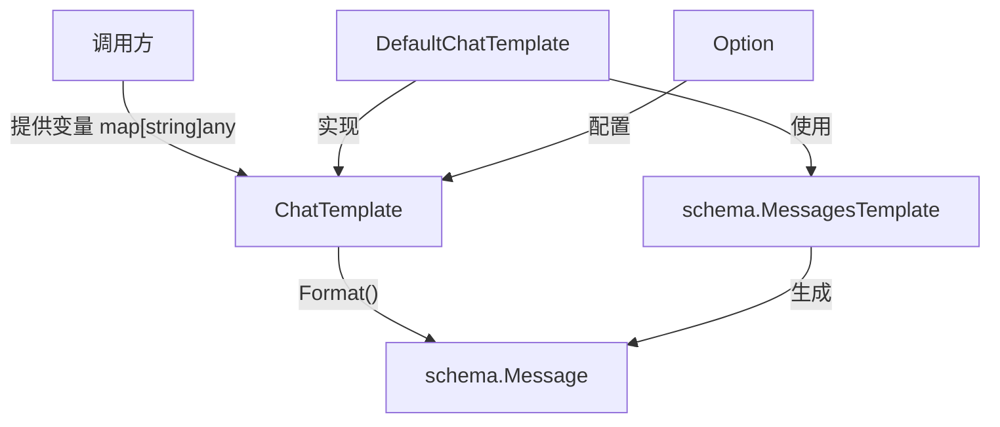

# prompt_interfaces 模块技术深度解析

## 1. 什么问题需要解决？

在构建 LLM 应用时，一个核心问题是如何将用户提供的动态变量（如上下文信息、工具结果、用户输入等）与预定义的提示模板结合，生成符合模型要求的消息序列。想象一下：你有一个系统提示模板，需要插入当前日期、用户信息、历史对话摘要等动态内容；或者你有一个包含多轮对话的模板，每个轮次都需要填充不同的变量。一个简单的字符串替换显然无法满足这种复杂场景的需求——你需要处理结构化的消息、多模态内容、不同的格式化策略，还要保持与不同模型提供商的兼容性。

`prompt_interfaces` 模块正是为了解决这个问题而设计的。它提供了一个统一的抽象层，让开发者能够以一致的方式处理提示模板的变量格式化，同时保持足够的灵活性来适应不同的使用场景。

## 2. 核心心智模型

理解这个模块的关键是建立一个"模板→变量→消息"的流水线心智模型。你可以把 `ChatTemplate` 想象成一个**消息工厂**：

1. **原材料**：变量映射表 `map[string]any`，包含所有需要插入模板的动态数据
2. **生产线**：`Format` 方法，它知道如何将变量正确地填充到模板中
3. **成品**：符合 `schema.Message` 规范的消息列表，可以直接传递给模型

这种设计将"模板定义"和"变量填充"这两个关注点分离，使得：
- 模板可以被复用和组合
- 变量来源可以灵活变化
- 格式化逻辑可以根据需要定制

## 3. 架构与数据流

### 3.1 组件关系图



### 3.2 数据流转

让我们追踪一个典型的使用场景：

1. **调用方准备数据**：收集所有需要的变量（如用户输入、上下文信息、工具结果等），组织成 `map[string]any`
2. **创建模板实例**：初始化一个 `DefaultChatTemplate`（或其他 `ChatTemplate` 实现），配置好模板内容和格式化类型
3. **调用 Format 方法**：传入上下文、变量映射和可选配置
4. **模板处理**：
   - `DefaultChatTemplate` 内部会委托给 `schema.MessagesTemplate` 数组
   - 每个 `MessagesTemplate` 负责将变量填充到自己的模板中
   - 所有模板生成的消息会被合并成最终的消息列表
5. **返回结果**：生成的 `[]*schema.Message` 可以直接传递给模型调用

## 4. 核心组件深度解析

### 4.1 ChatTemplate 接口

```go
type ChatTemplate interface {
    Format(ctx context.Context, vs map[string]any, opts ...Option) ([]*schema.Message, error)
}
```

**设计意图**：这是整个模块的核心抽象，它定义了"将变量格式化为消息列表"这一能力。接口设计非常简洁，只包含一个方法，这体现了"接口最小化"的设计原则——只定义本质行为，不限制实现方式。

**参数解析**：
- `ctx context.Context`：提供上下文控制，支持超时、取消和值传递
- `vs map[string]any`：变量映射表，键是模板中使用的变量名，值是实际数据
- `opts ...Option`：可选配置，用于定制格式化行为（实现特定的配置）

**返回值**：
- `[]*schema.Message`：格式化后的消息列表，结构符合模型输入要求
- `error`：格式化过程中可能出现的错误

### 4.2 DefaultChatTemplate 实现

```go
type DefaultChatTemplate struct {
    templates []schema.MessagesTemplate
    formatType schema.FormatType
}
```

**设计意图**：这是 `ChatTemplate` 的一个具体实现，它通过组合多个 `schema.MessagesTemplate` 来构建完整的消息序列。

**内部机制**：
- `templates`：一个 `schema.MessagesTemplate` 数组，每个元素负责生成一部分消息
- `formatType`：指定格式化类型，影响变量如何被插入到模板中

这种设计允许你将复杂的提示模板拆分成多个可复用的部分（如系统提示、用户提示模板、工具调用模板等），然后组合在一起使用。

## 5. 依赖关系分析

### 5.1 该模块调用什么

- **schema 包**：核心依赖，使用 `schema.Message` 作为输出格式，`schema.MessagesTemplate` 作为内部模板实现，`schema.FormatType` 控制格式化行为
- **context 包**：用于支持上下文传递

### 5.2 什么调用该模块

- **Compose Graph Engine**：在构建图节点时，可能会使用 `ChatTemplate` 来准备模型输入
- **ADK Agent**：各种 Agent 实现（如 `ChatModelAgent`）会使用 `ChatTemplate` 来格式化提示
- **直接用户代码**：应用开发者可以直接使用 `ChatTemplate` 来准备模型输入

### 5.3 数据契约

这个模块的核心契约是：
- 输入：变量映射 `map[string]any`，键必须与模板中使用的变量名匹配
- 输出：符合 `schema.Message` 结构的消息列表，可以直接传递给 `BaseChatModel` 或 `ToolCallingChatModel`

## 6. 设计决策与权衡

### 6.1 接口最小化 vs 功能丰富性

**决策**：选择了极其简洁的接口设计，只定义一个 `Format` 方法。

**权衡**：
- ✅ 优点：接口简单清晰，易于理解和实现；保持了最大的灵活性，不同实现可以有完全不同的内部结构
- ❌ 缺点：调用者无法从接口本身知道模板的结构（如变量名、模板内容等），这些信息被隐藏在实现内部

**为什么这样选择**：在这个场景下，"将变量格式化为消息"是核心能力，而模板的具体结构、变量定义等属于实现细节。简洁的接口让这个模块能够适应各种不同的模板实现方式。

### 6.2 使用 map[string]any 作为变量输入

**决策**：选择使用 `map[string]any` 而不是类型安全的结构体来传递变量。

**权衡**：
- ✅ 优点：极大的灵活性，可以接受任何类型的变量；不需要为每个模板定义专门的结构体
- ❌ 缺点：失去了编译时类型检查，变量名拼写错误或类型不匹配只能在运行时发现

**为什么这样选择**：提示模板的变量通常是动态变化的，而且不同模板需要的变量完全不同。使用 `map[string]any` 提供了最大的灵活性，虽然牺牲了一些类型安全性，但这在提示工程场景下是可以接受的权衡。

### 6.3 组合而非继承

**决策**：`DefaultChatTemplate` 使用组合（包含 `[]schema.MessagesTemplate`）而不是继承来构建复杂模板。

**权衡**：
- ✅ 优点：更灵活，可以在运行时动态组合模板；每个 `MessagesTemplate` 可以独立复用
- ❌ 缺点：可能需要更多的 boilerplate 代码来组合模板

**为什么这样选择**：组合在这种场景下明显优于继承。提示模板通常是由多个独立部分组成的（系统提示、用户提示、示例对话等），这些部分可以被不同的模板组合复用。

## 7. 使用指南与示例

### 7.1 基本使用

虽然我们没有看到 `DefaultChatTemplate` 的完整构造函数，但基于接口设计，典型使用方式应该是：

```go
// 假设你有一个创建 DefaultChatTemplate 的函数
template := NewDefaultChatTemplate(
    []schema.MessagesTemplate{systemTemplate, userTemplate},
    schema.FormatTypeDefault,
)

// 准备变量
variables := map[string]any{
    "user_name": "张三",
    "current_date": time.Now().Format("2006-01-02"),
    "query": "如何学习 Go 语言？",
}

// 格式化消息
messages, err := template.Format(ctx, variables)
if err != nil {
    // 处理错误
}

// 使用生成的消息调用模型
response, err := model.Generate(ctx, messages)
```

### 7.2 与其他模块集成

`ChatTemplate` 最常见的使用场景是与模型组件集成：

- 与 [model_interfaces](model_interfaces.md) 中的 `BaseChatModel` 或 `ToolCallingChatModel` 配合使用
- 在 [Compose Graph Engine](compose_graph_engine.md) 中作为节点的一部分
- 在 [ADK Agent](adk_agent_interface.md) 中用于准备提示

## 8. 注意事项与常见陷阱

### 8.1 变量名匹配

模板中使用的变量名必须与 `map[string]any` 中的键完全匹配，包括大小写。不匹配的变量名可能导致：
- 模板中的占位符未被替换
- 运行时错误
- 意外的默认值行为

### 8.2 类型安全

由于使用 `map[string]any`，你失去了编译时类型检查。建议：
- 在调用 `Format` 之前验证变量类型
- 使用辅助函数来构建变量映射，减少拼写错误
- 在模板实现中添加合理的类型检查和错误提示

### 8.3 上下文传递

不要忽略 `context.Context` 参数，它对于：
- 超时控制
- 请求取消
- 传递请求范围的值（如追踪 ID）
- 回调系统（参见 [Callbacks System](callbacks_system.md)）

都非常重要。

### 8.4 消息结构一致性

确保生成的 `schema.Message` 结构符合你使用的模型的要求。不同模型可能对消息格式有不同的期望，特别是：
- 多模态内容的表示方式
- 工具调用的格式
- 角色名称的约定

## 9. 相关模块参考

- [Schema Core Types](schema_core_types.md)：定义了 `Message`、`MessagesTemplate` 等核心类型
- [model_interfaces](model_interfaces.md)：使用 `ChatTemplate` 生成的消息作为输入
- [Compose Graph Engine](compose_graph_engine.md)：可能在图节点中使用 `ChatTemplate`
- [Callbacks System](callbacks_system.md)：与 `context.Context` 配合使用

---

*注：本文档基于当前可获得的代码信息编写，未来实现可能会有所变化。*
