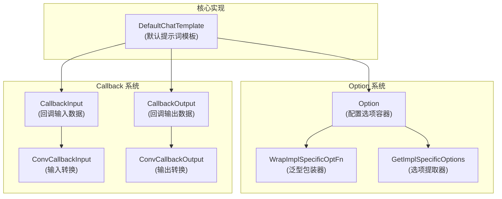

# Prompt Options & Callbacks (提示词模板配置与回调)

## 概述

`prompt_options_and_callbacks` 模块是 Eino 框架中提示词模板系统的核心支持层，它为提示词模板组件提供了**统一的配置选项机制**和**标准化的回调数据结构**。想象一下，如果把提示词模板系统比作一个"文本加工厂"，那么这个模块就是工厂的"控制面板"和"监控仪表盘"——它让你能够灵活调整生产参数，同时实时了解生产过程的每一个细节。

这个模块解决的核心问题是：如何在保持提示词模板组件接口简洁的同时，支持丰富的扩展配置和可观测性？答案是通过**类型安全的泛型选项模式**和**标准化的回调契约**来实现。

## 架构设计



### 核心组件职责

1. **Option 结构体**：一个类型擦除的容器，用于包装实现特定的配置函数。它就像一个通用的"信封"，可以装任何类型的配置指令，同时保持外部接口的一致性。

2. **WrapImplSpecificOptFn 泛型函数**：类型安全的选项包装器。它将具体类型的配置函数包装成 Option，确保在编译时就能捕获类型错误，而不是在运行时。

3. **GetImplSpecificOptions 泛型函数**：选项提取器。它从 Option 列表中提取出特定类型的配置，并应用到基础配置对象上。这个函数是类型安全的核心保障。

4. **CallbackInput 结构体**：提示词模板回调的输入数据契约。它包含了模板变量、模板本身和额外信息，为回调处理器提供完整的上下文。

5. **CallbackOutput 结构体**：提示词模板回调的输出数据契约。它包含了格式化后的消息、原始模板和额外信息，让回调处理器能够了解模板处理的结果。

6. **DefaultChatTemplate 结构体**：默认的提示词模板实现。它展示了如何正确使用 Option 系统和 Callback 系统，是一个参考实现。

## 设计决策分析

### 1. 类型擦除 vs 泛型接口

**选择**：使用类型擦除的 Option 结构体 + 泛型辅助函数

**替代方案**：定义泛型接口 `Option[T]`，让每个组件使用自己的选项类型

**权衡分析**：
- ✅ **优点**：保持了组件接口的一致性，所有组件都使用 `Option` 类型，无需泛型参数
- ✅ **优点**：简化了组合逻辑，不同组件的选项可以放在同一个列表中传递
- ⚠️ **缺点**：类型安全依赖于使用模式，错误的类型配对会在运行时才被发现（但通过 WrapImplSpecificOptFn/GetImplSpecificOptions 配对使用可以避免）
- 💡 **设计意图**：这是一个"用户体验优先"的设计。框架开发者承担了类型安全的责任，通过提供正确的使用模式，让使用者能够享受简洁的 API。

### 2. 回调数据的标准化 vs 灵活性

**选择**：提供结构化的 CallbackInput/CallbackOutput，同时保留 Extra 字段用于扩展

**替代方案**：完全灵活的 map[string]any，或者完全结构化的没有扩展空间的结构体

**权衡分析**：
- ✅ **优点**：结构化字段提供了类型安全和 IDE 支持，Extra 字段保留了灵活性
- ✅ **优点**：ConvCallbackInput/ConvCallbackOutput 提供了向后兼容性，可以接受旧格式的数据
- ⚠️ **缺点**：需要维护转换逻辑，增加了一定的代码复杂度
- 💡 **设计意图**：这是一个"渐进式设计"。核心字段结构化，确保常见场景的体验；扩展字段灵活化，应对未知的未来需求。

### 3. 回调的强制启用 vs 可选启用

**选择**：DefaultChatTemplate 始终启用回调（IsCallbacksEnabled 返回 true）

**替代方案**：让回调成为可选项，通过配置决定是否启用

**权衡分析**：
- ✅ **优点**：确保可观测性，开发者始终能够了解模板的执行情况
- ✅ **优点**：简化了使用，无需额外配置就能获得完整的回调支持
- ⚠️ **缺点**：可能带来微小的性能开销（但回调系统本身设计为低开销）
- 💡 **设计意图**：这是一个"可观测性优先"的设计。在 AI 应用开发中，了解提示词的生成过程往往比微小的性能开销更重要。

## 数据流向

让我们追踪一个典型的提示词模板格式化操作的数据流向：

1. **初始化阶段**：
   - 调用 `FromMessages` 创建 `DefaultChatTemplate`，传入模板和格式类型
   - 模板和格式类型被存储在结构体中

2. **配置阶段**（可选）：
   - 使用者创建实现特定的配置函数，例如 `func(opt *MyPromptOptions) { opt.SomeField = value }`
   - 使用 `WrapImplSpecificOptFn` 包装这个函数，得到 `Option`
   - 将 `Option` 传递给 `Format` 方法

3. **格式化阶段**：
   - 调用 `Format` 方法，传入上下文、变量和选项
   - 创建运行信息并触发 `OnStart` 回调，传入 `CallbackInput`（包含变量、模板和额外信息）
   - `GetImplSpecificOptions` 被内部实现调用（如果有的话），提取并应用选项
   - 遍历每个模板，调用其 `Format` 方法进行格式化
   - 收集所有格式化后的消息
   - 触发 `OnEnd` 回调，传入 `CallbackOutput`（包含结果、模板和额外信息）
   - 返回结果

4. **错误处理**：
   - 如果任何步骤出错，触发 `OnError` 回调
   - 错误被传播给调用者

## 核心组件详解

### Option 系统

Option 系统是这个模块的核心创新。它的工作原理类似于"依赖注入容器"，但更轻量级：

```go
// 定义实现特定的配置类型
type MyPromptOptions struct {
    TrimWhitespace bool
    MaxLength      int
}

// 创建配置函数
func WithTrimWhitespace(trim bool) Option {
    return WrapImplSpecificOptFn(func(opt *MyPromptOptions) {
        opt.TrimWhitespace = trim
    })
}

func WithMaxLength(length int) Option {
    return WrapImplSpecificOptFn(func(opt *MyPromptOptions) {
        opt.MaxLength = length
    })
}

// 在实现中使用
func (t *MyTemplate) Format(ctx context.Context, vs map[string]any, opts ...Option) ([]*schema.Message, error) {
    // 提取选项
    baseOpts := &MyPromptOptions{
        TrimWhitespace: true, // 默认值
        MaxLength:      0,    // 默认值
    }
    options := GetImplSpecificOptions(baseOpts, opts...)
    
    // 使用 options...
}
```

这种设计的关键优势是：
- **向后兼容**：添加新选项不会破坏现有代码
- **类型安全**：编译时检查配置函数的类型
- **默认值友好**：可以通过 base 参数提供完整的默认值

### Callback 系统

Callback 系统为提示词模板提供了完整的可观测性。它的设计考虑了以下几个场景：

1. **调试和日志**：记录模板变量和生成的消息
2. **性能监控**：测量模板格式化的耗时
3. **数据验证**：验证生成的消息是否符合预期
4. **A/B 测试**：比较不同模板的效果

```go
// 示例：创建一个日志回调处理器
type PromptLogger struct{}

func (l *PromptLogger) OnStart(ctx context.Context, input callbacks.CallbackInput) context.Context {
    if pi := ConvCallbackInput(input); pi != nil {
        log.Printf("Prompt formatting started with variables: %v", pi.Variables)
    }
    return ctx
}

func (l *PromptLogger) OnEnd(ctx context.Context, output callbacks.CallbackOutput) context.Context {
    if po := ConvCallbackOutput(output); po != nil {
        log.Printf("Prompt formatting ended, generated %d messages", len(po.Result))
    }
    return ctx
}

func (l *PromptLogger) OnError(ctx context.Context, err error) context.Context {
    log.Printf("Prompt formatting error: %v", err)
    return ctx
}
```

### DefaultChatTemplate

DefaultChatTemplate 是一个参考实现，它展示了如何正确地集成 Option 系统和 Callback 系统。它的设计简洁而实用：

- 使用构造函数 `FromMessages` 而不是直接暴露结构体字段
- 在 `Format` 方法中正确地处理回调生命周期
- 支持多种格式类型（通过 schema.FormatType）
- 可以组合多个模板

## 使用指南

### 创建自定义提示词模板

如果你想创建自己的提示词模板组件，以下是最佳实践：

1. **定义你的配置类型**（如果需要配置）：
```go
type MyTemplateOptions struct {
    // 你的配置字段
}
```

2. **创建配置函数**：
```go
func WithMyOption(value string) Option {
    return WrapImplSpecificOptFn(func(opt *MyTemplateOptions) {
        // 设置选项
    })
}
```

3. **实现 ChatTemplate 接口**：
```go
type MyTemplate struct {
    // 你的字段
}

func (t *MyTemplate) Format(ctx context.Context, vs map[string]any, opts ...Option) ([]*schema.Message, error) {
    // 1. 设置回调上下文
    ctx = callbacks.EnsureRunInfo(ctx, t.GetType(), components.ComponentOfPrompt)
    ctx = callbacks.OnStart(ctx, &CallbackInput{
        Variables: vs,
        Templates: t.templates,
    })
    
    var err error
    defer func() {
        if err != nil {
            _ = callbacks.OnError(ctx, err)
        }
    }()
    
    // 2. 提取选项（如果有）
    var options *MyTemplateOptions
    if len(opts) > 0 {
        options = GetImplSpecificOptions(&MyTemplateOptions{ /* 默认值 */ }, opts...)
    }
    
    // 3. 实际的格式化逻辑
    var result []*schema.Message
    // ... 实现 ...
    
    // 4. 触发结束回调
    _ = callbacks.OnEnd(ctx, &CallbackOutput{
        Result:    result,
        Templates: t.templates,
    })
    
    return result, nil
}

func (t *MyTemplate) GetType() string {
    return "MyTemplate"
}

func (t *MyTemplate) IsCallbacksEnabled() bool {
    return true
}
```

### 常见陷阱和注意事项

1. **选项类型不匹配**：
   - ❌ 错误：使用 WrapImplSpecificOptFn 包装 func(*A)，然后用 GetImplSpecificOptions[B] 提取
   - ✅ 正确：确保包装和提取使用相同的类型，最好将它们放在同一个包中

2. **忘记回调生命周期**：
   - ❌ 错误：只调用 OnStart，不调用 OnEnd 或 OnError
   - ✅ 正确：使用 defer 确保无论成功或失败都会触发相应的回调

3. **忽略 context**：
   - ❌ 错误：不使用 callbacks.EnsureRunInfo 返回的新 context
   - ✅ 正确：始终使用回调函数返回的新 context，确保运行信息正确传递

4. **回调数据转换失败**：
   - ❌ 错误：假设 ConvCallbackInput/ConvCallbackOutput 总是返回非 nil
   - ✅ 正确：检查返回值是否为 nil，处理类型不匹配的情况

## 与其他模块的关系

- **[Callbacks System](callbacks_system.md)**：这是本模块的基础依赖。Option 和 CallbackInput/CallbackOutput 都是为了与回调系统协作而设计的。
- **[Schema Core Types](schema_core_types.md)**：CallbackInput 和 CallbackOutput 都依赖于 schema 包中的类型，如 MessagesTemplate 和 Message。
- **[Component Interfaces](component_interfaces.md)**：Option 系统是为 ChatTemplate 接口设计的，而 DefaultChatTemplate 是该接口的实现。
- **[Compose Graph Engine](compose_graph_engine.md)**：提示词模板通常作为图中的节点使用，回调系统帮助追踪其在图执行中的行为。

## 总结

`prompt_options_and_callbacks` 模块是一个看似简单但设计精巧的支持模块。它通过**类型安全的泛型选项模式**解决了配置扩展问题，通过**标准化的回调数据结构**解决了可观测性问题。它的设计体现了几个重要的软件工程原则：

1. **接口隔离**：使用者只看到简洁的 Option 类型，而不需要了解内部的类型擦除机制
2. **开闭原则**：对扩展开放（可以添加新的选项类型），对修改关闭（不需要修改 Option 结构体）
3. **依赖倒置**：高层模块（DefaultChatTemplate）和低层模块（具体配置）都依赖于抽象（Option 系统）

这个模块的价值不在于它提供了什么复杂的功能，而在于它建立了一套良好的模式和契约，让整个提示词模板系统能够灵活扩展、易于观测，同时保持简洁的用户体验。
