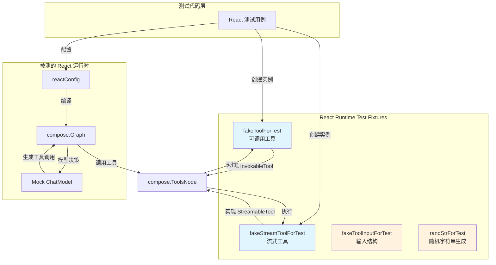

# React Runtime Test Fixtures

## 概述

测试一个智能体运行时就像测试一个精密的反馈循环系统——你需要控制输入、观察输出，并且能够精确地模拟各种边界条件。`react_runtime_test_fixtures` 模块提供了一套精心设计的测试工具（test doubles），专门用于测试 React 运行时（`adk/react.go`）的核心行为。这些测试工具实现了工具接口，带有可编程的计数器，让你能够模拟多次工具调用的场景，验证运行时是否正确地处理了迭代、流式输出、以及"直接返回"配置等复杂行为。

想象一下这些测试工具就像是一个训练用的"击球器"——你可以设置它抛出多少次球（`tarCount`），它会按顺序响应，让你能够观察智能体如何通过"观察-行动-观察"的循环逐步完成任务。

## 架构与数据流



### 数据流追踪

当一个测试用例使用这些测试工具时，数据会按照以下路径流动：

1. **初始化阶段**：测试代码创建 `fakeToolForTest` 或 `fakeStreamToolForTest` 实例，设置 `tarCount`（目标调用次数）。计数器从 0 开始。

2. **工具信息查询**：React 运行时调用 `Info(ctx)` 方法获取工具的元数据（名称、描述、参数定义）。这些元数据会被传递给 ChatModel，让模型知道如何调用这个工具。

3. **工具调用执行**：模型生成的工具调用包含 JSON 格式的参数字符串（如 `{"name": "Alice"}`）。React 运行时通过 `compose.ToolsNode` 调用工具：
   - 对于 `fakeToolForTest`，调用 `InvokableRun`，返回一个 JSON 字符串
   - 对于 `fakeStreamToolForTest`，调用 `StreamableRun`，返回一个字符串流

4. **计数器递增**：每次调用后，`curCount` 递增。当 `curCount >= tarCount` 时，工具的行为会改变——返回"bye"而不是"hello"消息。这让测试能够验证 React 运时是否能够处理工具行为的变化。

5. **结果回传**：工具返回的结果被 React 运行时接收并添加到消息历史中，作为下一轮模型推理的输入。

### 架构角色

在整体架构中，这些测试工具扮演的是**可控的外部依赖角色**。它们模拟了真实工具的核心行为（信息查询、参数解析、结果生成），但剥离了所有实际的业务逻辑和网络依赖。这使得测试能够专注于验证 React 运行时本身的正确性——比如：
- 模型和工具之间的循环是否正确终止
- 流式输出是否正确传播
- `toolsReturnDirectly` 配置是否按预期工作
- 最大迭代次数限制是否被正确遵守

## 组件深度解析

### fakeToolForTest

**用途**：非流式工具的测试替身，实现了 `tool.InvokableTool` 接口。

```go
type fakeToolForTest struct {
    tarCount int  // 目标调用次数——达到此次数后行为改变
    curCount int  // 当前已调用次数计数器
}
```

**内部机制**：

这个工具的设计核心是一个简单的状态机：初始状态（`curCount < tarCount`）和完成状态（`curCount >= tarCount`）。这种设计巧妙地模拟了真实世界中可能"多次尝试后成功"或"达到配额后拒绝"的场景。

每次调用 `InvokableRun` 时：
1. 使用 `sonic.UnmarshalString` 将 JSON 参数解析到 `fakeToolInputForTest` 结构体
2. 检查 `curCount` 是否达到 `tarCount`
3. 如果未达到，递增计数器并返回 `{"say": "hello {name}"}`
4. 如果已达到，返回 `{"say": "bye"}`（不再递增）

**Info 方法**返回工具元数据：
```go
&schema.ToolInfo{
    Name: "test_tool",
    Desc: "test tool for unit testing",
    ParamsOneOf: schema.NewParamsOneOfByParams(map[string]*schema.ParameterInfo{
        "name": {
            Desc:     "user name for testing",
            Required: true,
            Type:     schema.String,
        },
    }),
}
```

**参数与返回值**：
- `tarCount`：设置为不同的值可以模拟不同场景
  - `tarCount = 1`：第一次调用就返回"bye"，测试单次调用的场景
  - `tarCount = 3`：需要调用 3 次才会改变行为，可以测试多次循环
- `InvokableRun` 返回一个 JSON 字符串，符合 `tool.InvokableTool` 接口规范
- 如果 JSON 解析失败，返回错误

**副作用**：递增 `curCount`（这个状态是在测试工具实例内部维护的，不是跨调用持久化的）

---

### fakeStreamToolForTest

**用途**：流式工具的测试替身，实现了 `tool.StreamableTool` 接口。与 `fakeToolForTest` 类似，但返回的是 `*schema.StreamReader[string]` 而不是单个字符串。

```go
type fakeStreamToolForTest struct {
    tarCount int
    curCount int
}
```

**内部机制**：

流式工具的设计需要考虑流的创建和消费。当 `StreamableRun` 被调用时：

1. 解析 JSON 参数（与 `fakeToolForTest` 相同）
2. 检查计数器状态
3. 创建一个流并立即返回，流的实际内容在创建时就已经确定
4. 使用 `schema.StreamReaderFromArray` 从数组创建流：
   - 未达到 `tarCount`：流包含一个元素 `{"say": "hello {name}"}`
   - 已达到：流包含一个元素 `{"say": "bye"}`

**关键设计决策**：流的内容在创建时就已经固定，而不是异步生成。这是一个有意为之的简化——测试场景不需要模拟复杂的流生成逻辑，只需要验证流式接口的交互是否正确。如果需要更复杂的流行为测试（比如分块输出、流中断等），需要创建更专门的测试工具。

**Info 方法**返回：
```go
&schema.ToolInfo{
    Name: "test_stream_tool",
    Desc: "test stream tool for unit testing",
    ParamsOneOf: schema.NewParamsOneOfByParams(...),
}
```

**参数与返回值**：
- `StreamableRun` 返回 `(*schema.StreamReader[string], error)`
- 流中的每个元素都是一个 JSON 字符串

**使用场景**：
测试 `reactConfig` 的流式执行路径，特别是验证：
- 流式工具的输出是否正确地被中间件处理
- 流式工具与普通工具是否可以混合使用
- `toolsReturnDirectly` 配置对流式工具是否生效

---

### fakeToolInputForTest

**用途**：工具输入的 JSON 解析目标结构。

```go
type fakeToolInputForTest struct {
    Name string `json:"name"`
}
```

这是一个极简的数据容器，唯一的字段 `Name` 用于接收工具调用中的参数。它的存在体现了 Go 中 JSON 反序列化的标准模式：通过结构体标签将 JSON 字段映射到结构体字段。

**设计考量**：
为什么需要这个结构体而不是直接处理原始 JSON 字符串？

1. **类型安全**：结构体提供了编译时类型检查，避免手动处理 JSON 字符串时的错误
2. **可扩展性**：如果需要添加更多参数，只需添加字段，无需修改解析逻辑
3. **标准化**：这是 Go 生态中处理 JSON 的惯用方式，符合开发者直觉

---

### randStrForTest

**用途**：生成用于测试的随机字符串，主要用作 `ToolCall.ID`。

```go
func randStrForTest() string {
    seeds := []rune("test seed")
    b := make([]rune, 8)
    for i := range b {
        b[i] = seeds[rand.Intn(len(seeds))]
    }
    return string(b)
}
```

**内部机制**：
从固定的字符集 `"test seed"` 中随机选取 8 个字符组成字符串。这提供了足够的随机性来模拟真实的工具调用 ID，同时保持可预测性（种子字符集是固定的，不含特殊字符）。

**使用场景**：
在 `TestReact` 测试中，当设置 mock chat model 的期望时，需要为 `ToolCall.ID` 提供值：
```go
{
    ID: randStrForTest(),
    Function: schema.FunctionCall{
        Name: info.Name,
        Arguments: fmt.Sprintf(`{"name": "%s", "hh": "123"}`, randStrForTest()),
    },
}
```

**设计考量**：
为什么不用 `uuid.New()` 或 `crypto/rand`？

1. **简单性**：这是一个测试辅助函数，不需要密码学级别的随机性
2. **无外部依赖**：避免了引入额外的包
3. **足够的随机性**：对于区分不同的工具调用，这个级别的随机性已经足够

## 依赖分析

### 模块调用的外部依赖

这些测试工具直接依赖以下类型和包：

1. **`components.tool`**：
   - `tool.BaseTool`：基础工具接口，定义了 `Info` 方法
   - `tool.InvokableTool`：可调用工具接口，定义了 `InvokableRun` 方法
   - `tool.StreamableTool`：流式工具接口，定义了 `StreamableRun` 方法

2. **`schema`**：
   - `schema.ToolInfo`：工具元数据结构
   - `schema.ParameterInfo`：参数信息结构
   - `schema.StreamReader[T]`：泛型流读取器

3. **`github.com/bytedance/sonic`**：
   - `sonic.UnmarshalString`：快速 JSON 解析（高性能的 JSON 库）

### 调用本模块的组件

这些测试工具主要被以下组件使用：

1. **`adk/react_test.go`**：`TestReact` 函数中直接使用这些工具来验证 React 运行时的各种行为

2. **`adk/chatmodel_test.go`**：部分测试用例也使用了 `fakeToolForTest`

### 数据契约

测试工具与 React 运行时之间的契约通过接口定义：

```go
// InvokableTool 契约
func (t *fakeToolForTest) InvokableRun(
    ctx context.Context, 
    argumentsInJSON string,  // 输入：JSON 格式的参数字符串
    opts ...tool.Option,
) (string, error)  // 输出：JSON 格式的结果字符串

// StreamableTool 契约
func (t *fakeStreamToolForTest) StreamableRun(
    ctx context.Context, 
    argumentsInJSON string,  // 输入：JSON 格式的参数字符串
    opts ...tool.Option,
) (*schema.StreamReader[string], error)  // 输出：字符串流
```

**关键假设**：
- 输入的 `argumentsInJSON` 必须包含 `name` 字段，且类型为字符串
- 调用方负责关闭返回的 `StreamReader`（虽然 `StreamReaderFromArray` 创建的流会在消费完毕后自动关闭）
- `curCount` 的状态是在实例级别维护的，不是线程安全的——这假设测试场景不会并发调用同一个工具实例

## 设计决策与权衡

### 计数器机制的简单性 vs. 可表达性

**决策**：使用简单的整数计数器（`tarCount` 和 `curCount`）来控制工具的行为变化。

**权衡分析**：
- **简单性**：计数器机制极其直观，易于理解和配置。设置 `tarCount = 3` 就能模拟"调用 3 次后改变行为"的场景。
- **可表达性**：这种机制的表达能力有限。如果需要更复杂的条件触发（比如根据输入参数、累计调用次数、随机概率等），需要创建新的测试工具。

**为什么这样设计**：
React 运行时的测试场景主要集中在验证循环机制和迭代控制。计数器机制恰好覆盖了这些场景的核心需求：
- 模型是否在每次工具调用后继续推理
- 最大迭代次数限制是否生效
- 工具行为变化是否被正确处理

对于更复杂的行为测试，应该创建专门的测试工具，而不是在这个通用测试工具中添加过多的配置选项。

### 流内容的静态生成 vs. 动态生成

**决策**：`fakeStreamToolForTest` 在 `StreamableRun` 调用时就创建并返回完整的流，流的每个元素在创建时就已确定。

**权衡分析**：
- **静态生成**：代码简单，测试逻辑清晰。流的内容是可预测的，便于断言验证。
- **动态生成**：更接近真实场景（真实的流式工具可能是逐步生成内容），但会增加测试代码的复杂度和不确定性。

**为什么这样设计**：
React 运行时的测试目标是验证**流式接口的交互**（流是否正确传递、是否被中间件正确处理），而不是验证流内容的**生成逻辑**。因此，使用 `schema.StreamReaderFromArray` 从静态数组创建流是一个合理的简化。

如果需要测试流生成相关的逻辑（比如超时处理、部分失败等），应该创建专门的流式测试工具。

### JSON 解析失败时的错误传播

**决策**：当 `sonic.UnmarshalString` 失败时，工具直接返回错误，不提供默认值或重试。

**权衡分析**：
- **严格失败**：能够捕获参数格式错误的问题，让测试失败在正确的位置。
- **宽松处理**：可以提供默认值继续执行，但可能隐藏真实的问题。

**为什么这样设计**：
测试代码应该显式地验证各种场景，包括错误场景。如果测试代码传递了格式错误的 JSON，工具返回错误是正确的行为——这提示测试需要修复。

### 非线程安全的计数器

**决策**：`curCount` 没有任何同步机制，不是线程安全的。

**权衡分析**：
- **不加锁**：性能开销最小，代码最简洁。
- **加锁**：可以支持并发调用，但会增加复杂度，而且测试场景通常不需要。

**为什么这样设计**：
测试场景通常是串行的：模型依次调用工具，工具依次响应。即使 React 运行时支持并行工具调用（通过 `ToolsNodeConfig.ExecuteSequentially = false`），测试场景也可以通过使用不同的工具实例来避免并发问题。

如果需要测试并发工具调用的场景，应该创建支持并发的测试工具，而不是在这个工具中添加锁。

## 使用示例

### 基础用法：测试工具调用循环

```go
// 创建一个需要调用 3 次才会改变行为的工具
fakeTool := &fakeToolForTest{
    tarCount: 3,
}

// 配置 mock chat model，让它在前 2 次返回工具调用
times := 0
cm.EXPECT().Generate(gomock.Any(), gomock.Any(), gomock.Any()).
    DoAndReturn(func(ctx context.Context, input []Message, opts ...model.Option) (Message, error) {
        times++
        if times <= 2 {
            return schema.AssistantMessage("hello test",
                []schema.ToolCall{
                    {
                        ID: randStrForTest(),
                        Function: schema.FunctionCall{
                            Name:      "test_tool",
                            Arguments: `{"name": "Alice"}`,
                        },
                    },
                }), nil
        }
        return schema.AssistantMessage("bye", nil), nil
    }).AnyTimes()

// 创建并运行 React 图
graph, _ := newReact(ctx, &reactConfig{
    model: cm,
    toolsConfig: &compose.ToolsNodeConfig{
        Tools: []tool.BaseTool{fakeTool},
    },
})
compiled, _ := graph.Compile(ctx)
result, _ := compiled.Invoke(ctx, []Message{schema.UserMessage("test")})

// 验证结果
// 工具被调用了 2 次，模型最终返回 "bye"
```

### 测试 toolsReturnDirectly 配置

```go
// 创建工具
fakeTool := &fakeToolForTest{tarCount: 3}

// 配置 toolsReturnDirectly
config := &reactConfig{
    model: cm,
    toolsConfig: &compose.ToolsNodeConfig{
        Tools: []tool.BaseTool{fakeTool},
    },
    toolsReturnDirectly: map[string]bool{"test_tool": true},
}

// 执行后，最终结果应该是 Tool 角色的消息（工具的输出直接返回）
// 而不是 Assistant 角色的消息（模型对工具输出的响应）
result, _ := compiled.Invoke(ctx, input)
assert.Equal(t, schema.Tool, result.Role)
```

### 测试流式工具

```go
// 创建流式工具
fakeStreamTool := &fakeStreamToolForTest{
    tarCount: 2,
}

// 配置 mock model 的 Stream 方法
cm.EXPECT().Stream(gomock.Any(), gomock.Any(), gomock.Any()).
    DoAndReturn(func(ctx context.Context, input []Message, opts ...model.Option) (MessageStream, error) {
        sr, sw := schema.Pipe[Message](1)
        defer sw.Close()
        
        sw.Send(schema.AssistantMessage("hello stream",
            []schema.ToolCall{
                {
                    ID: randStrForTest(),
                    Function: schema.FunctionCall{
                        Name: "test_stream_tool",
                        Arguments: `{"name": "Bob"}`,
                    },
                },
            }), nil)
        return sr, nil
    }).AnyTimes()

// 执行流式调用
outStream, _ := compiled.Stream(ctx, input)
defer outStream.Close()

// 消费流
msgs := make([]Message, 0)
for {
    msg, err := outStream.Recv()
    if errors.Is(err, io.EOF) {
        break
    }
    msgs = append(msgs, msg)
}

// 验证消息序列
```

### 测试最大迭代次数限制

```go
// 配置最大迭代次数为 5
config := &reactConfig{
    model: cm,
    toolsConfig: &compose.ToolsNodeConfig{
        Tools: []tool.BaseTool{fakeTool},
    },
    maxIterations: 5,
}

// 配置 mock model，让它持续返回工具调用（超过 5 次）
times := 0
cm.EXPECT().Generate(gomock.Any(), gomock.Any(), gomock.Any()).
    DoAndReturn(func(...) (Message, error) {
        times++
        return schema.AssistantMessage("keep calling",
            []schema.ToolCall{{...}}), nil
    }).AnyTimes()

// 执行应该返回 ErrExceedMaxIterations
result, err := compiled.Invoke(ctx, input)
assert.ErrorIs(t, err, ErrExceedMaxIterations)
```

## 边界情况与注意事项

### 1. 计数器状态不持久化

**问题**：`curCount` 是工具实例的内部状态，每次运行新的测试用例时需要创建新的实例，或者手动重置计数器。

**解决方案**：
```go
// 好的做法：每个测试用例创建新实例
t.Run("Test1", func(t *testing.T) {
    fakeTool := &fakeToolForTest{tarCount: 3}
    // ... 测试代码
})

t.Run("Test2", func(t *testing.T) {
    fakeTool := &fakeToolForTest{tarCount: 5}  // 新的实例
    // ... 测试代码
})
```

### 2. JSON 参数格式严格性

**问题**：测试工具期望输入的 `argumentsInJSON` 是有效的 JSON，且必须包含 `name` 字段。如果 mock model 生成了格式错误的 JSON，工具会返回错误。

**解决方案**：确保 mock model 生成的参数格式正确：
```go
Arguments: fmt.Sprintf(`{"name": "%s", "hh": "123"}`, randStrForTest())
// 而不是：
Arguments: `name=Alice`  // 错误：不是 JSON 格式
Arguments: `{"user": "Alice"}`  // 错误：缺少 name 字段
```

### 3. 流的关闭责任

**问题**：虽然 `fakeStreamToolForTest` 返回的流是从数组创建的（会自动关闭），但其他测试代码创建的流可能需要手动关闭。

**解决方案**：
```go
outStream, _ := compiled.Stream(ctx, input)
defer outStream.Close()  // 始终使用 defer 关闭流
```

### 4. 并发调用的竞态条件

**问题**：如果 React 运行时配置为并行执行工具调用（`ExecuteSequentially = false`），并发调用同一个 `fakeToolForTest` 实例会导致 `curCount` 的竞态条件。

**解决方案**：对于并发测试，使用不同的实例：
```go
// 并行执行时，为每个工具创建独立实例
config := &compose.ToolsNodeConfig{
    Tools: []tool.BaseTool{
        &fakeToolForTest{tarCount: 3},  // 实例 1
        &fakeToolForTest{tarCount: 3},  // 实例 2
    },
    ExecuteSequentially: false,
}
```

### 5. tarCount 为 0 时的行为

**问题**：如果 `tarCount` 设置为 0，第一次调用就会返回"bye"。这可能不是你期望的行为。

**解决方案**：如果希望工具至少被调用一次后改变行为，设置 `tarCount >= 1`：
```go
// 第一次调用返回 "hello"，第二次及以后返回 "bye"
fakeTool := &fakeToolForTest{tarCount: 1}

// 第一次调用就返回 "bye"
fakeTool := &fakeToolForTest{tarCount: 0}
```

### 6. Mock model 的工具调用 ID 必须唯一

**问题**：在测试 `toolsReturnDirectly` 时，React 运行时需要通过 `ToolCall.ID` 来匹配返回的结果。如果多个工具调用使用相同的 ID，会导致匹配失败。

**解决方案**：使用 `randStrForTest()` 为每个工具调用生成唯一 ID：
```go
{
    ID: randStrForTest(),  // 每次调用生成新 ID
    Function: schema.FunctionCall{...},
}
```

## 相关文档

- [React Runtime Core](react-runtime-state-and-tool-result-flow.md)：React 运行时的核心实现，这些测试工具专门用于测试这个模块
- [ChatModel Agent Core Runtime](chatmodel-agent-core-runtime.md)：ChatModelAgent 的实现，也使用了类似的测试工具模式
- [Tool Execution and Interrupt Control](tool-node-execution-and-interrupt-control.md)：ToolsNode 的实现，负责实际执行这些测试工具
