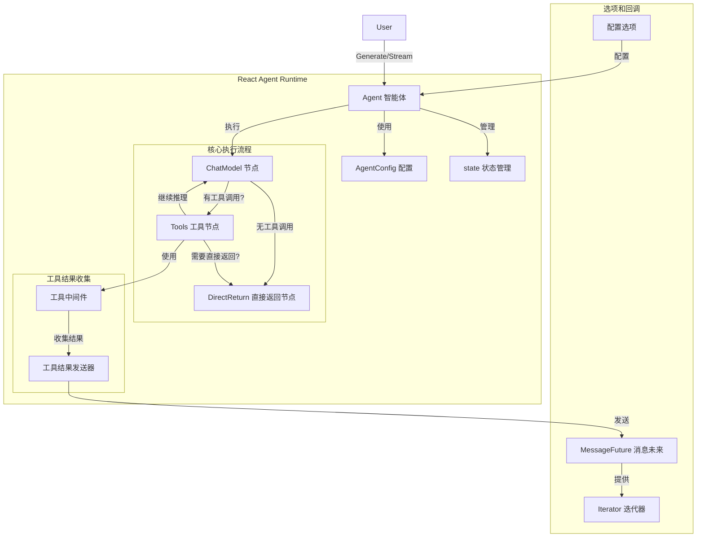

# React Agent Runtime and Options 模块详解

## 概述

React Agent 是 EINO 框架中用于构建交互式智能体的核心模块，它实现了 ReAct (Reasoning + Acting) 模式，允许智能体通过对话模型和工具调用的迭代来解决复杂问题。

想象一下，你正在让一个助手帮你完成一项任务。这个助手不仅能理解你的问题，还能主动调用工具来获取信息，然后根据工具返回的结果继续思考，直到给出最终答案。React Agent 就是这样一个"思考-行动-观察-再思考"的循环引擎。

本模块提供了 React Agent 的核心运行时、配置选项以及高级功能，支持同步生成和流式输出两种模式，并提供了丰富的工具集成和状态管理能力。

## 架构概览



### 核心组件及其职责

1. **Agent**: React Agent 的核心结构体，封装了整个执行流程。它内部维护一个 Graph，通过节点之间的流转实现 ReAct 模式。

2. **AgentConfig**: 配置 Agent 行为的结构体，包括模型选择、工具配置、消息修改器等。

3. **state**: 维护 Agent 执行过程中的状态，包括消息历史和直接返回标记。

4. **ChatModelNode**: 负责调用对话模型生成响应的节点。

5. **ToolsNode**: 负责执行工具调用的节点。

6. **DirectReturnNode**: 处理直接返回工具结果的节点。

7. **MessageFuture**: 提供异步访问 Agent 执行过程中产生的消息的接口。

8. **Iterator**: 轻量级的 FIFO 流，用于迭代访问 Agent 执行过程中产生的值和错误。

## 设计决策

### 1. 基于 Graph 的执行模型

**决策**: 使用 Graph 来组织 Agent 的执行流程，而不是简单的循环结构。

**原因**: 
- 提供了更清晰的抽象和更好的可扩展性
- 支持复杂的控制流和条件分支
- 便于与其他 Graph 组件集成和组合

**权衡**: 
- 增加了一定的实现复杂度
- 但提供了更强大的功能和更好的可维护性

### 2. 工具结果收集中间件

**决策**: 使用中间件模式来收集工具执行结果，而不是直接在工具调用处收集。

**原因**:
- 解耦了工具执行和结果收集的逻辑
- 支持多种工具执行模式（同步/流式）
- 便于扩展和自定义结果收集行为

**权衡**:
- 需要额外的中间件层
- 但提供了更好的灵活性和可维护性

### 3. 消息未来模式

**决策**: 使用 MessageFuture 模式来提供异步访问 Agent 执行过程中产生的消息的能力。

**原因**:
- 允许用户在 Agent 执行的同时访问中间结果
- 支持同步和流式两种执行模式
- 提供了统一的接口来访问不同类型的消息

**权衡**:
- 增加了一定的内存开销（需要缓存所有消息）
- 但提供了更好的用户体验和更强大的功能

### 4. 可配置的工具调用检查器

**决策**: 提供可配置的 StreamToolCallChecker，而不是硬编码工具调用检测逻辑。

**原因**:
- 不同模型的流式输出格式差异很大
- 允许用户根据具体模型定制检测逻辑
- 提高了框架的适应性和兼容性

**权衡**:
- 增加了配置的复杂度
- 但提供了更好的灵活性和兼容性

## 子模块说明

本模块包含以下子模块，每个子模块负责特定的功能：

- [react_agent_core_runtime](flow_agents_and_retrieval-react_agent_runtime_and_options-react_agent_core_runtime.md): 负责 React Agent 的核心执行逻辑
- [react_option_streaming_and_callback_contracts](flow_agents_and_retrieval-react_agent_runtime_and_options-react_option_streaming_and_callback_contracts.md): 定义了流式输出和回调的契约
- [react_option_layer_test_doubles](flow_agents_and_retrieval-react_agent_runtime_and_options-react_option_layer_test_doubles.md): 提供了测试用的替身对象
- [react_agent_test_tool_fixtures](flow_agents_and_retrieval-react_agent_runtime_and_options-react_agent_test_tool_fixtures.md): 提供了测试用的工具夹具

## 跨模块依赖

React Agent Runtime and Options 模块与以下模块有紧密的依赖关系：

1. **compose_graph_engine**: 提供了 Graph 执行引擎，React Agent 内部使用 Graph 来组织执行流程。
2. **components_core**: 提供了模型、工具等核心组件的接口和契约。
3. **agent_contracts_and_context**: 提供了 Agent 的基本契约和上下文管理。
4. **schema_models_and_streams**: 提供了消息、流等核心数据结构的定义。

## 使用指南

### 基本使用

创建一个 React Agent 非常简单：

```go
ctx := context.Background()

// 创建 Agent
agent, err := react.NewAgent(ctx, &react.AgentConfig{
    ToolCallingModel: myToolCallingModel,
    ToolsConfig: compose.ToolsNodeConfig{
        Tools: []tool.BaseTool{myTool1, myTool2},
    },
    MaxStep: 10,
})
if err != nil {
    // 处理错误
}

// 同步生成响应
response, err := agent.Generate(ctx, []*schema.Message{
    schema.UserMessage("你好，请帮我查询一些信息"),
})
if err != nil {
    // 处理错误
}

// 或者使用流式输出
stream, err := agent.Stream(ctx, []*schema.Message{
    schema.UserMessage("你好，请帮我查询一些信息"),
})
if err != nil {
    // 处理错误
}
```

### 使用 MessageFuture 访问中间消息

```go
// 创建 MessageFuture
option, future := react.WithMessageFuture()

// 使用 Agent
response, err := agent.Generate(ctx, messages, option)
if err != nil {
    // 处理错误
}

// 访问中间消息
iter := future.GetMessages()
for {
    msg, hasNext, err := iter.Next()
    if err != nil {
        // 处理错误
    }
    if !hasNext {
        break
    }
    // 处理消息
}
```

### 配置工具和模型选项

```go
// 配置工具选项
toolOpts := react.WithToolOptions(tool.WrapImplSpecificOptFn(func(o *MyToolOption) {
    o.SomeSetting = "value"
}))

// 配置模型选项
modelOpts := react.WithChatModelOptions(model.WithModel("gpt-4"))

// 配置工具
tools, err := react.WithTools(ctx, myTool1, myTool2)
if err != nil {
    // 处理错误
}

// 使用所有选项
response, err := agent.Generate(ctx, messages, 
    append(append([]agent.AgentOption{toolOpts, modelOpts}, tools...))...)
```

## 注意事项和常见陷阱

1. **StreamToolCallChecker 的配置**: 对于不先输出工具调用的模型（如 Claude），默认的 StreamToolCallChecker 可能无法正常工作，需要实现自定义的检查器。

2. **MessageFuture 的内存使用**: MessageFuture 会缓存所有中间消息，对于长时间运行的 Agent，可能会消耗大量内存。

3. **MaxStep 的设置**: 确保设置合理的 MaxStep，避免 Agent 陷入无限循环。

4. **工具返回直接**: 使用 ToolReturnDirectly 或 SetReturnDirectly 时要小心，确保只在必要时使用，避免过早返回。

5. **消息修改器的顺序**: MessageRewriter 会在 MessageModifier 之前调用，确保理解这个顺序。

6. **工具选项的传递**: 使用 WithTools 时，它会返回两个选项，确保都应用到 Agent 上。
