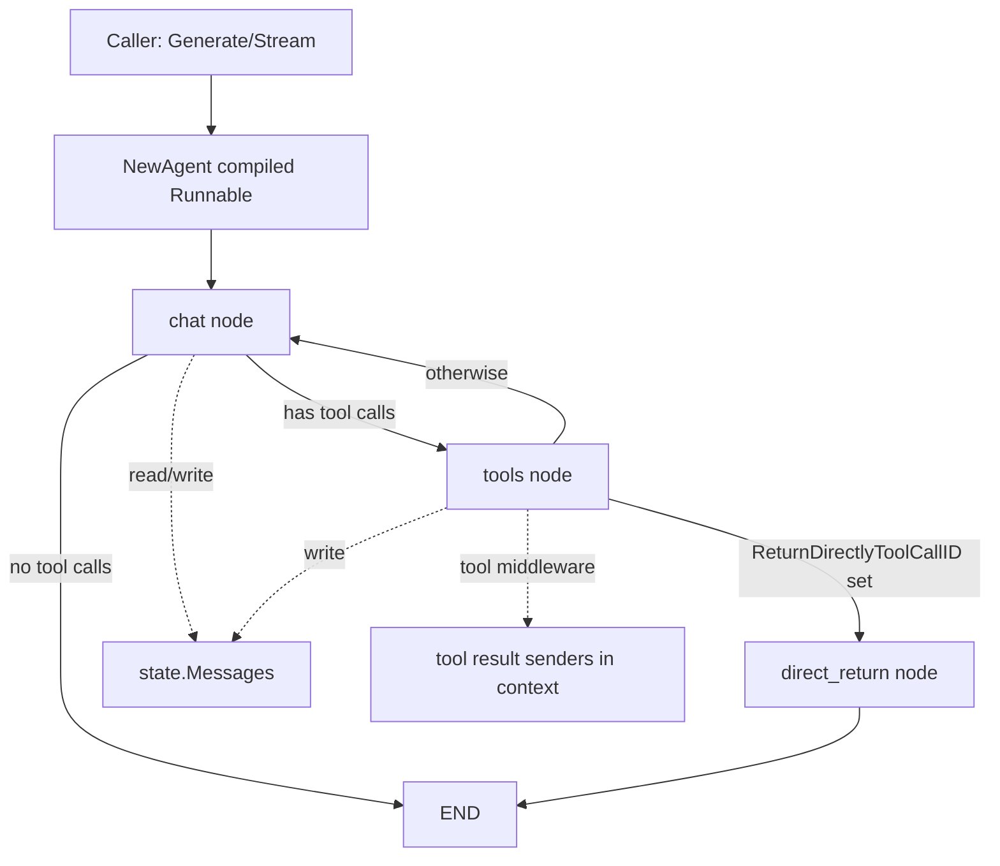

# react_graph_runtime_core 深度解析

`react_graph_runtime_core`（`flow/agent/react/react.go`）本质上是在做一件很“工程化”的事：把“LLM 可能调用工具、工具结果再喂回 LLM、直到收敛”的 ReAct 循环，封装成一个可编译、可中断、可流式的图执行单元。朴素实现通常是 `for` 循环里手写判断：有 tool call 就调工具、没 tool call 就返回；但一旦你需要**流式输出、状态续跑、可组合到更大工作流、工具中途直接返回**，这种手写循环会迅速失控。这个模块的设计洞察是：**把 ReAct 变成一个 Graph runtime 问题**，而不是 if/else 脚本问题。

---

## 1. 这个模块解决了什么问题？

在真实 agent 里，“模型-工具-模型”循环并不只是控制流问题，还带着四类约束：

第一，消息状态是累计的。每轮模型输入不是原始 input，而是历史消息 + 新工具结果 +（可选）改写逻辑。

第二，工具形态是多态的。既有普通 invokable，也有 streamable、enhanced invokable、enhanced streamable。你希望一个 ReAct runtime 同时接住它们。

第三，流式判断存在模型差异。并非所有模型都在第一块 token 就输出 tool calls；有的模型会先吐文本再给工具调用。

第四，流程可提前终止。有些工具输出本身就是最终答案，需要“短路”后直接返回，而不是再回到模型总结。

`react_graph_runtime_core` 将这些约束统一进一个 `Agent`：对外暴露 `Generate/Stream`，对内编译成图，利用节点与分支来表达循环与终止条件。

---

## 2. 心智模型：把它想成“自动换挡的双工位流水线”

可以把它想成两台机器的流水线：

- `chat` 工位：读当前消息上下文，产出 assistant 消息（可能带 tool calls）
- `tools` 工位：执行 tool calls，产出 tool message

中间有一个调度器：

- 若 `chat` 输出里检测到 tool calls → 去 `tools`
- 若没有 tool calls → 流程结束
- `tools` 结束后，若命中“直接返回” → 走 `direct_return` 节点并结束
- 否则回 `chat` 继续下一轮

这个调度器不是写死在 while 循环里，而是由 `compose.Graph` 的分支机制表达。这样你得到的是**可导出、可复用、可嵌入上层图**的运行时。



上图里最关键的是 `state`：它是跨节点的“共享运行内存”，记录历史消息和“是否直接返回”的标记。

---

## 3. 架构与数据流（端到端）

### 3.1 构建期（`NewAgent`）

`NewAgent(ctx, config)` 做了五件核心事：

1. **确定模型与工具描述**：
   - 通过 `genToolInfos` 调每个工具的 `Info(ctx)` 收集 `[]*schema.ToolInfo`
   - 调 `agent.ChatModelWithTools(config.Model, config.ToolCallingModel, toolInfos)` 生成可用的 `chatModel`

2. **注入工具结果采集中间件**：
   - `newToolResultCollectorMiddleware()` 被 prepend 到 `config.ToolsConfig.ToolCallMiddlewares`
   - 目的：从工具调用链抓取结果（含流式）并通过 context 回传

3. **建图并定义 state**：
   - `compose.NewGraph` + `WithGenLocalState` 初始化 `state{Messages, ReturnDirectlyToolCallID}`
   - `state.Messages` 预留容量与 `config.MaxStep` 相关

4. **挂节点与分支**：
   - `AddChatModelNode(nodeKeyModel, ...)`
   - `AddToolsNode(nodeKeyTools, ...)`
   - `AddBranch(nodeKeyModel, NewStreamGraphBranch(...))`：判断模型输出是否含 tool calls
   - `buildReturnDirectly(graph)`：给 tools 节点后追加“直接返回”分支与 `direct_return` lambda 节点

5. **编译为 runnable**：
   - `graph.Compile(...WithMaxRunSteps(config.MaxStep), WithNodeTriggerMode(compose.AnyPredecessor), WithGraphName(...))`

最终 `Agent` 持有：
- `runnable`（真正执行入口）
- `graph`（可导出）
- `graphAddNodeOpts`（被其他图复用时的编译参数）

### 3.2 运行期（`Generate` / `Stream`）

- `Generate` 调 `r.runnable.Invoke`
- `Stream` 调 `r.runnable.Stream`
- 两者都把 `agent.AgentOption` 通过 `agent.GetComposeOptions(opts...)` 转成 compose 运行参数

关键路径是 state 的读写：

- 进入 `chat` 节点前（`modelPreHandle`）：
  - 把本轮输入 append 到 `state.Messages`
  - 先执行 `MessageRewriter`（改写“累积历史”）
  - 再执行 `MessageModifier`（改写“本次喂模型输入”）

- 进入 `tools` 节点前（`toolsNodePreHandle`）：
  - 把模型输出消息 append 到 `state.Messages`
  - 用 `getReturnDirectlyToolCallID` 判断是否命中 `ToolReturnDirectly`

- tools 节点后分支：
  - 若 `state.ReturnDirectlyToolCallID` 非空 → `direct_return`
  - 否则回 `chat`

- `direct_return` 节点：
  - 从工具输出消息流中挑选 `ToolCallID == state.ReturnDirectlyToolCallID` 的消息并返回

---

## 4. 组件深潜（按“为什么这样设计”讲）

## `type AgentConfig struct`

`AgentConfig` 是这个模块的“策略面板”。它不是简单参数集合，而是把可变策略集中到边界层：

- `ToolCallingModel` / `Model`：兼容新旧模型接口，优先 `ToolCallingModel`
- `ToolsConfig`：把工具节点构造与执行策略下沉给 [Compose Tool Node](compose_tool_node.md)
- `MessageModifier` 与 `MessageRewriter`：把“输入修饰”和“历史重写”拆开，前者偏一次性，后者偏跨轮持久影响
- `ToolReturnDirectly`：按工具名配置短路策略
- `StreamToolCallChecker`：解耦模型厂商流式差异
- `GraphName/ModelNodeName/ToolsNodeName`：命名可观测性与嵌入式组合能力

这体现了一个取舍：**核心执行路径固定，策略通过回调和配置开放**。

## `type state struct`

`state` 很小，只保存：

- `Messages []*schema.Message`
- `ReturnDirectlyToolCallID string`

小而专注是故意的：它是图执行中的局部状态，不应该变成“万能上下文袋”。

`init()` 中 `schema.RegisterName[*state]("_eino_react_state")` 表明该状态需要可识别名称，通常用于序列化/恢复链路中的类型标识。

## `newToolResultCollectorMiddleware()`

这是一个非常关键但不显眼的扩展点。它统一封装了四类工具端点：

- `Invokable`
- `Streamable`
- `EnhancedInvokable`
- `EnhancedStreamable`

设计重点在流式分支：

- 对 `output.Result` 调 `Copy(2)`
- 一份给 sender（旁路消费），一份保留给下游

这避免了“一个流被两个消费者竞争读取”的经典问题。代价是复制流会增加一定开销，但换来正确性和可观测性。

## `firstChunkStreamToolCallChecker`

默认 checker 的策略很激进：

- 读取流
- 若首批有效 chunk 有 `ToolCalls`，返回 true
- 若遇到非空文本内容但无 `ToolCalls`，返回 false

它的优点是快；缺点是对“先文本后工具调用”的模型不鲁棒。代码和注释都明确提示：这时应自定义 `StreamToolCallChecker`，且**必须在返回前关闭 `modelOutput` 流**。

## `SetReturnDirectly(ctx)`

这是给工具实现者的“运行时指令”。在工具执行里调用它，会把当前 tool call id 写入 state（通过 `compose.ProcessState` + `compose.GetToolCallID(ctx)`）。

它的优先级高于静态配置 `ToolReturnDirectly`，意味着工具可以在运行时按条件决定是否短路。

## `buildReturnDirectly(graph)`

这里把“短路返回”实现为图上的独立节点，而不是在 tools 节点内部硬编码。好处是：

- 控制流显式可见（可检查、可导出）
- tools 节点保持单一职责（只管执行工具）
- 返回逻辑可替换（理论上可换成其他 lambda 节点）

`direct_return` 节点内部用 `schema.StreamReaderWithConvert` 从 `[]*schema.Message` 流映射到单个 `*schema.Message`，并按 `ToolCallID` 过滤。

## `Agent` + `Generate/Stream/ExportGraph`

`Agent` 只是薄封装：

- `Generate` / `Stream` 负责调用 runnable
- `ExportGraph` 暴露底层图和 add-node 选项

`ExportGraph` 的存在很重要：它说明该模块不是“封闭产品”，而是可被更大编排系统二次集成的构件。

---

## 5. 依赖关系与契约分析

从当前代码可见，这个模块的架构角色是**编排层（orchestrator）**，它并不实现模型或工具本体，而是连接这些能力。

它主要依赖：

- [Compose Graph Engine](compose_graph_engine.md)：图构建、节点挂载、分支、编译、状态处理
- [Compose Tool Node](compose_tool_node.md)：工具节点与工具中间件协议
- [Component Interfaces](component_interfaces.md)：`model.BaseChatModel` / `model.ToolCallingChatModel` 等接口契约
- [Schema Core Types](schema_core_types.md) 与 [Schema Stream](schema_stream.md)：`schema.Message`、`ToolResult`、`StreamReader`
- [Flow React Agent](flow_react_agent.md) 的 option 子模块：`agent.AgentOption` 转 compose options

它向上提供的契约是：

- `NewAgent(ctx, config) (*Agent, error)`
- `(*Agent).Generate(...)`
- `(*Agent).Stream(...)`
- `(*Agent).ExportGraph()`
- `SetReturnDirectly(ctx)`（供工具内部调用）

耦合点最明显的有两个：

1. 对 `schema.Message` 中 `ToolCalls` / `ToolCallID` 语义的依赖非常强；如果上游消息结构变更，这里分支与短路逻辑会直接受影响。
2. 对 `compose` 的节点生命周期（pre-handler、branch、state）强依赖；这让实现简洁，但意味着执行模型几乎绑定 compose runtime。

---

## 6. 关键设计取舍

这个实现的核心取舍是“把复杂度放进图运行时”。它牺牲了一点初读门槛，换来更高的可组合性。

在简单性 vs 灵活性上，选择了灵活性：

- 通过 `MessageRewriter/MessageModifier/StreamToolCallChecker/ToolMiddleware` 暴露扩展点
- 但这也要求使用者理解调用时机，否则容易产生“改写顺序”类 bug

在性能 vs 正确性上，流式工具结果选择了正确性优先：

- `Copy(2)` 增加复制成本
- 但保障 sender 与下游都能稳定消费流

在自治 vs 耦合上，Agent 与 compose 强耦合：

- 好处是实现短，功能来自成熟 runtime
- 代价是迁移到非 compose 引擎成本高

---

## 7. 使用方式与示例

### 7.1 最小用法

```go
cfg := &react.AgentConfig{
    ToolCallingModel: myToolCallingModel,
    ToolsConfig: compose.ToolsNodeConfig{
        Tools: myTools,
    },
    MaxStep: 12,
}

ag, err := react.NewAgent(ctx, cfg)
if err != nil { /* handle */ }

out, err := ag.Generate(ctx, []*schema.Message{
    {Role: schema.User, Content: "请帮我查询并总结"},
})
```

### 7.2 自定义流式 tool call 检测（Claude 类模型常见）

```go
cfg.StreamToolCallChecker = func(ctx context.Context, sr *schema.StreamReader[*schema.Message]) (bool, error) {
    defer sr.Close()
    hasToolCall := false
    for {
        msg, err := sr.Recv()
        if err == io.EOF {
            return hasToolCall, nil
        }
        if err != nil {
            return false, err
        }
        if len(msg.ToolCalls) > 0 {
            hasToolCall = true
        }
    }
}
```

### 7.3 工具内触发直接返回

```go
func myTool(ctx context.Context, in string) (string, error) {
    // 满足条件时直接返回，不再回模型
    _ = react.SetReturnDirectly(ctx)
    return "final answer from tool", nil
}
```

---

## 8. 新贡献者最该注意的坑

首先是 `MessageRewriter` 与 `MessageModifier` 的顺序：前者先改 state 中累积历史，后者再改本次给模型的输入。若你把“持久改写”逻辑放到 `MessageModifier`，效果会和预期不同。

其次是流式 checker 的资源管理：`StreamToolCallChecker` 必须关闭流，否则会引入泄漏或阻塞。

再者是 `SetReturnDirectly` 的覆盖关系：它优先于 `ToolReturnDirectly`，且同一步多次调用时“最后一次生效”。这在多工具并发调用场景里要非常小心。

还有一个隐性约束：`ToolReturnDirectly` 按工具名匹配，但真正返回靠 `ToolCallID` 精确定位消息；如果工具名复用/调用顺序复杂，调试时要看 call id 而不是只看 name。

最后，`MaxStep` 是安全阀，不是建议值。过小会截断正常多轮推理，过大则可能掩盖循环问题；应结合工具复杂度与模型行为做压测后定值。

---

## 9. 参考模块

- [Flow React Agent](flow_react_agent.md)
- [Compose Graph Engine](compose_graph_engine.md)
- [Compose Tool Node](compose_tool_node.md)
- [Component Interfaces](component_interfaces.md)
- [Schema Core Types](schema_core_types.md)
- [Schema Stream](schema_stream.md)
- [Flow Agent Option Bridge](agent_option_bridge.md)
