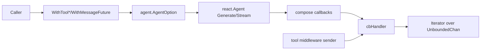

# react_runtime_options_and_message_future 深度解析

`react_runtime_options_and_message_future`（`flow/agent/react/option.go`）解决的是一个很实际但经常被低估的问题：**如何把 ReAct agent 运行时里的“配置注入”和“异步消息观测”做成稳定、统一、可组合的接口**。如果没有这个模块，调用方通常会在业务层手工拼 `compose.Option`、手工绑回调、再手工区分 `Generate`（一次性消息）和 `Stream`（消息流）两种路径，代码会迅速变得脆弱。这个模块的核心价值是把这些“跨层粘合逻辑”封装到一组 `AgentOption` 工厂和一个 `MessageFuture` 抽象里，让上层只关心“我要什么能力”，而不是“该在哪个 runtime 钩子里拿到它”。

## 架构角色与心智模型

可以把这个模块想象成 ReAct runtime 的“**转接总线 + 观察窗**”。

“转接总线”指的是：它把模型选项、工具选项、工具列表这些外部配置，统一转接为 `agent.AgentOption`，并最终下沉到 compose graph 执行层。

“观察窗”指的是：它通过 `WithMessageFuture()` 在 graph callback 和 model callback 上挂钩，把运行中产生的消息（包括工具结果转换成的消息）推入一个无界 FIFO，然后让调用方通过 `Iterator.Next()` 按需异步消费。



这里的关键设计点是：**消息采集不侵入主执行路径**。主路径仍由 [react_graph_runtime_core](react_graph_runtime_core.md) 驱动；本模块只通过 callback/context 中继和 option bridge 连接两侧。

## 这个模块解决了什么问题（先讲问题，再讲方案）

ReAct agent 的运行面临两个“错位”问题。第一是配置错位：模型参数归模型节点、工具参数归工具节点，但调用方通常只拿着一个 `agent.Generate(...opts)` 入口。第二是观测错位：模型输出、流式输出、工具输出分别来自不同回调面，若不统一，调用方很难得到完整“会话消息轨迹”。

本模块用两组机制解决这两个错位。

第一组是 option 工厂：`WithToolOptions`、`WithChatModelOptions`、`WithToolList`、`WithTools`。它们把“我想改哪里”的意图翻译成 `agent.WithComposeOptions(...)`，让上层 API 只暴露 `AgentOption`，底层细节由 compose runtime 吞掉。

第二组是 message future：`WithMessageFuture` 返回 `(agent.AgentOption, MessageFuture)`。前者把 callback 挂到 graph/model 生命周期；后者给调用方一个异步拉取接口（`GetMessages` / `GetMessageStreams`）。这相当于把原本分散在回调里的“推模型”变成调用方可控的“拉模型”。

## 端到端数据流

### 路径一：配置注入（最热路径之一）

当你调用 `react.Agent.Generate/Stream` 时，`react.Agent` 会把 `...agent.AgentOption` 交给 `agent.GetComposeOptions(opts...)` 展平，再传入 compose runnable。这个模块的 `WithToolOptions` / `WithChatModelOptions` / `WithToolList` / `WithTools` 正是在这个展平链路之前完成“语义到执行选项”的翻译。

`WithTools(ctx, tools...)` 特别值得注意：它先对每个 `tool.BaseTool` 调 `Info(ctx)` 取 `*schema.ToolInfo`，然后一次性返回两个 option：一个给 chat model（`model.WithTools(toolInfos)`），一个给 tools node（`compose.WithToolList(tools...)`）。这不是重复配置，而是 ReAct 的双通道要求：模型需要“知道工具 schema”，执行器需要“拿到工具实现”。

### 路径二：Generate + MessageFuture

调用 `WithMessageFuture()` 后，返回的 option 会通过 `compose.WithCallbacks(cb)` 注入 graph。`cb` 由 `ub.NewHandlerHelper().ChatModel(cmHandler).Graph(graphHandler).Handler()` 拼装，覆盖了 graph start/end/error 和 model end 两侧事件。

在 `OnStartFn` 时，`cbHandler.onGraphStart` 创建 `msgs` 队列（`internal.NewUnboundedChan[item[*schema.Message]]()`），并关闭 `started` 作为“可读取”信号。随后 `setToolResultSendersToCtx` 把工具结果 sender 放进 context。之后：

- 模型非流式输出进入 `onChatModelEnd`，直接 `sendMessage(input.Message)`。
- 工具输出通过 runtime 的工具结果采集中间件（定义在 [react_graph_runtime_core](react_graph_runtime_core.md)）拿到 sender，再反向调用本模块 sender，把结果转成 `schema.ToolMessage(...)` 后入队。

调用方在 `future.GetMessages()` 拿到 `Iterator[*schema.Message]`，反复 `Next()` 消费。graph 结束时 `onGraphEnd` 关闭队列；`Next()` 会返回 `(zero, false, nil)` 表示结束。

### 路径三：Stream + MessageFuture

流式输入场景下，graph 走 `OnStartWithStreamInputFn`，`onGraphStartWithStreamInput` 会创建 `sMsgs` 队列并关闭 `started`。之后：

- 模型流式输出进入 `onChatModelEndWithStreamOutput`，先用 `schema.StreamReaderWithConvert` 把 `*model.CallbackOutput` 流映射成 `*schema.Message` 流，再入队。
- 流式工具结果 sender 同样先转换成消息流后入队。

调用方通过 `future.GetMessageStreams()` 得到 `Iterator[*schema.StreamReader[*schema.Message]]`，每次 `Next()` 拿到一个消息流单元。

## 组件级深潜

### `WithToolOptions(opts ...tool.Option) agent.AgentOption`

这个函数的意图是“只改工具执行层选项”。内部路径是 `agent.WithComposeOptions(compose.WithToolsNodeOption(compose.WithToolOption(opts...)))`。它把工具参数限制在 ToolsNode 作用域，避免误污染模型节点。

设计上这是“窄接口、强边界”：调用方表达意图简洁，但也意味着它不会替你补齐模型侧工具 schema。

### `WithChatModelOptions(opts ...model.Option) agent.AgentOption`

同理，这个函数只把参数下沉到 chat model 节点。它适合调温度、max tokens 等模型行为，但不接触工具执行配置。

### `WithToolList(tools ...tool.BaseTool) agent.AgentOption`（Deprecated）

它只向 ToolsNode 注入工具实现，不给模型注入工具 schema。注释里已经明确建议改用 `WithTools`。保留它是兼容性选择：减少老代码迁移成本，但新代码若继续用它，容易出现“工具可执行但模型不知道可调用”的行为偏差。

### `WithTools(ctx context.Context, tools ...tool.BaseTool) ([]agent.AgentOption, error)`

这是配置层最重要的 convenience API。它封装了 ReAct 双通道配置，成功时固定返回 2 个 option。失败点也很明确：任何一个 `tl.Info(ctx)` 出错都会中断返回。

这背后的设计取舍是“显式一致性优先于懒配置”。它宁可在启动前失败，也不接受运行时才暴露 schema/实现不一致。

### `type MessageFuture interface`

`MessageFuture` 不是 promise/future 的“单值等待”，而是“异步可迭代视图”：

- `GetMessages()` 面向 `Generate` 风格（一条条 message）
- `GetMessageStreams()` 面向 `Stream` 风格（一条条 message stream）

这种二路接口比“统一成一个 union 类型”更朴素，但在 Go 里可读性和类型安全更高。

### `type Iterator[T]` 与 `Next() (T, bool, error)`

`Iterator` 的实现很轻，核心只是一层 `UnboundedChan` 包装。`Next` 返回三元组 `(value, ok, err)`：`ok=false` 表示流结束，`err` 表示该条目携带错误。这个约定让“正常结束”和“异常结束”可区分。

### `type cbHandler`

`cbHandler` 是真正的桥接器。它维护两条互斥通道：`msgs`（非流式）和 `sMsgs`（流式），并用 `started chan struct{}` 作为初始化栅栏，确保 `GetMessages/GetMessageStreams` 不会早于 graph start 返回半初始化对象。

其关键方法体现了“跨模式降级/升级”能力：

- `sendMessage`：若当前是 stream 模式，会把单条 message 包成 `StreamReaderFromArray` 再送入 `sMsgs`。
- `sendMessageStream`：若当前是 non-stream 模式，会 `ConcatMessageStream` 把流拼成单条 message 再送入 `msgs`。

换句话说，它在内部承担了“消息形态归一化”的责任，调用方只需按当前运行模式读取对应 iterator。

### `WithMessageFuture() (agent.AgentOption, MessageFuture)`

这是本模块最关键的入口。它做了四件事：

1. 构造 `cbHandler`。
2. 构造 model callback（捕获模型结束事件）。
3. 构造 graph callback（start/end/error + context 注入 tool result sender）。
4. 组合为一个 callback handler，并封装成 `agent.AgentOption` 返回。

特别是 tool sender 的四种形态（普通/流式/enhanced/enhanced 流式）与 runtime 的 `toolResultSenders` 定义完全对齐（见 [react_graph_runtime_core](react_graph_runtime_core.md)），这是跨文件契约最敏感的一段。

## 依赖与契约分析

这个模块向下依赖的核心组件有四类。

首先是 option bridge：`agent.WithComposeOptions` 与 `agent.GetComposeOptions`（见 [agent_option_bridge](agent_option_bridge.md)）。这是它把高层选项投递到 compose runtime 的唯一路径。

其次是 callback 框架：`callbacks.NewHandlerBuilder` 和 `utils/callbacks` 的 `HandlerHelper`、`ModelCallbackHandler`。本模块并不直接触碰图执行器，而是借 callback 生命周期做旁路采集。

再次是 schema 流与消息转换能力：`schema.ToolMessage`、`schema.StreamReaderWithConvert`、`schema.StreamReaderFromArray`、`schema.ConcatMessageStream`、`(*schema.ToolResult).ToMessageInputParts`（见 [message_schema_and_stream_concat](message_schema_and_stream_concat.md) 与 [schema_stream.md](schema_stream.md)）。

最后是无界通道实现：`internal.NewUnboundedChan`（见 [unbounded_channel](unbounded_channel.md)）。这决定了消费速度慢时不会阻塞生产者，但也引入内存增长风险。

向上看，已确认的直接调用关系是：`react.Agent.Generate/Stream` 接收本模块产出的 `AgentOption`。此外，工具结果 sender 的 context key/类型定义在 runtime 核心模块中，本模块通过 `setToolResultSendersToCtx` 与之对接。至于仓库内“哪些业务模块显式调用了 `WithMessageFuture`”，从当前给定代码片段无法完全确认。

## 关键设计取舍

最明显的取舍是“简单调用面 vs 运行时双通道一致性”。`WithTools` 强制同步配置模型 schema + 工具实现，牺牲一点灵活性（固定返回两个 option），换来调用正确性。

第二个取舍是“通用 callback 抽象 vs 直连内部结构”。`WithMessageFuture` 通过 callback 框架采集消息，而不是侵入 `react.Agent` 主逻辑。这降低了主流程耦合，但会把行为正确性绑定在 callback 生命周期契约上。

第三个取舍是“非阻塞产出 vs 内存上界”。`Iterator` 背后是 `UnboundedChan`，对高吞吐流友好，不会因消费者慢而反压主流程；代价是若消费者长期不读，缓存会持续增长。

第四个取舍是“形态统一 vs 额外开销”。`sendMessageStream` 在 non-stream 模式会调用 `ConcatMessageStream`，意味着要消费并拼接整个流，带来额外延迟与内存占用，但调用面保持统一。

## 使用方式与常见模式

最常见的方式是把 `WithTools` 和 `WithMessageFuture` 组合起来。

```go
ctx := context.Background()

toolOpts, err := react.WithTools(ctx, myTool1, myTool2)
if err != nil {
    return err
}

futureOpt, future := react.WithMessageFuture()

opts := append(toolOpts, futureOpt)
msg, err := ag.Generate(ctx, inputMessages, opts...)
if err != nil {
    return err
}
_ = msg

it := future.GetMessages()
for {
    m, ok, err := it.Next()
    if !ok {
        break
    }
    if err != nil {
        return err
    }
    // handle m
    _ = m
}
```

流式调用对应读取 `GetMessageStreams()`：

```go
futureOpt, future := react.WithMessageFuture()
stream, err := ag.Stream(ctx, inputMessages, futureOpt)
if err != nil {
    return err
}
_ = stream

sit := future.GetMessageStreams()
for {
    msgStream, ok, err := sit.Next()
    if !ok {
        break
    }
    if err != nil {
        return err
    }
    // consume msgStream.Recv() ...
}
```

如果只需改单侧参数，可以用 `WithChatModelOptions(...)` 或 `WithToolOptions(...)`，避免把不相关配置混到同一个 option 中。

## 新贡献者最容易踩的坑

第一，`WithMessageFuture()` 返回的 `cbHandler` 生命周期是“按一次运行准备”的。`onGraphStart` / `onGraphStartWithStreamInput` 里直接 `close(h.started)`，这要求你**不要把同一个 future option 在多次运行中复用**，否则可能触发重复关闭 channel 的 panic。

第二，`GetMessages()` 与 `GetMessageStreams()` 都会阻塞等待 `started`。如果 option 没有真正传入 agent 调用，或者运行没有启动，这里会一直等待。

第三，错误传播是“作为 iterator item 发送”的，不是 `Next()` 立即返回 `ok=false`。调用方必须每次都检查 `err`。

第四，non-stream 模式下收到 stream 消息会走 `ConcatMessageStream`，这是一次完整消费与拼接；大流量场景要评估内存与时延。

第五，`WithToolList` 已废弃语义（仅配置 ToolsNode）。新逻辑应优先使用 `WithTools`，否则模型端可能缺少 `ToolInfo`。

第六，`WithTools` 的 `Info(ctx)` 在配置阶段执行，`ctx` 超时/取消会直接导致 option 构造失败，这通常是正确行为，但要在调用层有清晰重试策略。

## 与其他模块的关系（参考阅读）

如果你要改这个模块，建议同时阅读以下文档，避免在跨模块契约上破坏兼容性：

- [react_graph_runtime_core](react_graph_runtime_core.md)：工具结果 sender 的 context 协议、运行时中间件注入点
- [agent_option_bridge](agent_option_bridge.md)：`AgentOption` 到 `compose.Option` 的桥接规则
- [tool_options_callback_and_function_adapters](tool_options_callback_and_function_adapters.md)：`tool.Option` 与工具适配器约定
- [model_options_and_callback_extras](model_options_and_callback_extras.md)：`model.Option` 与 callback output 结构
- [message_schema_and_stream_concat](message_schema_and_stream_concat.md)：`schema.Message` / `ToolResult` / 流拼接语义
- [schema_stream](schema_stream.md)：`StreamReader` 转换、复制与关闭语义
