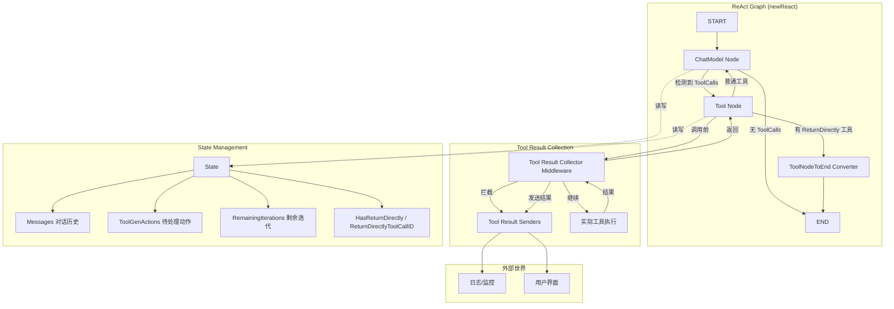

# React Runtime State and Tool Result Flow

## 核心概念（30秒理解）

这个模块实现了 ChatModelAgent 的 **ReAct（推理-行动）循环引擎**。想象一个对话式 AI 助手，它通过不断在"思考下一步"（调用聊天模型）和"执行操作"（调用工具）之间循环来完成任务。这个模块负责：

1. **管理运行时状态** — 跟踪对话历史、剩余迭代次数、待处理的工具动作
2. **编排执行流程** — 构建一个有向图来控制何时调用模型、何时调用工具、何时结束
3. **收集工具结果** — 拦截工具调用的输出，将其发送给外部监听器（用于日志、追踪等）
4. **支持直接返回** — 允许某些工具直接中断循环并返回结果

本质上，它是 ChatModelAgent 的"指挥官"，将聊天模型和工具节点编排成一个有状态的循环工作流。

---

## 问题空间：为什么需要这个模块？

在一个 ReAct 模式的智能体中，有几个关键的设计挑战：

### 1. 状态管理的复杂性

智能体需要维护状态，但这个状态不仅仅是"对话历史"。它还需要：
- 跟踪剩余迭代次数（防止无限循环）
- 存储工具生成的动作（如中断、转移控制权）
- 记录哪些工具应该触发直接返回

一个朴素实现可能把这些状态分散在多个变量中，或者依赖全局变量。但这样会导致：
- 难以测试和推理
- 并发安全问题
- 状态不一致的风险

**解决方案**：这个模块定义了一个统一的 `State` 结构，并通过 compose 框架的状态管理机制将其绑定到执行上下文中。

### 2. 工具结果的可见性

当工具执行时，智能体需要知道结果（以便下次模型调用时使用），但**外部世界**（如日志系统、监控、用户界面）也需要看到这些结果。如果直接在工具实现中添加日志代码，会污染工具逻辑。

**解决方案**：通过中间件模式（`newAdkToolResultCollectorMiddleware`）拦截工具执行结果，在返回给智能体之前先发送给外部监听器。这实现了关注点分离。

### 3. 执行流程的灵活性

ReAct 循环的基本模式是"模型 → 工具 → 模型 → 工具..."，但实际场景需要变体：
- 某些工具应该直接结束循环（如"exit"工具）
- 有些场景需要限制迭代次数
- 需要在模型调用前后执行自定义逻辑

**解决方案**：使用图编排（compose.Graph）而不是硬编码循环。通过添加节点、边和分支，灵活地定义执行路径。

### 4. 动作的生命周期管理

工具执行期间可能需要生成一些动作（如 `AgentAction`，包含中断、转移控制权等信息），但这些动作应该在工具完成后立即消费。如何确保它们不会泄漏到错误的上下文中？

**解决方案**：使用"栈"模式 —— 通过 `SendToolGenAction` 将动作推入状态，在工具完成时通过 `popToolGenAction` 弹出，并通过中间件附加到工具事件中。

---

## 架构图与数据流



### 核心执行流程

1. **启动阶段**：`newReact` 创建图结构，生成初始 `State`
2. **模型调用**：
   - Pre-handler 检查迭代次数，减少计数器
   - ChatModel 生成决策（可能包含 ToolCalls）
   - Post-handler 将消息追加到历史
3. **分支决策**：`toolCallCheck` 检查是否有工具调用
   - 无工具调用 → 转向 END
   - 有工具调用 → 转向 Tool Node
4. **工具执行**：
   - Pre-handler 检查是否有 ReturnDirectly 工具，设置状态标志
   - Tool Node 执行工具（通过中间件收集结果）
   - 发送工具结果给外部监听器
5. **返回决策**：
   - 如果有 ReturnDirectly 标志 → 通过 Converter 转换后转向 END
   - 否则 → 回到 ChatModel 继续循环

---

## 组件深度解析

### State 结构

**目的**：统一管理智能体的运行时状态。

```go
type State struct {
    Messages []Message                    // 对话历史，包含用户消息、助手响应、工具结果
    
    HasReturnDirectly        bool         // 标记是否有工具应该直接返回
    ReturnDirectlyToolCallID string       // 触发直接返回的工具调用ID
    
    ToolGenActions map[string]*AgentAction // 待附加到工具事件的动作映射
                                          // 键是工具名或 ToolCallID（支持并发调用）
    
    AgentName string                     // 智能体名称
    
    RemainingIterations int               // 剩余迭代次数（防止无限循环）
}
```

**设计考量**：
- **Messages**：是整个 ReAct 循环的"记忆"，每次模型调用都基于此生成决策
- **ToolGenActions**：使用 map 而非 stack 是为了支持同一工具的并发调用（不同 CallID）
- **RemainingIterations**：默认 20，防止智能体陷入无限循环，可配置
- **HasReturnDirectly**：布尔标志配合 ToolCallID 实现精确的"单工具返回"语义

---

### toolResultSenders 和上下文传递

**目的**：将工具结果发送函数注入到工具执行的上下文中，实现解耦。

```go
type toolResultSenders struct {
    addr         Address              // 发送者的地址（用于作用域控制）
    sender       adkToolResultSender  // 非流式工具结果发送器
    streamSender adkStreamToolResultSender // 流式工具结果发送器
}

type toolResultSendersCtxKey struct{}  // 上下文键
```

**使用模式**：

```go
// 在 ChatModelAgent 启动时设置
ctx = setToolResultSendersToCtx(ctx, addr, sender, streamSender)

// 在中间件中获取
senders := getToolResultSendersFromCtx(ctx)
if senders != nil {
    senders.sender(ctx, toolName, callID, result, action)
}
```

**设计权衡**：
- ✅ **解耦**：工具不需要知道如何发送结果，只管执行
- ✅ **灵活性**：可以根据上下文决定是否发送、如何发送
- ⚠️ **隐式依赖**：工具执行依赖上下文中存在 senders，这是隐式契约
- ⚠️ **作用域控制**：通过 `isAddressAtDepth` 实现作用域控制，但增加了复杂性

---

### SendToolGenAction / popToolGenAction

**目的**：让工具能够将 `AgentAction`（如中断、转移控制权）附加到自己的输出事件中。

```go
// 工具内部调用：将动作推入状态
func SendToolGenAction(ctx context.Context, toolName string, action *AgentAction) error {
    key := toolName
    toolCallID := compose.GetToolCallID(ctx)
    if len(toolCallID) > 0 {
        key = toolCallID  // 优先使用 CallID 支持并发
    }
    
    return compose.ProcessState(ctx, func(ctx context.Context, st *State) error {
        st.ToolGenActions[key] = action
        return nil
    })
}

// 中间件调用：从状态中弹出动作
func popToolGenAction(ctx context.Context, toolName string) *AgentAction {
    toolCallID := compose.GetToolCallID(ctx)
    var action *AgentAction
    
    compose.ProcessState(ctx, func(ctx context.Context, st *State) error {
        if len(toolCallID) > 0 {
            action = st.ToolGenActions[toolCallID]
            delete(st.ToolGenActions, toolCallID)
        } else {
            action = st.ToolGenActions[toolName]
            delete(st.ToolGenActions, toolName)
        }
        return nil
    })
    
    return action
}
```

**工作流程**：
1. 工具执行时调用 `SendToolGenAction` 将动作存入状态
2. 工具完成后，中间件调用 `popToolGenAction` 取出动作
3. 中间件将动作通过 `sender` 发送给外部监听器

**设计考量**：
- **CallID 优先**：支持同一工具的多次并发调用，每次有独立状态
- **自动清理**：通过 `pop` 操作确保动作不会泄漏到后续执行
- **仅限 ChatModelAgent**：文档明确指出这只能在 ChatModelAgent 中使用，因为依赖其内部 State

---

### newAdkToolResultCollectorMiddleware

**目的**：拦截工具执行结果并发送给外部监听器。

```go
func newAdkToolResultCollectorMiddleware() compose.ToolMiddleware {
    return compose.ToolMiddleware{
        Invokable: func(next compose.InvokableToolEndpoint) compose.InvokableToolEndpoint {
            return func(ctx context.Context, input *compose.ToolInput) (*compose.ToolOutput, error) {
                // 1. 获取发送器
                senders := getToolResultSendersFromCtx(ctx)
                
                // 2. 执行工具
                output, err := next(ctx, input)
                if err != nil {
                    return nil, err
                }
                
                // 3. 弹出动作
                prePopAction := popToolGenAction(ctx, input.Name)
                
                // 4. 发送结果
                if senders != nil && senders.sender != nil {
                    senders.sender(ctx, input.Name, input.CallID, output.Result, prePopAction)
                }
                
                return output, nil
            }
        },
        Streamable: func(next compose.StreamableToolEndpoint) compose.StreamableToolEndpoint {
            return func(ctx context.Context, input *compose.ToolInput) (*compose.StreamToolOutput, error) {
                senders := getToolResultSendersFromCtx(ctx)
                
                output, err := next(ctx, input)
                if err != nil {
                    return nil, err
                }
                
                prePopAction := popToolGenAction(ctx, input.Name)
                
                if senders != nil && senders.streamSender != nil {
                    // 5. 复制流：一份发送，一份返回
                    streams := output.Result.Copy(2)
                    senders.streamSender(ctx, input.Name, input.CallID, streams[0], prePopAction)
                    output.Result = streams[1]
                }
                
                return output, nil
            }
        },
    }
}
```

**设计亮点**：

1. **非侵入性**：通过中间件包装工具，工具实现不需要任何修改
2. **流式支持**：使用 `Copy(2)` 将流分成两路，一路发送给监听器，一路正常返回
3. **动作附加**：自动弹出并附加 `AgentAction`，无需手动处理

**流式复制的权衡**：
- ✅ **实时性**：监听器可以实时看到流式输出
- ⚠️ **资源开销**：需要复制流数据，但这是必要的，否则会影响正常返回流

---

### newReact：图构建器

**目的**：构建完整的 ReAct 执行图。

```go
func newReact(ctx context.Context, config *reactConfig) (reactGraph, error) {
    // 1. 创建图和初始状态
    g := compose.NewGraph[[]Message, Message](compose.WithGenLocalState(genState))
    
    // 2. 准备工具信息
    toolsInfo, err := genToolInfos(ctx, config.toolsConfig)
    
    // 3. 包装模型（可选重试）
    baseModel := config.model
    if config.modelRetryConfig != nil {
        baseModel = newRetryChatModel(config.model, config.modelRetryConfig)
    }
    chatModel, err := baseModel.WithTools(toolsInfo)
    
    // 4. 创建工具节点（带中间件）
    config.toolsConfig.ToolCallMiddlewares = append(
        []compose.ToolMiddleware{newAdkToolResultCollectorMiddleware()},
        config.toolsConfig.ToolCallMiddlewares...,
    )
    toolsNode, err := compose.NewToolNode(ctx, config.toolsConfig)
    
    // 5. 添加 ChatModel 节点（带前后处理器）
    _ = g.AddChatModelNode(chatModel_, chatModel,
        compose.WithStatePreHandler(modelPreHandler),
        compose.WithStatePostHandler(modelPostHandler),
        compose.WithNodeName(chatModel_))
    
    // 6. 添加 ToolNode（带前处理器）
    _ = g.AddToolsNode(toolNode_, toolsNode,
        compose.WithStatePreHandler(toolPreHandler),
        compose.WithNodeName(toolNode_))
    
    // 7. 设置边和分支
    _ = g.AddEdge(compose.START, chatModel_)
    branch := compose.NewStreamGraphBranch(toolCallCheck, ...)
    _ = g.AddBranch(chatModel_, branch)
    
    // 8. 如果有 ReturnDirectly 工具，添加额外逻辑
    if len(config.toolsReturnDirectly) > 0 {
        // 添加 Converter 节点和检查分支
    } else {
        _ = g.AddEdge(toolNode_, chatModel_)  // 普通循环
    }
    
    return g, nil
}
```

**关键处理器逻辑**：

**modelPreHandler**：
```go
func modelPreHandle(ctx context.Context, input []Message, st *State) ([]Message, error) {
    if st.RemainingIterations <= 0 {
        return nil, ErrExceedMaxIterations
    }
    st.RemainingIterations--  // 减少迭代计数
    
    // 构建模型输入：历史消息 + 新输入
    s := &ChatModelAgentState{Messages: append(st.Messages, input...)}
    for _, b := range config.beforeChatModel {
        err = b(ctx, s)  // 执行自定义前置处理
    }
    st.Messages = s.Messages
    
    return st.Messages, nil
}
```

**toolPreHandler**：
```go
func toolPreHandle(ctx context.Context, input Message, st *State) (Message, error) {
    input = st.Messages[len(st.Messages)-1]  // 使用最后一条消息（包含 ToolCalls）
    
    // 检查是否有 ReturnDirectly 工具
    if len(config.toolsReturnDirectly) > 0 {
        for i := range input.ToolCalls {
            toolName := input.ToolCalls[i].Function.Name
            if config.toolsReturnDirectly[toolName] {
                st.ReturnDirectlyToolCallID = input.ToolCalls[i].ID
                st.HasReturnDirectly = true
                break  // 只有第一个触发
            }
        }
    }
    
    return input, nil
}
```

**toolCallCheck 分支**：
```go
func toolCallCheck(ctx context.Context, sMsg MessageStream) (string, error) {
    defer sMsg.Close()
    for {
        chunk, err := sMsg.Recv()
        if err == io.EOF {
            return compose.END, nil  // 无工具调用，结束
        }
        if err != nil {
            return "", err
        }
        
        if len(chunk.ToolCalls) > 0 {
            return toolNode_, nil  // 有工具调用，去工具节点
        }
    }
}
```

**设计考量**：
- **状态即记忆**：`st.Messages` 持续累积，形成完整的对话历史
- **迭代限制**：在 pre-handler 中检查，确保在模型调用前就报错
- **ReturnDirectly 优先级**：只处理第一个触发的工具，避免歧义
- **流式分支**：检查流内容以决定分支方向，而非等待完整消息

---

## 依赖分析

### 被调用方（这个模块依赖的）

| 组件 | 用途 | 耦合度 |
|------|------|--------|
| `compose.Graph` | 图编排引擎，定义执行流程 | 高 |
| `compose.ToolMiddleware` | 工具中间件接口，拦截工具调用 | 高 |
| `compose.ToolInput/Output` | 工具调用和结果的类型定义 | 中 |
| `compose.GetToolCallID` | 获取当前工具调用ID | 低 |
| `compose.ProcessState` | 读写状态的核心接口 | 高 |
| `schema.StreamReader` | 流式工具结果类型 | 中 |
| `model.ToolCallingChatModel` | 聊天模型接口 | 高 |

**关键契约**：
1. **状态契约**：`compose.ProcessState` 要求状态类型可序列化且可变
2. **流契约**：`StreamReader.Copy(2)` 要求流支持复制
3. **中间件契约**：工具必须通过 compose 框架调用，中间件才能生效

### 调用方（依赖这个模块的）

| 组件 | 用途 | 期望 |
|------|------|------|
| `ChatModelAgent` | 使用 `newReact` 构建执行图 | 期望返回可运行的图 |
| `AgentTool` (adk/agent_tool) | 将 Agent 包装成工具 | 期望工具结果能被收集 |
| 测试工具 (adk/react_test) | 验证 ReAct 行为 | 期望可控的模拟工具 |

**隐式契约**：
1. **上下文中必须有 senders**：如果调用方没有设置 `toolResultSenders`，中间件会静默跳过发送
2. **State 类型匹配**：调用方的状态生成函数必须返回 `*State` 类型
3. **工具调用ID**：如果工具调用没有 CallID，则回退到使用工具名作为 key

---

## 设计决策与权衡

### 1. 有状态图 vs 无状态函数

**选择**：使用有状态的图（`WithGenLocalState`）而非无状态函数。

**理由**：
- ReAct 模式本质上是迭代的，需要维护"记忆"
- 状态（Messages）会在每次循环中增长，自然累积
- 迭代计数器需要在多次调用间持久化

**代价**：
- 状态可变性导致并发问题需要特别注意
- 序列化/恢复复杂度增加

---

### 2. 中间件 vs 直接调用

**选择**：使用 `ToolMiddleware` 拦截工具结果。

**理由**：
- 解耦：工具实现不需要知道"结果发送"的逻辑
- 可组合：可以叠加多个中间件
- 统一处理：非流式和流式工具的抽象接口一致

**代价**：
- 增加了一层间接性，调用栈更深
- 调试时需要跟踪中间件链

---

### 3. 流式复制 vs 延迟发送

**选择**：流式工具使用 `Copy(2)` 将流分成两路。

**理由**：
- 监听器需要实时看到流式输出
- 正常返回的流不能被"消费"掉

**代价**：
- 内存和计算开销增加（需要复制每个 chunk）
- 如果监听器消费慢，可能影响整体性能

**替代方案**：可以在监听器中缓存后一次性发送，但会失去实时性。

---

### 4. ReturnDirectly 标志 vs 显式工具

**选择**：在配置中标记哪些工具应该直接返回。

**理由**：
- 灵活性：同一个工具在不同场景下可以有不同的行为
- 简洁性：不需要为"退出"创建特殊工具类型

**代价**：
- 增加了图的复杂度（需要 Converter 节点和额外分支）
- 如果同时调用多个 ReturnDirectly 工具，只有第一个生效

**替代方案**：创建专用的 `ExitTool`，但会失去灵活性。

---

### 5. ToolCallID vs 工具名作为 key

**选择**：优先使用 `ToolCallID` 作为 `ToolGenActions` 的 key。

**理由**：
- 支持并发：同一工具可以被多次调用，每次有独立的 CallID
- 精确性：CallID 是全局唯一的，不会冲突

**代价**：
- 如果工具调用没有 CallID（非常规情况），需要回退到工具名
- 增加了理解成本（需要知道两种 key 机制）

---

## 使用场景与示例

### 场景 1：基本的 ReAct 循环

```go
// 配置
config := &reactConfig{
    model:          chatModel,
    toolsConfig:    toolsConfig,
    maxIterations:  10,
    agentName:      "helper",
}

// 构建图
graph, err := newReact(ctx, config)

// 运行
output := graph.Run(ctx, []Message{userMessage})
```

**流程**：
1. ChatModel 分析用户输入，决定调用 `search` 工具
2. ToolNode 执行搜索，结果被中间件发送给日志系统
3. 回到 ChatModel，基于搜索结果生成回答
4. 无工具调用，直接返回回答

---

### 场景 2：带直接返回的工具

```go
config := &reactConfig{
    toolsConfig: &compose.ToolsNodeConfig{
        // ...工具配置
    },
    toolsReturnDirectly: map[string]bool{
        "exit": true,  // exit 工具触发直接返回
    },
}
```

**流程**：
1. ChatModel 调用 `exit` 工具
2. toolPreHandler 检测到 `exit` 在 ReturnDirectly 列表中，设置标志
3. checkReturnDirect 分支检测到标志，转向 Converter
4. Converter 提取 exit 工具的结果，直接返回给调用者
5. **不会**回到 ChatModel 继续循环

---

### 场景 3：工具生成动作

```go
func myTool(ctx context.Context, input *ToolInput) (*ToolOutput, error) {
    // ... 执行工具逻辑
    
    // 如果检测到错误条件，生成中断动作
    if errorCondition {
        action := &AgentAction{
            Interrupted: &InterruptInfo{
                Reason: "manual intervention required",
            },
        }
        _ = SendToolGenAction(ctx, "myTool", action)
    }
    
    return &ToolOutput{Result: "done"}, nil
}
```

**结果**：
- 工具执行结果正常返回
- `Interrupted` 动作通过中间件被附加到工具事件中
- 外部监听器收到结果和动作，可以触发中断流程

---

## 边界情况与注意事项

### 1. 迭代次数耗尽

**现象**：当 `RemainingIterations` 降为 0 时，`modelPreHandler` 返回 `ErrExceedMaxIterations`。

**处理**：
- 调用方应该捕获这个错误
- 图会停止执行，不再调用 ChatModel
- 状态中已有的消息仍然保留

**建议**：
- 在测试中验证迭代限制是否生效
- 对于复杂任务，适当增加 `maxIterations` 或优化工具调用策略

---

### 2. ReturnDirectly 的歧义性

**问题**：如果一次调用同时包含多个 ReturnDirectly 工具，只有第一个生效。

**代码**：
```go
for i := range input.ToolCalls {
    toolName := input.ToolCalls[i].Function.Name
    if config.toolsReturnDirectly[toolName] {
        st.ReturnDirectlyToolCallID = input.ToolCalls[i].ID
        st.HasReturnDirectly = true
        break  // 第一个之后直接退出
    }
}
```

**建议**：
- 避免配置多个 ReturnDirectly 工具
- 如果需要多个"退出"机制，考虑使用不同的语义（如优先级）

---

### 3. 工具结果发送器的缺失

**问题**：如果上下文中没有 `toolResultSenders`，中间件会静默跳过发送。

**代码**：
```go
if senders != nil && senders.sender != nil {
    senders.sender(ctx, ...)
}
```

**风险**：
- 调用方可能误以为结果一定被发送
- 日志或监控可能遗漏数据

**建议**：
- 在 ChatModelAgent 启动时明确设置 senders
- 在测试中验证发送行为

---

### 4. 流式工具的资源管理

**问题**：流式工具的 `StreamReader` 需要正确关闭。

**代码**：
```go
defer sMsg.Close()  // 在 toolCallCheck 中关闭流
```

**建议**：
- 工具实现者确保流在所有路径上都被关闭
- 监听器消费流时不要阻塞或泄露

---

### 5. AgentAction 的作用域限制

**限制**：`SendToolGenAction` 只能在 ChatModelAgent 的 Run 上下文中使用。

**原因**：
- 依赖 `compose.ProcessState` 访问 `*State`
- 其他 Agent 类型可能没有这个状态

**错误示例**：
```go
// 在非 ChatModelAgent 上下文中调用会失败
_ = SendToolGenAction(ctx, toolName, action)
```

---

## 性能考量

### 1. 状态拷贝开销

每次模型调用都会：
```go
s := &ChatModelAgentState{Messages: append(st.Messages, input...)}
```

**影响**：
- `append` 可能触发底层数组扩容和复制
- 消息历史越长，开销越大

**优化建议**：
- 对于长时间运行的智能体，考虑消息压缩或摘要
- 使用容量预分配减少扩容

---

### 2. 流式复制开销

流式工具会：
```go
streams := output.Result.Copy(2)
```

**影响**：
- 每个 chunk 都会被复制一份
- 内存使用翻倍

**优化建议**：
- 对于非关键路径的工具，可以考虑禁用流式监听
- 使用缓冲减少拷贝次数

---

### 3. Map 查找开销

```go
if a := st.ToolGenActions[toolCallID]; a != nil {
    action = a
    delete(st.ToolGenActions, toolCallID)
}
```

**影响**：
- 每次 `popToolGenAction` 都进行 map 查找
- 如果工具调用频繁，这可能成为热点

**优化建议**：
- 通常影响不大，因为 map 查找是 O(1)
- 只在极端性能场景下需要优化

---

## 调试技巧

### 1. 状态检查

在处理器中添加日志：

```go
modelPreHandle := func(ctx context.Context, input []Message, st *State) ([]Message, error) {
    fmt.Printf("[DEBUG] Before model call: iterations=%d, messages=%d\n",
        st.RemainingIterations, len(st.Messages))
    // ...
}
```

### 2. 工具结果跟踪

在自定义 `sender` 中记录：

```go
sender := func(ctx context.Context, toolName, callID, result string, action *AgentAction) {
    fmt.Printf("[DEBUG] Tool %s[%s] returned: %q (action: %v)\n",
        toolName, callID, result, action)
}
```

### 3. 分支决策跟踪

修改分支函数：

```go
toolCallCheck := func(ctx context.Context, sMsg MessageStream) (string, error) {
    // ...
    if len(chunk.ToolCalls) > 0 {
        fmt.Printf("[DEBUG] Branching to tool node: %d calls\n", len(chunk.ToolCalls))
        return toolNode_, nil
    }
    // ...
}
```

---

## 相关模块文档

- **[ChatModel Agent Core Runtime](chatmodel_agent_core_runtime.md)**：使用这个模块构建的 ChatModelAgent
- **[Agent Contracts and Context](agent_contracts_and_context.md)**：AgentAction、Message 等基础类型
- **[Tool Node Execution](tool_node_execution_and_interrupt_control.md)**：工具节点和中间件的详细机制
- **[Graph Execution Runtime](graph_execution_runtime.md)**：compose.Graph 的底层实现
- **[ChatModel Retry Runtime](chatmodel_retry_runtime.md)**：重试机制的实现

---

## 总结

`adk/react` 模块是 ChatModelAgent 的"大脑和神经系统"，负责：
1. **状态管理**：跟踪对话历史、迭代计数、待处理动作
2. **流程编排**：构建 ReAct 循环图，处理分支和返回逻辑
3. **工具集成**：通过中间件收集工具结果和动作
4. **灵活性**：支持迭代限制、直接返回、自定义处理

核心设计哲学是**通过组合而非硬编码实现灵活性**——图编排、中间件、状态处理器都是可插拔的组件，共同协作实现复杂的 ReAct 行为。

对于新贡献者，理解这个模块的关键是：
1. 掌握 State 的结构和生命周期
2. 理解图节点的数据流和控制流
3. 熟悉中间件的拦截和转发机制
4. 注意 ReturnDirectly 和 ToolGenActions 的边界条件

只有理解了这些组件如何协作，才能安全地扩展或修改这个模块。
