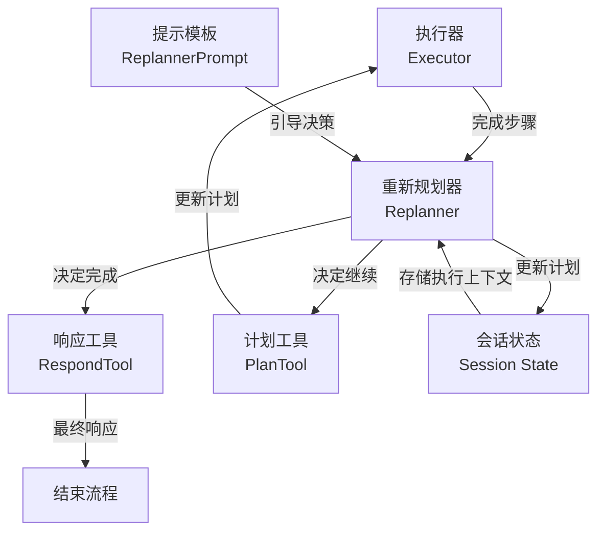

# Replanner Component 模块深度解析

## 1. 模块概述与问题定位

**`replanner_component`** 模块是 `plan-execute-replan` 代理框架中的核心组件，负责在执行过程中动态评估进度并决定下一步行动。它的出现解决了一个经典的代理设计挑战：**如何在复杂任务执行过程中，根据已获取的信息动态调整策略，而不是盲目地遵循最初的计划**。

### 问题空间

想象一个经典的规划与执行场景：
- 初始计划可能是基于不完整信息制定的
- 执行过程中会发现新的约束、机会或障碍
- 某些步骤可能比预期更快完成，或者完全失败
- 需要判断任务是否已经完成，或者是否需要调整策略

一个简单的 "计划后一次性执行" 方法在面对动态环境时会显得脆弱，而 `replanner` 正是为了解决这个问题而设计的。

### 核心洞察力

该模块的设计基于一个关键洞察：**执行过程中的每一步都是获取新信息的机会**。通过在每步执行后重新评估状态，代理可以：
1. 确认目标是否已经达成
2. 调整剩余步骤以适应新发现
3. 修复执行过程中出现的问题
4. 优化后续步骤的顺序和内容

## 2. 架构设计与数据流程

### 核心组件关系图



### 数据流程详解

1. **输入获取阶段**：
   - `replanner` 从会话状态中获取：用户输入、当前计划、已执行步骤
   - 收集最新执行结果并更新已执行步骤列表

2. **上下文构建阶段**：
   - 使用 `buildGenReplannerInputFn` 构建完整的决策上下文
   - 格式化输入信息、原始计划和执行历史
   - 将这些信息注入到 `ReplannerPrompt` 模板中

3. **模型决策阶段**：
   - 将构建好的消息发送给工具调用聊天模型
   - 模型必须选择两种工具之一：
     - `respond_tool`：任务完成，生成最终响应
     - `plan_tool`：需要继续，生成修订后的计划

4. **结果处理阶段**：
   - 解析模型返回的工具调用
   - 如果是 `respond_tool`，发送 `BreakLoopAction` 结束流程
   - 如果是 `plan_tool`，解析新计划并更新会话状态

## 3. 核心组件深度解析

### 3.1 `replanner` 结构体

这是模块的核心实现，封装了重新规划的所有逻辑。

```go
type replanner struct {
    chatModel   model.ToolCallingChatModel
    planTool    *schema.ToolInfo
    respondTool *schema.ToolInfo
    genInputFn  GenModelInputFn
    newPlan     NewPlan
}
```

**设计意图**：
- 依赖注入风格的设计，使得各个组件都可以被定制
- 明确区分了"规划工具"和"响应工具"的职责
- 支持自定义输入生成和计划解析逻辑

**关键成员解析**：
- `chatModel`：必须是支持工具调用的模型，这是模块的核心依赖
- `planTool`/`respondTool`：定义了模型可以选择的两种行动路径
- `genInputFn`：允许完全定制如何构建决策上下文
- `newPlan`：支持自定义计划结构的解析

### 3.2 `ReplannerConfig` 配置结构体

```go
type ReplannerConfig struct {
    ChatModel   model.ToolCallingChatModel
    PlanTool    *schema.ToolInfo
    RespondTool *schema.ToolInfo
    GenInputFn  GenModelInputFn
    NewPlan     NewPlan
}
```

**配置设计哲学**：
- 所有可选配置都有合理的默认值（使用 `PlanToolInfo` 和 `RespondToolInfo`）
- 允许从工具定义到输入生成的全链路定制
- 符合"约定优于配置"的原则，但保留了完全的灵活性

### 3.3 `Run` 方法 - 执行引擎

这是 `replanner` 的核心方法，实现了 `adk.Agent` 接口。

**核心流程**：
1. **会话上下文收集**：从会话状态中提取所有必要信息
2. **执行历史更新**：将最新的执行结果添加到历史记录
3. **决策链构建**：使用 `compose` 包构建处理管道
4. **流式输出处理**：支持实时流式输出，同时收集完整消息
5. **工具调用解析**：根据模型选择的工具执行相应逻辑
6. **状态更新**：根据决策更新会话状态或结束流程

**关键设计选择**：
- 使用 `compose.Chain` 构建处理流程，提高了代码的可读性和可维护性
- 同时支持流式输出和完整消息收集，满足不同场景需求
- 强制使用工具调用（`ToolChoiceForced`），确保模型必须做出明确选择

### 3.4 提示模板设计

`ReplannerPrompt` 是模块的"大脑"，它指导模型如何进行决策。

**模板的关键设计要素**：
1. **明确的二元选择**：强制模型在"完成"和"继续"之间做出选择
2. **具体的决策标准**：提供了清晰的判断指南
3. **计划质量要求**：详细说明了修订计划的标准
4. **上下文注入点**：使用占位符注入执行历史、原始计划等信息

**设计洞察**：
这个提示模板的设计体现了"约束下的自由"理念——模型在决策标准和输出格式上受到严格约束，但在具体的计划内容和响应生成上有充分的自由度。

## 4. 依赖关系分析

### 4.1 输入依赖

`replanner` 依赖于以下会话状态键：
- `UserInputSessionKey`：原始用户输入
- `PlanSessionKey`：当前执行的计划
- `ExecutedStepSessionKey`：最新执行步骤的结果
- `ExecutedStepsSessionKey`：完整的执行历史

**隐式契约**：
- 这些键必须由 `planner` 和 `executor` 组件预先设置
- `Plan` 必须实现 `json.Marshaler` 和 `json.Unmarshaler` 接口
- 执行结果被假设为字符串格式

### 4.2 输出与副作用

- 更新 `ExecutedStepsSessionKey`：添加新的执行结果
- 可能更新 `PlanSessionKey`：用修订后的计划替换原计划
- 可能发送 `BreakLoopAction`：终止执行循环
- 发送流式输出事件：支持实时响应展示

### 4.3 组件协作

- **上游**：`executor` 组件，它执行计划并产生结果
- **下游**：要么回到 `executor`（继续执行），要么终止流程（完成）
- **状态共享**：通过会话状态与其他组件共享信息

## 5. 设计决策与权衡

### 5.1 工具调用 vs 直接输出

**选择**：强制使用工具调用（`ToolChoiceForced`）

**理由**：
- 确保模型输出的结构可预测性
- 明确区分"完成"和"继续"两种状态
- 便于后续解析和处理

**权衡**：
- 增加了模型的理解负担
- 需要精心设计工具描述
- 限制了模型的表达方式

### 5.2 会话状态 vs 显式参数传递

**选择**：使用会话状态共享信息

**理由**：
- 简化了组件间的接口
- 支持状态的持久化和恢复
- 便于中间件和钩子的插入

**权衡**：
- 创建了隐式依赖，降低了代码的自文档性
- 增加了状态管理的复杂性
- 使得组件更难独立测试

### 5.3 二元决策 vs 多分支选择

**选择**：限制为"完成"或"继续"两种选择

**理由**：
- 简化了模型的决策过程
- 减少了错误处理的复杂度
- 符合常见的规划-执行模式

**权衡**：
- 可能不够灵活，无法表达更复杂的状态
- 限制了某些高级用例
- 可能需要在单个"继续"分支中处理多种情况

### 5.4 流式输出支持

**选择**：同时支持流式输出和完整消息收集

**理由**：
- 满足不同应用场景的需求
- 提供更好的用户体验（实时反馈）
- 保持与其他组件的兼容性

**权衡**：
- 增加了代码复杂度
- 需要处理流的复制和同步
- 可能带来轻微的性能开销

## 6. 实用指南与常见模式

### 6.1 基本使用

```go
// 创建基本的重新规划器
replanner, err := NewReplanner(ctx, &ReplannerConfig{
    ChatModel: myToolCallingModel,
})
```

### 6.2 自定义计划结构

```go
// 定义自定义计划类型
type MyCustomPlan struct {
    Tasks []struct {
        Description string `json:"description"`
        Priority    int    `json:"priority"`
    } `json:"tasks"`
}

// 实现 Plan 接口
func (p *MyCustomPlan) FirstStep() string {
    if len(p.Tasks) == 0 {
        return ""
    }
    return p.Tasks[0].Description
}

// 使用自定义计划
replanner, err := NewReplanner(ctx, &ReplannerConfig{
    ChatModel: myToolCallingModel,
    NewPlan: func(ctx context.Context) Plan {
        return &MyCustomPlan{}
    },
})
```

### 6.3 自定义提示逻辑

```go
customGenInputFn := func(ctx context.Context, in *ExecutionContext) ([]adk.Message, error) {
    // 自定义上下文构建逻辑
    // 可以添加额外的指导、格式化执行历史等
}

replanner, err := NewReplanner(ctx, &ReplannerConfig{
    ChatModel:   myToolCallingModel,
    GenInputFn:  customGenInputFn,
})
```

## 7. 边缘情况与注意事项

### 7.1 常见陷阱

1. **会话状态缺失**：
   - 症状：`panic("impossible: plan not found")` 等
   - 原因：未按正确顺序使用 `planner` → `executor` → `replanner` 链
   - 解决：确保在调用 `replanner` 前所有必要的会话键都已设置

2. **模型工具调用失败**：
   - 症状：`"no tool call"` 或 `"unexpected tool call"` 错误
   - 原因：模型没有按照预期调用工具
   - 解决：优化提示模板，确保工具描述清晰，或者降低 `ToolChoiceForced` 的严格性

3. **计划解析错误**：
   - 症状：`"unmarshal plan error"`
   - 原因：模型生成的 JSON 不符合计划结构
   - 解决：增加 JSON 修复逻辑，或者优化提示模板指导模型生成正确的格式

### 7.2 性能考虑

- 每次重新规划都会调用一次模型，可能增加延迟和成本
- 对于简单任务，可以考虑减少重新规划的频率
- 长执行历史可能导致 token 消耗增加，可以考虑摘要或截断策略

### 7.3 扩展性点

- 可以通过自定义 `GenInputFn` 添加执行历史的摘要或分析
- 可以扩展 `Plan` 接口支持更复杂的计划结构和元数据
- 可以添加中间件在重新规划前后执行额外的逻辑

## 8. 相关模块参考

- [Planner Component](planner_component.md)：负责生成初始计划
- [Executor Component](executor_component.md)：负责执行计划步骤
- [Plan-Execute Agent](plan_execute_agent.md)：整合三者的完整代理
- [ChatModel Agent](chatmodel_agent.md)：基础的聊天模型代理抽象
