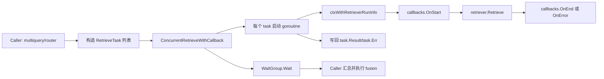

# retrieval_concurrency_utils 深度解析

`retrieval_concurrency_utils` 这个模块做的事情可以用一句话概括：**把多个检索请求“并发发车”，并且给每辆车都挂上统一的回调埋点和故障保护**。在检索编排场景里（比如一个 query 被改写成多个子 query，或一个 query 被路由到多个 retriever），串行调用会把尾延迟拉得很高；而直接“裸起 goroutine”又会丢掉可观测性、错误语义不统一、panic 可能把流程打崩。这个模块就是为了解决这三者之间的矛盾：既要快，也要稳，还要能被回调系统正确观测。

## 这个模块解决的核心问题

在 `flow/retriever` 体系中，上层策略（如 multi-query 改写、router 路由）会一次性产生多个检索子任务。最朴素的写法是 for-loop 逐个 `Retrieve`：逻辑简单，但性能会退化为所有 retriever 延迟之和，最慢链路直接拖垮整体响应。

另一种朴素写法是每个任务开 goroutine：吞吐上去了，但很快会遇到工程问题。第一，回调链（`callbacks.OnStart/OnEnd/OnError`）会失去一致的 `RunInfo`，观测数据难以归因到“这是哪个 retriever 类型的调用”；第二，某个 retriever 内部 panic 时，如果没有恢复机制，可能把整个流程打断；第三，多任务结果和错误的收集逻辑容易散落在上层业务里，导致多处重复实现。

`retrieval_concurrency_utils` 的设计意图是把这套“并发 + 回调 + 容错”的横切逻辑收口成一个小而稳定的公共层，让上层编排只关心：我有哪些 `RetrieveTask`，执行完后看 `Result/Err` 即可。

## 心智模型：把它当作“检索任务调度台”

可以把该模块想象成一个机场塔台：

- `RetrieveTask` 是每一架待起飞航班（包含航班名、目的地 query、执行机型 retriever、参数、落地结果）。
- `ConcurrentRetrieveWithCallback` 是塔台调度器：所有航班并发起飞，塔台等待全部返航后再放行下一阶段。
- `ctxWithRetrieverRunInfo` 是给每架航班贴上的飞行标签：告诉回调系统“这次飞行属于 retriever 组件，类型是什么”。

这个心智模型里最关键的一点是：**该模块不决定业务策略**（不做路由、不做融合、不做重试），只保证任务执行层面的并发一致性和可观测一致性。

## 架构与数据流



从调用链看，当前可见的两个关键上游是：

- [multiquery_rewriter_retriever](multiquery_rewriter_retriever.md)：在 `multiQueryRetriever.Retrieve` 中把改写后的每个 query 封装成 `RetrieveTask`，并发检索后再执行 `fusionFunc`。
- [router_retriever](router_retriever.md)：在 `routerRetriever.Retrieve` 中把路由出的每个 retriever 封装成 `RetrieveTask`，并发检索后再执行融合（默认 RRF）。

因此，这个模块在系统中的角色是一个**并发执行适配层（execution utility / orchestration helper）**：它夹在“任务生成”和“结果融合”之间，不拥有业务语义，但对性能与稳定性高度关键。

## 组件深潜

### `RetrieveTask`：最小任务单元（输入 + 输出就地承载）

`RetrieveTask` 是一个结构体，字段设计非常直接：

- 输入侧：`Name`、`Retriever`、`Query`、`RetrieveOptions`
- 输出侧：`Result`、`Err`

这里的非显式设计点是：**输出写回到任务对象本身**，而不是由并发函数返回一个新切片。这样做的好处是调用方可以在构造任务时携带自定义上下文标识（例如 router 的 `Name`），执行后仍在同一对象上读取结果，降低结果对齐成本。代价是该 API 是“可变对象协议”，调用方需要遵守“执行完成后再读取结果”的时序约束。

### `ConcurrentRetrieveWithCallback(ctx, tasks)`：并发执行内核

这个函数是模块核心，内部机制可以分四层理解。

第一层是并发模型：对 `tasks` 逐个启动 goroutine，并用 `sync.WaitGroup` 做 join。它选择了最简单的“一任务一 goroutine”策略，没有 worker pool，也没有并发度参数。这对当前场景是务实选择，因为上游通常只会产生有限数量任务（改写 query 数、路由 retriever 数），实现简单且延迟最优。

第二层是观测注入：每个 goroutine 一开始调用 `ctxWithRetrieverRunInfo`，随后围绕真实检索调用 `callbacks.OnStart` / `OnEnd` / `OnError`。这确保 callback handler 能看到完整生命周期事件，而不是只看到上层 fusion 阶段。

第三层是异常语义统一：函数使用 `defer + recover` 捕获 panic，并将其转换为 `t.Err = fmt.Errorf("retrieve panic, query: %s, error: %v", ...)`，同时触发 `callbacks.OnError`。这意味着对调用方而言，panic 与普通 error 都被归一到任务级错误通道，不会直接炸穿整个并发批次。

第四层是结果回填：成功时写 `t.Result`，失败时写 `t.Err`，函数本身不返回 error，而是在 `wg.Wait()` 后由调用方遍历任务自行决定失败策略（当前上游实现都是“遇到任一 Err 即返回”）。这个决策把“并发执行”与“错误聚合策略”解耦了。

### `ctxWithRetrieverRunInfo(ctx, r)`：为回调系统补齐组件身份

该函数构造 `callbacks.RunInfo`，固定 `Component` 为 `components.ComponentOfRetriever`，并尝试通过 `components.GetType(r)` 获取具体 retriever 类型。随后设置 `runInfo.Name = runInfo.Type + string(runInfo.Component)`，并通过 `callbacks.ReuseHandlers` 把新 run info 与已有 handler 绑定。

这段逻辑的价值在于，它把“谁在执行”这个信息显式写入上下文，避免 callback 只能看到匿名事件。对于链路追踪、指标分桶、debug 归因都很重要。

## 依赖与契约分析

这个模块向下依赖的关键点有三组。

第一组是 `retriever.Retriever` 接口契约。`ConcurrentRetrieveWithCallback` 假设每个任务都提供可调用的 `Retriever.Retrieve(ctx, query, opts...)`。如果上游传入 `nil Retriever`，会在调用时 panic，然后被 recover 捕获并写入 `Err`。这是一种“容错但不前置校验”的契约风格。

第二组是 callbacks 契约。模块直接调用 `callbacks.OnStart/OnEnd/OnError`，并依赖 `callbacks.ReuseHandlers` 传播 handler 上下文。换言之，它假设调用链上的 `ctx` 已承载可复用的 handler；即便没有 handler，这些调用也应是安全的（由 callbacks 子系统保证）。

第三组是组件类型系统。`ctxWithRetrieverRunInfo` 调用 `components.GetType` 获取 retriever 类型信息。这是一个弱依赖：取不到类型也不会失败，只是 `RunInfo.Type` 留空，观测维度下降但功能不受阻。

向上游看，当前明确调用它的是：

- `multiQueryRetriever.Retrieve`：把每个改写 query 作为独立任务并发执行。
- `routerRetriever.Retrieve`：把每个路由命中的 retriever 作为独立任务并发执行。

两者对该模块的共同期待是：**返回后所有任务都已结束，且每个任务都有确定的 `Result` 或 `Err` 状态**。这就是它的核心数据契约。

## 关键设计选择与权衡

这个模块体现了几个很典型的工程取舍。

它选择了“简单 goroutine 扇出”而不是可配置线程池。好处是代码短、调用开销低、尾延迟表现好；代价是没有内建限流，若未来上游生成超大任务集，可能导致瞬时 goroutine 激增。

它选择“任务对象就地写回”而不是函数返回结构化聚合结果。好处是最大兼容不同上游（router 需要 `Name`，multiquery 不需要）；代价是可变状态对并发安全和生命周期提出隐含要求：每个任务应只被单 goroutine 写、调用方在 `Wait` 后再读。

它选择“panic 转 error”而不是让 panic 上抛。好处是批次执行更鲁棒，单任务异常不拖垮整批；代价是会掩盖 panic 栈信息（目前错误字符串只包含 panic 值），排查复杂 panic 时上下文较少。

它把“执行”与“策略”分离：该模块不决定错误聚合（fail-fast 还是 best-effort）、不决定结果融合。这提高了复用性，但也要求上层明确实现自己的后处理策略。

## 使用方式与示例

典型用法是：构造任务数组，调用并发函数，随后遍历任务处理错误与结果。

```go
tasks := []*utils.RetrieveTask{
    {
        Name:            "bm25",
        Retriever:       bm25Retriever,
        Query:           query,
        RetrieveOptions: opts,
    },
    {
        Name:            "vector",
        Retriever:       vectorRetriever,
        Query:           query,
        RetrieveOptions: opts,
    },
}

utils.ConcurrentRetrieveWithCallback(ctx, tasks)

result := map[string][]*schema.Document{}
for _, t := range tasks {
    if t.Err != nil {
        return nil, t.Err
    }
    result[t.Name] = t.Result
}
```

如果你是在实现新的组合型 retriever（例如“多阶段召回器”），推荐复用这个模块，而不是重复实现 goroutine + wait + callback 三件套。你只需聚焦三步：任务生成、错误策略、融合策略。

## 新贡献者最需要注意的边界与坑

第一个坑是**上下文取消语义**。该模块本身不主动检查 `ctx.Done()`；它把取消控制交给具体 `Retriever.Retrieve` 实现。如果某个 retriever 忽略 context，那么该任务仍可能跑满。

第二个坑是**错误优先级由上层决定**。该函数不会返回“第一个错误”或“错误列表”，只写入每个 task。像 router/multiquery 当前是遇到任一错误即失败；你若要容错融合，需要在上层显式实现“跳过失败任务”的逻辑。

第三个坑是**`RetrieveOptions` 的传递一致性**。`routerRetriever` 会把调用入参 `opts` 透传到每个 task；`multiQueryRetriever` 当前构造 task 时未设置 `RetrieveOptions`。这是上层策略差异，不是工具函数问题，但很容易在扩展时忽略，导致行为不一致。

第四个坑是**panic 信息有限**。recover 后只记录 query 和 panic 值，不含栈。若你要做线上疑难排查，可能需要在上层或 retriever 内部补充更详细日志。

## 与其他模块的关系（参考）

建议结合以下文档一起读，能更完整理解该工具在检索编排中的位置：

- [multiquery_rewriter_retriever](multiquery_rewriter_retriever.md)
- [router_retriever](router_retriever.md)
- [Component Interfaces](Component Interfaces.md)（`retriever.Retriever` 所在接口层）
- [embedding_retriever_indexer_options_and_callbacks](embedding_retriever_indexer_options_and_callbacks.md)（retriever option / callback extra 相关类型）
