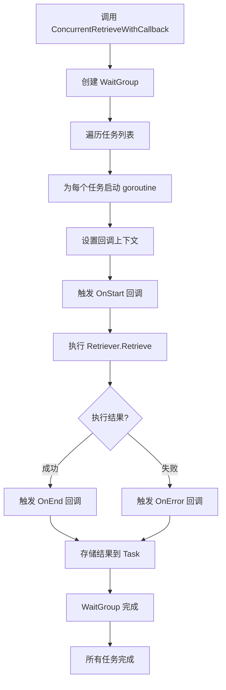

# retrieval_utils 模块技术深度分析

## 1. 模块概览

`retrieval_utils` 是一个专门为检索器流程设计的辅助工具包，核心功能是提供并发文档检索能力，并集成回调机制进行监控和追踪。这个模块解决的核心问题是：当需要从多个检索源获取文档时，如何高效地并行执行这些检索操作，同时保持对每个检索任务的完整可观测性。

想象一下，你需要从多个不同的搜索引擎查询同一问题，你不希望一个接一个地等待结果，而是希望同时发送所有查询。这正是 `ConcurrentRetrieveWithCallback` 函数的设计思想——它就像一个高效的调度中心，同时向多个检索器发送请求，并收集所有结果。

## 2. 核心组件与架构

### 2.1 RetrieveTask 结构

`RetrieveTask` 是整个模块的核心抽象，它封装了单个检索任务的所有必要信息：

```go
type RetrieveTask struct {
    Name            string
    Retriever       retriever.Retriever
    Query           string
    RetrieveOptions []retriever.Option
    Result          []*schema.Document
    Err             error
}
```

这个结构设计体现了命令模式（Command Pattern）的思想，将检索操作的所有参数、执行器和结果封装在一起。每个字段都有明确的职责：
- `Name`：任务标识，用于追踪和调试
- `Retriever`：实际执行检索的组件
- `Query` 和 `RetrieveOptions`：检索的输入参数
- `Result` 和 `Err`：存储执行结果的占位符

### 2.2 数据流与执行模型



## 3. 核心功能深入分析

### 3.1 并发检索机制

`ConcurrentRetrieveWithCallback` 函数是模块的核心，它使用 Go 的 goroutine 和 WaitGroup 实现高效的并发执行：

```go
func ConcurrentRetrieveWithCallback(ctx context.Context, tasks []*RetrieveTask) {
    wg := sync.WaitGroup{}
    for i := range tasks {
        wg.Add(1)
        go func(ctx context.Context, t *RetrieveTask) {
            // ... 执行检索任务
            defer wg.Done()
        }(ctx, tasks[i])
    }
    wg.Wait()
}
```

这种设计的关键在于：
- 每个任务在独立的 goroutine 中执行，充分利用多核资源
- 使用 WaitGroup 确保所有任务完成后函数才返回
- 通过闭包将当前任务的上下文正确传递给 goroutine

### 3.2 回调系统集成

模块不仅仅是并发执行检索，还完整集成了回调系统，提供可观测性：

```go
ctx = callbacks.OnStart(ctx, t.Query)
docs, err := t.Retriever.Retrieve(ctx, t.Query, t.RetrieveOptions...)
if err != nil {
    callbacks.OnError(ctx, err)
    t.Err = err
    return
}
callbacks.OnEnd(ctx, docs)
t.Result = docs
```

这里体现了 AOP（面向切面编程）的思想，在检索操作的不同生命周期点插入回调，使得：
- 可以监控检索的开始、结束和错误
- 支持日志记录、性能分析等横切关注点
- 不侵入检索器的核心逻辑

### 3.3 错误处理与恢复

模块特别关注错误处理，包括 panic 恢复：

```go
defer func() {
    if e := recover(); e != nil {
        t.Err = fmt.Errorf("retrieve panic, query: %s, error: %v", t.Query, e)
        ctx = callbacks.OnError(ctx, t.Err)
    }
    wg.Done()
}()
```

这是一种防御性编程的实践，确保单个检索任务的 panic 不会导致整个并发检索过程崩溃，同时也会记录这个错误。

## 4. 设计决策与权衡

### 4.1 同步等待 vs 异步结果

**选择**：函数使用同步等待模式，所有任务完成后才返回。

**权衡分析**：
- 优点：接口简单，调用者无需处理复杂的异步结果收集
- 缺点：整体执行时间由最慢的任务决定，无法部分结果可用时提前处理

**设计理由**：对于检索场景，通常需要所有检索源的结果才能进行下一步处理（如结果合并、重排序），因此同步等待是合理的选择。

### 4.2 共享上下文 vs 独立上下文

**选择**：每个 goroutine 使用相同的上下文。

**权衡分析**：
- 优点：统一的取消信号，一个任务取消会影响所有任务
- 缺点：无法为不同任务设置不同的超时或取消条件

**设计理由**：在检索场景中，通常希望要么全部完成，要么全部取消，共享上下文符合这种语义。

### 4.3 结果内联 vs 通道返回

**选择**：结果直接写入任务对象的字段。

**权衡分析**：
- 优点：无需额外的通道管理，内存开销小
- 缺点：需要确保对任务对象的并发访问安全（当前设计中每个任务只被一个 goroutine 写入，因此是安全的）

**设计理由**：每个 RetrieveTask 只由一个 goroutine 处理，因此不存在并发写入冲突，这种设计既简单又高效。

## 5. 依赖关系

### 5.1 输入依赖

模块依赖以下核心组件：
- `retriever.Retriever`：实际执行检索的接口（来自 [components/retriever](components.md)）
- `schema.Document`：文档数据结构（来自 [schema](schema.md)）
- `callbacks` 包：提供回调机制（来自 [callbacks](callbacks.md)）
- `components` 包：提供组件类型信息（来自 [components](components.md)）

### 5.2 被依赖关系

从模块树可以看到，以下模块可能会使用 `retrieval_utils`：
- `flow.retriever.multiquery`：多查询检索器
- `flow.retriever.parent`：父文档检索器  
- `flow.retriever.router`：路由检索器

这些高级检索器可能需要同时查询多个底层检索器，因此会使用 `ConcurrentRetrieveWithCallback` 来实现并发检索。

## 6. 使用指南与最佳实践

### 6.1 基本使用示例

```go
tasks := []*utils.RetrieveTask{
    {
        Name:      "retriever1",
        Retriever: retriever1,
        Query:     "如何学习 Go 语言",
    },
    {
        Name:      "retriever2",
        Retriever: retriever2,
        Query:     "如何学习 Go 语言",
    },
}

utils.ConcurrentRetrieveWithCallback(ctx, tasks)

// 处理结果
for _, task := range tasks {
    if task.Err != nil {
        log.Printf("检索 %s 失败: %v", task.Name, task.Err)
        continue
    }
    log.Printf("检索 %s 成功，获得 %d 个文档", task.Name, len(task.Result))
}
```

### 6.2 最佳实践

1. **任务命名**：始终给每个任务一个有意义的 `Name`，便于调试和日志分析。
2. **上下文管理**：传入的上下文应该包含适当的超时控制，防止检索无限等待。
3. **错误处理**：调用后务必检查每个任务的 `Err` 字段，部分失败是常见情况。
4. **结果合并**：考虑使用专门的结果合并逻辑处理多个检索源的结果。

## 7. 注意事项与潜在陷阱

### 7.1 错误隔离

虽然模块会捕获单个任务的 panic，但任务之间是完全独立的。一个任务的失败不会影响其他任务的执行，这既是优点（容错性好）也是需要注意的点（需要处理部分失败的情况）。

### 7.2 资源消耗

并发执行多个检索任务可能会对底层检索服务造成压力，特别是当任务数量很多时。建议根据实际情况控制并发度，或者考虑使用信号量限制同时执行的任务数量。

### 7.3 上下文传播

当前实现中，所有任务共享同一个上下文。这意味着如果上下文被取消（例如超时），所有正在进行的检索都会收到取消信号。如果需要为不同任务设置不同的超时，需要在外部为每个任务创建独立的子上下文。

### 7.4 结果顺序

函数返回后，`tasks` 切片的顺序保持不变，但任务的执行完成顺序是不确定的。如果需要按完成顺序处理结果，需要额外的机制（如使用通道）。

## 8. 总结

`retrieval_utils` 是一个简洁而强大的模块，它通过 `RetrieveTask` 抽象和 `ConcurrentRetrieveWithCallback` 函数，为多检索源场景提供了高效的并发执行能力。它的设计体现了 Go 语言的并发哲学，同时通过集成回调系统保证了可观测性。

这个模块的价值在于它解决了一个常见但非平凡的问题：如何安全、高效地并发执行多个检索操作，同时保持对每个操作的完整追踪。它是构建更高级检索策略（如多查询检索、父文档检索等）的基础组件。
