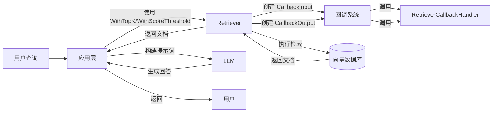

# Retriever & Indexer Options and Callbacks (检索器与索引器配置与回调)

> 这是一个关于"如何让组件既标准化又灵活"的模块。它不实现检索或索引逻辑，而是定义了这些组件与世界对话的方式。

这个模块为检索器（Retriever）和索引器（Indexer）组件提供了统一的配置选项和回调机制，是连接上层应用与具体实现之间的"桥梁"和"契约"。它的设计体现了"关注点分离"原则，将配置和可观测性与核心业务逻辑解耦，使得检索和索引组件可以专注于自己的核心功能，同时保持系统的灵活性和可扩展性。

## 1. 模块概览

在构建检索增强生成（RAG）系统中，检索和索引是两个核心操作：
- **索引（Indexing）**：将文档转换为向量并存储到检索系统
- **检索（Retrieval）**：根据查询从检索系统中找到相关文档

这个模块的作用类似于餐厅的"点菜系统"：它不直接烹饪食物（实现具体的检索/索引逻辑），而是提供标准化的方式来传递"烹饪要求"（配置选项）和记录"烹饪过程"（回调信息）。

## 2. 核心组件

### 2.1 配置选项系统

本模块采用函数式选项模式（Functional Options Pattern），这是一种在 Go 语言中处理可选参数的优雅解决方案。

#### 检索器选项（Retriever Options）

检索器选项允许你配置检索行为，就像在搜索引擎中设置搜索参数一样。

**核心组件：**
- `Option`：单个配置选项
- `Options`：所有配置的集合
- `With*` 系列函数：用于构建选项的工厂函数

**主要配置项：**
- `Index`：检索的索引名称
- `SubIndex`：检索的子索引名称
- `TopK`：返回的最相关文档数量
- `ScoreThreshold`：文档相似度的最低分数要求
- `Embedding`：用于将查询转换为向量的嵌入器
- `DSLInfo`：特定实现的 DSL 信息（仅适用于 Viking）

#### 索引器选项（Indexer Options）

索引器选项用于配置文档索引行为。

**核心组件：**
- `Option`：单个配置选项
- `Options`：所有配置的集合
- `With*` 系列函数：用于构建选项的工厂函数

**主要配置项：**
- `SubIndexes`：要索引的子索引列表
- `Embedding`：用于将文档转换为向量的嵌入器

### 2.2 回调系统

回调系统提供了一种在检索和索引过程中捕获输入输出信息的机制，类似于飞机上的"黑匣子"记录器。

#### 检索器回调

**CallbackInput**：
- `Query`：检索查询
- `TopK`：返回文档数量
- `Filter`：过滤条件
- `ScoreThreshold`：分数阈值
- `Extra`：额外信息

**CallbackOutput**：
- `Docs`：检索到的文档
- `Extra`：额外信息

#### 索引器回调

**CallbackInput**：
- `Docs`：要索引的文档
- `Extra`：额外信息

**CallbackOutput**：
- `IDs`：索引后的文档 ID
- `Extra`：额外信息

## 3. 设计决策与权衡

### 3.1 函数式选项模式

本模块采用函数式选项模式，这是一个经过深思熟虑的设计选择：

**为什么选择函数式选项模式：**

1. **向后兼容性**：添加新选项不会破坏现有代码
2. **可读性**：`WithTopK(10)` 比传递一堆 `nil` 参数更清晰
3. **默认值处理**：可以安全地忽略不需要配置的选项
4. **实现特定选项**：通过 `WrapImplSpecificOptFn` 支持特定实现的选项

**替代方案对比：**
- 结构体字面量：不够灵活，添加新字段会破坏兼容性
- 配置构建器：更冗长，需要更多代码

**权衡分析：**
- **优点**：最大程度的灵活性和向后兼容性
- **缺点**：需要编写更多的样板代码，选项的验证只能在运行时进行
- **为什么这个选择是合理的**：在一个作为组件契约的模块中，向后兼容性和灵活性的价值远超过了额外样板代码的成本

### 3.2 通用选项与实现特定选项的"双轨制"

本模块设计了一个巧妙的"双轨制"选项系统，在同一个 `Option` 结构体中同时容纳了通用选项和实现特定选项。

**设计动机：**
- 不同的检索系统（如 Elasticsearch、Viking、Milvus）有巨大的差异，不可能用一套通用选项覆盖所有情况
- 但上层框架和应用需要一套稳定的通用选项来构建可移植的代码

**实现机制：**
- 通用选项通过 `apply` 函数字段实现，类型安全且有明确的契约
- 实现特定选项通过 `implSpecificOptFn` 接口{}字段实现，灵活但类型安全较弱
- 两个提取函数 `GetCommonOptions` 和 `GetImplSpecificOptions` 分别处理这两类选项

**权衡分析：**
- **优点**：既保持了通用性，又为特定实现保留了无限的灵活性
- **缺点**：实现特定选项是类型不安全的（需要运行时类型断言），且选项的存在与否在编译时无法检查
- **缓解策略**：通过良好的文档和约定，以及在组件实现中提供明确的错误信息

### 3.3 回调系统的多态设计

回调输入输出的设计采用了一种"宽松"的多态方式，既支持结构化的 `CallbackInput`/`CallbackOutput`，也支持原始类型（如 `string`、`[]*schema.Document`）。

**设计动机：**
- 不同的组件实现可能有不同的复杂度需求
- 简单实现可能不想构建完整的回调结构体
- 复杂实现可能需要传递更多的上下文信息

**权衡分析：**
- **优点**：最大程度的灵活性，支持各种复杂度的实现
- **缺点**：类型安全性降低，回调处理器需要处理多种可能的输入类型
- **为什么这个选择是合理的**：在一个旨在支持多种异构实现的框架中，灵活性优先于严格的类型安全


## 4. 数据流程

### 4.1 检索流程

```
用户查询 → 创建检索器 → 应用配置选项 → 执行检索 → 触发回调 → 返回文档
     ↓              ↓                  ↓          ↓          ↓          ↓
  Query       WithTopK(10)       向量搜索  CallbackInput  CallbackOutput  Docs
```

### 4.2 索引流程

```
文档列表 → 创建索引器 → 应用配置选项 → 执行索引 → 触发回调 → 返回文档ID
     ↓              ↓                  ↓          ↓          ↓          ↓
   Docs      WithEmbedding(emb)   向量存储  CallbackInput  CallbackOutput  IDs
```

## 5. 使用示例

### 5.1 检索器配置

```go
// 创建检索器选项
opts := []retriever.Option{
    retriever.WithTopK(10),
    retriever.WithScoreThreshold(0.7),
    retriever.WithEmbedding(embedder),
}

// 提取通用选项
baseOpts := retriever.GetCommonOptions(nil, opts...)

// 提取特定实现选项
type MyRetrieverOpts struct {
    CustomField string
}
myOpts := retriever.GetImplSpecificOptions(&MyRetrieverOpts{
    CustomField: "default"}, opts...)
```

### 5.2 索引器配置

```go
// 创建索引器选项
opts := []indexer.Option{
    indexer.WithSubIndexes([]string{"sub1", "sub2"}),
    indexer.WithEmbedding(embedder),
}

// 提取选项
opts := indexer.GetCommonOptions(nil, opts...)
```

### 5.3 回调使用

```go
// 在回调处理器中使用
func (h *MyRetrieverHandler) OnEnd(ctx context.Context, info *callbacks.RunInfo, input callbacks.CallbackInput, output callbacks.CallbackOutput) {
    // 转换为检索器特定的输入输出
    ri := retriever.ConvCallbackInput(input)
    ro := retriever.ConvCallbackOutput(output)
    
    if ri != nil && ro != nil {
        log.Printf("检索查询: %s, 返回文档数: %d", ri.Query, len(ro.Docs))
    }
}
```

## 6. 注意事项

### 6.1 选项应用顺序

选项按照提供的顺序应用，后提供的选项会覆盖先提供的选项：

```go
// 最终 TopK 会是 20，而不是 10
opts := []retriever.Option{
    retriever.WithTopK(10),
    retriever.WithTopK(20),
}
```

### 6.2 实现特定选项的类型安全

使用 `GetImplSpecificOptions` 时要确保类型匹配，否则不会报错但也不会应用选项：

```go
// 这样不会报错，但选项不会被应用
type WrongType struct{}
opts := retriever.GetImplSpecificOptions(&WrongType{}, opts...)
```

### 6.3 回调输入输出的 nil 检查

使用 `ConvCallbackInput` 和 `ConvCallbackOutput` 可能返回 nil，一定要进行检查：

```go
ri := retriever.ConvCallbackInput(input)
if ri == nil {
    // 处理转换失败的情况
}
```

## 7. 架构角色与模块关系

### 7.1 在整体架构中的位置

这个模块在整个系统中扮演着**"契约定义者"**和**"连接层"**的角色：

- **向上**：为上层应用和框架（如 [Flow Retrievers](flow_retrievers.md)、[Flow Indexers](flow_indexers.md)、[Compose Graph Engine](compose_graph_engine.md)）提供标准化的接口
- **向下**：为具体的检索器和索引器实现定义了必须遵守的契约
- **横向**：与 [Callbacks System](callbacks_system.md) 协作，提供可观测性

这种设计使得系统具有"插拔式"的特性：你可以替换底层的检索系统实现，而无需修改上层应用代码。

### 7.2 依赖关系分析

**直接依赖：**
- [Schema Core Types](schema_core_types.md)：使用 `schema.Document` 作为文档数据结构
- [Component Interfaces](component_interfaces.md)：与 `Retriever` 和 `Indexer` 接口配合使用
- [Callbacks System](callbacks_system.md)：依赖回调系统的基础设施

**被依赖：**
- [Flow Retrievers](flow_retrievers.md)：使用本模块定义的选项和回调来构建高级检索策略
- [Flow Indexers](flow_indexers.md)：使用本模块定义的选项和回调来构建高级索引策略
- [Compose Graph Engine](compose_graph_engine.md)：在图节点中集成回调系统，实现工作流的可观测性

### 7.3 数据流转的端到端视图

让我们通过一个完整的 RAG（检索增强生成）场景来看看数据如何流经这个模块：



在这个流程中，本模块的作用是：
1. **传递配置**：将应用层的配置意图（如 `TopK=10`）传递给检索器实现
2. **提供可观测性**：通过回调系统捕获检索的输入和输出，供监控、日志记录等使用
3. **保持解耦**：应用层不需要知道具体使用的是哪个检索系统实现

### 7.4 新贡献者指南

作为刚加入团队的高级工程师，以下是你需要特别注意的几点：

1. **"隐形"的契约**：这个模块定义的不仅是数据结构，更是组件之间的契约。修改任何公共API都要考虑对上游和下游的影响。

2. **选项的幂等性**：确保你的选项应用逻辑是幂等的——多次应用同一个选项应该产生相同的结果。

3. **回调中的数据修改**：回调处理器可以修改回调输入输出中的数据，设计组件时要考虑这种可能性。

4. **特定实现选项的静默失败**：`GetImplSpecificOptions` 在类型不匹配时不会报错，而是默默地返回默认值。这使得调试变得困难，要特别注意。

5. **上下文传递**：回调系统依赖 context.Context 传递信息，确保在你的实现中正确地传递和使用 context。

6. **避免在回调中进行耗时操作**：回调处理器应该是轻量级的，避免在回调中进行耗时操作，否则会影响组件的性能。
